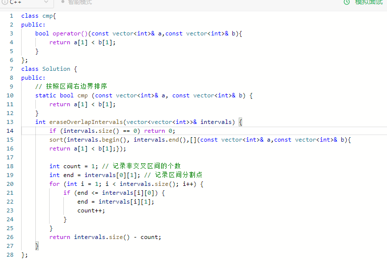
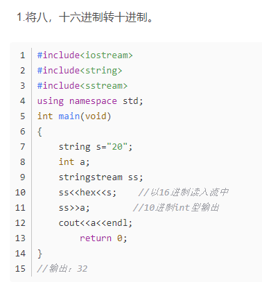
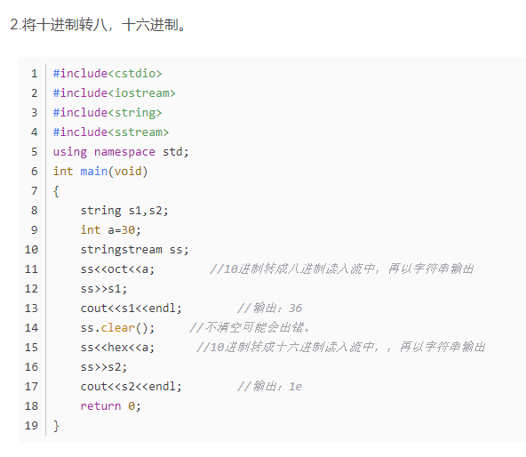

sort的lambada表达式
sort(test.begin(),test.end(),{return x.a>y.a;});

c++数组的定义
[【C++】C++数组初始化方法](https://blog.csdn.net/qq_36622009/article/details/85057710)
int *pia = new int[10]; // array of 10 uninitialized ints

sort排序的过程中，如果定义函数对象，需要重载（），记得使用cmp的使用用cmp();
定义static函数可以直接使用cmp。

注意引用的使用：
重叠子区间中：
**三种写法都是const A &  , 不带cosnt不能运行通过，不带&也通过不了。**

不带& 超出时间限制

# 字符串相关题目
[C/C++ 刷题中头疼的字符串](https://blog.csdn.net/qq_43142509/article/details/121009896)

# 字符串相关

to_string 和 stoi都在string头文件里面 用的时候 using namespace std;

# 进制转换相关

[C++中的各种进制转换函数汇总](https://blog.csdn.net/vir_lee/article/details/80645066)

 使用字符串流stringstream
(头文件#include<sstream>)

