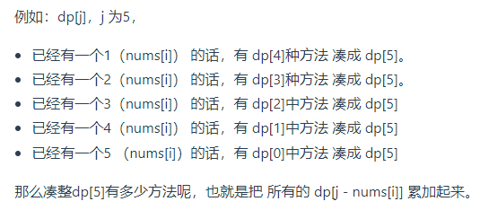

[hot100 视频](https://www.bilibili.com/video/BV1Pq4y1j78o?spm_id_from=333.999.0.0)

[leetcode讲解](https://xiaochen1024.com/)

# 【1-20】
# 1. 两数之和


```java
class Solution {
public:
    vector<int> twoSum(vector<int>& nums, int target) {
        unordered_map<int,int> umap;
        int i = 0;
        for(int num:nums){
            if(umap.find(target-num)==umap.end())
                umap[num]=i;
            else
                return {umap[target-num],i};
            i++;
        }
        return {};
    }
};
```


# 2. 两数相加（链表数字相加）

两个链表倒序的，

解法一，报错，数据长度有限制， int long 都不能完全通过


求出来两个链表的数字，相加后，然后再合成链表返回

```java
class Solution {
public:
    ListNode* addTwoNumbers(ListNode* l1, ListNode* l2) {
        

        long long num1 = 0,num2 = 0;
        long long mul1 = 1;
        while(l1!=nullptr){
            num1  = num1 + mul1 * l1->val;
            mul1 *= 10;
            l1 = l1->next;
        }

        mul1 = 1;
        while(l2!=nullptr){
            num2  = num2 + mul1 * l2->val;
            mul1 *= 10;
            l2 = l2->next;
        }

        long long res = num1 + num2;

        if(res ==0 )
        return new ListNode(0);

        cout<<res;
        ListNode* cur = new ListNode(0);
        ListNode* dummy = new ListNode(-1);
        dummy->next = cur;
        while(res){
            long long val = res%10;
            ListNode* temp = new ListNode(val);
            cur->next = temp;
            cur = cur->next;
            res = res/10;
        }
        return dummy->next->next;
    }
};
```

解法二： 直接在一个链表里面相加，考虑进位


这里的head tail两个指针，head只参与第一次节点创建，相当于dummy指针

```java
class Solution {
public:
    ListNode* addTwoNumbers(ListNode* l1, ListNode* l2) {
        ListNode *head = nullptr, *tail = nullptr;
        int carry = 0;
        while (l1 || l2) {
            // 判断l1是否为空。
            int n1 = l1 ? l1->val: 0;
            // 判断l1是否为空。
            int n2 = l2 ? l2->val: 0;
            // 计算sum：  carry为进位，初始为0
            int sum = n1 + n2 + carry;
            // 判断头节点是否非空：
            if (!head) { 
                // 如果头节点空的话，首次添加节点
                head = tail = new ListNode(sum % 10);
            } else {
                // 如果头节点非空的话，
                tail->next = new ListNode(sum % 10);
                tail = tail->next;
            }
            
            carry = sum / 10;
            if (l1) {
                l1 = l1->next;
            }
            if (l2) {
                l2 = l2->next;
            }
        }
        if (carry > 0) {
            tail->next = new ListNode(carry);
        }
        return head;
    }
};
```

# 3. 无重复的最长子串

给定一个字符串 s ，请你找出其中不含有重复字符的 最长子串 的长度。

```java
// labuladong解法
class Solution {
    public:
    int lengthOfLongestSubstring(string s) {
        unordered_map<char, int> window;
        
        int left = 0, right = 0;
        int res = 0; // 记录结果
        while (right < s.size()) {
            char c = s[right];
            right++;
            // 进行窗口内数据的一系列更新
            window[c]++;
            // 判断左侧窗口是否要收缩
            while (window[c] > 1) {
                char d = s[left];
                left++;
                // 进行窗口内数据的一系列更新
                window[d]--;
            }
            // 在这里更新答案
            res = max(res, right - left);
        }
        return res;
    }
};

```

# 5. 最长回文子串

给你一个字符串 s，找到 s 中最长的回文子串。

```java

class Solution {
public:
    string longestPalindrome(string s) {
        string res="";
        for(int i=0;i<s.size();i++){
            string s1 = Palindrome(s,i,i);
            string s2 = Palindrome(s,i,i+1);
            res = res.size()>s1.size()?res:s1;
            res = res.size()>s2.size()?res:s2;
        }
        return res;
    }
    string Palindrome(string& s, int l, int r) {
        // 防止索引越界
        while (l >= 0 && r < s.size()
                && s[l] == s[r]) {
            // 向两边展开
            l--; r++;
        }
        // 返回以 s[l] 和 s[r] 为中心的最长回文串
        return s.substr(l + 1, r - l - 1);
    }
};

```

# 6. 正则表达式匹配
给你一个字符串 s 和一个字符规律 p，请你来实现一个支持 '.' 和 '*' 的正则表达式匹配。

'.' 匹配任意单个字符
'*' 匹配零个或多个前面的那一个元素
所谓匹配，是要涵盖 整个 字符串 s的，而不是部分字符串。


[正则表达式](https://mp.weixin.qq.com/s/rnaFK05IcFWvNN1ppNf2ug)

解法一:动态规划
s 和 p 相互匹配的过程大致是，两个指针 i, j 分别在 s 和 p 上移动，如果最后两个指针都能移动到字符串的末尾，那么就匹配成功，反之则匹配失败。

正则表达算法问题只需要把住一个基本点：看 s[i] 和 p[j] 两个字符是否匹配，一切逻辑围绕匹配/不匹配两种情况展开即可。

动态规划算法的核心就是「状态」和「选择」，「状态」无非就是 i 和 j 两个指针的位置，「选择」就是模式串的 p[j] 选择匹配几个字符。

dp 函数的定义如下：

若 dp(s, i, p, j) = true，则表示 s[i..] 可以匹配 p[j..]；若 dp(s, i, p, j) = false，则表示 s[i..] 无法匹配 p[j..]。

```java
class Solution {
    public:
    // 备忘录
    vector<vector<int>> memo;

    bool isMatch(string s, string p) {
        int m = s.size(), n = p.size();
        memo = vector<vector<int>>(m, vector<int>(n, -1));
        // 指针 i，j 从索引 0 开始移动
        return dp(s, 0, p, 0);
    }

    /* 计算 p[j..] 是否匹配 s[i..] */
    bool dp(string& s, int i, string& p, int j) {
        int m = s.size(), n = p.size();
        // base case
        if (j == n) {
            return i == m;
        }
        if (i == m) {
            // 如果能匹配空串，一定是字符和 * 成对儿出现
            if ((n - j) % 2 == 1) {
                return false;
            }
            // 检查是否为 x*y*z* 这种形式
            for (; j + 1 < n; j += 2) {
                if (p[j + 1] != '*') {
                    return false;
                }
            }
            return true;
        }

        // 查备忘录，防止重复计算
        if (memo[i][j] != -1) {
            return memo[i][j];
        }

        bool res = false;

        if (s[i] == p[j] || p[j] == '.') {
            // 匹配
            if (j < n - 1 && p[j + 1] == '*') {
                // 1.1 通配符匹配 0 次或多次
                res = dp(s, i, p, j + 2)
                        || dp(s, i + 1, p, j);
            } else {
                 // 1.2 常规匹配 1 次
                res = dp(s, i + 1, p, j + 1);
            }
        } else {
            // 不匹配
            if (j < n - 1 && p[j + 1] == '*') {
                // 2.1 通配符匹配 0 次
                res = dp(s, i, p, j + 2);
            } else {
                // 2.2 无法继续匹配
                res = false;
            }
        }
        // 将当前结果记入备忘录
        memo[i][j] = res;
        return res;
    }
};
```


# 11. 盛最多水的容器


用 left 和 right 两个指针从两端向中心收缩，一边收缩一边计算 [left, right] 之间的矩形面积，取最大的面积值即是答案。

```java
class Solution {
public:
    int maxArea(vector<int>& height) {
        int l = 0, r = height.size() - 1;
        int ans = 0;
        while (l < r) {
            int area = min(height[l], height[r]) * (r - l);
            ans = max(ans, area);
            if (height[l] <= height[r]) {
                ++l;
            }
            else {
                --r;
            }
        }
        return ans;
    }
};
```


# 15. 三数之和


双指针解法
需要保证数组有序


```java
class Solution {
public:
    vector<vector<int>> threeSum(vector<int>& nums) {
        vector<vector<int>> result;
        sort(nums.begin(), nums.end());
        // 找出a + b + c = 0
        // a = nums[i], b = nums[left], c = nums[right]
        for (int i = 0; i < nums.size(); i++) {
            // 排序之后如果第一个元素已经大于零，那么无论如何组合都不可能凑成三元组，直接返回结果就可以了
            if (nums[i] > 0) {
                return result;
            }
            
            // 正确去重方法
            if (i > 0 && nums[i] == nums[i - 1]) {
                continue;
            }
            int left = i + 1;
            int right = nums.size() - 1;
            while (right > left) {
            
                if (nums[i] + nums[left] + nums[right] > 0) {
                    right--;
                    // 当前元素不合适了，可以去重
                    while (left < right && nums[right] == nums[right + 1]) right--;
                } else if (nums[i] + nums[left] + nums[right] < 0) {
                    left++;
                    // 不合适，去重
                    while (left < right && nums[left] == nums[left - 1]) left++;
                } else {
                    result.push_back(vector<int>{nums[i], nums[left], nums[right]});
                    // 去重逻辑应该放在找到一个三元组之后
                    while (right > left && nums[right] == nums[right - 1]) right--;
                    while (right > left && nums[left] == nums[left + 1]) left++;

                    // 找到答案时，双指针同时收缩
                    right--;
                    left++;
                }
            }

        }
        return result;
    }
};

```

# 17. 电话号码的字母组合
给定一个仅包含数字 2-9 的字符串，返回所有它能表示的字母组合。答案可以按 任意顺序 返回。

给出数字到字母的映射如下（与电话按键相同）。注意 1 不对应任何字母。

```java
// 版本一
class Solution {
private:
    const string letterMap[10] = {
        "", // 0
        "", // 1
        "abc", // 2
        "def", // 3
        "ghi", // 4
        "jkl", // 5
        "mno", // 6
        "pqrs", // 7
        "tuv", // 8
        "wxyz", // 9
    };
public:
    vector<string> result;
    string s;
    void backtracking(const string& digits, int index) {
        if (index == digits.size()) {
            result.push_back(s);
            return;
        }
        int digit = digits[index] - '0';        // 将index指向的数字转为int
        string letters = letterMap[digit];      // 取数字对应的字符集
        for (int i = 0; i < letters.size(); i++) {
            s.push_back(letters[i]);            // 处理
            backtracking(digits, index + 1);    // 递归，注意index+1，一下层要处理下一个数字了
            s.pop_back();                       // 回溯
        }
    }
    vector<string> letterCombinations(string digits) {
        s.clear();
        result.clear();
        if (digits.size() == 0) {
            return result;
        }
        backtracking(digits, 0);
        return result;
    }
};
```

# 19. 删除链表的倒数第 N 个结点

```java
/**
 * Definition for singly-linked list.
 * struct ListNode {
 *     int val;
 *     ListNode *next;
 *     ListNode() : val(0), next(nullptr) {}
 *     ListNode(int x) : val(x), next(nullptr) {}
 *     ListNode(int x, ListNode *next) : val(x), next(next) {}
 * };
 */
class Solution {
public:
    ListNode* removeNthFromEnd(ListNode* head, int n) {
        ListNode* dummy = new ListNode(0,head);
        ListNode* first = dummy;
        ListNode* second = dummy;
        
        for(int i =0;i<n+1;i++){
            first = first->next;
        }

        while(first!=nullptr){
            first = first->next;
            second = second->next;
        }
        
        second->next = second->next->next;
        return dummy->next;
    }
};

```


# 20. 有效的括号
给定一个只包括 '('，')'，'{'，'}'，'['，']' 的字符串 s ，判断字符串是否有效。

有效字符串需满足：
    左括号必须用相同类型的右括号闭合。
    左括号必须以正确的顺序闭合。

```java

class Solution {
public:
    bool isValid(string s) {
        // 注意哈希字典的初始化
        unordered_map<char,int> m{{'(',1},{'[',2},{'{',3},
                                {')',4},{']',5},{'}',6}};
        stack<char> st;
        bool istrue=true;
        for(char c:s){
            int flag=m[c];
            if(flag>=1&&flag<=3) st.push(c);
            else if(!st.empty()&&m[st.top()]==flag-3) st.pop();
            else {istrue=false;break;}
        }
        if(!st.empty()) istrue=false;
        return istrue;
    }
};

```

# 21. 合并两个有序链表

```java
class Solution {
public:
    ListNode* mergeTwoLists(ListNode* l1, ListNode* l2) {
        ListNode* preHead = new ListNode(-1);
        ListNode* prev = preHead;
        
        while (l1 != nullptr && l2 != nullptr) {
            if (l1->val < l2->val) {
                prev->next = l1;
                l1 = l1->next;
            } else {
                prev->next = l2;
                l2 = l2->next;
            }
            prev = prev->next;
        }
        // 合并后 l1 和 l2 最多只有一个还未被合并完
        // 我们直接将链表末尾指向未合并完的链表即可
        prev->next = l1 == nullptr ? l2 : l1;
        return preHead->next;
    }
};
```

# 22. 括号生成
数字 n 代表生成括号的对数，请你设计一个函数，用于能够生成所有可能的并且 有效的 括号组合。
输入：n = 3
输出：["((()))","(()())","(())()","()(())","()()()"]

```java

class Solution {
public:
    vector<string> generateParenthesis(int n) {
        if (n == 0) return {};
        // 记录所有合法的括号组合
        vector<string> res;
        // 回溯过程中的路径
        string track;
        // 可用的左括号和右括号数量初始化为 n
        backtrack(n, n, track, res);
        return res;
    }

    // 可用的左括号数量为 left 个，可用的右括号数量为 rgiht 个
    void backtrack(int left, int right, 
                string& track, vector<string>& res) {
        // 若左括号剩下的多，说明不合法
        if (right < left) return;
        // 数量小于 0 肯定是不合法的
        if (left < 0 || right < 0) return;
        // 当所有括号都恰好用完时，得到一个合法的括号组合
        if (left == 0 && right == 0) {
            res.push_back(track);
            return;
        }
        
        // 尝试放一个左括号
        track.push_back('('); // 选择
        backtrack(left - 1, right, track, res);
        track.pop_back(); // 撤消选择

        // 尝试放一个右括号
        track.push_back(')'); // 选择
        backtrack(left, right - 1, track, res);
        track.pop_back(); // 撤消选择
    }
};

```

# 23. 合并K个升序链表

给你一个链表数组，每个链表都已经按升序排列。
请你将所有链表合并到一个升序链表中，返回合并后的链表。

```java

class cmp {
public:
    bool operator()(const ListNode* a,const ListNode* b) {
        return a->val > b->val;
    }
};
class Solution {
public:
    priority_queue<ListNode*,vector<ListNode*>,cmp> q;
    ListNode* mergeKLists(vector<ListNode*>& lists) {
        ListNode* dummy = new ListNode(-1);
        ListNode* p = dummy;
        
        for (ListNode* node: lists) {//将每多个链表的 头节点 放入优先队列
            if (node) q.push(node);
        }

        while (!q.empty()) {
            ListNode* cur = q.top();
            q.pop();
            p->next = cur; 
            if(cur->next!=nullptr){
                q.push(cur->next);
            }
            p = p->next;
        }
        return dummy->next;
    }
};

```

# 31. 下一个排列


注意到下一个排列总是比当前排列要大，除非该排列已经是最大的排列。我们希望找到一种方法，能够找到一个大于当前序列的新序列，且变大的幅度尽可能小。具体地：

我们需要将一个左边的「较小数」与一个右边的「较大数」交换，以能够让当前排列变大，从而得到下一个排列。

同时我们要让这个「较小数」尽量靠右，而「较大数」尽可能小。当交换完成后，「较大数」右边的数需要按照升序重新排列。这样可以在保证新排列大于原来排列的情况下，使变大的幅度尽可能小。


```java

class Solution {
public:
    void nextPermutation(vector<int>& nums) {
        int n = nums.size();
        int i  = n - 2; // a[i] > a[i+1]
        
        while(i>=0 && nums[i]>=nums[i+1]) i--;
        if(i==-1){
            reverse(nums.begin(),nums.end());
            return;
        }
        
        int j = n-1;
        while(nums[j]<=nums[i]) j--;
        swap(nums[i],nums[j]);
        reverse(nums.begin()+i+1,nums.end());
    }
};
```

# 32. 最长有效括号

给你一个只包含 '(' 和 ')' 的字符串，找出最长有效（格式正确且连续）括号子串的长度。

输入：s = "(()"
输出：2
解释：最长有效括号子串是 "()"

(  +1     ) -1  首次总和<0 


```java
class Solution {
public:
    int longestValidParentheses(string s) {
        int n = s.size();
        stack<int> stk;// 存元素下表

        stk.push(-1); // 作为极端情况下的外边界

        int ret = 0;
        for(int i = 0; i < n; i++){
            
            if(s[i] == '('){
                stk.push(i);
            }else{
            // 如果为 ）的话
                // 如果栈顶为-1  代表为空 ||  如果栈顶的索引在字符串里面为 ）  两种情况不匹配 直接将新的）压栈
                if(stk.top()==-1 || s[stk.top()]==')'){
                    stk.push(i);
                }else if ( s[stk.top()]=='('){
                // 如果栈顶元素为 ( 代表匹配 弹出该元素，用该元素前面的元素计算 与i的距离，并更新最大有效长度
                    stk.pop();//[1,i]
                    int b = stk.top();
                    ret = max(ret,i-b);
                }
            }
        }
        return ret;
    }
};
```


# 33. 搜索旋转排序数组
输入：nums = [4,5,6,7,0,1,2], target = 0
输出：4
必须设计一个时间复杂度为 O(log n) 的算法解决此问题。

mid分割后肯定有一部分是有序的，一部分可能有序可能无序

将数组一分为二，其中一定有一个是有序的，另一个可能是有序，也能是部分有序。
此时有序部分用二分法查找。无序部分再一分为二，其中一个一定有序，另一个可能有序，可能无序。就这样循环. 


```java
class Solution {
public:
    int search(vector<int>& nums, int target) {
        int n = (int)nums.size();
        if (!n) {
            return -1;
        }
        if (n == 1) {
            return nums[0] == target ? 0 : -1;
        }
        int l = 0, r = n - 1;
        while (l <= r) {
            int mid = (l + r) / 2;
            if (nums[mid] == target) return mid;
            if (nums[0] <= nums[mid]) {
                if (nums[0] <= target && target < nums[mid]) {
                    r = mid - 1;
                } else {
                    l = mid + 1;
                }
            } else {
                if (nums[mid] < target && target <= nums[n - 1]) {
                    l = mid + 1;
                } else {
                    r = mid - 1;
                }
            }
        }
        return -1;
    }
};
```


# 39. 组合总和
给你一个 无重复元素 的整数数组 candidates 和一个目标整数 target ，找出 candidates 中可以使数字和为目标数 target 的 所有 不同组合 ，并以列表形式返回。你可以按 任意顺序 返回这些组合。

candidates 中的 同一个 数字可以 无限制重复被选取 。如果至少一个数字的被选数量不同，则两种组合是不同的。 

对于给定的输入，保证和为 target 的不同组合数少于 150 个。

输入：candidates = [2,3,6,7], target = 7
输出：[[2,2,3],[7]]


```java

class Solution {
public:
    vector<vector<int>> res;
    vector<int> path;
    vector<vector<int>> combinationSum(vector<int>& candidates, int target) {
        if(candidates.size()==0){
            return res;
        }
        backtrack(candidates,0,target,0);
        return res;
    }

    void backtrack(vector<int>& candidates, int start,int target,int sum){
        if(target==sum){
            res.push_back(path);
            return;
        }
        if(sum>target){return;}
        for(int i =start;i<candidates.size();i++){
            path.push_back(candidates[i]);
            sum+=candidates[i];
            backtrack(candidates,i,target,sum);
            sum-=candidates[i];
            path.pop_back();
        }
    }
};

```


# 42. 接雨水


解法1： 双指针
```java

class Solution {
public:
    int trap(vector<int>& height) {
        int n = height.size();
        if (n == 0) {
            return 0;
        }
        vector<int> leftMax(n);
        leftMax[0] = height[0];
        for (int i = 1; i < n; ++i) {
            leftMax[i] = max(leftMax[i - 1], height[i]);
        }

        vector<int> rightMax(n);
        rightMax[n - 1] = height[n - 1];
        for (int i = n - 2; i >= 0; --i) {
            rightMax[i] = max(rightMax[i + 1], height[i]);
        }

        int ans = 0;
        for (int i = 0; i < n; ++i) {
            ans += min(leftMax[i], rightMax[i]) - height[i];
        }
        return ans;
    }
};

```

解法二：单调栈
```java
class Solution {
public:
    int trap(vector<int>& height) {
        if (height.size() <= 2) return 0; // 可以不加
        stack<int> st; // 存着下标，计算的时候用下标对应的柱子高度
        st.push(0);
        int sum = 0;
        for (int i = 1; i < height.size(); i++) {
            if (height[i] < height[st.top()]) {     // 情况一
                st.push(i);
            } if (height[i] == height[st.top()]) {  // 情况二
                st.pop(); // 其实这一句可以不加，效果是一样的，但处理相同的情况的思路却变了。
                st.push(i);
            } else {                                // 情况三
                while (!st.empty() && height[i] > height[st.top()]) { // 注意这里是while
                    int mid = st.top();
                    st.pop();
                    if (!st.empty()) {
                        int h = min(height[st.top()], height[i]) - height[mid];
                        int w = i - st.top() - 1; // 注意减一，只求中间宽度
                        sum += h * w;
                    }
                }
                st.push(i);
            }
        }
        return sum;
    }
};
```


# 46. 全排列
给定一个不含重复数字的数组 nums ，返回其 所有可能的全排列 。你可以 按任意顺序 返回答案。

```java

class Solution {
public:
    vector<vector<int>> result;
    vector<int> path;
    void backtracking (vector<int>& nums, vector<bool>& used) {
        // 此时说明找到了一组
        if (path.size() == nums.size()) {
            result.push_back(path);
            return;
        }
        for (int i = 0; i < nums.size(); i++) {
            if (used[i] == true) continue; // path里已经收录的元素，直接跳过
            used[i] = true;
            path.push_back(nums[i]);
            backtracking(nums, used);
            path.pop_back();
            used[i] = false;
        }
    }
    vector<vector<int>> permute(vector<int>& nums) {
        result.clear();
        path.clear();
        vector<bool> used(nums.size(), false);
        backtracking(nums, used);
        return result;
    }
};

```


# 48. 旋转图像
给定一个 n × n 的二维矩阵 matrix 表示一个图像。请你将图像顺时针旋转 90 度。

你必须在 原地 旋转图像，这意味着你需要直接修改输入的二维矩阵。请不要 使用另一个矩阵来旋转图像。

```java

class Solution {
public:
    void rotate(vector<vector<int>>& matrix) {
        int m = matrix.size();
        int n = matrix[0].size();
        // 先沿对角线反转二维矩阵
        for(int i=0;i<=m-1;i++){
            for(int j =i;j<=n-1;j++){
                int temp = matrix[i][j];
                matrix[i][j] = matrix[j][i];
                matrix[j][i] = temp;
            }
        }
        // 然后反转二维矩阵的每一行
        for(int i = 0;i<m;i++){
            int left = 0,right = matrix[0].size()-1;
            // 反转一维数组
            while(left<right){
                int temp = matrix[i][left];
                matrix[i][left] = matrix[i][right];
                matrix[i][right] = temp;
                left++;
                right--;
            }
        }
    }
};

```

# 【21-40】
# 49. 字母异位词分组
给你一个字符串数组，请你将 字母异位词 组合在一起。可以按任意顺序返回结果列表。

字母异位词 是由重新排列源单词的字母得到的一个新单词，所有源单词中的字母通常恰好只用一次。

输入: strs = ["eat", "tea", "tan", "ate", "nat", "bat"]
输出: [["bat"],["nat","tan"],["ate","eat","tea"]]

解法一：哈希的方法
```java
class Solution {
public:
    vector<vector<string>> groupAnagrams(vector<string>& strs) {
        unordered_map<string,vector<string>> umap;

        for(const auto& s:strs){
            auto key = s;
            sort(key.begin(),key.end());

            umap[key].push_back(s);
        }

        vector<vector<string>> res;

        for(const auto& vec:umap){
            res.push_back(vec.second);
        }
        return res;
    }
};
```


# 53. 最大子数组和
给你一个整数数组 nums ，请你找出一个具有最大和的连续子数组（子数组最少包含一个元素），返回其最大和。
子数组 是数组中的一个连续部分。

输入：nums = [-2,1,-3,4,-1,2,1,-5,4]
输出：6
解释：连续子数组 [4,-1,2,1] 的和最大，为 6 。

解法一：贪心的思想

```java
class Solution {
public:
    int maxSubArray(vector<int>& nums) {
        int result = INT32_MIN;
        int count = 0;
        for (int i = 0; i < nums.size(); i++) {
            count += nums[i];
            if (count > result) { // 取区间累计的最大值（相当于不断确定最大子序终止位置）
                result = count;
            }
            if (count <= 0) count = 0; // 相当于重置最大子序起始位置，因为遇到负数一定是拉低总和
        }
        return result;
    }
};
```
解法二： 动态规划的思想

以 nums[i] 为结尾的「最大子数组和」为 dp[i]。
dp[i] 有两种「选择」，要么与前面的相邻子数组连接，形成一个和更大的子数组；要么不与前面的子数组连接，自成一派，自己作为一个子数组。
在这两种选择中择优，就可以计算出最大子数组，而且空间复杂度还有优化空间，见详细题解。


```java
class Solution {
    public int maxSubArray(int[] nums) {
        int n = nums.length;
        if (n == 0) return 0;
        int[] dp = new int[n];
        // base case
        // 第一个元素前面没有子数组
        dp[0] = nums[0];
        // 状态转移方程
        for (int i = 1; i < n; i++) {
            dp[i] = Math.max(nums[i], nums[i] + dp[i - 1]);
        }
        // 得到 nums 的最大子数组
        int res = Integer.MIN_VALUE;
        for (int i = 0; i < n; i++) {
            res = Math.max(res, dp[i]);
        }
        return res;
    }
}
// 详细解析参见：
// https://labuladong.github.io/article/?qno=53

```

# 55. 跳跃游戏
给定一个非负整数数组 nums ，你最初位于数组的 第一个下标 。
数组中的每个元素代表你在该位置可以跳跃的最大长度。
判断你是否能够到达最后一个下标。

```java
class Solution {
public:
    bool canJump(vector<int>& nums) {
        int cover = 0;
        if (nums.size() == 1) return true; // 只有一个元素，就是能达到
        for (int i = 0; i <= cover; i++) { // 注意这里是小于等于cover - 下标索引
            cover = max(i + nums[i], cover);
            if (cover >= nums.size() - 1) return true; // 说明可以覆盖到终点了
        }
        return false;
    }
};
```

# 56. 合并区间
以数组 intervals 表示若干个区间的集合，其中单个区间为 intervals[i] = [starti, endi] 。请你合并所有重叠的区间，并返回 一个不重叠的区间数组，该数组需恰好覆盖输入中的所有区间 。

```java
class Solution {
public:
    // intervals 形如 [[1,3],[2,6]...]
    vector<vector<int>> merge(vector<vector<int>>& intervals) {
        // # 按区间的 start 升序排列
        sort(intervals.begin(),intervals.end(),[](vector<int> & a,vector<int>& b){
            return a[0] < b[0];
        });

        vector<vector<int>> res;
        res.push_back(intervals[0]);
        // # res 中最后一个元素的引用
        for(int i = 1; i < intervals.size(); i++){
            vector<int> cur = intervals[i];
            if(cur[0] <= res.back()[1]){
                // # 找到最大的 end
                res.back()[1] = max(cur[1],res.back()[1]);
            }else{
                // 处理下一个待合并区间
                res.push_back(cur);
            }
        }
        return res;
    }
};
```

# 62. 不同路径
一个机器人位于一个 m x n 网格的左上角 （起始点在下图中标记为 “Start” ）。

机器人每次只能向下或者向右移动一步。机器人试图达到网格的右下角（在下图中标记为 “Finish” ）。

问总共有多少条不同的路径？

1. dp[i][j] ：表示从（0 ，0）出发，到(i, j) 有dp[i][j]条不同的路径。
2. dp[i][j] = dp[i - 1][j] + dp[i][j - 1]，因为dp[i][j]只有这两个方向过来。
3. 首先dp[i][0]一定都是1，因为从(0, 0)的位置到(i, 0)的路径只有一条，那么dp[0][j]也同理。
4. dp[i][j]都是从其上方和左方推导而来，那么从左到右一层一层遍历就可以了。
5. 举例推导dp数组


```java
class Solution {
public:
    int uniquePaths(int m, int n) {
        vector<vector<int>> dp(m, vector<int>(n, 0));
        for (int i = 0; i < m; i++) dp[i][0] = 1;
        for (int j = 0; j < n; j++) dp[0][j] = 1;
        for (int i = 1; i < m; i++) {
            for (int j = 1; j < n; j++) {
                dp[i][j] = dp[i - 1][j] + dp[i][j - 1];
            }
        }
        return dp[m - 1][n - 1];
    }
};
```


# 64. 最小路径和
给定一个包含非负整数的 m x n 网格 grid ，请找出一条从左上角到右下角的路径，使得路径上的数字总和为最小。

说明：每次只能向下或者向右移动一步。

解法一：暴力搜索 ： 只过了23个用例

```java
class Solution {
public:
    int res = INT_MAX;
    int minPathSum(vector<vector<int>>& grid) {
        dfs(grid,0,0,0);
        return res;
    }
    void dfs(vector<vector<int>>& grid,int i,int j,int sum){
        int m = grid.size(),n = grid[0].size();
        if(i>=m || j>=n) return;
        sum += grid[i][j];
        if(i==m-1 && j == n-1) res = sum < res? sum : res;
        dfs(grid,i+1,j,sum);
        dfs(grid,i,j+1,sum);
    }
};
```

解法二： 动态规划

```java
class Solution {
public:
    int minPathSum(vector<vector<int>>& grid) {
        if (grid.size() == 0 || grid[0].size() == 0) {
            return 0;
        }
        int rows = grid.size(), columns = grid[0].size();
        auto dp = vector < vector <int> > (rows, vector <int> (columns));
        dp[0][0] = grid[0][0];
        // 初始化 第一列
        for (int i = 1; i < rows; i++) {
            dp[i][0] = dp[i - 1][0] + grid[i][0];
        }
        // 初始化 第一行
        for (int j = 1; j < columns; j++) {
            dp[0][j] = dp[0][j - 1] + grid[0][j];
        }
        // 遍历递推
        for (int i = 1; i < rows; i++) {
            for (int j = 1; j < columns; j++) {
                dp[i][j] = min(dp[i - 1][j], dp[i][j - 1]) + grid[i][j];
            }
        }
        return dp[rows - 1][columns - 1];
    }
};

```


# 70. 爬楼梯
假设你正在爬楼梯。需要 n 阶你才能到达楼顶。
每次你可以爬 1 或 2 个台阶。你有多少种不同的方法可以爬到楼顶呢？

**动态规划的思路**

```java

// 版本一
class Solution {
public:
    int climbStairs(int n) {
        if (n <= 1) return n; // 因为下面直接对dp[2]操作了，防止空指针
        vector<int> dp(n + 1);
        dp[1] = 1;
        dp[2] = 2;
        for (int i = 3; i <= n; i++) { // 注意i是从3开始的
            dp[i] = dp[i - 1] + dp[i - 2];
        }
        return dp[n];
    }
};

```


**完全背包的思路：**
dp[i]有几种来源，dp[i - 1]，dp[i - 2]，dp[i - 3] 等等，即：dp[i - j]  dp[i] += dp[i - j]

[0070.爬楼梯完全背包版本.html#_70-爬楼梯](https://www.programmercarl.com/0070.爬楼梯完全背包版本.html#_70-爬楼梯)

```java
class Solution {
public:
    int climbStairs(int n) {
        vector<int> dp(n + 1, 0);
        dp[0] = 1;
        for (int i = 1; i <= n; i++) { // 遍历背包
            for (int j = 1; j <= 2; j++) { // 遍历物品
                if (i - j >= 0) dp[i] += dp[i - j];
            }
        }
        return dp[n];
    }
};
```

# 72. 编辑距离
给你两个单词 word1 和 word2， 请返回将 word1 转换成 word2 所使用的最少操作数  。

你可以对一个单词进行如下三种操作：

插入一个字符
删除一个字符
替换一个字符

输入：word1 = "horse", word2 = "ros"
输出：3
解释：
horse -> rorse (将 'h' 替换为 'r')
rorse -> rose (删除 'r')
rose -> ros (删除 'e')

1. dp[i][j] 表示以下标i-1为结尾的字符串word1，和以下标j-1为结尾的字符串word2，最近编辑距离为dp[i][j]。
2. 
    if (word1[i - 1] == word2[j - 1]) {
        dp[i][j] = dp[i - 1][j - 1];
    }
    else {
        dp[i][j] = min({dp[i - 1][j - 1], dp[i - 1][j], dp[i][j - 1]}) + 1;
    }

3.
dp[i][0] ：以下标i-1为结尾的字符串word1，和空字符串word2，最近编辑距离为dp[i][0]。

那么dp[i][0]就应该是i，对word1里的元素全部做删除操作，即：dp[i][0] = i;

同理dp[0][j] = j;

4. 确定遍历顺序
所以在dp矩阵中一定是从左到右从上到下去遍历。

```java
class Solution {
public:
    int minDistance(string word1, string word2) {
        vector<vector<int>> dp(word1.size() + 1, vector<int>(word2.size() + 1, 0));
        for (int i = 0; i <= word1.size(); i++) dp[i][0] = i;
        for (int j = 0; j <= word2.size(); j++) dp[0][j] = j;
        for (int i = 1; i <= word1.size(); i++) {
            for (int j = 1; j <= word2.size(); j++) {
                if (word1[i - 1] == word2[j - 1]) {
                    dp[i][j] = dp[i - 1][j - 1];
                }
                else {
                    dp[i][j] = min({dp[i - 1][j - 1], dp[i - 1][j], dp[i][j - 1]}) + 1;
                }
            }
        }
        return dp[word1.size()][word2.size()];
    }
};
```


# 75. 颜色分类

给定一个包含红色、白色和蓝色、共 n 个元素的数组 nums ，原地对它们进行排序，使得相同颜色的元素相邻，并按照红色、白色、蓝色顺序排列。

我们使用整数 0、 1 和 2 分别表示红色、白色和蓝色。

必须在不使用库的sort函数的情况下解决这个问题。

```java
class Solution {
public:
    void sortColors(vector<int>& nums) {
        int n = nums.size();
        int left = 0;
        int right = n - 1;
        
        for(int i = 0;i < nums.size();){
            if(nums[i]==2){
                //在右侧寻找坑位
                while(right>i && nums[right]==2) right--;
                if(right>i){
                    //如果在右侧找到了坑位
                    swap(nums[right],nums[i]);
                    right--; //挪动坑位，i不动
                }else{
                    // 未找到坑位
                    break;
                }
            }else if(nums[i]==0){
                //在左侧寻找坑位
                while(left<i&&nums[left]==0) left++;
                if(left<i){
                    //找到坑位
                    swap(nums[left],nums[i]);
                    left++;
                }else{
                    //整个左侧都是0.left.i 右移
                    left++,i++;
                }
            }else{
                i++;
            }
        }
    }
};
```


# 76. 最小覆盖子串
给你一个字符串 s 、一个字符串 t 。返回 s 中涵盖 t 所有字符的最小子串。如果 s 中不存在涵盖 t 所有字符的子串，则返回空字符串 ""

对于 t 中重复字符，我们寻找的子字符串中该字符数量必须不少于 t 中该字符数量。
如果 s 中存在这样的子串，我们保证它是唯一的答案。

输入：s = "ADOBECODEBANC", t = "ABC"
输出："BANC"

解法一： 哈希 + 滑动窗口


```java

class Solution {
    public:
    string minWindow(string s, string t) {
        unordered_map<char, int> need, window;
        for (char c : t) need[c]++;
        int left = 0, right = 0;
        int valid = 0;
        // 记录最小覆盖子串的起始索引及长度
        int start = 0, len = INT_MAX;
        while (right < s.size()) {
            // c 是将移入窗口的字符
            char c = s[right];
            // 右移窗口
            right++;
            // 进行窗口内数据的一系列更新
            if (need.count(c)) {
                window[c]++;
                if (window[c] == need[c]) // 可能存在window[c]大于need字符的情况
                    valid++;
            }
            // 判断左侧窗口是否要收缩
            while (valid == need.size()) {
                // 在这里更新最小覆盖子串
                if (right - left < len) {
                    start = left;
                    len = right - left;
                }
                // d 是将移出窗口的字符
                char d = s[left];
                // 左移窗口
                left++;
                // 进行窗口内数据的一系列更新
                if (need.count(d)) {
                    if (window[d] == need[d])
                        valid--;
                    window[d]--;
                }
            }
        }
        // 返回最小覆盖子串
        return len == INT_MAX ?"" : s.substr(start, len);
    }
};
```

# 78. 子集
给你一个整数数组 nums ，数组中的元素 互不相同 。返回该数组所有可能的子集（幂集）。

解集 不能 包含重复的子集。你可以按 任意顺序 返回解集。

```java
class Solution {
private:
    vector<vector<int>> result;
    vector<int> path;
    void backtracking(vector<int>& nums, int startIndex) {
        result.push_back(path); // 收集子集，要放在终止添加的上面，否则会漏掉自己
        if (startIndex >= nums.size()) { // 终止条件可以不加
            return;
        }
        for (int i = startIndex; i < nums.size(); i++) {
            path.push_back(nums[i]);
            backtracking(nums, i + 1);
            path.pop_back();
        }
    }
public:
    vector<vector<int>> subsets(vector<int>& nums) {
        result.clear();
        path.clear();
        backtracking(nums, 0);
        return result;
    }
};
```

# 79. 单词搜索
给定一个 m x n 二维字符网格 board 和一个字符串单词 word 。如果 word 存在于网格中，返回 true ；否则，返回 false 。
单词必须按照字母顺序，通过相邻的单元格内的字母构成，其中“相邻”单元格是那些水平相邻或垂直相邻的单元格。同一个单元格内的字母不允许被重复使用。


```java
class Solution {
public:
    bool check(vector<vector<char>>& board, vector<vector<int>>& visited, int i, int j, string& s, int k) {
        if (board[i][j] != s[k]) {
            return false;
        } else if (k == s.length() - 1) {
            return true;
        }
        visited[i][j] = true;
        vector<pair<int, int>> directions{{0, 1}, {0, -1}, {1, 0}, {-1, 0}};
        bool result = false;
        for (const auto& dir: directions) {
            int newi = i + dir.first, newj = j + dir.second;
            if (newi >= 0 && newi < board.size() && newj >= 0 && newj < board[0].size()) {
                if (!visited[newi][newj]) {
                    bool flag = check(board, visited, newi, newj, s, k + 1);
                    if (flag) {
                        result = true;
                        break;
                    }
                }
            }
        }
        visited[i][j] = false;
        return result;
    }

    bool exist(vector<vector<char>>& board, string word) {
        int h = board.size(), w = board[0].size();
        vector<vector<int>> visited(h, vector<int>(w));
        for (int i = 0; i < h; i++) {
            for (int j = 0; j < w; j++) {
                bool flag = check(board, visited, i, j, word, 0);
                if (flag) {
                    return true;
                }
            }
        }
        return false;
    }
};
```

# 84. 柱状图中最大的矩形
给定 n 个非负整数，用来表示柱状图中各个柱子的高度。每个柱子彼此相邻，且宽度为 1 。
求在该柱状图中，能够勾勒出来的矩形的最大面积。


单调栈解法
[0084.柱状图中最大的矩形.html#单调栈](https://www.programmercarl.com/0084.柱状图中最大的矩形.html#单调栈)

情况一：当前遍历的元素heights[i]小于栈顶元素heights[st.top()]的情况
情况二：当前遍历的元素heights[i]等于栈顶元素heights[st.top()]的情况
情况三：当前遍历的元素heights[i]大于栈顶元素heights[st.top()]的情况


```java
class Solution {
public:
    int largestRectangleArea(vector<int>& heights) {
        stack<int> st;
        heights.insert(heights.begin(), 0); // 数组头部加入元素0
        heights.push_back(0); // 数组尾部加入元素0
        st.push(0);
        int result = 0;
        // 第一个元素已经入栈，从下标1开始
        for (int i = 1; i < heights.size(); i++) {
            // 注意heights[i] 是和heights[st.top()] 比较 ，st.top()是下标
            if (heights[i] > heights[st.top()]) {
                st.push(i);
            } else if (heights[i] == heights[st.top()]) {
                st.pop(); // 这个可以加，可以不加，效果一样，思路不同
                st.push(i);
            } else {
                while (heights[i] < heights[st.top()]) { // 注意是while
                    int mid = st.top();
                    st.pop();
                    int left = st.top();
                    int right = i;
                    int w = right - left - 1;
                    int h = heights[mid];
                    result = max(result, w * h);
                }
                st.push(i);
            }
        }
        return result;
    }
};
```


# 85. 最大矩形

给定一个仅包含 0 和 1 、大小为 rows x cols 的二维二进制矩阵，找出只包含 1 的最大矩形，并返回其面积。

以矩阵的每一行为x轴，

```java
class Solution {
public:
    int maximalRectangle(vector<vector<char>>& matrix) {
		int row = matrix.size();
		if (row == 0)
			return 0;
		int col = matrix[0].size();
		vector<int> heights(col,0);
		// heights[col] = -1;
		int res = 0;
		for (int i = 0; i < row; i++) {
			for (int j = 0; j < col; j++) {
				heights[j] = matrix[i][j] == '1' ? heights[j] + matrix[i][j] - '0' : 0;
			}
			res = max(res, largestRectangleArea(heights));
		}
		return res;
    }
    int largestRectangleArea(vector<int> heights) {
        stack<int> st;
        heights.insert(heights.begin(), 0); // 数组头部加入元素0
        heights.push_back(0); // 数组尾部加入元素0
        st.push(0);
        int result = 0;
        // 第一个元素已经入栈，从下标1开始
        for (int i = 1; i < heights.size(); i++) {
            // 注意heights[i] 是和heights[st.top()] 比较 ，st.top()是下标
            if (heights[i] > heights[st.top()]) {
                st.push(i);
            } else if (heights[i] == heights[st.top()]) {
                st.pop(); // 这个可以加，可以不加，效果一样，思路不同
                st.push(i);
            } else {
                while (heights[i] < heights[st.top()]) { // 注意是while
                    int mid = st.top();
                    st.pop();
                    int left = st.top();
                    int right = i;
                    int w = right - left - 1;
                    int h = heights[mid];
                    result = max(result, w * h);
                }
                st.push(i);
            }
        }
        return result;
    }
};
```

# 94. 二叉树的中序遍历

给定一个二叉树的根节点 root ，返回 它的 中序 遍历 。

```java
/**
 * Definition for a binary tree node.
 * struct TreeNode {
 *     int val;
 *     TreeNode *left;
 *     TreeNode *right;
 *     TreeNode() : val(0), left(nullptr), right(nullptr) {}
 *     TreeNode(int x) : val(x), left(nullptr), right(nullptr) {}
 *     TreeNode(int x, TreeNode *left, TreeNode *right) : val(x), left(left), right(right) {}
 * };
 */
class Solution {
public:
    vector<int> res;
    vector<int> inorderTraversal(TreeNode* root) {
        tranverse(root);
        return res;
    }
    void tranverse(TreeNode* root){
        if(root==nullptr){
            return;
        }
        tranverse(root->left);
        res.push_back(root->val);
        tranverse(root->right);
    }
};
```

# 96. 不同的二叉搜索树
给你一个整数 n ，求恰由 n 个节点组成且节点值从 1 到 n 互不相同的 二叉搜索树 有多少种？返回满足题意的二叉搜索树的种数。


思路：  

dp[3]，就是 元素1为头结点搜索树的数量 + 元素2为头结点搜索树的数量 + 元素3为头结点搜索树的数量

元素1为头结点搜索树的数量 = 右子树有2个元素的搜索树数量 * 左子树有0个元素的搜索树数量

元素2为头结点搜索树的数量 = 右子树有1个元素的搜索树数量 * 左子树有1个元素的搜索树数量

元素3为头结点搜索树的数量 = 右子树有0个元素的搜索树数量 * 左子树有2个元素的搜索树数量


1. dp[i] ： 1到i为节点组成的二叉搜索树的个数为dp[i]。
2.  dp[i] += dp[以j为头结点左子树节点数量] * dp[以j为头结点右子树节点数量]
j相当于是头结点的元素，从1遍历到i为止。

所以递推公式：dp[i] += dp[j - 1] * dp[i - j]; ，
j-1 为j为头结点左子树节点数量，i-j 为以j为头结点右子树节点数量

3. dp[0] = 1
4. 顺序遍历 两个for循环
5. 举例

```java
class Solution {
public:
    int numTrees(int n) {
        vector<int> dp(n + 1);
        dp[0] = 1;
        for (int i = 1; i <= n; i++) {
            for (int j = 1; j <= i; j++) {
                dp[i] += dp[j - 1] * dp[i - j];
            }
        }
        return dp[n];
    }
};
```

# 98. 验证二叉搜索树
给你一个二叉树的根节点 root ，判断其是否是一个有效的二叉搜索树。

有效 二叉搜索树定义如下：

节点的左子树只包含 小于 当前节点的数。
节点的右子树只包含 大于 当前节点的数。
所有左子树和右子树自身必须也是二叉搜索树。


```java
class Solution {
private:
    vector<int> vec;
    void traversal(TreeNode* root) {
        if (root == NULL) return;
        traversal(root->left);
        vec.push_back(root->val); // 将二叉搜索树转换为有序数组
        traversal(root->right);
    }
public:
    bool isValidBST(TreeNode* root) {
        vec.clear(); // 不加这句在leetcode上也可以过，但最好加上
        traversal(root);
        for (int i = 1; i < vec.size(); i++) {
            // 注意要小于等于，搜索树里不能有相同元素
            if (vec[i] <= vec[i - 1]) return false;
        }
        return true;
    }
};
```

# 101. 对称二叉树
给你一个二叉树的根节点 root ， 检查它是否轴对称。

```java

class Solution {
public:
    bool compare(TreeNode* left, TreeNode* right) {
        // 首先排除空节点的情况
        if (left == NULL && right != NULL) return false;
        else if (left != NULL && right == NULL) return false;
        else if (left == NULL && right == NULL) return true;
        // 排除了空节点，再排除数值不相同的情况
        else if (left->val != right->val) return false;

        // 此时就是：左右节点都不为空，且数值相同的情况
        // 此时才做递归，做下一层的判断
        bool outside = compare(left->left, right->right);   // 左子树：左、 右子树：右
        bool inside = compare(left->right, right->left);    // 左子树：右、 右子树：左
        bool isSame = outside && inside;                    // 左子树：中、 右子树：中 （逻辑处理）
        return isSame;

    }
    bool isSymmetric(TreeNode* root) {
        if (root == NULL) return true;
        return compare(root->left, root->right);
    }
};

```

# 102. 二叉树的层序遍历
给你二叉树的根节点 root ，返回其节点值的 层序遍历 。 （即逐层地，从左到右访问所有节点）。

```java
class Solution {
public:
    vector<vector<int>> res;
    vector<vector<int>> levelOrder(TreeNode* root) {
        queue<TreeNode*> q;
        //需要加判断 判断是否为空 root节点 
        if(root==nullptr){
            return res;
        }
        q.push(root);
        while(!q.empty()){
            int n = q.size();
            vector<int> temp;
            for(int i =0;i<n;i++){
                TreeNode* cur = q.front();
                q.pop();
                temp.push_back(cur->val);
                // 需要判断当前cur是否为空
                if(cur->left!=nullptr){
                    q.push(cur->left);
                }
                if(cur->right!=nullptr){
                    q.push(cur->right);
                }
            }
            res.push_back(temp);
        }
        return res;
    }
};
```

# 104. 二叉树的最大深度

给定一个二叉树，找出其最大深度。

二叉树的深度为根节点到最远叶子节点的最长路径上的节点数。

说明: 叶子节点是指没有子节点的节点。

```java
class Solution {
public:
    int res = 0;
    int depth = 0;

    int maxDepth(TreeNode* root) {
        tranverse(root);
        return res;
    }

    void tranverse(TreeNode* root){
        if(root ==nullptr){
            if(res<depth){
                res = depth;
            }
            return;
        }
        this->depth++;
        tranverse(root->left);
        tranverse(root->right);
        this->depth--;
    }

};
```

# 【41-50】
# 105. 前序遍历和中序遍历重建二叉树

```java

class Solution {
public:
    unordered_map<int,int> umap;
    TreeNode* buildTree(vector<int>& preorder, vector<int>& inorder) {
        for (int i = 0; i < inorder.size(); i++) umap[inorder[i]] = i;
        return build(preorder, 0, preorder.size() - 1,
                    inorder, 0, inorder.size() - 1);
    }

    TreeNode* build(vector<int>& preorder ,int preStart, int preEnd,
                        vector<int>& inorder,int inStart,int inEnd){
        if(preStart  > preEnd) return nullptr;

        // root 节点对应的值就是后序遍历数组的最后一个元素
        int rootVal = preorder[preStart];
        // rootVal 在中序遍历数组中的索引
        int index = umap[rootVal];
        // 左子树的节点个数
        int leftSize = index - inStart;
        
        // 先构造出当前根节点
        TreeNode* root = new TreeNode(rootVal);
        // 递归构造左右子树
        root->left = build(preorder, preStart + 1, preStart + leftSize,
                         inorder, inStart, index - 1);
        root->right = build(preorder, preStart + leftSize + 1, preEnd,
                         inorder, index + 1, inEnd);
        return root;
    }

};

```


# 114. 二叉树展开为链表
给你二叉树的根结点 root ，请你将它展开为一个单链表：

展开后的单链表应该同样使用 TreeNode ，其中 right 子指针指向链表中下一个结点，而左子指针始终为 null 。
展开后的单链表应该与二叉树 先序遍历 顺序相同。


```java
class Solution {
public:
    void flatten(TreeNode* root) {
        tranverse(root);
    }
    // 右子树移动到左子树下 
    
    void tranverse(TreeNode* root){
        if(root==nullptr){
            return;
        }
        
        tranverse(root->left);
        tranverse(root->right);
        // 1.左右子树已经被拉伸成一条链表
        TreeNode* left = root->left;
        TreeNode* right = root->right;
        // 2.左子树作为右子树
        root->left=nullptr;
        root->right = left;

        // 3.将原先右子树接到当前右子树【末端】
        TreeNode* p = root;
        while(p->right!=nullptr){
            p = p->right;
        }
        p->right = right;
    }
};
```

# 121. 买卖股票的最佳时机
给定一个数组 prices ，它的第 i 个元素 prices[i] 表示一支给定股票第 i 天的价格。

你只能选择 某一天 买入这只股票，并选择在 未来的某一个不同的日子 卖出该股票。设计一个算法来计算你所能获取的最大利润。

返回你可以从这笔交易中获取的最大利润。如果你不能获取任何利润，返回 0 。

1. dp[i][0] 表示第i天持有股票所得最多现金 dp[i][1] 表示第i天不持有股票所得最多现金
其实一开始现金是0，那么加入第i天买入股票现金就是 -prices[i]， 这是一个负数。

2. 
dp[i][0] = max(dp[i - 1][0], -prices[i])
> 如果第i天持有股票即dp[i][0]， 那么可以由两个状态推出来：
-  第i-1天就持有股票，那么就保持现状，所得现金就是昨天持有股票的所得现金 
即：dp[i - 1][0]
- 第i天买入股票，所得现金就是买入今天的股票后所得现金
即：-prices[i]

dp[i][1] = max(dp[i - 1][1], prices[i] + dp[i - 1][0]);
> 如果第i天不持有股票即dp[i][1]， 也可以由两个状态推出来
- 第i-1天就不持有股票，那么就保持现状，所得现金就是昨天不持有股票的所得现金 
即：dp[i - 1][1]
- 第i天卖出股票，所得现金就是按照今天股票佳价格卖出后所得现金
即：prices[i] + dp[i - 1][0]

3. dp[0][0] -= prices[0]; dp[0][1] = 0;
4. 从递推公式可以看出dp[i]都是有dp[i - 1]推导出来的，那么一定是从前向后遍历

```java
class Solution {
public:
    int maxProfit(vector<int>& prices) {
        int len = prices.size();
        if (len == 0) return 0;
        vector<vector<int>> dp(len, vector<int>(2));
        dp[0][0] -= prices[0];
        dp[0][1] = 0;
        for (int i = 1; i < len; i++) {
            dp[i][0] = max(dp[i - 1][0], -prices[i]);
            dp[i][1] = max(dp[i - 1][1], prices[i] + dp[i - 1][0]);
        }
        return dp[len - 1][1];
    }
};
```

# 124. 二叉树中的最大路径和

路径 被定义为一条从树中任意节点出发，沿父节点-子节点连接，达到任意节点的序列。同一个节点在一条路径序列中 至多出现一次 。**该路径 至少包含一个 节点，且不一定经过根节点。**

路径和 是路径中各节点值的总和。

给你一个二叉树的根节点 root ，返回其 最大路径和 。


```java
class Solution {
public:
    int res = INT_MIN; 
    int maxPathSum(TreeNode* root) {
        if(root==nullptr){
            return 0;
        }
        oneSideMax(root);
        return res;
    }

     // 定义：计算从根节点 root 为起点的最大单边路径和
    int oneSideMax(TreeNode* root){
        if(root==nullptr){
            return 0;
        }
        int lmax = max(0,oneSideMax(root->left));
        int rmax = max(0,oneSideMax(root->right));
        // 后序遍历位置，顺便更新最大路径和
        int sums = lmax+rmax+root->val;
        res = max(res,sums);
        // 实现函数定义，左右子树的最大单边路径和加上根节点的值
        // 就是从根节点 root 为起点的最大单边路径和
        return max(lmax,rmax)+root->val;
    }
};
```

# 128. 最长连续序列

不用考虑顺序，找出一些值，重新排列，让他们是连续的。要求O（n）时间复杂度。

给定一个未排序的整数数组 nums ，找出数字连续的最长序列（不要求序列元素在原数组中连续）的长度。

请你设计并实现时间复杂度为 O(n) 的算法解决此问题。


输入：nums = [100,4,200,1,3,2]
输出：4
解释：最长数字连续序列是 [1, 2, 3, 4]。它的长度为 4。

最简单直接sort一下，然后排列找。

使用哈希进行标志，对每个元素向两边扩充判断，访问过进行标记，线性的算法

```java
class Solution {
public:
    int longestConsecutive(vector<int>& nums) {
        unordered_map<int,int> data;
        for(int x : nums) data[x] = 1;
        int ret = 0;
        for(auto& p : data)
            if(p.second){
                int val = p.first,len = 1;
                for(int i = 1; data.count(val-i) && data[val-i];i++)
                    len++, data[val-i] = 0;
                
                for(int i = 1; data.count(val+i) && data[val+i];i++)
                    len++,data[val+i] = 0;
                ret = max(ret,len);
            }
        return ret;
    }
};
```

# 136. 只出现一次的数字
给定一个非空整数数组，除了某个元素只出现一次以外，其余每个元素均出现两次。找出那个只出现了一次的元素。

说明：

你的算法应该具有线性时间复杂度。 你可以不使用额外空间来实现吗？

```java
class Solution {
public:
    int singleNumber(vector<int>& nums) {
        int res = 0;
        for(int num : nums){
            res ^= num;
        }
        return res;
    }
};
```

# 139. 单词拆分

给你一个字符串 s 和一个字符串列表 wordDict 作为字典。请你判断是否可以利用字典中出现的单词拼接出 s 。
注意：不要求字典中出现的单词全部都使用，并且字典中的单词可以重复使用。


输入: s = "leetcode", wordDict = ["leet", "code"]
输出: true
解释: 返回 true 因为 "leetcode" 可以由 "leet" 和 "code" 拼接成。


输入: s = "applepenapple", wordDict = ["apple", "pen"]
输出: true
解释: 返回 true 因为 "applepenapple" 可以由 "apple" "pen" "apple" 拼接成。
     注意，你可以重复使用字典中的单词。


解法：
单词就是物品，字符串s就是背包，单词能否组成字符串s，就是问物品能不能把背包装满。
1. dp[i] : 字符串长度为i的话，dp[i]为true，表示可以拆分为一个或多个在字典中出现的单词。
2. 如果确定dp[j] 是true，且 [j, i] 这个区间的子串出现在字典里，那么dp[i]一定是true。（j < i ）。
所以递推公式是 if([j, i] 这个区间的子串出现在字典里 && dp[j]是true) 那么 dp[i] = true。
3. dp[0]就是递归的根基，dp[0]一定要为true
4. 遍历背包放在外循环，将遍历物品放在内循环。内循环从前到后。
本题还有特殊性，因为是要求子串，最好是遍历背包放在外循环，将遍历物品放在内循环。
如果要是外层for循环遍历物品，内层for遍历背包，就需要把所有的子串都预先放在一个容器里。


```java
class Solution {
public:
    bool wordBreak(string s, vector<string>& wordDict) {
        unordered_set<string> wordSet(wordDict.begin(), wordDict.end());
        vector<bool> dp(s.size() + 1, false);
        dp[0] = true;
        for (int i = 1; i <= s.size(); i++) {   // 遍历背包
            for (int j = 0; j < i; j++) {       // 遍历物品
                string word = s.substr(j, i - j); //substr(起始位置，截取的个数)
                if (wordSet.find(word) != wordSet.end() && dp[j]) {
                    dp[i] = true;
                }
            }
        }
        return dp[s.size()];
    }
};
```

# 141. 环形链表
给你一个链表的头节点 head ，判断链表中是否有环。

如果链表中有某个节点，可以通过连续跟踪 next 指针再次到达，则链表中存在环。 为了表示给定链表中的环，评测系统内部使用整数 pos 来表示链表尾连接到链表中的位置（索引从 0 开始）。注意：pos 不作为参数进行传递 。仅仅是为了标识链表的实际情况。


```java
class Solution {
public:
    bool hasCycle(ListNode *head) {
        ListNode* slow = head;
        ListNode* fast = head;

        while(fast!=NULL&&fast->next!=NULL){
            fast = fast->next->next;
            slow = slow->next;
            if(fast==slow){
                return true;
            }
        }
        return false;
    }
};
```

# 【51-60】

# 142. 环形链表 II

给定一个链表的头节点  head ，返回链表开始入环的第一个节点。 如果链表无环，则返回 null。

如果链表中有某个节点，可以通过连续跟踪 next 指针再次到达，则链表中存在环。 为了表示给定链表中的环，评测系统内部使用整数 pos 来表示链表尾连接到链表中的位置（索引从 0 开始）。如果 pos 是 -1，则在该链表中没有环。注意：pos 不作为参数进行传递，仅仅是为了标识链表的实际情况。

不允许修改 链表。


```java
class Solution {
public:
    ListNode *detectCycle(ListNode *head) {
        ListNode * fast = head;
        ListNode * slow = head;
        // 在环中第一次相遇后退出
        while(fast!=NULL&&fast->next!=NULL){
            fast =fast->next->next;
            slow = slow->next;
            if(fast==slow){
                break;
            }
        }
        // 然后将一个指针放在头节点，开始寻找环的入口
        //  if语句段放的位置容易出错
        if(fast == NULL ||fast->next==NULL){
            return NULL;
        }
        slow = head;
        while(slow!=fast){
            fast = fast->next;
            slow = slow->next;
        }
        return slow;
    }
};
```

# 146. LRU缓存
请你设计并实现一个满足  LRU (最近最少使用) 缓存 约束的数据结构。
实现 LRUCache 类：
LRUCache(int capacity) 以 正整数 作为容量 capacity 初始化 LRU 缓存
int get(int key) 如果关键字 key 存在于缓存中，则返回关键字的值，否则返回 -1 。
void put(int key, int value) 如果关键字 key 已经存在，则变更其数据值 value ；如果不存在，则向缓存中插入该组 key-value 。如果插入操作导致关键字数量超过 capacity ，则应该 逐出 最久未使用的关键字。
函数 get 和 put 必须以 O(1) 的平均时间复杂度运行。


```java

struct DLinkedNode {
    int key, value;
    DLinkedNode* prev;
    DLinkedNode* next;
    DLinkedNode(): key(0), value(0), prev(nullptr), next(nullptr) {}
    DLinkedNode(int _key, int _value): key(_key), value(_value), prev(nullptr), next(nullptr) {}
};

class LRUCache {
private:
    unordered_map<int, DLinkedNode*> cache;
    DLinkedNode* head;
    DLinkedNode* tail;
    int size;
    int capacity;

public:
    LRUCache(int _capacity): capacity(_capacity), size(0) {
        // 使用伪头部和伪尾部节点
        head = new DLinkedNode();
        tail = new DLinkedNode();
        head->next = tail;
        tail->prev = head;
    }
    
    int get(int key) {
        if (!cache.count(key)) {
            return -1;
        }
        // 如果 key 存在，先通过哈希表定位，再移到头部
        DLinkedNode* node = cache[key];
        moveToHead(node);
        return node->value;
    }
    
    void put(int key, int value) {
        if (!cache.count(key)) {
            // 如果 key 不存在，创建一个新的节点
            DLinkedNode* node = new DLinkedNode(key, value);
            // 添加进哈希表
            cache[key] = node;
            // 添加至双向链表的头部
            addToHead(node);
            ++size;
            if (size > capacity) {
                // 如果超出容量，删除双向链表的尾部节点
                DLinkedNode* removed = removeTail();
                // 删除哈希表中对应的项
                cache.erase(removed->key);
                // 防止内存泄漏
                delete removed;
                --size;
            }
        }
        else {
            // 如果 key 存在，先通过哈希表定位，再修改 value，并移到头部
            DLinkedNode* node = cache[key];
            node->value = value;
            moveToHead(node);
        }
    }

    void addToHead(DLinkedNode* node) {
        node->prev = head;
        node->next = head->next;
        head->next->prev = node;
        head->next = node;
    }
    
    void removeNode(DLinkedNode* node) {
        node->prev->next = node->next;
        node->next->prev = node->prev;
    }

    void moveToHead(DLinkedNode* node) {
        removeNode(node);
        addToHead(node);
    }

    DLinkedNode* removeTail() {
        DLinkedNode* node = tail->prev;
        removeNode(node);
        return node;
    }
};
```

# 148. 排序链表

给你链表的头结点 head ，请将其按 升序 排列并返回 排序后的链表 。


```java
/**
 * Definition for singly-linked list.
 * struct ListNode {
 *     int val;
 *     ListNode *next;
 *     ListNode() : val(0), next(nullptr) {}
 *     ListNode(int x) : val(x), next(nullptr) {}
 *     ListNode(int x, ListNode *next) : val(x), next(next) {}
 * };
 */
 //需要补充

class Solution {
public:
    ListNode* sortList(ListNode* head) {
        if(head == NULL || head->next == NULL)
            return head;

        ListNode* fast = head;
        ListNode* slow = head;

        ListNode* brk;
        while(fast != NULL && fast->next != NULL){
            fast = fast->next->next;
            
            if(fast == NULL || fast->next == NULL)
                brk = slow;
            slow = slow->next;
        }
        
        brk->next = nullptr;
        ListNode* head1 = sortList(head);
        ListNode* head2 = sortList(slow);
        
        ListNode dummy(0);
        ListNode* cur = &dummy;
        while(head1 != nullptr || head2 != nullptr){
            if(head1 == nullptr || (head1 != nullptr && head2 != nullptr && head1->val >= head2->val)){
                cur->next = head2;
                head2 = head2->next;
                
                cur = cur->next;
            }else {
                cur->next = head1;
                head1 = head1->next;
                
                cur = cur->next;
            }
        }
        
        return dummy.next;
    }
};

```


# 152. 乘积最大子数组
给你一个整数数组 nums ，请你找出数组中乘积最大的非空**连续子数组**（该子数组中至少包含一个数字），并返回该子数组所对应的乘积。
测试用例的答案是一个 32-位 整数。
子数组 是数组的连续子序列。

输入: nums = [2,3,-2,4]
输出: 6
解释: 子数组 [2,3] 有最大乘积 6。


```java
class Solution {
public:
    int maxProduct(vector<int>& nums) {
        int res = nums[0], prevMin = nums[0], prevMax = nums[0];
        int temp1 = 0, temp2 = 0;
        for (int i = 1; i < nums.size(); i++) {
            temp1 = prevMin * nums[i];
            temp2 = prevMax * nums[i];
            prevMin = min(min(temp1, temp2), nums[i]);
            prevMax = max(max(temp1, temp2), nums[i]);
            res = max(prevMax, res);
        }
        return res;
    }
};
```


# 155. 最小栈
设计一个支持 push ，pop ，top 操作，并能在常数时间内检索到最小元素的栈。

实现 MinStack 类:
MinStack() 初始化堆栈对象。
void push(int val) 将元素val推入堆栈。
void pop() 删除堆栈顶部的元素。
int top() 获取堆栈顶部的元素。
int getMin() 获取堆栈中的最小元素。
 
```java
class MinStack {
    stack<int> x_stack;
    stack<int> min_stack;
public:
    MinStack() {
        min_stack.push(INT_MAX);
    }
    
    void push(int x) {
        x_stack.push(x);
        min_stack.push(min(min_stack.top(), x));
    }
    
    void pop() {
        x_stack.pop();
        min_stack.pop();
    }
    
    int top() {
        return x_stack.top();
    }
    
    int getMin() {
        return min_stack.top();
    }
};

/**
 * Your MinStack object will be instantiated and called as such:
 * MinStack* obj = new MinStack();
 * obj->push(val);
 * obj->pop();
 * int param_3 = obj->top();
 * int param_4 = obj->getMin();
 */
 
```


# 160. 相交链表


```java
// 双链表解法
class Solution {
public:
    ListNode *getIntersectionNode(ListNode *headA, ListNode *headB) {
        ListNode* p1 = headA;
        ListNode* p2 = headB;
        while(p1!=p2){
            if(p1){
                p1  = p1->next;
            }else{
                p1 =headB;
            }

            if(p2){
                p2 = p2->next;
            }else{
                p2 = headA;
            }            
        }
        return p1;
    }
};
```

# 169. 多数元素

给定一个大小为 n 的数组 nums ，返回其中的多数元素。多数元素是指在数组中出现次数 大于 ⌊ n/2 ⌋ 的元素。

你可以假设数组是非空的，并且给定的数组总是存在多数元素。

解法二： 哈希存储，然后判断
解法一： 正负粒子的理解

```java
class Solution {
    public int majorityElement(int[] nums) {
        // 我们想寻找的那个众数
        int target = 0;
        // 计数器（类比带电粒子例子中的带电性）
        int count = 0;
        for (int i = 0; i < nums.length; i++) {
            if (count == 0) {
                // 当计数器为 0 时，假设 nums[i] 就是众数
                target = nums[i];
                // 众数出现了一次
                count = 1;
            } else if (nums[i] == target) {
                // 如果遇到的是目标众数，计数器累加
                count++;
            } else {
                // 如果遇到的不是目标众数，计数器递减
                count--;
            }
        }
        // 回想带电粒子的例子
        // 此时的 count 必然大于 0，此时的 target 必然就是目标众数
        return target;
    }
}
```


# 198. 打家劫舍


1. dp[i]：考虑下标i（包括i）以内的房屋，最多可以偷窃的金额为dp[i]。
2. 决定dp[i]的因素就是第i房间偷还是不偷。
dp[i] = max(dp[i - 2] + nums[i], dp[i - 1]);
3. dp[0] = nums[0];  dp[1] = max(nums[0], nums[1]);
4. dp[i] 是根据dp[i - 2] 和 dp[i - 1] 推导出来的，那么一定是从前到后遍历
5. ！

```java
class Solution {
public:
    int rob(vector<int>& nums) {
        if (nums.size() == 0) return 0;
        if (nums.size() == 1) return nums[0];
        vector<int> dp(nums.size());
        dp[0] = nums[0];
        dp[1] = max(nums[0], nums[1]);
        for (int i = 2; i < nums.size(); i++) {
            dp[i] = max(dp[i - 2] + nums[i], dp[i - 1]);
        }
        return dp[nums.size() - 1];
    }
};
```

# 200. 岛屿数量

给你一个由 '1'（陆地）和 '0'（水）组成的的二维网格，请你计算网格中岛屿的数量。

岛屿总是被水包围，并且每座岛屿只能由水平方向和/或竖直方向上相邻的陆地连接形成。

此外，你可以假设该网格的四条边均被水包围。

```java
class Solution {
public:
    int res = 0;
    int numIslands(vector<vector<char>>& grid) {
        int row = grid.size();
        int col = grid[0].size();
        for(int i =0;i<row;i++){
            for(int j =0;j<col;j++){
                if(grid[i][j]=='1'){
                    res++;
                    dfs(grid,i,j);
                }
            }
        }
        return res;
    }

    void dfs(vector<vector<char>>& grid,int i,int j){
        int row = grid.size();
        int col = grid[0].size();
        if(i<0||i>=row||j<0||j>=col){
            return;
        }
        if(grid[i][j]=='0'){
            return;
        }
        grid[i][j]='0';

        dfs(grid,i-1,j);
        dfs(grid,i+1,j);
        dfs(grid,i,j-1);
        dfs(grid,i,j+1);
    }
};
```


# 206. 反转链表
给你单链表的头节点 head ，请你反转链表，并返回反转后的链表。


迭代形式
```java
class Solution {
public:
    ListNode* reverseList(ListNode* head) {
        ListNode* pre = nullptr;
        ListNode* cur = head;
        ListNode* next = nullptr; // 可以指向nullptr,循环里面要重新指向
        while(cur){
            // 指针重定位
            next = cur->next;
            cur->next = pre;
            // 更新状态
            pre = cur;
            cur = next;
        }
        return pre;
    }
};
```

递归形式
```java
class Solution {
public:
    ListNode* reverseList(ListNode* head) {
        if (head==nullptr || head->next==nullptr) {
            return head;
        }
        ListNode* newHead = reverseList(head->next);
        head->next->next = head;
        head->next = nullptr;
        return newHead;
    }
};
```


# 【61-80】
# 207. 课程表
[环检测及拓扑排序算法](https://labuladong.github.io/algo/2/22/51/)

【拓扑排序】
你这个学期必须选修 numCourses 门课程，记为 0 到 numCourses - 1 。

在选修某些课程之前需要一些先修课程。 先修课程按数组 prerequisites 给出，其中 prerequisites[i] = [ai, bi] ，表示如果要学习课程 ai 则 必须 先学习课程  bi 。

例如，先修课程对 [0, 1] 表示：想要学习课程 0 ，你需要先完成课程 1 。
**请你判断是否可能完成所有课程的学习？**如果可以，返回 true ；否则，返回 false 。

首先转换为有向图！

```java
class Solution {
public:
    vector<vector<int>> g;
    vector<int> vis;
    vector<int> onpath;
    bool isCircle = false;

public:
    void build(vector<vector<int>>& a){
        for(const vector<int>& item : a){
            g[item[1]].push_back(item[0]);
        }
    }
    void tranverse(vector<vector<int>>& a,int s){
        if(onpath[s]) isCircle = true;
        if(onpath[s] || vis[s]) return;
        vis[s] = 1;
        onpath[s] = 1;
        for(int num : g[s]){
            tranverse(a,num);
        }
        onpath[s] = 0;
    }
    bool canFinish(int n, vector<vector<int>>& a) {
        onpath.resize(n);
        vis.resize(n);
        g.resize(n);
        build(a);
        for(int i = 0; i < n; i++){
            tranverse(a,i);
        }
        return !isCircle;
    }
};
```


# 208. 实现 Trie (前缀树) !!
Trie（发音类似 "try"）或者说 前缀树 是一种树形数据结构，用于高效地存储和检索字符串数据集中的键。这一数据结构有相当多的应用情景，例如自动补完和拼写检查。

请你实现 Trie 类：
    Trie() 初始化前缀树对象。
    void insert(String word) 向前缀树中插入字符串 word 。
    boolean search(String word) 如果字符串 word 在前缀树中，返回 true（即，在检索之前已经插入）；否则，返回 false 。
    boolean startsWith(String prefix) 如果之前已经插入的字符串 word 的前缀之一为 prefix ，返回 true ；否则，返回 false 。


```java
class Trie {
private:
    vector<Trie*> children;
    bool isEnd;

    Trie* searchPrefix(string prefix) {
        Trie* node = this;
        for (char ch : prefix) {
            ch -= 'a';
            if (node->children[ch] == nullptr) {
                return nullptr;
            }
            node = node->children[ch];
        }
        return node;
    }

public:
    Trie() : children(26), isEnd(false) {}

    void insert(string word) {
        Trie* node = this;
        for (char ch : word) {
            ch -= 'a';
            if (node->children[ch] == nullptr) {
                node->children[ch] = new Trie();
            }
            node = node->children[ch];
        }
        node->isEnd = true;
    }

    bool search(string word) {
        Trie* node = this->searchPrefix(word);
        return node != nullptr && node->isEnd;
    }

    bool startsWith(string prefix) {
        return this->searchPrefix(prefix) != nullptr;
    }
};
```


# 215. 数组中的第K个最大元素

给定整数数组 nums 和整数 k，请返回数组中第 k 个最大的元素。
请注意，你需要找的是数组排序后的第 k 个最大的元素，而不是第 k 个不同的元素。


```java
class Solution {
public:
    int findKthLargest(vector<int>& nums, int k) {
        // 堆的创建 大小排序和正常的相反 此处为小顶堆
        priority_queue<int,vector<int>,greater<int>> pq;;

        for(int i = 0; i < nums.size(); i++){
            if(pq.size()<k){
                pq.push(nums[i]);
            }else{
                if(pq.top()<nums[i]){
                    pq.pop();
                    pq.push(nums[i]);
                }
            }
        }
        return pq.top();
    }
};
```

# 221. 最大正方形

在一个由 '0' 和 '1' 组成的二维矩阵内，找到只包含 '1' 的最大正方形，并返回其面积。

解法：动态规划
这道题不难，关键是你要观察出一个全是 1 的正方形有什么特点，如何根据小的正方形推导出大的正方形（状态转移方程）。

**状态转移方程**

```java
if (matrix[i][j] == 1)
    // 类似「水桶效应」，最大边长取决于边长最短的那个正方形
    dp[i][j] = min(dp[i-1][j], dp[i-1][j-1], dp[i][j-1]) + 1;
else
    dp[i][j] = 0;
```

**代码**

```java
class Solution {
public:
    int maximalSquare(vector<vector<char>>& matrix) {
        int m = matrix.size(), n = matrix[0].size();
        // 定义：以 matrix[i][j] 为右下角元素的全为 1 
        // 正方形矩阵的最大边长为 dp[i][j]

        vector<vector<int>> dp(m,vector<int>(n));

        // base case，第一行和第一列的正方形边长
        for (int i = 0; i < m; i++) {
            dp[i][0] = matrix[i][0] - '0';
        }
        for (int j = 0; j < n; j++) {
            dp[0][j] = matrix[0][j] - '0';
        }

        // 进行状态转移
        for (int i = 1; i < m; i++) {
            for (int j = 1; j < n; j++) {
                if (matrix[i][j] == '0') {
                    // 值为 0 不可能是正方形的右下角
                    continue;
                }
                dp[i][j] = min(min(
                    dp[i - 1][j],
                    dp[i][j - 1]),
                    dp[i - 1][j - 1]
                ) + 1;
            }
        }

        int len = 0;
        for (int i = 0; i < m; i++) {
            for (int j = 0; j < n; j++) {
                len = max(len, dp[i][j]);
            }
        }
        return len * len;
    }
};
```

# 226. 翻转二叉树

给你一棵二叉树的根节点 root ，翻转这棵二叉树，并返回其根节点。

```java
class Solution {
public:
    TreeNode* invertTree(TreeNode* root) {
        if (root == NULL) return root;
        swap(root->left, root->right);  // 中
        invertTree(root->left);         // 左
        invertTree(root->right);        // 右
        return root;
    }
};
```

```java
class Solution {
public:
    TreeNode* invertTree(TreeNode* root) {
        queue<TreeNode*> que;
        if (root != NULL) que.push(root);
        while (!que.empty()) {
            int size = que.size();
            for (int i = 0; i < size; i++) {
                TreeNode* node = que.front();
                que.pop();
                swap(node->left, node->right); // 节点处理
                if (node->left) que.push(node->left);
                if (node->right) que.push(node->right);
            }
        }
        return root;
    }
};
```


# 234. 回文链表
给你一个单链表的头节点 head ，请你判断该链表是否为回文链表。如果是，返回 true ；否则，返回 false 。

把原始链表反转存入一条新的链表，然后比较这两条链表是否相同。
```java
//  将其复制到数组中使用双指针法
class Solution {
public:
    bool isPalindrome(ListNode* head) {
        vector<int> vals;
        while (head != nullptr) {
            vals.emplace_back(head->val);
            head = head->next;
        }
        for (int i = 0, j = (int)vals.size() - 1; i < j; ++i, --j) {
            if (vals[i] != vals[j]) {
                return false;
            }
        }
        return true;
    }
};
```


更聪明一些的办法是借助双指针算法:
    1、先通过 双指针技巧 中的快慢指针来找到链表的中点：
    2、如果 fast 指针没有指向 null，说明链表长度为奇数，slow 还要再前进一步：
    3、从 slow 开始反转后面的链表，现在就可以开始比较回文串了：

```java
class Solution {
    public boolean isPalindrome(ListNode head) {
        ListNode slow, fast;
        slow = fast = head;
        while (fast != null && fast.next != null) {
            slow = slow.next;
            fast = fast.next.next;
        }

        if (fast != null)
            slow = slow.next;

        ListNode left = head;
        ListNode right = reverse(slow);
        while (right != null) {
            if (left.val != right.val)
                return false;
            left = left.next;
            right = right.next;
        }

        return true;
    }

    ListNode reverse(ListNode head) {
        ListNode pre = null, cur = head;
        while (cur != null) {
            ListNode next = cur.next;
            cur.next = pre;
            pre = cur;
            cur = next;
        }
        return pre;
    }
}
// 详细解析参见：
// https://labuladong.github.io/article/?qno=234

```


# 236. 二叉树的最近公共祖先
[GIT原理之最近公共祖先](https://labuladong.github.io/algo/2/21/47/)
给定一个二叉树, 找到该树中两个指定节点的最近公共祖先。


先给出递归函数的定义：给该函数输入三个参数 root，p，q，它会返回一个节点：

情况 1，如果 p 和 q 都在以 root 为根的树中，函数返回的即使 p 和 q 的最近公共祖先节点。

情况 2，那如果 p 和 q 都不在以 root 为根的树中怎么办呢？函数理所当然地返回 null 呗。

情况 3，那如果 p 和 q 只有一个存在于 root 为根的树中呢？函数就会返回那个节点。

- 根据这个定义，分情况讨论：

情况 1，如果 p 和 q 都在以 root 为根的树中，那么 left 和 right 一定分别是 p 和 q（从 base case 看出来的）。

情况 2，如果 p 和 q 都不在以 root 为根的树中，直接返回 null。

情况 3，如果 p 和 q 只有一个存在于 root 为根的树中，函数返回该节点。


```java
class Solution {
public:
    TreeNode* lowestCommonAncestor(TreeNode* root, TreeNode* p, TreeNode* q) {
        if (root == q || root == p || root == NULL) return root;
        TreeNode* left = lowestCommonAncestor(root->left, p, q);
        TreeNode* right = lowestCommonAncestor(root->right, p, q);
        if (left != NULL && right != NULL) return root;

        if (left == NULL && right != NULL) return right;
        else if (left != NULL && right == NULL) return left;
        else  { //  (left == NULL && right == NULL)
            return NULL;
        }

    }
};
```

# 238. 除自身以外数组的乘积

给你一个整数数组 nums，返回 数组 answer ，其中 answer[i] 等于 nums 中除 nums[i] 之外其余各元素的乘积 。


```java
class Solution {
public:
    vector<int> productExceptSelf(vector<int>& a) {
    
        int n = a.size();
        vector<int> b(n,1);
        int s = 1;
         //先乘左边，从左到右
        for(int i = 0; i<n;i++){
            //每多一位由数组B左边的元素多乘一个前面A的元素
            b[i] *=s;
            s*=a[i];
        }
        s = 1;
        //再乘右边，从右到左
        for(int i = n-1;~i;i--){
            //temp为右边的累乘
            b[i]*=s;
            s*=a[i];
        }
        return b;
    }
};
```

# 239. 滑动窗口最大值
给你一个整数数组 nums，有一个大小为 k 的滑动窗口从数组的最左侧移动到数组的最右侧。你只可以看到在滑动窗口内的 k 个数字。滑动窗口每次只向右移动一位。

返回 滑动窗口中的最大值 。

```java
class Solution {
public:
    class myque{
    public:
        deque<int> que;
        void pop(int val){
            if(!que.empty()&&que.front()==val){
                que.pop_front();
            }
        }
        void push(int val){
            while(!que.empty()&&que.back()<val){
                que.pop_back();
            }
            que.push_back(val);
        }
        int front(){
            return que.front();
        }
    };
    vector<int> maxSlidingWindow(vector<int>& nums, int k) {
        myque que;
        vector<int> res;
        for(int i =0;i<k;i++){
            que.push(nums[i]);
        }
        res.push_back(que.front());
        for (int i = k; i < nums.size(); i++) {
            que.pop(nums[i - k]); // 滑动窗口移除最前面元素
            que.push(nums[i]); // 滑动窗口前加入最后面的元素
            res.push_back(que.front()); // 记录对应的最大值
        }
        return res;
    }
};
```

# 240. 搜索二维矩阵 II

编写一个高效的算法来搜索 m x n 矩阵 matrix 中的一个目标值 target 。该矩阵具有以下特性：
每行的元素从左到右升序排列。
每列的元素从上到下升序排列。

```java
class Solution {
public:
    bool searchMatrix(vector<vector<int>>& matrix, int target) {
        int m = matrix.size(), n = matrix[0].size();
        // 初始化在右上角
        int i = 0, j = n - 1;
        while (i < m && j >= 0) {
            if (matrix[i][j] == target) {
                return true;
            }
            if (matrix[i][j] < target) {
                // 需要大一点，往下移动
                i++;
            } else {
                // 需要小一点，往左移动
                j--;
            }
        }
        // while 循环中没有找到，则 target 不存在
        return false;
    }
};
```

# 253. 会议室 II


# 279. 完全平方数
给你一个整数 n ，返回 和为 n 的完全平方数的最少数量 。

完全平方数 是一个整数，其值等于另一个整数的平方；换句话说，其值等于一个整数自乘的积。例如，1、4、9 和 16 都是完全平方数，而 3 和 11 不是。

输入：n = 12
输出：3 
解释：12 = 4 + 4 + 4

完全平方数就是物品（可以无限件使用），凑个正整数n就是背包，问凑满这个背包最少有多少物品？

1. dp[j]：和为j的完全平方数的最少数量为dp[j]
2. dp[j] 可以由dp[j - i * i]推出， dp[j - i * i] + 1 便可以凑成dp[j]。
此时我们要选择最小的dp[j]，所以递推公式：dp[j] = min(dp[j - i * i] + 1, dp[j]);

3. dp[0]表示 和为0的完全平方数的最小数量，那么dp[0]一定是0。
非0下标的dp[j]一定要初始为最大值，这样dp[j]在递推的时候才不会被初始值覆盖。
4. 都是可以
5. 

```java
class Solution {
public:
    int numSquares(int n) {
        vector<int> dp(n + 1, INT_MAX);
        dp[0] = 0;
        for (int i = 0; i <= n; i++) { // 遍历背包
            for (int j = 1; j * j <= i; j++) { // 遍历物品
                dp[i] = min(dp[i - j * j] + 1, dp[i]);
            }
        }
        return dp[n];
    }
};
```

# 283. 移动零
给定一个数组 nums，编写一个函数将所有 0 移动到数组的末尾，同时保持非零元素的相对顺序。

请注意 ，必须在不复制数组的情况下原地对数组进行操作。

进阶：你能尽量减少完成的操作次数吗？

双指针技巧

```java
class Solution {
public:
    void moveZeroes(vector<int>& nums) {
        int n = nums.size(), left = 0, right = 0;
        while (right < n) {
            if (nums[right]!=0) {
                swap(nums[left], nums[right]);
                left++;
                right++;
            }else{
                right++;
            }
        }
    }
};
```


# 287. 寻找重复数

给定一个包含 n + 1 个整数的数组 nums ，其数字都在 [1, n] 范围内（包括 1 和 n），可知至少存在一个重复的整数。
假设 nums 只有 一个重复的整数 ，返回 这个重复的数 。
你设计的解决方案必须 不修改 数组 nums 且只用常量级 O(1) 的额外空间。

```java
class Solution {
public:
    int findDuplicate(vector<int>& nums) {
        unordered_map<int,int> umap;
        for(auto& num : nums){
            if(umap.find(num) == umap.end()){
                umap[num]++;
            }else
                return num;
        }
        return -1;
    }
};
```


# 297. 二叉树的序列化与反序列化 


```java
/*
struct TreeNode {
    int val;
    struct TreeNode *left;
    struct TreeNode *right;
    TreeNode(int x) :
            val(x), left(NULL), right(NULL) {
    }
};
*/
class Solution {
private:
	string SerializeCore(TreeNode* root) {
		if(root == nullptr) {
            return "#!";
        }
        
        string str;
        str +=to_string(root->val) + '!';
        str +=SerializeCore(root->left);
        str +=SerializeCore(root->right);
		return str;
	}

	TreeNode* DeserializeCore(char*& str) {
		if(*str == '#'){
            str++;
            return nullptr;
        }
        int num = 0;
        while( *str != '!'){
            num = num*10 + (*str)-'0';
            str++;
        }
        TreeNode *node = new TreeNode(num);
        node->left = DeserializeCore(++str);
        node->right = DeserializeCore(++str);
        
        return node;
	}

public:
	char* Serialize(TreeNode* root) {
		string str = SerializeCore(root);
        char *chs = new char[str.size()];
        for(int i = 0;i<str.size();++i){
            chs[i] = str[i];
        }
        return chs;

	}

	TreeNode* Deserialize(char* str) {
		return DeserializeCore(str);
	}
};

```

# 300. 最长递增子序列

给你一个整数数组 nums ，找到其中最长严格递增子序列的长度。

子序列 是由数组派生而来的序列，删除（或不删除）数组中的元素而不改变其余元素的顺序。例如，[3,6,2,7] 是数组 [0,3,1,6,2,2,7] 的子序列。

输入：nums = [10,9,2,5,3,7,101,18]
输出：4
解释：最长递增子序列是 [2,3,7,101]，因此长度为 4 。

输入：nums = [0,1,0,3,2,3]
输出：4

1. dp[i]表示i之前包括i的以nums[i]结尾最长上升子序列的长度
2. if (nums[i] > nums[j]) dp[i] = max(dp[i], dp[j] + 1); 
注意这里不是要dp[i] 与 dp[j] + 1进行比较，而是我们要取dp[j] + 1的最大值。
3. 每一个i，对应的dp[i]（即最长上升子序列）起始大小至少都是1.
4. j其实就是0到i-1，遍历i的循环在外层，遍历j则在内层


```java
class Solution {
public:
    int findLengthOfLCIS(vector<int>& nums) {
        if (nums.size() == 0) return 0;
        int result = 1;
        vector<int> dp(nums.size() ,1);
        for (int i = 0; i < nums.size() - 1; i++) {
            if (nums[i + 1] > nums[i]) { // 连续记录
                dp[i + 1] = dp[i] + 1;
            }
            if (dp[i + 1] > result) result = dp[i + 1];
        }
        return result;
    }
};
```


# 301. 删除无效的括号

**hot100的解法**

给你一个由若干括号和字母组成的字符串 s ，删除最小数量的无效括号，使得输入的字符串有效。

返回所有可能的结果。答案可以按 任意顺序 返回。

输入：s = "()())()"
输出：["(())()","()()()"]

输入：s = "(a)())()"
输出：["(a())()","(a)()()"]


```java
class Solution {
public:
    bool isValid(string str) {
        int count = 0;

        for (char c : str) {
            if (c == '(') {
                count++;
            } else if (c == ')') {
                count--;
                if (count < 0) {
                    return false;
                }
            }
        }

        return count == 0;
    }

    vector<string> removeInvalidParentheses(string s) {
        vector<string> ans;
        unordered_set<string> currSet;

        currSet.insert(s);
        while (true) {
            for (auto & str : currSet) {
                if (isValid(str))
                    ans.emplace_back(str);
            }
            if (ans.size() > 0) {
                return ans;
            }
            unordered_set<string> nextSet;
            for (auto & str : currSet) {
                for (int i = 0; i < str.size(); i++) {
                    if (i > 0 && str[i] == str[i - 1]) {
                        continue;
                    }
                    if (str[i] == '(' || str[i] == ')') {
                        nextSet.insert(str.substr(0, i) + str.substr(i + 1, str.size()));
                    }
                }
            }
            currSet = nextSet;
        }
    }
};
```


# 309. 最佳买卖股票时机含冷冻期

给定一个整数数组prices，其中第  prices[i] 表示第 i 天的股票价格 。​

设计一个算法计算出最大利润。在满足以下约束条件下，你可以尽可能地完成更多的交易（多次买卖一支股票）:

卖出股票后，你无法在第二天买入股票 (即冷冻期为 1 天)。
注意：你不能同时参与多笔交易（你必须在再次购买前出售掉之前的股票）。

输入: prices = [1,2,3,0,2]
输出: 3 
解释: 对应的交易状态为: [买入, 卖出, 冷冻期, 买入, 卖出]

```java
class Solution {
public:
    int maxProfit(vector<int>& prices) {
        int n = prices.size();
        if (n == 0) return 0;
        vector<vector<int>> dp(n, vector<int>(4, 0));
        dp[0][0] -= prices[0]; // 持股票
        for (int i = 1; i < n; i++) {
            dp[i][0] = max(dp[i - 1][0], max(dp[i - 1][3], dp[i - 1][1]) - prices[i]);
            dp[i][1] = max(dp[i - 1][1], dp[i - 1][3]);
            dp[i][2] = dp[i - 1][0] + prices[i];
            dp[i][3] = dp[i - 1][2];
        }
        return max(dp[n - 1][3],max(dp[n - 1][1], dp[n - 1][2]));
    }
};
```


# 312. 戳气球 
有 n 个气球，编号为0 到 n - 1，每个气球上都标有一个数字，这些数字存在数组 nums 中。

现在要求你戳破所有的气球。戳破第 i 个气球，你可以获得 nums[i - 1] * nums[i] * nums[i + 1] 枚硬币。 这里的 i - 1 和 i + 1 代表和 i 相邻的两个气球的序号。如果 i - 1或 i + 1 超出了数组的边界，那么就当它是一个数字为 1 的气球。

求所能获得硬币的最大数量。

输入：nums = [3,1,5,8]
输出：167
解释：
nums = [3,1,5,8] --> [3,5,8] --> [3,8] --> [8] --> []
coins =  3*1*5    +   3*5*8   +  1*3*8  + 1*8*1 = 167

**动态规划**
子问题必须独立。所以对于这个戳气球问题，如果想用动态规划，必须巧妙地定义dp数组的含义，避免子问题产生相关性，才能推出合理的状态转移方程。

dp[i][j] = x表示，戳破气球i和气球j之间（开区间，不包括i和j）的所有气球，可以获得的最高分数为x。

那么根据这个定义，题目要求的结果就是dp[0][n+1]的值，而 base case 就是dp[i][j] = 0，其中0 <= i <= n+1, j <= i+1，因为这种情况下，开区间(i, j)中间根本没有气球可以戳。

「反向思考」，想一想气球i和气球j之间最后一个被戳破的气球可能是哪一个？
根据刚才对dp数组的定义，如果最后一个戳破气球k，dp[i][j]的值应该为
dp[i][j] = dp[i][k] + dp[k][j] + points[i]*points[k]*points[j]

```java
class Solution {
public:
    int maxCoins(vector<int>& nums) {
        int n = nums.size();
        // 添加两侧的虚拟气球
        vector<int> points(n+2);
        points[0] = points[n + 1] = 1;
        for (int i = 1; i <= n; i++) {
            points[i] = nums[i - 1];
        }
        // base case 已经都被初始化为 0
        vector<vector<int>> dp(n+2,vector<int>(n+2));
        // 开始状态转移
        // i 应该从下往上
        for (int i = n; i >= 0; i--) {
            // j 应该从左往右
            for (int j = i + 1; j < n + 2; j++) {
                // 最后戳破的气球是哪个？
                for (int k = i + 1; k < j; k++) {
                    // 择优做选择
                    dp[i][j] = max(
                        dp[i][j], 
                        dp[i][k] + dp[k][j] + points[i]*points[j]*points[k]
                    );
                }
            }
        }
        return dp[0][n + 1];
    }
};
```

不同顺序 转换成求全排列的问题，
```java
int res = Integer.MIN_VALUE;
/* 输入一组气球，返回戳破它们获得的最大分数 */
int maxCoins(int[] nums) {
    backtrack(nums, 0);
    return res;
}
/* 回溯算法的伪码解法 */
void backtrack(int[] nums, int socre) {
    if (nums 为空) {
        res = max(res, score);
        return;
    }
    for (int i = 0; i < nums.length; i++) {
        int point = nums[i-1] * nums[i] * nums[i+1];
        int temp = nums[i];
        // 做选择
        在 nums 中删除元素 nums[i]
        // 递归回溯
        backtrack(nums, score + point);
        // 撤销选择
        将 temp 还原到 nums[i]
    }
}
```


# 322. 零钱兑换
给你一个整数数组 coins ，表示不同面额的硬币；以及一个整数 amount ，表示总金额。

计算并返回可以凑成总金额所需的 最少的硬币个数 。如果没有任何一种硬币组合能组成总金额，返回 -1 。

你可以认为每种硬币的数量是无限的。

输入：coins = [1, 2, 5], amount = 11
输出：3 
解释：11 = 5 + 5 + 1


1. dp[j]：凑成总金额j的货币组合数为dp[j]
2. dp[j] += dp[j - coins[i]];
dp[j] （考虑coins[i]的组合总和） 就是所有的dp[j - coins[i]]（不考虑coins[i]）相加。
3. 首先dp[0]一定要为1，dp[0] = 1是 递归公式的基础。
下标非0的dp[j]初始化为0，这样累计加dp[j - coins[i]]的时候才不会影响真正的dp[j]
4. 外层for循环遍历物品（钱币），内层for遍历背包（金钱总额）

```java
class Solution {
public:
    int coinChange(vector<int>& coins, int amount) {
        vector<int> dp(amount + 1, INT_MAX);
        dp[0] = 0;
        for (int i = 0; i < coins.size(); i++) { // 遍历物品
            for (int j = coins[i]; j <= amount; j++) { // 遍历背包
                if (dp[j - coins[i]] != INT_MAX) { // 如果dp[j - coins[i]]是初始值则跳过
                    dp[j] = min(dp[j - coins[i]] + 1, dp[j]);
                }
            }
        }
        if (dp[amount] == INT_MAX) return -1;
        return dp[amount];
    }
};
```


# 【81-100】
# 337. 打家劫舍 III
小偷又发现了一个新的可行窃的地区。这个地区只有一个入口，我们称之为 root 。

除了 root 之外，每栋房子有且只有一个“父“房子与之相连。一番侦察之后，聪明的小偷意识到“这个地方的所有房屋的排列类似于一棵二叉树”。 如果 两个直接相连的房子在同一天晚上被打劫 ，房屋将自动报警。

给定二叉树的 root 。返回 在不触动警报的情况下 ，小偷能够盗取的最高金额 。


本题一定是要后序遍历，因为通过递归函数的返回值来做下一步计算。

// 下标0：不偷，下标1：偷

// 偷cur
int val1 = cur->val + left[0] + right[0];
// 不偷cur
int val2 = max(left[0], left[1]) + max(right[0], right[1]);


```java
class Solution {
public:
    int rob(TreeNode* root) {
        vector<int> result = robTree(root);
        return max(result[0], result[1]);
    }
    // 长度为2的数组，0：不偷，1：偷
    vector<int> robTree(TreeNode* cur) {
        if (cur == NULL) return vector<int>{0, 0};
        vector<int> left = robTree(cur->left);
        vector<int> right = robTree(cur->right);
        // 偷cur
        int val1 = cur->val + left[0] + right[0];
        // 不偷cur
        int val2 = max(left[0], left[1]) + max(right[0], right[1]);
        return {val2, val1};
    }
};
```

# 338. 比特位计数
给你一个整数 n ，对于 0 <= i <= n 中的每个 i ，计算其二进制表示中 1 的个数 ，返回一个长度为 n + 1 的数组 ans 作为答案。

```java
class Solution {
public:
    vector<int> countBits(int n) {
        vector<int> res;
        for(int i =0;i<=n;i++){
            int n = countBit(i);
            res.push_back(n);
        }
        return res;
    }

    int countBit(int num){
        int res = 0;
        while(num>0){
            num = num&(num-1);
            res++;
        }
        return res;
    }
};
```


# 347. 前 K 个高频元素
给你一个整数数组 nums 和一个整数 k ，请你返回其中出现频率前 k 高的元素。你可以按 任意顺序 返回答案。

 定义一个哈希map，遍历统计频率；
然后定义一个小顶堆，保持个数为k,添加元素的同时把小的数据pop掉，最后剩下的就是前k个高频数据了。 
注意：priority_queue<pair<int, int>, vector<pair<int, int>>, mycomparison> pri_que;
Mycomparision的定义中 与 排序算法相反，lhs.second > rhs.second;  建立小根堆。

```java
// 时间复杂度：O(nlogk)
// 空间复杂度：O(n)
class Solution {
public:
    // 小顶堆
    class mycomparison {
    public:
        bool operator()(const pair<int, int>& lhs, const pair<int, int>& rhs)
        {
            return lhs.second > rhs.second;
        }
    };
    vector<int> topKFrequent(vector<int>& nums, int k) {
        // 要统计元素出现频率
        unordered_map<int, int> map; // map<nums[i],对应出现的次数>
        for (int i = 0; i < nums.size(); i++) {
            map[nums[i]]++;
        }

        // 对频率排序
        // 定义一个小顶堆，大小为k
        priority_queue<pair<int, int>, vector<pair<int, int>>, mycomparison> pri_que;

        // 用固定大小为k的小顶堆，扫面所有频率的数值
        for (unordered_map<int, int>::iterator it = map.begin(); it != map.end(); it++) {
            pri_que.push(*it);
            if (pri_que.size() > k) { // 如果堆的大小大于了K，则队列弹出，保证堆的大小一直为k
                pri_que.pop();
            }
        }

        // 找出前K个高频元素，因为小顶堆先弹出的是最小的，所以倒序来输出到数组
        vector<int> result(k);
        for (int i = k - 1; i >= 0; i--) {
            result[i] = pri_que.top().first;
            pri_que.pop();
        }
        return result;

    }
};

```


# 394. 字符串解码
给定一个经过编码的字符串，返回它解码后的字符串。

编码规则为: k[encoded_string]，表示其中方括号内部的 encoded_string 正好重复 k 次。注意 k 保证为正整数。

你可以认为输入字符串总是有效的；输入字符串中没有额外的空格，且输入的方括号总是符合格式要求的。

此外，你可以认为原始数据不包含数字，所有的数字只表示重复的次数 k ，例如不会出现像 3a 或 2[4] 的输入。

输入：s = "3[a]2[bc]"
输出："aaabcbc"

```java
class Solution {
public:
    string decodeString(string s) {
        int n = s.length();
        stack<string> stk;

        for(int i = n - 1;i>=0;){
            char c = s[i];

            if(c==']' || 'a'<=c && c<='z'){
                stk.push(string(1,c));
                i--;//i--
            }else{
                // '['
                string block;
                while(!stk.empty() && stk.top() != "]"){
                    block += stk.top();
                    stk.pop();
                }
                if(!stk.empty()) stk.pop();
                //解析 重复次数
                i--;
                int val = 0,base = 1;
                while(i>=0 && isdigit(s[i])){
                    val = val + (s[i]-'0')*base;
                    base *=10;
                    i--;//--
                }
                string str;
                while(val) str+=block,val--;//重复value次
                stk.push(str);

            }
        }
        string res;
        while(!stk.empty()) res += stk.top(),stk.pop();
        return res;
    }
};
```


# 399. 除法求值  ---


```java
class Solution {
public:
    vector<double> calcEquation(vector<vector<string>>& equations, vector<double>& values, vector<vector<string>>& queries) {
        int nvars = 0;
        unordered_map<string, int> variables;

        int n = equations.size();
        for (int i = 0; i < n; i++) {
            if (variables.find(equations[i][0]) == variables.end()) {
                variables[equations[i][0]] = nvars++;
            }
            if (variables.find(equations[i][1]) == variables.end()) {
                variables[equations[i][1]] = nvars++;
            }
        }

        // 对于每个点，存储其直接连接到的所有点及对应的权值
        vector<vector<pair<int, double>>> edges(nvars);
        for (int i = 0; i < n; i++) {
            int va = variables[equations[i][0]], vb = variables[equations[i][1]];
            edges[va].push_back(make_pair(vb, values[i]));
            edges[vb].push_back(make_pair(va, 1.0 / values[i]));
        }

        vector<double> ret;
        for (const auto& q: queries) {
            double result = -1.0;
            if (variables.find(q[0]) != variables.end() && variables.find(q[1]) != variables.end()) {
                int ia = variables[q[0]], ib = variables[q[1]];
                if (ia == ib) {
                    result = 1.0;
                } else {
                    queue<int> points;
                    points.push(ia);
                    vector<double> ratios(nvars, -1.0);
                    ratios[ia] = 1.0;

                    while (!points.empty() && ratios[ib] < 0) {
                        int x = points.front();
                        points.pop();

                        for (const auto [y, val]: edges[x]) {
                            if (ratios[y] < 0) {
                                ratios[y] = ratios[x] * val;
                                points.push(y);
                            }
                        }
                    }
                    result = ratios[ib];
                }
            }
            ret.push_back(result);
        }
        return ret;
    }
};
```


# 406. 根据身高重建队列

输入：people = [[7,0],[4,4],[7,1],[5,0],[6,1],[5,2]]
输出：[[5,0],[7,0],[5,2],[6,1],[4,4],[7,1]]

people[i] = [hi, ki] 表示第 i 个人的身高为 hi ，前面 正好 有 ki 个身高大于或等于 hi 的人。

请你重新构造并返回输入数组 people 所表示的队列。返回的队列应该格式化为数组 queue ，其中 queue[j] = [hj, kj] 是队列中第 j 个人的属性（queue[0] 是排在队列前面的人）。

两个维度，h  和 k 
遇到两个维度权衡的时候，一定要先确定一个维度，再确定另一个维度。

**思路**
1. 那么按照身高h来排序呢，身高一定是从大到小排（身高相同的话则k小的站前面），让高个子在前面。

2. 按照身高排序之后，优先按身高高的people的k来插入，后序插入节点也不会影响前面已经插入的节点，最终按照k的规则完成了队列。
所以在按照身高从大到小排序后：
局部最优：优先按身高高的people的k来插入。插入操作过后的people满足队列属性
全局最优：最后都做完插入操作，整个队列满足题目队列属性


```java
// 版本一
class Solution {
public:
    vector<vector<int>> reconstructQueue(vector<vector<int>>& people) {
        sort (people.begin(), people.end(), 
        [](const vector<int>& a, const vector<int>& b) 
        {
            if (a[0] == b[0]) return a[1] < b[1];
            return a[0] > b[0];
        });
        
        vector<vector<int>> que;
        for (int i = 0; i < people.size(); i++) {
            int position = people[i][1];
            que.insert(que.begin() + position, people[i]);
        }
        return que;
    }
};
```

```java
class Solution {
public:
    vector<vector<int>> reconstructQueue(vector<vector<int>>& people) {
        // 大于或等于，如果
        sort(people.begin(),people.end(),[](vector<int>& a,vector<int> &b){
            if(a[0]!=b[0])return a[0]>b[0];
            return a[1]<b[1];
        });

        vector<vector<int>> res;
        for(int i = 0;i<people.size();i++){
            res.push_back(people[i]);
            int idx = res.size()-1;
            while(idx>res[idx][1]){
                swap(res[idx],res[idx-1]);
                idx--;
            }
        }
        return res;
    }
};
```

# 416. 分割等和子集
给你一个 只包含正整数 的 非空 数组 nums 。请你判断是否可以将这个数组分割成两个子集，使得两个子集的元素和相等。

输入：nums = [1,5,11,5]
输出：true
解释：数组可以分割成 [1, 5, 5] 和 [11] 。


1. dp[j]表示 背包总容量是j，最大可以凑成j的子集总和为dp[j]。
2. dp[j] = max(dp[j], dp[j - weight[i]] + value[i]);
3. vector<int> dp(10001, 0);
4. 物品遍历的for循环放在外层，遍历背包的for循环放在内层，且内层for循环倒序遍历！
5. 举例推导dp数组
dp[j]的数值一定是小于等于j的。
如果dp[j] == j 说明，集合中的子集总和正好可以凑成总和j，理解这一点很重要。


```java
class Solution {
public:
    bool canPartition(vector<int>& nums) {
        int sum = 0;
        vector<int> dp(20001,0);

        for(int& num:nums){
            sum+=num;
        }

        if(sum%2==1){
            return false;
        }

        int target = sum/2;

        for(int i = 0;i<nums.size();i++){//物品
            for(int j = target;j>=nums[i];j--){//背包
                dp[j] = max(dp[j],dp[j-nums[i]]+nums[i]);
            }
        }
        if(dp[target]==target){
            return true;
        }
        return false;
    }
};
```


# 437. 路径总和  II
给定一个二叉树的根节点 root ，和一个整数 targetSum ，求该二叉树里节点值之和等于 targetSum 的 路径 的数目。

路径 不需要从根节点开始，也不需要在叶子节点结束，但是路径方向必须是向下的（只能从父节点到子节点）。

 
```java
class Solution {
public:
    int rootSum(TreeNode* root, long long targetSum) {
        if (!root) {
            return 0;
        }

        long long ret = 0;
        if (root->val == targetSum) {
            ret++;
        } 

        ret += rootSum(root->left, targetSum - root->val);
        ret += rootSum(root->right, targetSum - root->val);
        return ret;
    }

    int pathSum(TreeNode* root, long long targetSum) {
        if (!root) {
            return 0;
        }
        
        long long ret = rootSum(root, targetSum);
        ret += pathSum(root->left, targetSum);
        ret += pathSum(root->right, targetSum);
        return ret;
    }
};
```


# 438. 找到字符串中所有字母异位词

给定两个字符串 s 和 p，找到 s 中所有 p 的 异位词 的子串，返回这些子串的起始索引。不考虑答案输出的顺序。

异位词 指由相同字母重排列形成的字符串（包括相同的字符串）。

 输入: s = "cbaebabacd", p = "abc"
输出: [0,6]
解释:
起始索引等于 0 的子串是 "cba", 它是 "abc" 的异位词。
起始索引等于 6 的子串是 "bac", 它是 "abc" 的异位词。


```java
class Solution {
public:
    vector<int> findAnagrams(string s, string t) {
        unordered_map<char, int> need, window;
        for (char c : t) need[c]++;

        int left = 0, right = 0;
        int valid = 0;
        vector<int> res; // 记录结果
        while (right < s.size()) {
            char c = s[right];
            right++;
            // 进行窗口内数据的一系列更新
            if (need.count(c)) {
                window[c]++;
                if (window[c] == need[c]) 
                    valid++;
            }
            // 判断左侧窗口是否要收缩
            while (right - left >= t.size()) {
                // 当窗口符合条件时，把起始索引加入 res
                if (valid == need.size())
                    res.push_back(left);
                char d = s[left];
                left++;
                // 进行窗口内数据的一系列更新
                if (need.count(d)) {
                    if (window[d] == need[d])
                        valid--;
                    window[d]--;
                }
            }
        }
        return res;
    }
};
```

# 448. 找到所有数组中消失的数字
给你一个含 n 个整数的数组 nums ，其中 nums[i] 在区间 [1, n] 内。请你找出所有在 [1, n] 范围内但没有出现在 nums 中的数字，并以数组的形式返回结果。

进阶：你能在不使用额外空间且时间复杂度为 O(n) 的情况下解决这个问题吗? 你可以假定返回的数组不算在额外空间内。


原地修改
```java
class Solution {
public:
    vector<int> findDisappearedNumbers(vector<int>& nums) {
        int n = nums.size();
        for (auto& num : nums) {
            int x = (num - 1) % n;
            nums[x] += n;
        }
        vector<int> ret;
        for (int i = 0; i < n; i++) {
            if (nums[i] <= n) {
                ret.push_back(i + 1);
            }
        }
        return ret;
    }
};
```


# 461. 汉明距离
两个整数之间的 汉明距离 指的是这两个数字对应二进制位不同的位置的数目。

给你两个整数 x 和 y，计算并返回它们之间的汉明距离。


```java
// 最佳方法
class Solution {
public:
    int hammingDistance(int x, int y) {
        int s = x ^ y, ret = 0;
        while (s) {
            s &= s - 1;
            ret++;
        }
        return ret;
    }
};
```

```java

// 移位置运算
class Solution {
public:
    int hammingDistance(int x, int y) {
        int s = x ^ y, ret = 0;
        while (s) {
            ret += s & 1;
            s >>= 1;
        }
        return ret;
    }
};
```


枚举每一位


# 494. 目标和

给你一个整数数组 nums 和一个整数 target 。

向数组中的每个整数前添加 '+' 或 '-' ，然后串联起所有整数，可以构造一个 表达式 ：

例如，nums = [2, 1] ，可以在 2 之前添加 '+' ，在 1 之前添加 '-' ，然后串联起来得到表达式 "+2-1" 。
返回可以通过上述方法构造的、运算结果等于 target 的不同 表达式 的数目。


回溯解法+剪枝
```java
class Solution {
private:
    vector<vector<int>> result;
    vector<int> path;
    void backtracking(vector<int>& candidates, int target, int sum, int startIndex) {
        if (sum == target) {
            result.push_back(path);
        }
        // 如果 sum + candidates[i] > target 就终止遍历
        for (int i = startIndex; i < candidates.size() && sum + candidates[i] <= target; i++) {
            sum += candidates[i];
            path.push_back(candidates[i]);
            backtracking(candidates, target, sum, i + 1);
            sum -= candidates[i];
            path.pop_back();

        }
    }
public:
    int findTargetSumWays(vector<int>& nums, int S) {
        int sum = 0;
        for (int i = 0; i < nums.size(); i++) sum += nums[i];
        if (S > sum) return 0; // 此时没有方案
        if ((S + sum) % 2) return 0; // 此时没有方案，两个int相加的时候要各位小心数值溢出的问题
        int bagSize = (S + sum) / 2; // 转变为组合总和问题，bagsize就是要求的和

        // 以下为回溯法代码
        result.clear();
        path.clear();
        sort(nums.begin(), nums.end()); // 需要排序
        backtracking(nums, bagSize, 0, 0);
        return result.size();
    }
};
```

解法二：
01背包解法：
既然为target，那么就一定有 left组合 - right组合 = target。
left + right等于sum，而sum是固定的。
公式来了， left - (sum - left) = target -> left = (target + sum)/2 。
target是固定的，sum是固定的，left就可以求出来。
此时问题就是在集合nums中找出和为left的组合。

1. dp[j] 表示：填满j（包括j）这么大容积的包，有dp[j]种方法。
2. dp[j] += dp[j - nums[i]] 
不考虑nums[i]的情况下，填满容量为j - nums[i]的背包，有dp[j - nums[i]]种方法。
那么只要搞到nums[i]的话，凑成dp[j]就有dp[j - nums[i]] 种方法。


3. dp[0] = 1，理论上也很好解释，装满容量为0的背包，有1种方法，就是装0件物品。
dp[j]其他下标对应的数值应该初始化为0，从递归公式也可以看出，dp[j]要保证是0的初始值，才能正确的由dp[j - nums[i]]推导出来。

4. nums放在外循环，target在内循环，且内循环倒序。

```java
class Solution {
public:
    int findTargetSumWays(vector<int>& nums, int S) {
        int sum = 0;
        for (int i = 0; i < nums.size(); i++) sum += nums[i];
        if (abs(S) > sum) return 0; // 此时没有方案
        if ((S + sum) % 2 == 1) return 0; // 此时没有方案
        int bagSize = (S + sum) / 2;
        vector<int> dp(bagSize + 1, 0);
        dp[0] = 1;
        for (int i = 0; i < nums.size(); i++) {
            for (int j = bagSize; j >= nums[i]; j--) {
                dp[j] += dp[j - nums[i]];
            }
        }
        return dp[bagSize];
    }
};
```


# 538. 把二叉搜索树转换为累加树
给出二叉 搜索 树的根节点，该树的节点值各不相同，请你将其转换为累加树（Greater Sum Tree），
使每个节点 node 的**新值等于原树中大于或等于 node.val 的值之和。**

提醒一下，二叉搜索树满足下列约束条件：

节点的左子树仅包含键 小于 节点键的节点。
节点的右子树仅包含键 大于 节点键的节点。
左右子树也必须是二叉搜索树。

**类似于二叉搜索树的第k个大的树的做法**
将中序遍历的步骤，倒转一下

中序遍历 从小到大
中序遍历先访问右边   从大到小  

一边统计序列，一边统计前缀和

```java
class Solution {
public:
    int sum = 0;

    TreeNode* convertBST(TreeNode* root) {
        if (!root)  return root;
        convertBST(root->right);
        sum += root->val;
        root->val = sum;
        convertBST(root->left);
        return root;
    }
};
```


# 543. 二叉树的直径
给定一棵二叉树，你需要计算它的直径长度。一棵二叉树的直径长度是任意两个结点路径长度中的最大值。这条路径可能穿过也可能不穿过根结点。

```java

class Solution {
public:
    int ans;
    int depth(TreeNode* rt){
        if (rt == NULL) {
            return 0; // 访问到空节点了，返回0
        }
        int L = depth(rt->left); // 左儿子为根的子树的深度
        int R = depth(rt->right); // 右儿子为根的子树的深度
        ans = max(ans, L + R + 1); // 计算d_node即L+R+1 并更新ans
        return max(L, R) + 1; // 返回该节点为根的子树的深度
    }
    int diameterOfBinaryTree(TreeNode* root) {
        ans = 0;
        depth(root);
        return ans - 1; // 求路径，不是求节点个数，要减去1
    }
};
```


# 560. 和为 K 的子数组
给你一个整数数组 nums 和一个整数 k ，请你统计并返回 该数组中和为 k 的连续子数组的个数 。

解法一：前缀和 + 枚举子区间  n^2的时间复杂度，过不了

解法二：前缀和+ 哈希表   倒序遍历，只枚举左端点，将右端点加入**哈希表**

```java
class Solution {
public:
    int subarraySum(vector<int>& nums, int k) {
        int n = nums.size();
        vector<int> presum(nums.size()+1,0);
        
        for(int i = 1; i <= n; i++){
            presum[i] = presum[i-1] + nums[i-1];
        }
        int ret = 0;
        unordered_map<int,int> data;
        for(int l = n; l ; l--){
            data[presum[l]]++;
            int target = presum[l-1] + k;
            if(data.count(target))
                ret += data[target];
        }
        return ret;

    }
};
```


# 581. 最短无序连续子数组
给你一个整数数组 nums ，你需要找出一个 连续子数组 ，如果对这个子数组进行升序排序，那么整个数组都会变为升序排序。

请你找出符合题意的 最短 子数组，并输出它的长度。

输入：nums = [2,6,4,8,10,9,15]
输出：5
解释：你只需要对 [6, 4, 8, 10, 9] 进行升序排序，那么整个表都会变为升序排序。


```java
class Solution {
public:
    int findUnsortedSubarray(vector<int>& nums) {
        if (is_sorted(nums.begin(), nums.end())) {
            return 0;
        }
        vector<int> numsSorted(nums);
        sort(numsSorted.begin(), numsSorted.end());
        int left = 0;
        while (nums[left] == numsSorted[left]) {
            left++;
        }
        int right = nums.size() - 1;
        while (nums[right] == numsSorted[right]) {
            right--;
        }
        return right - left + 1;
    }
};
```


# 617. 合并二叉树


//-----------------
```java

class Solution {
public:
    TreeNode* mergeTrees(TreeNode* t1, TreeNode* t2) {
        if (t1 == NULL) return t2;
        if (t2 == NULL) return t1;
        // 重新定义新的节点，不修改原有两个树的结构
        TreeNode* root = new TreeNode(0);
        root->val = t1->val + t2->val;
        root->left = mergeTrees(t1->left, t2->left);
        root->right = mergeTrees(t1->right, t2->right);
        return root;
    }
};

```


# 621. 任务调度器
给你一个用字符数组 tasks 表示的 CPU 需要执行的任务列表。其中每个字母表示一种不同种类的任务。任务可以以任意顺序执行，并且每个任务都可以在 1 个单位时间内执行完。在任何一个单位时间，CPU 可以完成一个任务，或者处于待命状态。

然而，两个 相同种类 的任务之间必须有长度为整数 n 的冷却时间，因此至少有连续 n 个单位时间内 CPU 在执行不同的任务，或者在待命状态。

你需要计算完成所有任务所需要的 最短时间 。


贪心策略
先把最大的任务排列求出来，求最大任务的个数
然后ret = (max-1 )*(n-1)
在判断最大的任务数有几个，ret++ 几次
最后max(ret,task.size())

```java
class Solution {
public:
    int leastInterval(vector<char>& tasks, int n) {
        vector<int> temp(26,0);
        for(char c : tasks)
            temp[c-'A']++;
        int maxval = 0;
        for(int num:temp)
            maxval = max(num,maxval);
        int ret = (maxval - 1)*(n+1);
        for(int num : temp)
            if(num == maxval)
                ret++;
        ret = ret > tasks.size()? ret: tasks.size();
        return ret;
    }
};
```


```java
/*
1. 任务只有26
2. 数量最多的任务，决定最短的执行时间
    A 最多
    A.. A.. A.. A


贪心策略
按时间思考：枚举时间


*/
class Solution {
public:
    int leastInterval(vector<char>& tasks, int n) {
        using pii = pair<int,int>;

        // 就绪队列： <cnt,int> 大顶堆
        priority_queue<pii> pq2;
        
        // 冷冻队列： <last,type> 小顶堆
        priority_queue<pii,vector<pii>,greater<pii>> pq1;

        vector<int> cnt(26);//每种任务剩余的数量
        vector<int> last(26,INT_MIN); //每种任务执行的时间

        for(char c:tasks) cnt[c-'A']++;

        for(int i = 0; i < 26; i++) if(cnt[i]) pq2.push({cnt[i],i});//添加到就绪队列

        int time = 0;
        while(!pq1.empty() || !pq2.empty()){
            //吧冷冻队列的任务+ 到就绪队列
            while(!pq1.empty() && pq1.top().first+n<time){
                auto item = pq1.top();
                pq1.pop();
                pq2.push({cnt[item.second],item.second});
            }
            // 此时冷对队列中的任务都不是就绪，只能从就绪队列中选任务
            if(!pq2.empty()){
                auto item = pq2.top();
                pq2.pop();
                cnt[item.second]--;
                if(cnt[item.second]){
                    //任务刚刚执行完，放入冷冻队列
                    pq1.push({time,item.second});
                }

            }
            time++;
            
        }
        return time;

    }
};
```


# 647. 回文子串


解法一：双指针法

一个元素可以作为中心点，两个元素也可以作为中心点。

```java
class Solution {
public:
    int countSubstrings(string s) {
        int result = 0;
        for (int i = 0; i < s.size(); i++) {
            result += extend(s, i, i, s.size()); // 以i为中心
            result += extend(s, i, i + 1, s.size()); // 以i和i+1为中心
        }
        return result;
    }
    int extend(const string& s, int i, int j, int n) {
        int res = 0;
        while (i >= 0 && j < n && s[i] == s[j]) {
            i--;
            j++;
            res++;
        }
        return res;
    }
};
```


解法二：动态规划 -- 

1. 布尔类型的dp[i][j]：表示区间范围[i,j] （注意是左闭右闭）的子串是否是回文子串，如果是dp[i][j]为true，否则为false。

2.
当s[i]与s[j]不相等，那没啥好说的了，dp[i][j]一定是false。
当s[i]与s[j]相等时，这就复杂一些了，有如下三种情况：

情况一：下标i 与 j相同，同一个字符例如a，当然是回文子串
情况二：下标i 与 j相差为1，例如aa，也是回文子串
情况三：下标：i 与 j相差大于1的时候，例如cabac，此时s[i]与s[j]已经相同了，我们看i到j区间是不是回文子串就看aba是不是回文就可以了，那么aba的区间就是 i+1 与 j-1区间，这个区间是不是回文就看dp[i + 1][j - 1]是否为true。

3. 所以dp[i][j]初始化为false。
4  情况三是根据dp[i + 1][j - 1]是否为true，在对dp[i][j]进行赋值true的。
    从下到上，从左到右遍历，这样保证dp[i + 1][j - 1]都是经过计算的。


```java
class Solution {
public:
    int countSubstrings(string s) {
        vector<vector<bool>> dp(s.size(), vector<bool>(s.size(), false));
        int result = 0;
        for (int i = s.size() - 1; i >= 0; i--) {  // 注意遍历顺序
            for (int j = i; j < s.size(); j++) {
                if (s[i] == s[j]) {
                    if (j - i <= 1) { // 情况一 和 情况二
                        result++;
                        dp[i][j] = true;
                    } else if (dp[i + 1][j - 1]) { // 情况三
                        result++;
                        dp[i][j] = true;
                    }
                }
            }
        }
        return result;
    }
};
```


# 739. 每日温度

给定一个整数数组 temperatures ，表示每天的温度，返回一个数组 answer ，其中 answer[i] 是指对于第 i 天，下一个更高温度出现在几天后。如果气温在这之后都不会升高，请在该位置用 0 来代替。

输入: temperatures = [73,74,75,71,69,72,76,73]
输出: [1,1,4,2,1,1,0,0]

单调栈里只需要存放元素的下标i就可以了，如果需要使用对应的元素，直接T[i]就可以获取。

情况一：当前遍历的元素T[i]小于栈顶元素T[st.top()]的情况
情况二：当前遍历的元素T[i]等于栈顶元素T[st.top()]的情况
情况三：当前遍历的元素T[i]大于栈顶元素T[st.top()]的情况

```java
// 版本一
class Solution {
public:
    vector<int> dailyTemperatures(vector<int>& T) {
        // 递增栈
        stack<int> st;
        vector<int> result(T.size(), 0);
        st.push(0);
        for (int i = 1; i < T.size(); i++) {
            if (T[i] < T[st.top()]) {                       // 情况一
                st.push(i);
            } else if (T[i] == T[st.top()]) {               // 情况二
                st.push(i);
            } else {
                while (!st.empty() && T[i] > T[st.top()]) { // 情况三
                    result[st.top()] = i - st.top();
                    st.pop();
                }
                st.push(i);
            }
        }
        return result;
    }
};
```


