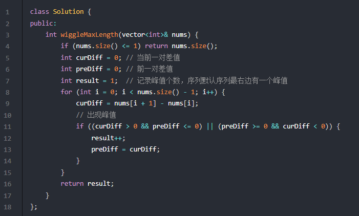
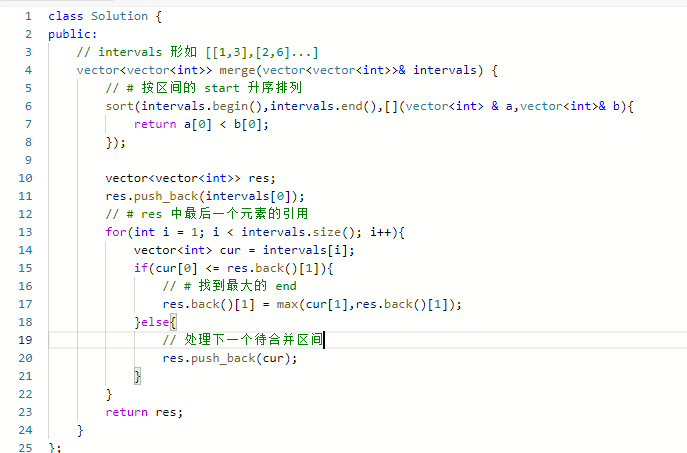
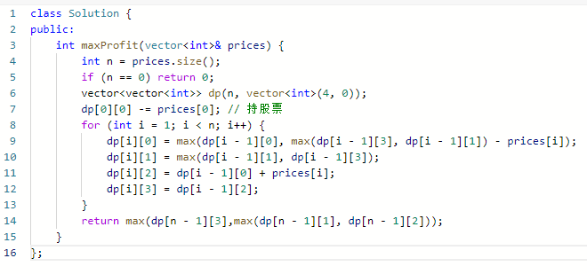

[www.programmercarl.com](https://www.programmercarl.com)

# C++刷题知识点总结
## Leetcode刷题常用函数总结(C++)
https://blog.csdn.net/qq_34116958/article/details/106796683 
 
 

## C++刷题常用函数总结
https://www.cnblogs.com/authetic/p/10420713.html 
C++ STL常用函数总结
https://blog.csdn.net/zygood_/article/details/122457444 
C++ 刷题实用方法总结
https://blog.csdn.net/huaxin0304/article/details/119781026?ops_request_misc=%257B%2522request%255Fid%2522%253A%2522165400329816781483742129%2522%252C%2522scm%2522%253A%252220140713.130102334.pc%255Fall.%2522%257D&request_id=165400329816781483742129&biz_id=0&utm_medium=distribute.pc_search_result.none-task-blog-2~all~first_rank_ecpm_v1~rank_v31_ecpm-7-119781026-null-null.142^v11^control,157^v12^control&utm_term=c%2B%2B+%E5%88%B7%E9%A2%98%E5%B8%B8%E7%94%A8+%E5%A4%B4%E6%96%87%E4%BB%B6+%E5%AE%B9%E5%99%A8%E7%B1%BB%E5%9E%8B+%E7%94%A8%E6%B3%95&spm=1018.2226.3001.4187 

## 华为机试总结
字符串最后一个单词的长度
String getline isspace用法
计算某字符出现次数
Unordered_map 范围for循环用法
随机数
Set vector 范围for循环用法
HJ4 字符串分隔
String 的函数用法  append0   substr用法
HJ5 进制转换
cout << stoi(str,0,16) << endl;        stoi的用法，可以将字符串转为指定进制的数字
HJ6 质数因子
质数（素数） 合数（合成数）
数据范围问题  大范围用long  or  long long   --- using ll=long long; 
头文件 cmath   sqrt     质数因子
HJ7 取近似值
小数的向上取整和向下取整    float转int 只保留整数部分
HJ8 合并表记录
Map 的 count函数
HJ9 提取不重复的整数
Reverse函数   unordered_set  insert  string + char --- string    stoi函数在string里面

HJ10 字符个数统计
哈希集合

HJ11 数字颠倒
 To_string  reverse函数

HJ12 字符串反转
空串 通过+  可以完成拼接

HJ13 句子逆序
Sstream  istringstream的用法 根据空格分割字符串  reverse的用法

HJ14 字符串排序
直接对很多字符串进行sort即可  sort的用法 默认升序方式 
谓词 仿射函数（函数对象） lambda表达式  自定义的时候 > 降序 < 升序

HJ15 求int型正整数在内存中存储时1的个数
位与操作 移位操作

HJ17 坐标移动
Switch case default  break

# 牛客输入输出

https://www.cnblogs.com/Allen-rg/p/13922965.html 

https://www.codeleading.com/article/38934414133/ 有用
## 输入
一、先说数字（通常给定一组数，或者给定给一个数组）
（1）直接输入一个数，对该数字进行一些操作，例如判断是否是素数，立方根等，这种类型只需要输入一个数即可，可用以下几种输入：

（2）给定一个数，表示有多少组数（可能是字符和数字的组合）
//输入：3
// liming,1410
// zhangsan,1562
// lisi,1355

（3）可能直接就是要求输入一组数，并不告知具体的数量，以（2）的例子为例，如果不告诉你多少个学生，你就无法根据学生数量用for循环输入了，这时候用while循环就可以很好地处理（流的处理模式）

　二、再说字符（串）（很常见）
（1）给定字符（串），进行相关地处理
//给定字符
char ch;
cin>>ch;//方式一
while(cin.get(ch))//方式二
//给定字符串
string input;
getline(cin,input);//方式一 解决字符串有空格的问题
cin>>input;//方式二
while(方式一/方式二) //方式三

（2）给定不止一组字符串，告知大小

（3）输入一组字符串，不告知大小，仍然以上个例子举例，不告诉你有多少字符串，这样就不能根据数量来用for循环做了，但可以用while循环处理


## 常用头文件 
#include <iostream>

#include <algorithm>
#include <cmath>
 
#include <string>
#include <vector>
#include <iterator>
#include <queue>　　　　　 //STL队列容器
#include <set>           //STL 集合容器
#include <stack>         //STL 堆栈容器
#include <map>           //STL map容器
 
using namespace std;

#include <bits/stdc++.h>

## 牛客网输入输出练习


## stringstream分割字符串
include<sstream>
 


[C++中getline()和cin同时使用时的注意事项](https://blog.csdn.net/m0_37536854/article/details/82873321)
在使用getline函数之前要注意，输入流中是否有可能会有换行符，如果有则使用cin.ignore清除。

> 同时使用cin和getline的时候，/n会缓存在对象里面，需要ignore一下，不然直接跳过了就

```c++
	int n, m;
	cin >> n >> m;
	cin.ignore(); // cin会缓存 /n 的内容。  
	string str;
	getline(cin, str);
	istringstream sin(str);
	string temp;
	vector<string> vec;
	while (getline(sin, temp, ' ')) {
		vec.push_back(temp);
	}
	cout << vec.empty();

	for (string& item : vec) {
		cout << item << " ";
	}
```


## bitset 位运算相关 用法
https://blog.csdn.net/m0_38132420/article/details/79175213


## C++中的各种进制转换函数汇总
https://blog.csdn.net/vir_lee/article/details/80645066


# 十大排序算法
https://blog.csdn.net/pilipilipan/article/details/79702298 

https://cloud.tencent.com/developer/article/1627749 
-	插入排序：
直接插入排序 二分法插入排序 希尔排序
-	交换排序：
冒泡排序（两两交换） 快速排序（pivot 分成两个子序列 一边小 一边大）
-	选择排序：
简单选择排序（遍历元素找出一个，然后放前面） 堆排序（构建大根堆或者小根堆） nlogn
-	归并排序  logn
2-路归并排序 将位置相邻的有序子序列归并成1个
-	基数排序 桶排序
不是基于比较的算法，先分配到桶，再收集  年月日 排序 适用于关键字确定的


## 快速排序
```c++
void quickSort(vector<int>& data, int low, int high) {
	//for_each(data.begin(), data.end(), [](const auto a) {cout << a << " "; });
	//cout << endl;
	if (low >= high) return;
	int key = data[low], begin = low, end = high;
	while (begin < end) {
		while (begin < end && data[end] > key) {
			end--;
		}
		if (begin < end) data[begin++] = data[end];
		while (begin<end && data[begin]<= key) {
			begin++;
		}
		if (begin < end) data[end--] = data[begin];
	}

	data[begin] = key;
	quickSort(data, low, begin - 1);
	quickSort(data, begin + 1,high);
}
```

## 归并排序

```c++
void mergeSort(vector<int>& data, vector<int>& copy, int begin, int end) {
	if (begin >= end) return;
	int mid = begin + (end - begin) / 2;
	int low1 = begin, high1 = mid, low2 = mid + 1, high2 = end, index = begin;
	mergeSort(copy, data, low1, high1);
	mergeSort(copy, data, low2, high2);
	while (low1 <= high1 && low2 <= high2) {

		copy[index++] = data[low1] < data[low2] ? data[low1++] : data[low2++];
	}
	while (low1 <= high1) {
		copy[index++] = data[low1++];
	}

	while (low2 <= high2) {
		copy[index++] = data[low2++];
	}
}

void mergeTest() {
	vector<int> nums = { -5,-10,6,5,12,96,1,2,3 };
	vector<int> copy(nums);
	mergeSort(nums, copy, 0, nums.size() - 1);
	nums.assign(copy.begin(), copy.end());
	for_each(nums.begin(), nums.end(), [](const auto& a) {cout << a << " "; });
}
```

## 堆排序

```c++
#include<iostream>
#include<vector>
using namespace std;
void swap(vector<int>& arr, int a,int b){
    arr[a]=arr[a]^arr[b];
    arr[b]=arr[a]^arr[b];
    arr[a]=arr[a]^arr[b];
}
void adjust(vector<int>& arr,int len,int index){
    int maxid=index;
    // 计算左右子节点的下标   left=2*i+1  right=2*i+2  parent=(i-1)/2
    int left=2*index+1,right=2*index+2;

    // 寻找当前以index为根的子树中最大/最小的元素的下标
    if(left<len and arr[left]<arr[maxid]) maxid=left;
    if(right<len and arr[right]<arr[maxid]) maxid=right;

    // 进行交换，记得要递归进行adjust,传入的index是maxid
    if(maxid!=index){
        swap(arr,maxid,index);
        adjust(arr,len,maxid);
    }
}
void heapsort(vector<int>&arr,int len){
    // 初次构建堆，i要从最后一个非叶子节点开始，所以是(len-1-1)/2，0这个位置要加等号
    for(int i=(len-1-1)/2;i>=0;i--){
        adjust(arr,len,i);
    }

    // 从最后一个元素的下标开始往前遍历，每次将堆顶元素交换至当前位置，并且缩小长度（i为长度），从0处开始adjust
    for(int i=len-1;i>0;i--){
        swap(arr,0,i);
        adjust(arr,i,0);// 注意每次adjust是从根往下调整，所以这里index是0！
    }
}
int main(){
    vector<int> arr={3,4,2,1,5,8,7,6};

    cout<<"before: "<<endl;
    for(int item:arr) cout<<item<<" ";
    cout<<endl;

    heapsort(arr,arr.size());

    cout<<"after: "<<endl;
    for(int item:arr)cout<<item<<" ";
    cout<<endl;

    return 0;
}
 
```


```java
桶排序算法

```


[十大经典排序算法动画与解析](https://mp.weixin.qq.com/s/vn3KiV-ez79FmbZ36SX9lg)

# 数组
## 前缀和数组
### 区域和检索 - 数组不可变  （一维）

size设置大于n，为了统一起来，主要有一个元素的情况  比如 sum[1]-sums[0], sums[0] = 0
实现一个类，实现o1的复杂度，计算区域和


### 二维区域和检索 - 矩阵不可变 （二维矩阵）


### 和为K的子数组个数
给你一个整数数组 nums 和一个整数 k ，请你统计并返回 该数组中和为 k 的连续子数组的个数 。


```c++
暴力解法 超出时间限制
class Solution {
public:
    int subarraySum(vector<int>& nums, int k) {
        int count = 0;
        int len = nums.size();
        for (int left = 0; left < len; left++) {
            int sum = 0;
            // 区间里可能会有一些互相抵销的元素
            for (int right = left; right < len; right++) {
                sum += nums[right];
                if (sum == k) {
                    count++;
                }
            }
        }
        return count;
    }
};
```

前缀和 + 哈希表优化


## 差分数组
前缀和主要适用的场景是原始数组不会被修改的情况下，频繁查询某个区间的累加和。
差分数组的主要适用场景是频繁对原始数组的某个区间的元素进行增减。


### 区间加法

### 航班预定统计


```c++
class Solution {
public:
    vector<int> corpFlightBookings(vector<vector<int>>& bookings, int n) {
        vector<int> nums(n);
        for (auto& booking : bookings) {
            nums[booking[0] - 1] += booking[2];
            if (booking[1] < n) {
                nums[booking[1]] -= booking[2];
            }
        }
        for (int i = 1; i < n; i++) {
            nums[i] += nums[i - 1];
        }
        return nums;
    }
};
```


### 拼车


trips = [[2,1,5],[3,3,7]], capacity = 4

```c++
class Solution {
public:
    bool carPooling(vector<vector<int>>& trips, int capacity) {
        vector<int> d(1001);
        for(auto &e: trips) {
            d[e[1]] += e[0];
            d[e[2]] -= e[0];
        }
        for(int i = 0; i <= 1000; i ++ ) {
            if(i) d[i] += d[i - 1];
            if(d[i] > capacity) return false;
        }
        return true;
    }
};
```


## 二分查找
### 二分查找
```c++
class Solution {
public:
    int search(vector<int>& nums, int target) {
        int left = 0;
        int right = nums.size() - 1; // 定义target在左闭右闭的区间里，[left, right]
        while (left <= right) { // 当left==right，区间[left, right]依然有效，所以用 <=
            int middle = left + ((right - left) / 2);// 防止溢出 等同于(left + right)/2
            if (nums[middle] > target) {
                right = middle - 1; // target 在左区间，所以[left, middle - 1]
            } else if (nums[middle] < target) {
                left = middle + 1; // target 在右区间，所以[middle + 1, right]
            } else { // nums[middle] == target
                return middle; // 数组中找到目标值，直接返回下标
            }
        }
        // 未找到目标值
        return -1;
    }
};
```
### 搜索插入位置（返回target index 或者插入的index）


  // 分别处理如下四种情况
        // 目标值在数组所有元素之前  [0, -1]
        // 目标值等于数组中某一个元素  return middle;
        // 目标值插入数组中的位置 [left, right]，return  right + 1
        // 目标值在数组所有元素之后的情况 [left, right]， 因为是右闭区间，所以 return right + 1


### 搜索插入位置（上下界）

```c++
class Solution {
public:
    vector<int> searchRange(vector<int>& nums, int target) {
        if(nums.size()==0){
            return {-1,-1};
        }
        int l =lb(nums,target);
        int r =rb(nums,target);
        return {l,r};
    }
    int lb(vector<int>& nums,int target){
        int l=0,r=nums.size()-1;
        
        while(l<=r){
            int mid = l+(r-l)/2;
            if(nums[mid]<target){
                l=mid+1;
            }else if(nums[mid]>target){
                r = mid-1;
            }else if(nums[mid]==target){
                r = r-1;
            }
        }
        if(l>=nums.size()||nums[l]!=target){
            return -1;
        }
        return l;
    }
    int rb(vector<int>& nums,int target){
        int l=0,r=nums.size()-1;
        while(l<=r){
            int mid = l+(r-l)/2;
            if(nums[mid]<target){
                l=mid+1;
            }else if(nums[mid]>target){
                r = mid-1;
            }else if(nums[mid]==target){
                l = l+1;
            }
        }
        if(r<0||nums[r]!=target){
            return -1;
        }
        return r;
    }

};
```

### x的平方根

```c++
class Solution {
public:
    int mySqrt(int x) {
        int l = 0, r = x, ans = -1;
        while (l <= r) {
            int mid = l + (r - l) / 2;
            if ((long long)mid * mid <= x) {
                ans = mid;
                l = mid + 1;
            } else {
                r = mid - 1;
            }
        }
        return ans;
    }
};
```

### 有效的完全平方数
给定一个 正整数 num ，编写一个函数，如果 num 是一个完全平方数，则返回 true ，否则返回 false 。
输入：num = 16
输出：true


## 双指针法
### 双指针技巧总纲
#### 1. 快慢指针  删除有序数组 和 有序链表的重复项


#### 2. 左右指针 二分查找+有序数组的两数之和


#### 3. 反转数组

#### 4. 回文串判断
```java
boolean isPalindrome(String s) {
    // 一左一右两个指针相向而行
    int left = 0, right = s.length() - 1;
    while (left < right) {
        if (s.charAt(left) != s.charAt(right)) {
            return false;
        }
        left++;
        right--;
    }
    return true;
}

```
#### 5. 最长回文子串
找回文串的难点在于，回文串的的长度可能是奇数也可能是偶数，解决该问题的核心是从中心向两端扩散的双指针技巧。
如果回文串的长度为奇数，则它有一个中心字符；如果回文串的长度为偶数，则可以认为它有两个中心字符。所以我们可以先实现这样一个函数：
```java
// 在 s 中寻找以 s[l] 和 s[r] 为中心的最长回文串
String palindrome(String s, int l, int r) {
    // 防止索引越界
    while (l >= 0 && r < s.length()
            && s.charAt(l) == s.charAt(r)) {
        // 双指针，向两边展开
        l--; r++;
    }
    // 返回以 s[l] 和 s[r] 为中心的最长回文串
    return s.substring(l + 1, r);
}
```
这样，如果输入相同的 l 和 r，就相当于寻找长度为奇数的回文串，如果输入相邻的 l 和 r，则相当于寻找长度为偶数的回文串。


### 移除元素

双指针方法


### 删除有序数组中的重复项


### 移动零（将0移动到末尾，保持相对顺序）


### 比较含退格的字符串
给定 s 和 t 两个字符串，当它们分别被输入到空白的文本编辑器后，如果两者相等，返回 true 。# 代表退格字符。
输入：s = "ab#c", t = "ad#c"
输出：true
解释：s 和 t 都会变成 "ac"。

**法一：使用栈，重构字符串比价**
O(M+N) O(M+N)


**法二：双指针法**
M+N   1


### 有序数组的平方（有正负数）

方法一：直接排序


方法二：找分界线，归并排序


方法三：双指针


## 滑动窗口
### 长度最小的子数组 连续
给定一个含有 n 个正整数的数组和一个正整数 s ，找出该数组中满足其和 ≥ s 的长度最小的 连续 子数组，并返回其长度。如果不存在符合条件的子数组，返回 0。
2*n 1


### 水果成篮


哈希map 套滑动窗口的模板


### 最小覆盖子串
本问题要求我们返回字符串 s 中包含字符串 t的全部字符的最小窗口。我们称包含 tt 的全部字母的窗口为「可行」窗口。
输入：s = "ADOBECODEBANC", t = "ABC"
输出："BANC"


### 找所有字母的异位词（同找排列问题）
相当于，输入一个串 S，一个串 T，找到 S 中所有 T 的排列，返回它们的起始索引


### 字符串排列（ t 的某个排列 在 s中出现）


### 最长无重复子串


### 剑指offerII的题目


## 模拟行为
### 翻转图像
请你将图像顺时针旋转 90 度。
主对角线镜像对称，然后每一行翻转。
```java
class Solution {
public:
    void rotate(vector<vector<int>>& matrix) {
        int m = matrix.size();
        int n = matrix[0].size();
        // 先沿对角线反转二维矩阵
        for(int i=0;i<=m-1;i++){
            for(int j =i;j<=n-1;j++){
                int temp = matrix[i][j];
                matrix[i][j] = matrix[j][i];
                matrix[j][i] = temp;
            }
        }
        // 然后反转二维矩阵的每一行
        for(int i = 0;i<m;i++){
            int left = 0,right = matrix[0].size()-1;
            // 反转一维数组
            while(left<right){
                int temp = matrix[i][left];
                matrix[i][left] = matrix[i][right];
                matrix[i][right] = temp;
                left++;
                right--;
            }
        }
    }
};
```

### 螺旋矩阵（顺时针遍历->vector中）


### 螺旋矩阵II（顺时针生成矩阵）
你一个正整数 n ，生成一个包含 1 到 n2 所有元素，且元素按顺时针顺序螺旋排列的 n x n 正方形矩阵 matrix 。


### 顺时针打印矩阵
同螺旋矩阵（顺时针遍历->vector中）

# 链表
## 两数相加（链表数字相加）

两个链表倒序的，

解法一，报错，数据长度有限制， int long 都不能完全通过


求出来两个链表的数字，相加后，然后再合成链表返回

```java
class Solution {
public:
    ListNode* addTwoNumbers(ListNode* l1, ListNode* l2) {
        

        long long num1 = 0,num2 = 0;
        long long mul1 = 1;
        while(l1!=nullptr){
            num1  = num1 + mul1 * l1->val;
            mul1 *= 10;
            l1 = l1->next;
        }

        mul1 = 1;
        while(l2!=nullptr){
            num2  = num2 + mul1 * l2->val;
            mul1 *= 10;
            l2 = l2->next;
        }

        long long res = num1 + num2;

        if(res ==0 )
        return new ListNode(0);

        cout<<res;
        ListNode* cur = new ListNode(0);
        ListNode* dummy = new ListNode(-1);
        dummy->next = cur;
        while(res){
            long long val = res%10;
            ListNode* temp = new ListNode(val);
            cur->next = temp;
            cur = cur->next;
            res = res/10;
        }
        return dummy->next->next;
    }
};
```

解法二： 直接在一个链表里面相加，考虑进位


这里的head tail两个指针，head只参与第一次节点创建，相当于dummy指针

```java
class Solution {
public:
    ListNode* addTwoNumbers(ListNode* l1, ListNode* l2) {
        ListNode *head = nullptr, *tail = nullptr;
        int carry = 0;
        while (l1 || l2) {
            // 判断l1是否为空。
            int n1 = l1 ? l1->val: 0;
            // 判断l1是否为空。
            int n2 = l2 ? l2->val: 0;
            // 计算sum：  carry为进位，初始为0
            int sum = n1 + n2 + carry;
            // 判断头节点是否非空：
            if (!head) { 
                // 如果头节点空的话，首次添加节点
                head = tail = new ListNode(sum % 10);
            } else {
                // 如果头节点非空的话，
                tail->next = new ListNode(sum % 10);
                tail = tail->next;
            }
            
            carry = sum / 10;
            if (l1) {
                l1 = l1->next;
            }
            if (l2) {
                l2 = l2->next;
            }
        }
        if (carry > 0) {
            tail->next = new ListNode(carry);
        }
        return head;
    }
};
```
单链表 双链表 循环链表（解决约瑟夫环的问题）
1. 定义
```c++
// 单链表
struct ListNode {
    int val;  // 节点上存储的元素
    ListNode *next;  // 指向下一个节点的指针
    ListNode(int x) : val(x), next(NULL) {}  // 节点的构造函数
};

ListNode* head = new ListNode(5);

```
数组在定义的时候，长度就是固定的，如果想改动数组的长度，就需要重新定义一个新的数组。

链表的长度可以是不固定的，并且可以动态增删， 适合数据量不固定，频繁增删，较少查询的场景。


## 双指针7道题目


### 合并两个有序链表 ！
虚拟节点，while里面两两比较大小接入即可

 


### 合并k个有序链表 ！（dummy 优先队列）
用到了虚拟头节点 和 优先队列（注意优先队列）
```c++

priority_queue<Type, Container, Functional>;
//Type是数据类型，Container为保存数据的容器，Functional为元素比较方式

//以int为例定义大顶堆的两种形式，默认是大顶堆，元素从大到小排序
priority_queue<int, vector<int>, less<int>> q1;
priority_queue<int> q2;

//以int为例定义小顶堆，元素从小到大排序
priority_queue<int, vector<int>, greater<int>> q3;

```
优先队列 和 sort有区别
优先队列的大小比较是相反的，less默认是大顶堆

优先队列pq中的元素个数最多是k，所以一次poll或者add方法的时间复杂度是O(logk)；所有的链表节点都会被加入和弹出pq，所以算法整体的时间复杂度是O(Nlogk)，其中k是链表的条数，N是这些链表的节点总数。


### 删除链表的第k个节点

双指针方法 快慢指针
fast首先走n + 1步 ，为什么是n+1呢，因为只有这样同时移动的时候slow才能指向删除节点的上一个节点（方便做删除操作），如图：
fast和slow同时移动，直到fast指向末尾，


### 环形链表（是否有环）
判断链表是否有环

### 环形链表II （检测环的入口）

### 链表的中间节点
快慢指针

**注意边界条件**


### 相交链表

还有哈希set 判断第一个交点 不过空间复杂度高

两个链表搞成循环 遍历完1遍历2  两个指针  相交的地方就是交点

两个链表搞成循环 遍历完1遍历2  两个指针  相交的地方就是交点


有哈希解法 和 双链表解法
哈希


两个链表搞成循环 遍历完1遍历2  两个指针  相交的地方就是交点


## 翻转链表
迭代法和递归法
双指针法（因为单向，需要保存前一个）

步骤：  三步走

1. 保存一下 cur的下一个节点，因为接下来要改变cur->next
2. 翻转操作
3. 更新pre 和 cur指针


## k个一组反转链表
[k个一组反转链表](https://mp.weixin.qq.com/s/A-dQ9spsP_Iu1Y4iCRP9nA)
如果不是k的整数倍，剩余的节点保持有序

1、先反转以 head 开头的 k 个元素。
2、将第 k + 1 个元素作为 head 递归调用 reverseKGroup 函数。
3、将上述两个过程的结果连接起来。

```c++
class Solution {
public:
    ListNode* reverseKGroup(ListNode* head, int k) {
        if( head == nullptr ) return nullptr;
        ListNode* a = head;
        ListNode* b = head;
        for(int i = 0; i < k; i++){
            if(b == nullptr) return head;
            b = b->next;
        }
        ListNode* newNode = reverse(a,b);
        a->next = reverseKGroup(b,k);
        return newNode;
    }

    ListNode* reverse(ListNode* a,ListNode* b){
        ListNode* temp;
        ListNode* pre = nullptr;
        ListNode* cur = a;
        while(cur != b){
            temp = cur->next; // 保存cur的下一个节点
            cur->next = pre; //翻转
            // 移动
            pre = cur;
            cur = temp;
        }
        return pre;
    }
};
```


## 判断回文链表
判断回文串 ：  使用双指针从两端向中心遍历即可
寻找回文串： 需要根据奇数和偶数 从中心向两端扩展

三种方法： 
1. 创建一个新的链表，逆序然后对比  
2. 复制到数组中使用双指针法
3. 利用后序遍历的思想 


## 移除链表 虚拟头节点


## 设计链表


```c++
class MyLinkedList {
public:
    // 定义链表节点结构体
    struct LinkedNode {
        int val;
        LinkedNode* next;
        LinkedNode(int val):val(val), next(nullptr){}
    };

    // 初始化链表
    MyLinkedList() {
        _dummyHead = new LinkedNode(0); // 这里定义的头结点 是一个虚拟头结点，而不是真正的链表头结点
        _size = 0;
    }

    // 获取到第index个节点数值，如果index是非法数值直接返回-1， 注意index是从0开始的，第0个节点就是头结点
    int get(int index) {
        if (index > (_size - 1) || index < 0) {
            return -1;
        }
        LinkedNode* cur = _dummyHead->next;
        while(index--){ // 如果--index 就会陷入死循环
            cur = cur->next;
        }
        return cur->val;
    }

    // 在链表最前面插入一个节点，插入完成后，新插入的节点为链表的新的头结点
    void addAtHead(int val) {
        LinkedNode* newNode = new LinkedNode(val);
        newNode->next = _dummyHead->next;
        _dummyHead->next = newNode;
        _size++;
    }

    // 在链表最后面添加一个节点
    void addAtTail(int val) {
        LinkedNode* newNode = new LinkedNode(val);
        LinkedNode* cur = _dummyHead;
        while(cur->next != nullptr){
            cur = cur->next;
        }
        cur->next = newNode;
        _size++;
    }

    // 在第index个节点之前插入一个新节点，例如index为0，那么新插入的节点为链表的新头节点。
    // 如果index 等于链表的长度，则说明是新插入的节点为链表的尾结点
    // 如果index大于链表的长度，则返回空
    void addAtIndex(int index, int val) {
        if (index > _size) {
            return;
        }
        LinkedNode* newNode = new LinkedNode(val);
        LinkedNode* cur = _dummyHead;
        while(index--) {
            cur = cur->next;
        }
        newNode->next = cur->next;
        cur->next = newNode;
        _size++;
    }

    // 删除第index个节点，如果index 大于等于链表的长度，直接return，注意index是从0开始的
    void deleteAtIndex(int index) {
        if (index >= _size || index < 0) {
            return;
        }
        LinkedNode* cur = _dummyHead;
        while(index--) {
            cur = cur ->next;
        }
        LinkedNode* tmp = cur->next;
        cur->next = cur->next->next;
        delete tmp;
        _size--;
    }

    // 打印链表
    void printLinkedList() {
        LinkedNode* cur = _dummyHead;
        while (cur->next != nullptr) {
            cout << cur->next->val << " ";
            cur = cur->next;
        }
        cout << endl;
    }
private:
    int _size;
    LinkedNode* _dummyHead;

};
```


## 两两交换链表中的节点

方法1：正常模拟
此时一定要画图，不画图，操作多个指针很容易乱，而且要操作的先后顺序


# 哈希表


## 数组作为哈希表


### 有效的字母异位词(2字符串 一个是否为另一个)

示例 1: 输入: s = "anagram", t = "nagaram" 输出: true
示例 2: 输入: s = "rat", t = "car" 输出: false

若 s 和 t 中每个字符出现的次数都相同，则称 s 和 t 互为字母异位词。

```c++

class Solution {
public:
    bool isAnagram(string s, string t) {
        int record[26] = {0};
        for (int i = 0; i < s.size(); i++) {
            // 并不需要记住字符a的ASCII，只要求出一个相对数值就可以了
            record[s[i] - 'a']++;
        }
        for (int i = 0; i < t.size(); i++) {
            record[t[i] - 'a']--;
        }
        for (int i = 0; i < 26; i++) {
            if (record[i] != 0) {
                // record数组如果有的元素不为零0，说明字符串s和t 一定是谁多了字符或者谁少了字符。
                return false;
            }
        }
        // record数组所有元素都为零0，说明字符串s和t是字母异位词
        return true;
    }
};

```

### 赎金信

给定一个赎金信 (ransom) 字符串和一个杂志(magazine)字符串，判断第一个字符串 ransom 能不能由第二个字符串 magazines 里面的字符构成。如果可以构成，返回 true ；否则返回 false。

杂志字符串中的每个字符只能在赎金信字符串中使用一次。

canConstruct("a", "b") -> false
canConstruct("aa", "ab") -> false
canConstruct("aa", "aab") -> true

```c++
// 时间复杂度: O(n)
// 空间复杂度：O(1)
class Solution {
public:
    bool canConstruct(string ransomNote, string magazine) {
        int record[26] = {0};
        //add
        if (ransomNote.size() > magazine.size()) {
            return false;
        }
        for (int i = 0; i < magazine.length(); i++) {
            // 通过recode数据记录 magazine里各个字符出现次数
            record[magazine[i]-'a'] ++;
        }
        for (int j = 0; j < ransomNote.length(); j++) {
            // 遍历ransomNote，在record里对应的字符个数做--操作
            record[ransomNote[j]-'a']--;
            // 如果小于零说明ransomNote里出现的字符，magazine没有
            if(record[ransomNote[j]-'a'] < 0) {
                return false;
            }
        }
        return true;
    }
};
```

## set作为哈希表


### 两个数组的交集

```java
class Solution {
public:
    vector<int> intersection(vector<int>& nums1, vector<int>& nums2) {
        unordered_set<int> result_set; // 存放结果
        unordered_set<int> nums_set(nums1.begin(), nums1.end());
        for (int num : nums2) {
            // 发现nums2的元素 在nums_set里又出现过
            if (nums_set.find(num) != nums_set.end()) {
                result_set.insert(num);
            }
        }
        return vector<int>(result_set.begin(), result_set.end());
    }
};
```
### 快乐数（平方循环后为1）
// 如果这个sum曾经出现过，说明已经陷入了无限循环了，立刻return false


```java
class Solution {
public:
    // 取数值各个位上的单数之和
    int getSum(int n) {
        int sum = 0;
        while (n) {
            sum += (n % 10) * (n % 10);
            n /= 10;
        }
        return sum;
    }
    bool isHappy(int n) {
        unordered_set<int> set;
        while(1) {
            int sum = getSum(n);
            if (sum == 1) {
                return true;
            }
            // 如果这个sum曾经出现过，说明已经陷入了无限循环了，立刻return false
            if (set.find(sum) != set.end()) {
                return false;
            } else {
                set.insert(sum);
            }
            n = sum;
        }
    }
};
```

## map作为哈希表


### 两数之和

piar     utility 头文件   vector unordered_map 

```java
class Solution {
public:
    vector<int> twoSum(vector<int>& nums, int target) {
        std::unordered_map <int,int> map;
        for(int i = 0; i < nums.size(); i++) {
            auto iter = map.find(target - nums[i]);
            if(iter != map.end()) {
                return {iter->second, i};
            }
            map.insert(pair<int, int>(nums[i], i));
        }
        return {};
    }
};
```
### 四数相加
（前两个求和 与后两个哈希）


```java
class Solution {
public:
    int fourSumCount(vector<int>& A, vector<int>& B, vector<int>& C, vector<int>& D) {
        unordered_map<int, int> umap; //key:a+b的数值，value:a+b数值出现的次数
        // 遍历大A和大B数组，统计两个数组元素之和，和出现的次数，放到map中
        for (int a : A) {
            for (int b : B) {
                umap[a + b]++;
            }
        }
        int count = 0; // 统计a+b+c+d = 0 出现的次数
        // 在遍历大C和大D数组，找到如果 0-(c+d) 在map中出现过的话，就把map中key对应的value也就是出现次数统计出来。
        for (int c : C) {
            for (int d : D) {
                if (umap.find(0 - (c + d)) != umap.end()) {
                    count += umap[0 - (c + d)];
                }
            }
        }
        return count;
    }
};

```

### 三数之和


双指针解法
需要保证数组有序


```java
class Solution {
public:
    vector<vector<int>> threeSum(vector<int>& nums) {
        vector<vector<int>> result;
        sort(nums.begin(), nums.end());
        // 找出a + b + c = 0

        for (int i = 0; i < nums.size(); i++) {
            // 排序之后如果第一个元素已经大于零，那么无论如何组合都不可能凑成三元组，直接返回结果就可以了
            if (nums[i] > 0) {
                return result;
            }
            
            // 正确去重方法
            if (i > 0 && nums[i] == nums[i - 1]) {
                continue;
            }
            int left = i + 1;
            int right = nums.size() - 1;
            while (right > left) {
                if (nums[i] + nums[left] + nums[right] > 0) {
                    right--;
                    // 当前元素不合适了，可以去重
                    while (left < right && nums[right] == nums[right + 1]) right--;
                } else if (nums[i] + nums[left] + nums[right] < 0) {
                    left++;
                    // 不合适，去重
                    while (left < right && nums[left] == nums[left - 1]) left++;
                } else {
                    result.push_back(vector<int>{nums[i], nums[left], nums[right]});
                    // 去重逻辑应该放在找到一个三元组之后
                    while (right > left && nums[right] == nums[right - 1]) right--;
                    while (right > left && nums[left] == nums[left + 1]) left++;
                    // 找到答案时，双指针同时收缩
                    right--;
                    left++;
                }
            }

        }
        return result;
    }
};

```
### 四数之和


```java
class Solution {
public:
    vector<vector<int>> fourSum(vector<int>& nums, int target) {
        vector<vector<int>> result;
        sort(nums.begin(), nums.end());
        for (int k = 0; k < nums.size(); k++) {
	    // 剪枝处理
            if (nums[k] > target && (nums[k] >= 0 || target >= 0)) {
            	break; // 这里使用break，统一通过最后的return返回
            }
            // 去重
            if (k > 0 && nums[k] == nums[k - 1]) {
                continue;
            }
            for (int i = k + 1; i < nums.size(); i++) {
	    	    // 2级剪枝处理
		        if (nums[k] + nums[i] > target && (nums[k] + nums[i] >= 0 || target >= 0)) {
		            break;
		        }
		
                // 正确去重方法
                if (i > k + 1 && nums[i] == nums[i - 1]) {
                    continue;
                }
                int left = i + 1;
                int right = nums.size() - 1;
                while (right > left) {
                    // nums[k] + nums[i] + nums[left] + nums[right] > target 会溢出
                    if (nums[k] + nums[i] > target - (nums[left] + nums[right])) {
                        right--;
                        // 当前元素不合适了，可以去重
                        while (left < right && nums[right] == nums[right + 1]) right--;
                    // nums[k] + nums[i] + nums[left] + nums[right] < target 会溢出
                    } else if (nums[k] + nums[i]  < target - (nums[left] + nums[right])) {
                        left++;
                        // 不合适，去重
                        while (left < right && nums[left] == nums[left - 1]) left++;
                    } else {
                        result.push_back(vector<int>{nums[k], nums[i], nums[left], nums[right]});
                        // 去重逻辑应该放在找到一个四元组之后
                        while (right > left && nums[right] == nums[right - 1]) right--;
                        while (right > left && nums[left] == nums[left + 1]) left++;

                        // 找到答案时，双指针同时收缩
                        right--;
                        left++;
                    }
                }

            }
        }
        return result;
    }
};
```

# 字符串
## 把字符串转换成整数(atoi)

思路：
既然是将字符串转化为数字，那我们可以遍历字符串，一个字符串，一个字符地检查，然后取出掉无用的，取出数字，利用如下代码，一个数字一个数字地转换，前面的扩大十倍加上后面一位。
> res = res * 10 + sign * (c - '0');

具体做法：
step 1：遍历字符串，用index记录全程的下标。
step 2：首先要排除空串，然后越过前导空格，以及前导空格后什么都没有就返回0.
step 3：然后检查符号，没有符号默认为正数。
step 4：再在后续遍历的时候，将数字字符转换成字符，遇到非数字则结束转换。
step 5：与Int型最大最小值比较，检查越界情况。

```c++
class Solution {
public:
    int StrToInt(string s) {
        int res = 0;
        int index = 0;
        int n = s.length();
        //去掉前导空格，如果有
        while(index < n){ 
            if(s[index] == ' ')
                index++;
            else
                break;
        }
        //去掉空格就什么都没有了
        if(index == n) 
            return 0;
        int sign = 1;
        //处理第一个符号是正负号的情况
        if(s[index] == '+')
            index++;
        else if(s[index] == '-'){
            index++;
            sign = -1;
        }
        //去掉符号就什么都没有了
        if(index == n) 
            return 0;
        while(index < n){
            char c = s[index];
            //后续非法字符，截断
            if(c < '0' || c > '9')  
                break;
            //处理越界
            if(res > INT_MAX / 10 || (res == INT_MAX / 10 && (c - '0') > INT_MAX % 10))
            
                return INT_MAX;
            if(res < INT_MIN / 10 || (res == INT_MIN / 10 && (c - '0') > -(INT_MIN % 10)))
                return INT_MIN;
            res = res * 10 + sign * (c - '0');
            index++;
        }
        return res;
    }
};
```

## 反转字符串
utility  iostream algorithm 都有 swap    c++11改在了al...
**双指针 交换首尾**

```java
class Solution {
public:
    void reverseString(vector<char>& s) {
        int i = 0;
        int j = s.size()-1;
        while(i<=j){
            swap(s[i],s[j]);
            i++;
            j--;
        }
    }
};
```

## 反转字符串II （每2k 对前k 个字符反转）

其实在遍历字符串的过程中，只要让 i += (2 * k)，i 每次移动 2 * k 就可以了，然后判断是否需要有反转的区间。
当需要固定规律一段一段去处理字符串的时候，要想想在在for循环的表达式上做做文章。
 


所以当需要固定规律一段一段去处理字符串的时候，**要想想在在for循环的表达式上做做文章。**

  


## 替换空格 （用%20替换' '）
请实现一个函数，把字符串 s 中的每个空格替换成"%20"。
// 统计空格的个数 // 扩充字符串s的大小，也就是每个空格替换成"%20"之后的大小
// 从后先前将空格替换为"%20"


### 1. 使用额外的辅助空间：
```java
class Solution {
public:
    string replaceSpace(string s) {
        string str;
        for(auto c:s){
            if(c==' '){
                str+="%20";
            }else{
                str+=c;
            }
        }
        return str;
    }
};
```

### 2. 不适用额外辅助空间


## 翻转字符串中的单词
（代码较多 细节）
先移除多余空格 再反转整个字符串 然后再翻转单词 （整体+局部）

1. split函数分割，然后反转，再join
```java
#include<sstream>
istringstream sin(string);
while(gelint(sin,str,',')){
    res.push_back(str);
}
```

2. 双指针
思路： 整体翻转+ 局部翻转
   -  移除多余空格
    - 将整个字符串反转
    - 将每个单词反转


```java
// 版本一
class Solution {
public:
    // 反转字符串s中左闭又闭的区间[start, end]
    void reverse(string& s, int start, int end) {
        for (int i = start, j = end; i < j; i++, j--) {
            swap(s[i], s[j]);
        }
    }

    // 移除冗余空格：使用双指针（快慢指针法）O(n)的算法
    void removeExtraSpaces(string& s) {
        int slowIndex = 0, fastIndex = 0; // 定义快指针，慢指针
        // 去掉字符串前面的空格
        while (s.size() > 0 && fastIndex < s.size() && s[fastIndex] == ' ') {
            fastIndex++;
        }
        for (; fastIndex < s.size(); fastIndex++) {
            // 去掉字符串中间部分的冗余空格
            if (fastIndex - 1 > 0
                    && s[fastIndex - 1] == s[fastIndex]
                    && s[fastIndex] == ' ') {
                continue;
            } else {
                s[slowIndex++] = s[fastIndex];
            }
        }
        if (slowIndex - 1 > 0 && s[slowIndex - 1] == ' ') { // 去掉字符串末尾的空格
            s.resize(slowIndex - 1);
        } else {
            s.resize(slowIndex); // 重新设置字符串大小
        }
    }

    string reverseWords(string s) {
        removeExtraSpaces(s); // 去掉冗余空格
        reverse(s, 0, s.size() - 1); // 将字符串全部反转
        int start = 0; // 反转的单词在字符串里起始位置
        int end = 0; // 反转的单词在字符串里终止位置
        bool entry = false; // 标记枚举字符串的过程中是否已经进入了单词区间
        for (int i = 0; i < s.size(); i++) { // 开始反转单词
            if (!entry) {
                start = i; // 确定单词起始位置
                entry = true; // 进入单词区间
            }
            // 单词后面有空格的情况，空格就是分词符
            if (entry && s[i] == ' ' && s[i - 1] != ' ') {
                end = i - 1; // 确定单词终止位置
                entry = false; // 结束单词区间
                reverse(s, start, end);
            }
            // 最后一个结尾单词之后没有空格的情况
            if (entry && (i == (s.size() - 1)) && s[i] != ' ' ) {
                end = i;// 确定单词终止位置
                entry = false; // 结束单词区间
                reverse(s, start, end);
            }
        }
        return s;
    }
    
};
```
## 左旋字符串（把前n个字符串移动到末尾）


**局部翻转 + 整体翻转 = 左旋转**
具体步骤为：
反转区间为前n的子串
反转区间为n到末尾的子串
反转整个字符串

```java
class Solution {
public:
    string reverseLeftWords(string s, int n) {
        reverse(s.begin(), s.begin() + n);
        reverse(s.begin() + n, s.end());
        reverse(s.begin(), s.end());
        return s;
    }
};
```

## 实现strStr() (KMP算法) ？
在一个串中查找是否出现过另一个串，


前缀：包含首字母不包含尾字母的所有串
后缀：包含尾字母不包含首字母的所有串
前缀表： next数组 遇到冲突 告诉我们回退到哪里

最长相等前后缀： 

```c++
class Solution {
public:
    void getNext(int* next, const string& s) {
        int j = 0;
        next[0] = 0;
        for(int i = 1; i < s.size(); i++) {
            while (j > 0 && s[i] != s[j]) {
                j = next[j - 1];
            }
            if (s[i] == s[j]) {
                j++;
            }
            next[i] = j;
        }
    }
    int strStr(string haystack, string needle) {
        if (needle.size() == 0) {
            return 0;
        }
        int next[needle.size()];
        getNext(next, needle);
        int j = 0;
        for (int i = 0; i < haystack.size(); i++) {
            while(j > 0 && haystack[i] != needle[j]) {
                j = next[j - 1];
            }
            if (haystack[i] == needle[j]) {
                j++;
            }
            if (j == needle.size() ) {
                return (i - needle.size() + 1);
            }
        }
        return -1;
    }
};
```


## 重复的子字符串 （s可以由多个串重复得到）？


## 字符串相乘 （数字乘法）
数字太大，直接相乘会发生益处，因此采用数字乘法进行。


- 索引从0开始
num1[i] 和 num2[j] 的乘积对应的就是 res[i+j] 和 res[i+j+1] 这两个位置。


# 数据结构设计+栈与队列

## 单调栈
前三道题的单调栈解法： [单调栈结构解决三道算法题](https://labuladong.github.io/algo/2/21/60/)

### 每日温度（下一个比今天大的温度的，还有几天 ）
下一个比今天大的温度的，还有几天  单调栈：从栈顶到栈底 单调递增
例如，给定一个列表 temperatures = [73, 74, 75, 71, 69, 72, 76, 73]，你的输出应该是 [1, 1, 4, 2, 1, 1, 0, 0]。
```java
// 版本一
class Solution {
public:
    vector<int> dailyTemperatures(vector<int>& T) {
        // 递增栈
        stack<int> st; // 栈里面保存的是索引
        vector<int> result(T.size(), 0);
        st.push(0);
        for (int i = 1; i < T.size(); i++) {
            if (T[i] < T[st.top()]) {                       // 情况一
                st.push(i);
            } else if (T[i] == T[st.top()]) {               // 情况二
                st.push(i);
            } else {
                while (!st.empty() && T[i] > T[st.top()]) { // 情况三
                    result[st.top()] = i - st.top();
                    st.pop();
                }
                st.push(i);
            }
        }
        return result;
    }
};
```


### 下一个更大元素 I


```java
// 版本一
class Solution {
public:
    vector<int> nextGreaterElement(vector<int>& nums1, vector<int>& nums2) {
        stack<int> st;
        vector<int> result(nums1.size(), -1);
        if (nums1.size() == 0) return result;

        unordered_map<int, int> umap; // key:下标元素，value：下标
        for (int i = 0; i < nums1.size(); i++) {
            umap[nums1[i]] = i;
        }
        st.push(0);
        for (int i = 1; i < nums2.size(); i++) {
            if (nums2[i] < nums2[st.top()]) {           // 情况一
                st.push(i);
            } else if (nums2[i] == nums2[st.top()]) {   // 情况二
                st.push(i);
            } else {                                    // 情况三
                while (!st.empty() && nums2[i] > nums2[st.top()]) {
                    if (umap.count(nums2[st.top()]) > 0) { // 看map里是否存在这个元素
                        int index = umap[nums2[st.top()]]; // 根据map找到nums2[st.top()] 在 nums1中的下标
                        result[index] = nums2[i];
                    }
                    st.pop();
                }
                st.push(i);
            }
        }
        return result;
    }
};
```


### 下一个更大元素 II


```java
// 版本一
class Solution {
public:
    vector<int> nextGreaterElements(vector<int>& nums) {
        // 拼接一个新的nums
        vector<int> nums1(nums.begin(), nums.end());
        nums.insert(nums.end(), nums1.begin(), nums1.end());
        // 用新的nums大小来初始化result
        vector<int> result(nums.size(), -1);
        if (nums.size() == 0) return result;

        // 开始单调栈
        stack<int> st;
        for (int i = 0; i < nums.size(); i++) {
            while (!st.empty() && nums[i] > nums[st.top()]) {
                result[st.top()] = nums[i];
                st.pop();
            }
            st.push(i);
        }
        // 最后再把结果集即result数组resize到原数组大小
        result.resize(nums.size() / 2);
        return result;
    }
};

```

### 接雨水


三种解法：
 双指针法
```java
class Solution {
public:
    int trap(vector<int>& height) {
        int sum = 0;
        for (int i = 0; i < height.size(); i++) {
            // 第一个柱子和最后一个柱子不接雨水
            if (i == 0 || i == height.size() - 1) continue;

            int rHeight = height[i]; // 记录右边柱子的最高高度
            int lHeight = height[i]; // 记录左边柱子的最高高度
            for (int r = i + 1; r < height.size(); r++) {
                if (height[r] > rHeight) rHeight = height[r];
            }
            for (int l = i - 1; l >= 0; l--) {
                if (height[l] > lHeight) lHeight = height[l];
            }
            int h = min(lHeight, rHeight) - height[i];
            if (h > 0) sum += h;
        }
        return sum;
    }
};
```
动态规划
```java
class Solution {
public:
    int trap(vector<int>& height) {
        if (height.size() <= 2) return 0;
        vector<int> maxLeft(height.size(), 0);
        vector<int> maxRight(height.size(), 0);
        int size = maxRight.size();

        // 记录每个柱子左边柱子最大高度
        maxLeft[0] = height[0];
        for (int i = 1; i < size; i++) {
            maxLeft[i] = max(height[i], maxLeft[i - 1]);
        }
        // 记录每个柱子右边柱子最大高度
        maxRight[size - 1] = height[size - 1];
        for (int i = size - 2; i >= 0; i--) {
            maxRight[i] = max(height[i], maxRight[i + 1]);
        }
        // 求和
        int sum = 0;
        for (int i = 0; i < size; i++) {
            int count = min(maxLeft[i], maxRight[i]) - height[i];
            if (count > 0) sum += count;
        }
        return sum;
    }
};
```

单调栈
```java
class Solution {
public:
    int trap(vector<int>& height) {
        if (height.size() <= 2) return 0; // 可以不加
        stack<int> st; // 存着下标，计算的时候用下标对应的柱子高度
        st.push(0);
        int sum = 0;
        for (int i = 1; i < height.size(); i++) {
            if (height[i] < height[st.top()]) {     // 情况一
                st.push(i);
            } if (height[i] == height[st.top()]) {  // 情况二
                st.pop(); // 其实这一句可以不加，效果是一样的，但处理相同的情况的思路却变了。
                st.push(i);
            } else {                                // 情况三
                while (!st.empty() && height[i] > height[st.top()]) { // 注意这里是while
                    int mid = st.top();
                    st.pop();
                    if (!st.empty()) {
                        int h = min(height[st.top()], height[i]) - height[mid];
                        int w = i - st.top() - 1; // 注意减一，只求中间宽度
                        sum += h * w;
                    }
                }
                st.push(i);
            }
        }
        return sum;
    }
};

```


### 柱状图中的最大矩形


#### 双指针
```java
class Solution {
public:
    int largestRectangleArea(vector<int>& heights) {
        int sum = 0;
        for (int i = 0; i < heights.size(); i++) {
            int left = i;
            int right = i;
            for (; left >= 0; left--) {
                if (heights[left] < heights[i]) break;
            }
            for (; right < heights.size(); right++) {
                if (heights[right] < heights[i]) break;
            }
            int w = right - left - 1;
            int h = heights[i];
            sum = max(sum, w * h);
        }
        return sum;
    }
};
```

#### 动态规划
```java
class Solution {
public:
    int largestRectangleArea(vector<int>& heights) {
        vector<int> minLeftIndex(heights.size());
        vector<int> minRightIndex(heights.size());
        int size = heights.size();

        // 记录每个柱子 左边第一个小于该柱子的下标
        minLeftIndex[0] = -1; // 注意这里初始化，防止下面while死循环
        for (int i = 1; i < size; i++) {
            int t = i - 1;
            // 这里不是用if，而是不断向左寻找的过程
            while (t >= 0 && heights[t] >= heights[i]) t = minLeftIndex[t];
            minLeftIndex[i] = t;
        }
        // 记录每个柱子 右边第一个小于该柱子的下标
        minRightIndex[size - 1] = size; // 注意这里初始化，防止下面while死循环
        for (int i = size - 2; i >= 0; i--) {
            int t = i + 1;
            // 这里不是用if，而是不断向右寻找的过程
            while (t < size && heights[t] >= heights[i]) t = minRightIndex[t];
            minRightIndex[i] = t;
        }
        // 求和
        int result = 0;
        for (int i = 0; i < size; i++) {
            int sum = heights[i] * (minRightIndex[i] - minLeftIndex[i] - 1);
            result = max(sum, result);
        }
        return result;
    }
};
```

#### 单调栈
```jva
// 版本一
class Solution {
public:
    int largestRectangleArea(vector<int>& heights) {
        stack<int> st;
        heights.insert(heights.begin(), 0); // 数组头部加入元素0
        heights.push_back(0); // 数组尾部加入元素0
        st.push(0);
        int result = 0;
        // 第一个元素已经入栈，从下标1开始
        for (int i = 1; i < heights.size(); i++) {
            // 注意heights[i] 是和heights[st.top()] 比较 ，st.top()是下标
            if (heights[i] > heights[st.top()]) {
                st.push(i);
            } else if (heights[i] == heights[st.top()]) {
                st.pop(); // 这个可以加，可以不加，效果一样，思路不同
                st.push(i);
            } else {
                while (heights[i] < heights[st.top()]) { // 注意是while
                    int mid = st.top();
                    st.pop();
                    int left = st.top();
                    int right = i;
                    int w = right - left - 1;
                    int h = heights[mid];
                    result = max(result, w * h);
                }
                st.push(i);
            }
        }
        return result;
    }
};
```


## LRU设计


private： unordered_map<key,node*>   head  tail   size capacity
public：
        1. 构造函数 - 初始化 head tail capacity size
        2. put(int key, int value) - 如果 key 不存在，创建一个新的节点  ; 添加进哈希表 ;  添加至双向链表的头部; 
                                                        如果超出容量，删除双向链表的尾部节点;   删除哈希表中对应的项;  释放内存； size--
        3. get(int key)     - 如果 key 存在，先通过哈希表定位，再移到头部       
        4. addToHead(node) - 添加到头部
        5. removeNode(node) - 移除节点
        6. removeTail() - 移除尾部节点


```java
//需要 后面细看~

struct DLinkedNode {
    int key, value;
    DLinkedNode* prev;
    DLinkedNode* next;
    DLinkedNode(): key(0), value(0), prev(nullptr), next(nullptr) {}
    DLinkedNode(int _key, int _value): key(_key), value(_value), prev(nullptr), next(nullptr) {}
};

class LRUCache {
private:
    unordered_map<int, DLinkedNode*> cache;
    DLinkedNode* head;
    DLinkedNode* tail;
    int size;
    int capacity;

public:
    LRUCache(int _capacity): capacity(_capacity), size(0) {
        // 使用伪头部和伪尾部节点
        head = new DLinkedNode();
        tail = new DLinkedNode();
        head->next = tail;
        tail->prev = head;
    }
    
    int get(int key) {
        if (!cache.count(key)) {
            return -1;
        }
        // 如果 key 存在，先通过哈希表定位，再移到头部
        DLinkedNode* node = cache[key];
        moveToHead(node);
        return node->value;
    }
    
    void put(int key, int value) {
        if (!cache.count(key)) {
            // 如果 key 不存在，创建一个新的节点
            DLinkedNode* node = new DLinkedNode(key, value);
            // 添加进哈希表
            cache[key] = node;
            // 添加至双向链表的头部
            addToHead(node);
            ++size;
            if (size > capacity) {
                // 如果超出容量，删除双向链表的尾部节点
                DLinkedNode* removed = removeTail();
                // 删除哈希表中对应的项
                cache.erase(removed->key);
                // 防止内存泄漏
                delete removed;
                --size;
            }
        }
        else {
            // 如果 key 存在，先通过哈希表定位，再修改 value，并移到头部
            DLinkedNode* node = cache[key];
            node->value = value;
            moveToHead(node);
        }
    }

    void addToHead(DLinkedNode* node) {
        node->prev = head;
        node->next = head->next;
        head->next->prev = node;
        head->next = node;
    }
    
    void removeNode(DLinkedNode* node) {
        node->prev->next = node->next;
        node->next->prev = node->prev;
    }

    // 由前两个函数构成
    void moveToHead(DLinkedNode* node) {
        removeNode(node);
        addToHead(node);
    }

    DLinkedNode* removeTail() {
        DLinkedNode* node = tail->prev;
        removeNode(node);
        return node;
    }
};

/**
 * Your LRUCache object will be instantiated and called as such:
 * LRUCache* obj = new LRUCache(capacity);
 * int param_1 = obj->get(key);
 * obj->put(key,value);
 */
```


## LFU设计
[L;FU](https://labuladong.github.io/algo/2/21/57/)

1. 哈希表 和 平衡二叉树
```java
struct Node {
    int cnt, time, key, value;

    Node(int _cnt, int _time, int _key, int _value):cnt(_cnt), time(_time), key(_key), value(_value){}
    
    bool operator < (const Node& rhs) const {
        return cnt == rhs.cnt ? time < rhs.time : cnt < rhs.cnt;
    }
};
class LFUCache {
    // 缓存容量，时间戳
    int capacity, time;
    unordered_map<int, Node> key_table;
    set<Node> S;
public:
    LFUCache(int _capacity) {
        capacity = _capacity;
        time = 0;
        key_table.clear();
        S.clear();
    }
    
    int get(int key) {
        if (capacity == 0) return -1;
        auto it = key_table.find(key);
        // 如果哈希表中没有键 key，返回 -1
        if (it == key_table.end()) return -1;
        // 从哈希表中得到旧的缓存
        Node cache = it -> second;
        // 从平衡二叉树中删除旧的缓存
        S.erase(cache);
        // 将旧缓存更新
        cache.cnt += 1;
        cache.time = ++time;
        // 将新缓存重新放入哈希表和平衡二叉树中
        S.insert(cache);
        it -> second = cache;
        return cache.value;
    }
    
    void put(int key, int value) {
        if (capacity == 0) return;
        auto it = key_table.find(key);
        if (it == key_table.end()) {
            // 如果到达缓存容量上限
            if (key_table.size() == capacity) {
                // 从哈希表和平衡二叉树中删除最近最少使用的缓存
                key_table.erase(S.begin() -> key);
                S.erase(S.begin());
            }
            // 创建新的缓存
            Node cache = Node(1, ++time, key, value);
            // 将新缓存放入哈希表和平衡二叉树中
            key_table.insert(make_pair(key, cache));
            S.insert(cache);
        }
        else {
            // 这里和 get() 函数类似
            Node cache = it -> second;
            S.erase(cache);
            cache.cnt += 1;
            cache.time = ++time;
            cache.value = value;
            S.insert(cache);
            it -> second = cache;
        }
    }
};
```

2. 方法二：双哈希表

```java
// 缓存的节点信息
struct Node {
    int key, val, freq;
    Node(int _key,int _val,int _freq): key(_key), val(_val), freq(_freq){}
};
class LFUCache {
    int minfreq, capacity;
    unordered_map<int, list<Node>::iterator> key_table;
    unordered_map<int, list<Node>> freq_table;
public:
    LFUCache(int _capacity) {
        minfreq = 0;
        capacity = _capacity;
        key_table.clear();
        freq_table.clear();
    }
    
    int get(int key) {
        if (capacity == 0) return -1;
        auto it = key_table.find(key);
        if (it == key_table.end()) return -1;
        list<Node>::iterator node = it -> second;
        int val = node -> val, freq = node -> freq;
        freq_table[freq].erase(node);
        // 如果当前链表为空，我们需要在哈希表中删除，且更新minFreq
        if (freq_table[freq].size() == 0) {
            freq_table.erase(freq);
            if (minfreq == freq) minfreq += 1;
        }
        // 插入到 freq + 1 中
        freq_table[freq + 1].push_front(Node(key, val, freq + 1));
        key_table[key] = freq_table[freq + 1].begin();
        return val;
    }
    
    void put(int key, int value) {
        if (capacity == 0) return;
        auto it = key_table.find(key);
        if (it == key_table.end()) {
            // 缓存已满，需要进行删除操作
            if (key_table.size() == capacity) {
                // 通过 minFreq 拿到 freq_table[minFreq] 链表的末尾节点
                auto it2 = freq_table[minfreq].back();
                key_table.erase(it2.key);
                freq_table[minfreq].pop_back();
                if (freq_table[minfreq].size() == 0) {
                    freq_table.erase(minfreq);
                }
            } 
            freq_table[1].push_front(Node(key, value, 1));
            key_table[key] = freq_table[1].begin();
            minfreq = 1;
        } else {
            // 与 get 操作基本一致，除了需要更新缓存的值
            list<Node>::iterator node = it -> second;
            int freq = node -> freq;
            freq_table[freq].erase(node);
            if (freq_table[freq].size() == 0) {
                freq_table.erase(freq);
                if (minfreq == freq) minfreq += 1;
            }
            freq_table[freq + 1].push_front(Node(key, value, freq + 1));
            key_table[key] = freq_table[freq + 1].begin();
        }
    }
};
```


## 前缀树的应用
[前缀树](https://labuladong.github.io/algo/2/21/58/)


## 数据流中的中位数（hard）
[数据流中位数](https://labuladong.github.io/algo/2/21/59/)

## 二叉堆实现优先级队列  ！！
[二叉堆优先级队列实现](https://labuladong.github.io/algo/2/21/62/)


## 设计朋友圈时间线 设计推特
[355. 设计推特](https://labuladong.github.io/algo/2/21/64/)


## 两个栈实现队列（模拟）  
定义两个栈 一个入 一个出  push pop  peek isEmpty函数实现

```java
class MyQueue {
public:
    stack<int> stIn;
    stack<int> stOut;
    /** Initialize your data structure here. */
    MyQueue() {

    }
    /** Push element x to the back of queue. */
    void push(int x) {
        stIn.push(x);
    }

    /** Removes the element from in front of queue and returns that element. */
    int pop() {
        // 只有当stOut为空的时候，再从stIn里导入数据（导入stIn全部数据）
        if (stOut.empty()) {
            // 从stIn导入数据直到stIn为空
            while(!stIn.empty()) {
                stOut.push(stIn.top());
                stIn.pop();
            }
        }
        int result = stOut.top();
        stOut.pop();
        return result;
    }

    /** Get the front element. */
    int peek() {
        int res = this->pop(); // 直接使用已有的pop函数
        stOut.push(res); // 因为pop函数弹出了元素res，所以再添加回去
        return res;
    }

    /** Returns whether the queue is empty. */
    bool empty() {
        return stIn.empty() && stOut.empty();
    }
};

```

## 队列实现栈 （模拟） 
可以使用两个队列实现 一个队列备份 一个队列操作
也可以使用一个队列实现  将前面部分搬移到最后一个元素后面  然后在pop即可

```java
class MyStack {
public:
    queue<int> que1;
    queue<int> que2; // 辅助队列，用来备份
    /** Initialize your data structure here. */
    MyStack() {

    }

    /** Push element x onto stack. */
    void push(int x) {
        que1.push(x);
    }

    /** Removes the element on top of the stack and returns that element. */
    int pop() {
        int size = que1.size();
        size--;
        while (size--) { // 将que1 导入que2，但要留下最后一个元素
            que2.push(que1.front());
            que1.pop();
        }

        int result = que1.front(); // 留下的最后一个元素就是要返回的值
        que1.pop();
        que1 = que2;            // 再将que2赋值给que1
        while (!que2.empty()) { // 清空que2
            que2.pop();
        }
        return result;
    }

    /** Get the top element. */
    int top() {
        return que1.back();
    }

    /** Returns whether the stack is empty. */
    bool empty() {
        return que1.empty();
    }
};
```


## 有效的括号 栈

给定一个只包括 '('，')'，'{'，'}'，'['，']' 的字符串，判断字符串是否有效。

有效字符串需满足：

左括号必须用相同类型的右括号闭合。
左括号必须以正确的顺序闭合。
注意空字符串可被认为是有效字符串。

使用栈结构进行匹配 左括号push 遇到可以匹配的右括号pop 判断栈最后是否为空即可
需要主要考虑清楚三种情况
// 第三种情况：遍历字符串匹配的过程中，栈已经为空了，没有匹配的字符了，说明右括号没有找到对应的左括号 return false
// 第二种情况：遍历字符串匹配的过程中，发现栈里没有我们要匹配的字符。所以
// 第一种情况：此时我们已经遍历完了字符串，但是栈不为空，说明有相应的左括号没有右括号来匹配，所以return false，否则就return true
```java
class Solution {
public:
    bool isValid(string s) {
        stack<int> st;
        for (int i = 0; i < s.size(); i++) {
            if (s[i] == '(') st.push(')');
            else if (s[i] == '{') st.push('}');
            else if (s[i] == '[') st.push(']');
            // 第三种情况：遍历字符串匹配的过程中，栈已经为空了，没有匹配的字符了，说明右括号没有找到对应的左括号 return false
            // 第二种情况：遍历字符串匹配的过程中，发现栈里没有我们要匹配的字符。所以return false
            else if (st.empty() || st.top() != s[i]) return false;
            else st.pop(); // st.top() 与 s[i]相等，栈弹出元素
        }
        // 第一种情况：此时我们已经遍历完了字符串，但是栈不为空，说明有相应的左括号没有右括号来匹配，所以return false，否则就return true
        return st.empty();
    }
};
```


## 删除字符串中的所有相邻重复项 栈结构
可以把字符串顺序放到一个栈中，然后如果相同的话 栈就弹出，这样最后栈里剩下的元素都是相邻不相同的元素了。
解法：a)可以直接将字符串当作栈结构使用  b）也可以使用栈结构排除，最后再revesrse一下。

1. 题目
给出由小写字母组成的字符串 S，重复项删除操作会选择两个相邻且相同的字母，并删除它们。
在 S 上反复执行重复项删除操作，直到无法继续删除。
在完成所有重复项删除操作后返回最终的字符串。答案保证唯一。
示例：
输入："abbaca"
输出："ca"
解释：例如，在 "abbaca" 中，我们可以删除 "bb" 由于两字母相邻且相同，这是此时唯一可以执行删除操作的重复项。之后我们得到字符串 "aaca"，其中又只有 "aa" 可以执行重复项删除操作，所以最后的字符串为 "ca"。

2. 思路：
本题要删除相邻相同元素，其实也是匹配问题，相同左元素相当于左括号，相同右元素就是相当于右括号，匹配上了就删除。
那么再来看一下本题：可以把字符串顺序放到一个栈中，然后如果相同的话 栈就弹出，这样最后栈里剩下的元素都是相邻不相同的元素了。
用stack的版本
```java
class Solution {
public:
    string removeDuplicates(string S) {
        stack<char> st;
        for (char s : S) {
            if (st.empty() || s != st.top()) {
                st.push(s);
            } else {
                st.pop(); // s 与 st.top()相等的情况
            }
        }
        string result = "";
        while (!st.empty()) { // 将栈中元素放到result字符串汇总
            result += st.top();
            st.pop();
        }
        reverse (result.begin(), result.end()); // 此时字符串需要反转一下
        return result;
    }
};
```

直接用string的版本
```java
class Solution {
public:
    string removeDuplicates(string S) {
        string result;
        for(char s : S) {
            if(result.empty() || result.back() != s) {
                result.push_back(s);
            }
            else {
                result.pop_back();
            }
        }
        return result;
    }
```


##  逆波兰表达式求值 栈结构
后缀表达式  不用考虑优先级  相对于中缀表达式 更适合 计算机的思考模式

示例 1：
输入: ["2", "1", "+", "3", " * "]
输出: 9
解释: 该算式转化为常见的中缀算术表达式为：((2 + 1) * 3) = 9

那么来看一下本题，其实逆波兰表达式相当于是二叉树中的后序遍历。 大家可以把运算符作为中间节点，按照后序遍历的规则画出一个二叉树。

但我们没有必要从二叉树的角度去解决这个问题，只要知道逆波兰表达式是用后续遍历的方式把二叉树序列化了，就可以了。

在进一步看，本题中每一个子表达式要得出一个结果，然后拿这个结果再进行运算，那么这岂不就是一个相邻字符串消除的过程，和1047.删除字符串中的所有相邻重复项 (opens new window)中的对对碰游戏是不是就非常像了.


```java

class Solution {
public:
    int evalRPN(vector<string>& tokens) {
        stack<int> st;
        for (int i = 0; i < tokens.size(); i++) {
            if (tokens[i] == "+" || tokens[i] == "-" || tokens[i] == "*" || tokens[i] == "/") {
                int num1 = st.top();
                st.pop();
                int num2 = st.top();
                st.pop();
                if (tokens[i] == "+") st.push(num2 + num1);
                if (tokens[i] == "-") st.push(num2 - num1);
                if (tokens[i] == "*") st.push(num2 * num1);
                if (tokens[i] == "/") st.push(num2 / num1);
            } else {
                st.push(stoi(tokens[i]));
            }
        }
        int result = st.top();
        st.pop(); // 把栈里最后一个元素弹出（其实不弹出也没事）
        return result;
    }
};

```


## 滑动窗口最大值 单调队列


优先级队列无法删除其他数值，所以要用单调队列 利用deque定义一个单调队列  
元素大小递减排序 ，遇到小元素不管，大元素于队列尾部元素比较，如何大于已经有的，则将已经有的去除，把新的大的添加进去。

```java
class Solution {
private:
    class MyQueue { //单调队列（从大到小）
    public:
        deque<int> que; // 使用deque来实现单调队列
        // 每次弹出的时候，比较当前要弹出的数值是否等于队列出口元素的数值，如果相等则弹出。
        // 同时pop之前判断队列当前是否为空。
        void pop(int value) {
            if (!que.empty() && value == que.front()) {
                que.pop_front();
            }
        }
        // 如果push的数值大于入口元素的数值，那么就将队列后端的数值弹出，直到push的数值小于等于队列入口元素的数值为止。
        // 这样就保持了队列里的数值是单调从大到小的了。
        void push(int value) {
            while (!que.empty() && value > que.back()) {
                que.pop_back();
            }
            que.push_back(value);

        }
        // 查询当前队列里的最大值 直接返回队列前端也就是front就可以了。
        int front() {
            return que.front();
        }
    };
public:
    vector<int> maxSlidingWindow(vector<int>& nums, int k) {
        MyQueue que;
        vector<int> result;
        for (int i = 0; i < k; i++) { // 先将前k的元素放进队列
            que.push(nums[i]);
        }
        result.push_back(que.front()); // result 记录前k的元素的最大值
        for (int i = k; i < nums.size(); i++) {
            que.pop(nums[i - k]); // 滑动窗口移除最前面元素
            que.push(nums[i]); // 滑动窗口前加入最后面的元素
            result.push_back(que.front()); // 记录对应的最大值
        }
        return result;
    }
};
```


##  前 K 个高频元素 优先级队列

方法一： unordered_map 存储元素频次，然后sort一下
```c++
#include<vector>
#include<map>
#include<utility>
#include<unordered_map>
#include<queue>
using namespace std;

int main() {
	unordered_map<int, int> umap;
	
	vector<int> vec = {1,5,1,5,1,2,5,6,7,1,2,44,4,1,5,3,55,2,66,7,4};
	for (int num : vec) {
		umap[num]++;
	}
	vector<pair<int, int>> res;
	for (auto item : umap) {
		res.push_back(item);
	}

	sort(res.begin(), res.end(), [](pair<int, int>& a, pair<int, int>& b) {return a.second > b.second; });
	for (int i = 0; i < 4; i++) {
		cout << res[i].first << " ";
	}
	return 0;

}
```
方法二
定义一个哈希map，遍历统计频率；
然后定义一个小顶堆，保持个数为k,添加元素的同时把小的数据pop掉，最后剩下的就是前k个高频数据了。 

注意：priority_queue<pair<int, int>, vector<pair<int, int>>, mycomparison> pri_que;
Mycomparision的定义中 与 排序算法相反，lhs.second > rhs.second;  建立小根堆。
```java
// 时间复杂度：O(nlogk)
// 空间复杂度：O(n)
class Solution {
public:
    // 小顶堆
    class mycomparison {
    public:
        bool operator()(const pair<int, int>& lhs, const pair<int, int>& rhs) {
            return lhs.second > rhs.second;
        }
    };
    vector<int> topKFrequent(vector<int>& nums, int k) {
        // 要统计元素出现频率
        unordered_map<int, int> map; // map<nums[i],对应出现的次数>
        for (int i = 0; i < nums.size(); i++) {
            map[nums[i]]++;
        }

        // 对频率排序
        // 定义一个小顶堆，大小为k
        priority_queue<pair<int, int>, vector<pair<int, int>>, mycomparison> pri_que;

        // 用固定大小为k的小顶堆，扫面所有频率的数值
        for (unordered_map<int, int>::iterator it = map.begin(); it != map.end(); it++) {
            pri_que.push(*it);
            if (pri_que.size() > k) { // 如果堆的大小大于了K，则队列弹出，保证堆的大小一直为k
                pri_que.pop();
            }
        }

        // 找出前K个高频元素，因为小顶堆先弹出的是最小的，所以倒序来输出到数组
        vector<int> result(k);
        for (int i = k - 1; i >= 0; i--) {
            result[i] = pri_que.top().first;
            pri_que.pop();
        }
        return result;

    }
};

```

# 图
连接直接看：
[图论算法 及 相关的题目](https://labuladong.github.io/algo/2/20/47/)

## 遍历所有路径


## 拓扑排序

### 课程表1 判断是否有环
DFS版本
 

### 课程表2 拓扑排序
DFS版本
其实特别简单，将后序遍历的结果进行反转，就是拓扑排序的结果。
```java

class Solution {
public:
    vector<vector<int>> g;
    vector<int> vis;
    vector<int> onpath;
    bool isCircle = false;

public:
    void build(vector<vector<int>>& a){
        for(const vector<int>& item : a){
            g[item[1]].push_back(item[0]);
        }
    }
    void tranverse(vector<vector<int>>& a,int s){
        if(onpath[s]) isCircle = true;
        if(onpath[s] || vis[s]) return;
        vis[s] = 1;
        onpath[s] = 1;
        for(int num : g[s]){
            tranverse(a,num);
        }
        onpath[s] = 0;
    }
    bool canFinish(int n, vector<vector<int>>& a) {
        onpath.resize(n);
        vis.resize(n);
        g.resize(n);
        build(a);
        for(int i = 0; i < n; i++){
            tranverse(a,i);
        }
        return !isCircle;
    }
};

```

## 二分图判定


## 并查集


## kruskal 最小生成树算法


## prim 最小生成树算法

## Dijstra算法


# 二叉树


## 基本理论
二叉树的种类、存储方式、遍历方式、定义方式

### 二叉树的种类
1. 满二叉树
如果一棵二叉树只有度为0的结点和度为2的结点，并且度为0的结点在同一层上，则这棵二叉树为满二叉树。
深度为k，有2^k-1个节点的二叉树。
2. 完全二叉树
完全二叉树的定义如下：在完全二叉树中，除了最底层节点可能没填满外，其余每层节点数都达到最大值，并且最下面一层的节点都集中在该层最左边的若干位置。若最底层为第 h 层，则该层包含 1~ 2^(h-1)  个节点。

3. 二叉搜索树
前面介绍的树，都没有数值的，而二叉搜索树是有数值的了，二叉搜索树是一个有序树。

若它的左子树不空，则左子树上所有结点的值均小于它的根结点的值；
若它的右子树不空，则右子树上所有结点的值均大于它的根结点的值；
它的左、右子树也分别为二叉排序树


4. 平衡二叉搜索树
平衡二叉搜索树：又被称为AVL（Adelson-Velsky and Landis）树，且具有以下性质：它是一棵空树或它的左右两个子树的高度差的绝对值不超过1，并且左右两个子树都是一棵平衡二叉树。
C++中map、set、multimap，multiset的底层实现都是平衡二叉搜索树，所以map、set的增删操作时间时间复杂度是logn
unordered_map、unordered_set，unordered_map、unordered_map底层实现是哈希表。

### 二叉树的存储方式
二叉树可以链式存储，也可以顺序存储。
如果父节点的数组下标是 i，那么它的左孩子就是 i * 2 + 1，右孩子就是 i * 2 + 2。


### 二叉树的遍历方式
深度优先遍历
    前序遍历（递归法，迭代法）
    中序遍历（递归法，迭代法）
    后序遍历（递归法，迭代法）
广度优先遍历
    层次遍历（迭代法）

### 二叉树的定义
```c++
struct TreeNode {
    int val;
    TreeNode *left;
    TreeNode *right;
    TreeNode(int x) : val(x), left(NULL), right(NULL) {}
};
```


## 遍历方式

###  前中后遍历

**前序遍历**
```c++
class Solution {
public:
    void traversal(TreeNode* cur, vector<int>& vec) {
        if (cur == NULL) return;
        vec.push_back(cur->val);    // 中
        traversal(cur->left, vec);  // 左
        traversal(cur->right, vec); // 右
    }
    vector<int> preorderTraversal(TreeNode* root) {
        vector<int> result;
        traversal(root, result);
        return result;
    }
};
```

**中序遍历**
```c++
void traversal(TreeNode* cur, vector<int>& vec) {
    if (cur == NULL) return;
    traversal(cur->left, vec);  // 左
    vec.push_back(cur->val);    // 中
    traversal(cur->right, vec); // 右
}
```

**后序遍历**
```c++
void traversal(TreeNode* cur, vector<int>& vec) {
    if (cur == NULL) return;
    traversal(cur->left, vec);  // 左
    traversal(cur->right, vec); // 右
    vec.push_back(cur->val);    // 中
}
```


### 二叉树的层序遍历


#### 1.二叉树的层序遍历


#### 2. 二叉树的层次遍历 II (其节点值自底向上的层次遍历)
相对于102.二叉树的层序遍历，就是最后把result数组反转一下就可以了。


#### 3. 二叉树的右视图
想象自己站在它的右侧，按照从顶部到底部的顺序，返回从右侧所能看到的节点值。


#### 4.二叉树的层平均值

给定一个非空二叉树, 返回一个由每层节点平均值组成的数组。


#### 5.N叉树的层序遍历
```c++
/*
// Definition for a Node.
class Node {
public:
    int val;
    vector<Node*> children;

    Node() {}

    Node(int _val) {
        val = _val;
    }

    Node(int _val, vector<Node*> _children) {
        val = _val;
        children = _children;
    }
};
*/
```


#### 6. 在每个树行中找最大值

#### 7. 填充每个节点的下一个右侧节点指针
给定一个 完美二叉树 ，其所有叶子节点都在同一层，每个父节点都有两个子节点.

本题依然是层序遍历，只不过在单层遍历的时候记录一下本层的头部节点，然后在遍历的时候让前一个节点指向本节点就可以了


```c++
struct Node {
  int val;
  Node *left;
  Node *right;
  Node *next;
}
```


#### 8. 二叉树的最大深度


#### 9. 二叉树的最小深度
需要注意的是，只有当左右孩子都为空的时候，才说明遍历的最低点了。如果其中一个孩子为空则不是最低点


## 二叉树的属性
- 大纲


### 对称二叉树
给你一个二叉树的根节点 root ， 检查它是否轴对称。


**递归法**：


-	层序遍历，然后对每一层进行对称判断
-	进行左右节点的判断  注意节点为空的情况，如果相等且不为空再进入下一层，

**迭代**
使用队列


### 相同的树


### 判断一棵树是不是另外一颗树的子树

定义两个递归函数：
第一个，判断是不是相同的树
第二个，判断是不是子树，s和t都有值返回真，s和t有一个为空的另外一个有值返回false ； 最后对 两棵树的根节点 和 子节点进行比较递归

 
 

### 二叉树最大深度


-	后序遍历，后序max(..)+1 
-	层序遍历    每层遍历 +1

**后序遍历**


**层序遍历**


###  二叉树的最小深度


-	后序遍历  需要判断左子树 或者 右子树 为空的情况   特殊考虑 1+左右，其他情况和最大深度一样
-	层序遍历   中间加上最小的判断 如果为空直接return res

**后序遍历**


**层序遍历**


### 完全二叉树的节点个数
给出一个完全二叉树，求出该树的节点个数。


普通二叉树的求法
完全二叉树性质的求法

1. 普通二叉树的求法

**递归**


**迭代法**


时间复杂度：O(n)
空间复杂度：O(n）

2. 满二叉树的公式求解
情况一：就是满二叉树
情况二：最后一层叶子节点没有满。

对于情况一，可以直接用 2^树深度 - 1 来计算，注意这里根节点深度为1。
对于情况二，分别递归左孩子，和右孩子，递归到某一深度一定会有左孩子或者右孩子为满二叉树，然后依然可以按照情况1来计算。


-	普通二叉树遍历方式   bfs dfs
-	根据特性的遍历方式  左子树的高度 右子树的高度 如果两者相等就直接利用公式 如果不等则递归


### 平衡二叉树

给定一个二叉树，判断它是否是高度平衡的二叉树。
本题中，一棵高度平衡二叉树定义为：一个二叉树每个节点 的左右两个子树的高度差的绝对值不超过1。

1. 明确递归函数的参数和返回值
// -1 表示已经不是平衡二叉树了，否则返回值是以该节点为根节点树的高度
int getHeight(TreeNode* node)
2. if (node == NULL) {
    return 0;
    }
    
3. 明确单层递归的逻辑
分别求出其左右子树的高度，然后如果差值小于等于1，则返回当前二叉树的高度，否则则返回-1，表示已经不是二叉平衡树了。


### 二叉树所有路径
给定一个二叉树，返回所有从根节点到叶子节点的路径。
说明: 叶子节点是指没有子节点的节点。


### 二叉树的直径
给定一棵二叉树，你需要计算它的直径长度。一棵二叉树的直径长度是任意两个结点路径长度中的最大值。这条路径可能穿过也可能不穿过根结点。

```java

class Solution {
public:
    int ans;
    int depth(TreeNode* rt){
        if (rt == NULL) {
            return 0; // 访问到空节点了，返回0
        }
        int L = depth(rt->left); // 左儿子为根的子树的深度
        int R = depth(rt->right); // 右儿子为根的子树的深度
        ans = max(ans, L + R + 1); // 计算d_node即L+R+1 并更新ans
        return max(L, R) + 1; // 返回该节点为根的子树的深度
    }
    int diameterOfBinaryTree(TreeNode* root) {
        ans = 0;
        depth(root);
        return ans - 1; // 求路径，不是求节点个数，要减去1
    }
};
```


### 左叶子之和
 给定二叉树的根节点 root ，返回所有左叶子之和。
 
如果左节点不为空，且左节点没有左右孩子，那么这个节点的左节点就是左叶子
**判断当前节点是不是左叶子是无法判断的，必须要通过节点的父节点来判断其左孩子是不是左叶子**

当遇到左叶子节点的时候，记录数值，然后通过递归求取左子树左叶子之和，和 右子树左叶子之和，相加便是整个树的左叶子之和。


### 树左下角的值
给定一个二叉树，在树的最后一行找到最左边的值。

层序遍历 找树的最底层左边的值即可


### 路径总和（是否存在路径）
给你二叉树的根节点 root 和一个表示目标和的整数 targetSum 。判断该树中是否存在 根节点到叶子节点 的路径，这条路径上所有节点值相加等于目标和 targetSum 。如果存在，返回 true ；否则，返回 false 

1. 参数：需要二叉树的根节点，还需要一个计数器，这个计数器用来计算二叉树的一条边之和是否正好是目标和，计数器为int型。
遍历的路线，并不要遍历整棵树，所以递归函数需要返回值，可以用bool类型表示。
2. 
不要去累加然后判断是否等于目标和，那么代码比较麻烦，可以用递减，让计数器count初始为目标和，然后每次减去遍历路径节点上的数值。
如果最后count == 0，同时到了叶子节点的话，说明找到了目标和。
如果遍历到了叶子节点，count不为0，就是没找到。

3. 
因为终止条件是判断叶子节点，所以递归的过程中就不要让空节点进入递归了。


###  二叉树中的最大路径和

路径 被定义为一条从树中任意节点出发，沿父节点-子节点连接，达到任意节点的序列。同一个节点在一条路径序列中 至多出现一次 。**该路径 至少包含一个 节点，且不一定经过根节点。**

路径和 是路径中各节点值的总和。

给你一个二叉树的根节点 root ，返回其 最大路径和 。


```java
class Solution {
public:
    int res = INT_MIN; 
    int maxPathSum(TreeNode* root) {
        if(root==nullptr){
            return 0;
        }
        oneSideMax(root);
        return res;
    }

     // 定义：计算从根节点 root 为起点的最大单边路径和
    int oneSideMax(TreeNode* root){
        if(root==nullptr){
            return 0;
        }
        int lmax = max(0,oneSideMax(root->left));
        int rmax = max(0,oneSideMax(root->right));
        // 后序遍历位置，顺便更新最大路径和
        int sums = lmax+rmax+root->val;
        res = max(res,sums);
        // 实现函数定义，左右子树的最大单边路径和加上根节点的值
        // 就是从根节点 root 为起点的最大单边路径和
        return max(lmax,rmax)+root->val;
    }
};
```


## 二叉树的修改与改造
### 二叉树的序列化与反序列化 

```java
/*
struct TreeNode {
    int val;
    struct TreeNode *left;
    struct TreeNode *right;
    TreeNode(int x) :
            val(x), left(NULL), right(NULL) {
    }
};

*/
class Solution {
private:
	string SerializeCore(TreeNode* root) {
		if(root == nullptr) {
            return "#!";
        }
        
        string str;
        str +=to_string(root->val) + '!';
        str +=SerializeCore(root->left);
        str +=SerializeCore(root->right);
		return str;
	}

	TreeNode* DeserializeCore(char*& str) {
		if(*str == '#'){
            str++;
            return nullptr;
        }
        int num = 0;
        while( *str != '!'){
            num = num*10 + (*str)-'0';
            str++;
        }
        TreeNode *node = new TreeNode(num);
        node->left = DeserializeCore(++str);
        node->right = DeserializeCore(++str);
        
        return node;
	}

public:
	char* Serialize(TreeNode* root) {
		string str = SerializeCore(root);
        char *chs = new char[str.size()];
        for(int i = 0;i<str.size();++i){
            chs[i] = str[i];
        }
        return chs;

	}

	TreeNode* Deserialize(char* str) {
		return DeserializeCore(str);
	}
};

```

### 翻转二叉树
给你一棵二叉树的根节点 root ，翻转这棵二叉树，并返回其根节点。


**前序遍历**

 

**广度优先遍历**


### 从中序与后序遍历序列构造二叉树

第一步：如果数组大小为零的话，说明是空节点了。

第二步：如果不为空，那么取后序数组最后一个元素作为节点元素。

第三步：找到后序数组最后一个元素在中序数组的位置，作为切割点

第四步：切割中序数组，切成中序左数组和中序右数组 （顺序别搞反了，一定是先切中序数组）

第五步：切割后序数组，切成后序左数组和后序右数组

第六步：递归处理左区间和右区间


### 从前序与中序遍历序列构造二叉树


### 最大二叉树
给定一个不含重复元素的整数数组。一个以此数组构建的最大二叉树定义如下：

二叉树的根是数组中的最大元素。
左子树是通过数组中最大值左边部分构造出的最大二叉树。
右子树是通过数组中最大值右边部分构造出的最大二叉树。


 


### 合并二叉树


给定两个二叉树，想象当你将它们中的一个覆盖到另一个上时，两个二叉树的一些节点便会重叠。

你需要将他们合并为一个新的二叉树。合并的规则是如果两个节点重叠，那么将他们的值相加作为节点合并后的新值，否则不为 NULL 的节点将直接作为新二叉树的节点。

**思路**
不要陷进去思考，从递归函数的含以上思考问题，然后把每个节点的操作 思考清楚
给定两个二叉树，想象当你将它们中的一个覆盖到另一个上时，两个二叉树的一些节点便会重叠。


## 二叉搜索树的属性
### 二叉搜索树中的搜索

给定二叉搜索树（BST）的根节点和一个值。 你需要在BST中找到节点值等于给定值的节点。 返回以该节点为根的子树。 如果节点不存在，则返回 NULL。

递归
 
 
 

### 验证二叉搜索树
给定一个二叉树，判断其是否是一个有效的二叉搜索树。

假设一个二叉搜索树具有如下特征：

节点的左子树只包含小于当前节点的数。
节点的右子树只包含大于当前节点的数。
所有左子树和右子树自身必须也是二叉搜索树。

中序遍历，从前往后走


 

### 二叉搜索树的最小绝对值之差

给你一棵所有节点为非负值的二叉搜索树，请你计算树中任意两节点的差的绝对值的最小值。
提示：树中至少有 2 个节点。

思路：
方法一 中序遍历 数组  求差 然后求解
方法二  使用一个临时节点保存前一个值，然后中序遍历过程中求解


 


### 二叉搜索树中的众数
给定一个有相同值的二叉搜索树（BST），找出 BST 中的所有众数（出现频率最高的元素）。

假定 BST 有如下定义：
结点左子树中所含结点的值小于等于当前结点的值
结点右子树中所含结点的值大于等于当前结点的值
左子树和右子树都是二叉搜索树


1. 如果不是二叉搜索树：  


2. 是二叉搜索树
既然是搜索树，它中序遍历就是有序的。


### 把二叉搜索树转换为累加树


给出二叉 搜索 树的根节点，该树的节点值各不相同，请你将其转换为累加树（Greater Sum Tree），
使每个节点 node 的**新值等于原树中大于或等于 node.val 的值之和。**

提醒一下，二叉搜索树满足下列约束条件：

节点的左子树仅包含键 小于 节点键的节点。
节点的右子树仅包含键 大于 节点键的节点。
左右子树也必须是二叉搜索树。

**类似于二叉搜索树的第k个大的树的做法**
将中序遍历的步骤，倒转一下

中序遍历 从小到大
中序遍历先访问右边   从大到小  

一边统计序列，一边统计前缀和


逆二叉树遍历
 
 

## 二叉树的公共祖先问题
### 二叉树的最近公共祖先
给定一个二叉树, 找到该树中两个指定节点的最近公共祖先。


先给出递归函数的定义：给该函数输入三个参数 root，p，q，它会返回一个节点：

情况 1，如果 p 和 q 都在以 root 为根的树中，函数返回的即使 p 和 q 的最近公共祖先节点。

情况 2，那如果 p 和 q 都不在以 root 为根的树中怎么办呢？函数理所当然地返回 null 呗。

情况 3，那如果 p 和 q 只有一个存在于 root 为根的树中呢？函数就会返回那个节点。

- 根据这个定义，分情况讨论：

情况 1，如果 p 和 q 都在以 root 为根的树中，那么 left 和 right 一定分别是 p 和 q（从 base case 看出来的）。

情况 2，如果 p 和 q 都不在以 root 为根的树中，直接返回 null。

情况 3，如果 p 和 q 只有一个存在于 root 为根的树中，函数返回该节点。


```java
class Solution {
public:
    TreeNode* lowestCommonAncestor(TreeNode* root, TreeNode* p, TreeNode* q) {
        if (root == q || root == p || root == NULL) return root;
        TreeNode* left = lowestCommonAncestor(root->left, p, q);
        TreeNode* right = lowestCommonAncestor(root->right, p, q);
        if (left != NULL && right != NULL) return root;

        if (left == NULL && right != NULL) return right;
        else if (left != NULL && right == NULL) return left;
        else  { //  (left == NULL && right == NULL)
            return NULL;
        }

    }
};
```


## 二叉搜索树的修改与改造
### 二叉搜索树的插入


只要按照二叉搜索树的规则去遍历，遇到空节点就插入节点就可以了。

到这里，大家应该能感受到，如何通过递归函数返回值完成了新加入节点的父子关系赋值操作了，下一层将加入节点返回，本层用root->left或者root->right将其接住。

```java
class Solution {
public:
    TreeNode* insertIntoBST(TreeNode* root, int val) {
        // 找到空位置插入新节点
        if (root == nullptr) return new TreeNode(val);

        if (root->val < val)
            root->right = insertIntoBST(root->right, val);
        if (root->val > val)
            root->left = insertIntoBST(root->left, val);
        return root;
    }
};
```


### 二叉搜索树的删除

搜索树的节点删除要比节点增加复杂的多，有很多情况需要考虑，做好心里准备。


方案一：普通二叉树的比删除方式

第一次是和目标节点的右子树最左面节点交换。
第二次直接被NULL覆盖了。

```java
class Solution {
public:
    TreeNode* deleteNode(TreeNode* root, int key) {
        if (root == nullptr) return root;
        if (root->val == key) {
            if (root->right == nullptr) { 
            // 这里第二次操作目标值：最终删除的作用
                return root->left;
            }
            TreeNode *cur = root->right;
            while (cur->left) {
                cur = cur->left;
            }
            swap(root->val, cur->val); 
            // 这里第一次操作目标值：交换目标值其右子树最左面节点。
        }
        root->left = deleteNode(root->left, key);
        root->right = deleteNode(root->right, key);
        return root;
    }
};
```


方案二：搜索树的删除方式


1. 确定递归函数参数以及返回值

2.
遇到空返回，其实这也说明没找到删除的节点，遍历到空节点直接返回了
if (root == nullptr) return root;

3. 确定单层递归的逻辑
这里就把二叉搜索树中删除节点遇到的情况都搞清楚。


### 二叉搜索树的修减


### 二叉搜索树的构造


# 回溯算法

**一般来说：
组合问题和排列问题是在树形结构的叶子节点上收集结果，而子集问题就是取树上所有节点的结果。
**


**递归终止条件**
**单层搜索的逻辑**


## 0 回溯算法框架
解决for循环无法写出的场景，通过回溯可以暴力找出解决方法
 
 
## 1 组合
### 组合问题 （返回一个序列的组合）
给定两个整数 n 和 k，返回范围 [1, n] 中所有可能的 k 个数的组合。
示例: 输入: n = 4, k = 2 输出: [ [2,4], [3,4], [2,3], [1,2], [1,3], [1,4], ]


 
 

减枝 优化 已经存了x个，剩下的通过总数k进行减去

 
 

### 组合总和III  


 
### 组合总和 （数组无重复元素，无限制选取）

给定一个无重复元素的数组 candidates 和一个目标数 target ，找出 candidates 中所有可以使数字和为 target 的组合。（无k个数的限制）
candidates 中的数字可以无限制重复被选取。
所有数字（包括 target）都是正整数。
解集不能包含重复的组合。

**不用i+1，表示可以重读选择**
 
 


### 组合总和II （数组有重复元素，每个只能用一次）


**startindex用了i+1,表示只能选择一次**

**used数组进行去重**
我们要去重的是同一树层上的“使用过”，同一树枝上的都是一个组合里的元素，不用去重。

**强调一下，树层去重的话，需要对数组排序！**

如果candidates[i] == candidates[i - 1] 并且 used[i - 1] == false，就说明：前一个树枝，使用了candidates[i - 1]，也就是说同一树层使用过candidates[i - 1]。

在图中将used的变化用橘黄色标注上，可以看出在candidates[i] == candidates[i - 1]相同的情况下：
used[i - 1] == true，说明同一树枝candidates[i - 1]使用过
used[i - 1] == false，说明同一树层candidates[i - 1]使用过


for (int i = startIndex; i <= 9 - (k - path.size()) + 1; i++)  // 剪枝 （前提已经排序好）


### 电话号码的字母组合
 


## 2 分割
终止条件的判断  1 分割线到达末尾，或者按照段数分割 2 注意break 和continue的使用，回文 IP合法的判断
### 分割回文串
给定一个字符串 s，将 s 分割成一些子串，使每个子串都是回文串。
返回 s 所有可能的分割方案。
示例: 输入: "aab" 输出: [ ["aa","b"], ["a","a","b"]

关键点：
切割问题，有不同的切割方式
判断回文

例如对于字符串abcdef：
组合问题：选取一个a之后，在bcdef中再去选取第二个，选取b之后在cdef中在选组第三个.....。
切割问题：切割一个a之后，在bcdef中再去切割第二段，切割b之后在cdef中在切割第三段.....。


需要startIndex 切割过的地方不能重复切割
 

### 复原IP


1. 判断子串是否合法：
主要考虑到如下三点：
段位以0为开头的数字不合法
段位里有非正整数字符不合法
段位如果大于255了不合法


##  3. 子集

**但是要清楚子集问题和组合问题、分割问题的的区别，子集是收集树形结构中树的所有节点的结果。
而组合问题、分割问题是收集树形结构中叶子节点的结果。**


### 子集 （数组元素不同）


### 子集II （数组元素有相同的 子集不重复）
去重 （树枝去重  和  树层去重）
给定一个**可能包含重复元素**的整数数组 nums，返回该数组所有可能的子集（幂集）。
说明：解集不能包含重复的子集。
示例:
输入: [1,2,2]
输出: [ [2], [1], [1,2,2], [2,2], [1,2], []]

**去重的话一定要先排序**
 
从图中可以看出，同一树层上重复取2 就要过滤掉，同一树枝上就可以重复取2，因为同一树枝上元素的集合才是唯一子集！


**用集合去重**


本题也可以不使用used数组来去重，因为递归的时候下一个startIndex是i+1而不是0。
 

## 4 排列
### 全排列 （数组不含重复数字）


排列问题需要一个used数组，标记已经选择的元素，如图橘黄色部分所示:


 

### 全排列2 （数组含重复数字）


startindex不用定义，直接从0开始遍历到整个数组大小，使用used数组进行树枝去用过的元素。
去重过程中，树层去重和树枝去重都是可以的。树层去重更加高效一些。


 

### 回溯的时间复杂度
 
## 5 棋盘问题
### N皇后

n 皇后问题 研究的是如何将 n 个皇后放置在 n×n 的棋盘上，并且使皇后彼此之间不能相互攻击。

给你一个整数 n ，返回所有不同的 n 皇后问题 的解决方案。
每一种解法包含一个不同的 n 皇后问题 的棋子放置方案，该方案中 'Q' 和 '.' 分别代表了皇后和空位。
一个for循环遍历列  递归遍历深度的行
 
 
 


### 解数独 二维递归 两个for循环


## 6 深搜


### 递增子序列 


set去重


### 重新安排行程 ！！


## 7 岛屿题目

[一文秒杀所有岛屿题目
](https://labuladong.github.io/algo/4/30/107/)

### 7.1 岛屿数量
**二维矩阵四周可以认为也是被海水包围的，所以靠边的陆地也算作岛屿。**


```c++
class Solution {
public:
    int res = 0;
    int numIslands(vector<vector<char>>& grid) {
        int row = grid.size();
        int col = grid[0].size();
         // 遍历 grid
  
      for(int i =0;i<row;i++){
            for(int j =0;j<col;j++){
                if(grid[i][j]=='1'){
                    res++;// 每发现一个岛屿，岛屿数量加一
                    dfs(grid,i,j); // 然后使用 DFS 将岛屿淹了
                }
            }
        }
        return res;
    }
    
    // 从 (i, j) 开始，将与之相邻的陆地都变成海水
    void dfs(vector<vector<char>>& grid,int i,int j){
        int row = grid.size();
        int col = grid[0].size();
        if(i<0||i>=row||j<0||j>=col){
            return;
        }
        if(grid[i][j]=='0'){
            return;
        }
        grid[i][j]='0';// 将 (i, j) 变成海水
        // 淹没上下左右的陆地
        dfs(grid,i-1,j);
        dfs(grid,i+1,j);
        dfs(grid,i,j-1);
        dfs(grid,i,j+1);
    }
};
```
### 7.2 封闭岛屿的数量
**靠边的陆地不算作「封闭岛屿」。**

```c++
class Solution {
public:
    int closedIsland(vector<vector<int>>& grid) {
        int m = grid.size(), n = grid[0].size();
        for (int j = 0; j < n; j++) {
            // 把靠上边的岛屿淹掉
            dfs(grid, 0, j);
            // 把靠下边的岛屿淹掉
            dfs(grid, m - 1, j);
        }
        for (int i = 0; i < m; i++) {
            // 把靠左边的岛屿淹掉
            dfs(grid, i, 0);
            // 把靠右边的岛屿淹掉
            dfs(grid, i, n - 1);
        }
        // 遍历 grid，剩下的岛屿都是封闭岛屿
        int res = 0;
        for (int i = 0; i < m; i++) {
            for (int j = 0; j < n; j++) {
                if (grid[i][j] == 0) {
                    res++;
                    dfs(grid, i, j);
                }
            }
        }
        return res;
    }

    // 从 (i, j) 开始，将与之相邻的陆地都变成海水
    void dfs(vector<vector<int>>& grid, int i, int j) {
        int m = grid.size(), n = grid[0].size();
        if (i < 0 || j < 0 || i >= m || j >= n) {
            return;
        }
        if (grid[i][j] == 1) {
            // 已经是海水了
            return;
        }
        // 将 (i, j) 变成海水
        grid[i][j] = 1;
        // 淹没上下左右的陆地
        dfs(grid, i + 1, j);
        dfs(grid, i, j + 1);
        dfs(grid, i - 1, j);
        dfs(grid, i, j - 1);
    }
};
```

### 7.3 最大的岛屿面积。
可以假设 grid 的四个边缘都被 0（代表水）包围着。

```c++
class Solution {
public:
    int maxAreaOfIsland(vector<vector<int>>& grid) {
        // 记录岛屿的最大面积
        int res = 0;
        int m = grid.size(), n = grid[0].size();
        for (int i = 0; i < m; i++) {
            for (int j = 0; j < n; j++) {
                if (grid[i][j] == 1) {
                    // 淹没岛屿，并更新最大岛屿面积
                    res = max(res, dfs(grid, i, j));
                }
            }
        }
        return res;
    }

    // 淹没与 (i, j) 相邻的陆地，并返回淹没的陆地面积
    int dfs(vector<vector<int>>& grid, int i, int j) {
        int m = grid.size(), n = grid[0].size();
        if (i < 0 || j < 0 || i >= m || j >= n) {
            // 超出索引边界
            return 0;
        }
        if (grid[i][j] == 0) {
            // 已经是海水了
            return 0;
        }
        // 将 (i, j) 变成海水
        grid[i][j] = 0;

        return dfs(grid, i + 1, j)
                + dfs(grid, i, j + 1)
                + dfs(grid, i - 1, j)
                + dfs(grid, i, j - 1) + 1;
    }
};
```

### 7.4 统计子岛屿


```c++
class Solution {
public:
    int countSubIslands(vector<vector<int>>& grid1, vector<vector<int>>& grid2) {
        int m = grid1.size(), n = grid1[0].size();
        for (int i = 0; i < m; i++) {
            for (int j = 0; j < n; j++) {
                if (grid1[i][j] == 0 && grid2[i][j] == 1) {
                    // 这个岛屿肯定不是子岛，淹掉
                    dfs(grid2, i, j);
                }
            }
        }
        // 现在 grid2 中剩下的岛屿都是子岛，计算岛屿数量
        int res = 0;
        for (int i = 0; i < m; i++) {
            for (int j = 0; j < n; j++) {
                if (grid2[i][j] == 1) {
                    res++;
                    dfs(grid2, i, j);
                }
            }
        }
        return res;
    }

    // 淹没与 (i, j) 相邻的陆地，并返回淹没的陆地面积
    void dfs(vector<vector<int>>& grid, int i, int j) {
        int m = grid.size(), n = grid[0].size();
        if (i < 0 || j < 0 || i >= m || j >= n) {
            // 超出索引边界
            return;
        }
        if (grid[i][j] == 0) {
            // 已经是海水了
            return;
        }
        // 将 (i, j) 变成海水
        grid[i][j] = 0;
        // 淹没上下左右的陆地
        dfs(grid, i + 1, j);
        dfs(grid, i, j + 1);
        dfs(grid, i - 1, j);
        dfs(grid, i, j - 1);
    }
};
```

### 7.5 不同的岛屿数量


岛屿序列化的结果，只要每次使用 dfs 遍历岛屿的时候生成这串数字进行比较，就可以计算到底有多少个不同的岛屿了

```c++

 // 稍微改造 dfs 函数，添加一些函数参数以便记录遍历顺序
void dfs(int[][] grid, int i, int j, string sb, int dir) {
    int m = grid.length, n = grid[0].length;
    if (i < 0 || j < 0 || i >= m || j >= n || grid[i][j] == 0) {
        return;
    }
    // 前序遍历位置：进入 (i, j)
    grid[i][j] = 0;
    sb.append(dir).append(',');
    
    dfs(grid, i - 1, j, sb, 1); // 上
    dfs(grid, i + 1, j, sb, 2); // 下
    dfs(grid, i, j - 1, sb, 3); // 左
    dfs(grid, i, j + 1, sb, 4); // 右
    
    // 后序遍历位置：离开 (i, j)
    sb.append(-dir).append(',');
}

 // dir 记录方向，dfs 函数递归结束后，sb 记录着整个遍历顺序。有了这个 dfs 函数就好办了，我们可以直接写出最后的解法代码：

int numDistinctIslands(int[][] grid) {
int numDistinctIslands(int[][] grid) {
    int m = grid.length, n = grid[0].length;
    // 记录所有岛屿的序列化结果
    set<string> st;
    for (int i = 0; i < m; i++) {
        for (int j = 0; j < n; j++) {
            if (grid[i][j] == 1) {
                // 淹掉这个岛屿，同时存储岛屿的序列化结果
                string sb;
                // 初始的方向可以随便写，不影响正确性
                dfs(grid, i, j, sb, 666);
                st.insert(sb);
            }
        }
    }
    // 不相同的岛屿数量
    return st.size();
}

```


## 8 括号生成
数字 n 代表生成括号的对数，请你设计一个函数，用于能够生成所有可能的并且 有效的 括号组合。

输入：n = 3
输出：["((()))","(()())","(())()","()(())","()()()"]

```java
class Solution {
public:
    vector<string> generateParenthesis(int n) {
        if (n == 0) return {};
        // 记录所有合法的括号组合
        vector<string> res;
        // 回溯过程中的路径
        string track;
        // 可用的左括号和右括号数量初始化为 n
        backtrack(n, n, track, res);
        return res;
    }

    // 可用的左括号数量为 left 个，可用的右括号数量为 rgiht 个
    void backtrack(int left, int right, 
                string& track, vector<string>& res) {
        // 若左括号剩下的多，说明不合法
        if (right < left) return;
        // 数量小于 0 肯定是不合法的
        if (left < 0 || right < 0) return;
        // 当所有括号都恰好用完时，得到一个合法的括号组合
        if (left == 0 && right == 0) {
            res.push_back(track);
            return;
        }
        
        // 尝试放一个左括号
        track.push_back('('); // 选择
        backtrack(left - 1, right, track, res);
        track.pop_back(); // 撤消选择

        // 尝试放一个右括号
        track.push_back(')'); // 选择
        backtrack(left, right - 1, track, res);
        track.pop_back(); // 撤消选择
    }
};

```


# 贪心


## 简单题目
### 分发饼干

输入: g = [1,2], s = [1,2,3]
输出: 2
解释:你有两个孩子和三块小饼干，2个孩子的胃口值分别是1,2。你拥有的饼干数量和尺寸都足以让所有孩子满足。所以你应该输出2.


### K次取反后最大化的数组和


给你一个整数数组 nums 和一个整数 k ，按以下方法修改该数组：
选择某个下标 i 并将 nums[i] 替换为 -nums[i] 。
重复这个过程恰好 k 次。**可以多次选择同一个下标 i 。**
以这种方式修改数组后，返回数组 可能的最大和 。


输入：A = [4,2,3], K = 1
输出：5
解释：选择索引 (1,) ，然后 A 变为 [4,-2,3]。
示例 2：

输入：A = [3,-1,0,2], K = 3
输出：6
解释：选择索引 (1, 2, 2) ，然后 A 变为 [3,1,0,2]。
示例 3：

输入：A = [2,-3,-1,5,-4], K = 2
输出：13
解释：选择索引 (1, 4) ，然后 A 变为 [2,3,-1,5,4]。


贪心的思路，局部最优：让绝对值大的负数变为正数，当前数值达到最大，整体最优：整个数组和达到最大。

那么如果将负数都转变为正数了，K依然大于0，此时的问题是一个有序正整数序列，如何转变K次正负，让 数组和 达到最大。

那么又是一个贪心：局部最优：只找数值最小的正整数进行反转，当前数值可以达到最大（例如正整数数组{5, 3, 1}，反转1 得到-1 比 反转5得到的-5 大多了），全局最优：整个 数组和 达到最大。

思路：
第一步：将数组按照绝对值大小从大到小排序，注意要按照绝对值的大小
第二步：从前向后遍历，遇到负数将其变为正数，同时K--
第三步：如果K还大于0，那么反复转变数值最小的元素，将K用完  注意判断奇偶
第四步：求和

**sort排序的过程中，如果定义函数对象，需要重载（），记得使用cmp的使用用cmp;
定义static函数可以直接使用cmp。**


### 柠檬水找零
在柠檬水摊上，每一杯柠檬水的售价为 5 美元。
顾客排队购买你的产品，（按账单 bills 支付的顺序）一次购买一杯。
每位顾客只买一杯柠檬水，然后向你付 5 美元、10 美元或 20 美元。你必须给每个顾客正确找零，也就是说净交易是每位顾客向你支付 5 美元。
注意，一开始你手头没有任何零钱。
如果你能给每位顾客正确找零，返回 true ，否则返回 false 。


思路：
有如下三种情况：

情况一：账单是5，直接收下。
情况二：账单是10，消耗一个5，增加一个10
情况三：账单是20，优先消耗一个10和一个5，如果不够，再消耗三个5


## 序列问题
### 摆动序列
如果连续数字之间的差严格地在正数和负数之间交替，则数字序列称为摆动序列。第一个差（如果存在的话）可能是正数或负数。少于两个元素的序列也是摆动序列。

例如， [1,7,4,9,2,5] 是一个摆动序列，因为差值 (6,-3,5,-7,3) 是正负交替出现的。相反, [1,4,7,2,5] 和 [1,7,4,5,5] 不是摆动序列，第一个序列是因为它的前两个差值都是正数，第二个序列是因为它的最后一个差值为零。

> 给定一个整数序列，返回作为摆动序列的最长子序列的长度。 通过从原始序列中删除一些（也可以不删除）元素来获得子序列，剩下的元素保持其原始顺序。

思路：
局部最优：删除单调坡度上的节点（不包括单调坡度两端的节点），那么这个坡度就可以有两个局部峰值。
整体最优：整个序列有最多的局部峰值，从而达到最长摆动序列。

要点：用两个diff 进行比较




### 单调递增的数字 （1个）
[0738.单调递增的数字.html#暴力解法](https://www.programmercarl.com/0738.单调递增的数字.html#暴力解法)
当且仅当每个相邻位数上的数字 x 和 y 满足 x <= y 时，我们称这个整数是单调递增的。

给定一个整数 n ，返回 小于或等于 n 的最大数字，且数字呈 单调递增 。

示例 2:

输入: n = 1234
输出: 1234
示例 3:

输入: n = 332
输出: 299

例如：98，一旦出现strNum[i - 1] > strNum[i]的情况（非单调递增），首先想让strNum[i - 1]--，然后strNum[i]给为9，这样这个整数就是89，即小于98的最大的单调递增整数。

局部最优：遇到strNum[i - 1] > strNum[i]的情况，让strNum[i - 1]--，然后strNum[i]给为9，可以保证这两位变成最大单调递增整数。

但这里局部最优推出全局最优，还需要其他条件，即遍历顺序，和标记从哪一位开始统一改成9。

遍历顺序：
从后向前遍历，就可以重复利用上次比较得出的结果了，从后向前遍历332的数值变化为：332 -> 329 -> 299


## 买卖股票
### 买卖股票最佳时机II(多次交易)
给定一个数组，它的第 i 个元素是一支给定股票第 i 天的价格。

设计一个算法来计算你所能获取的最大利润。你可以尽可能地完成更多的交易（多次买卖一支股票）。
注意：你不能同时参与多笔交易（你必须在再次购买前出售掉之前的股票）。

本题首先要清楚两点：
只有一只股票！
当前只有买股票或者买股票的操作
想获得利润至少要两天为一个交易单元。

**「本题中理解利润拆分是关键点！」 不要整块的去看，而是把整体利润拆为每天的利润。**

```c++
class Solution {
public:
    int maxProfit(vector<int>& prices) {
        int result = 0;
        for (int i = 1; i < prices.size(); i++) {
            result += max(prices[i] - prices[i - 1], 0);
        }
        return result;
    }
};
```

### 买卖股票含手续费

给定一个整数数组 prices，其中第 i 个元素代表了第 i 天的股票价格 ；非负整数 fee 代表了交易股票的手续费用。

你可以无限次地完成交易，但是你每笔交易都需要付手续费。如果你已经购买了一个股票，在卖出它之前你就不能再继续购买股票了。

返回获得利润的最大值。

注意：这里的一笔交易指买入持有并卖出股票的整个过程，每笔交易你只需要为支付一次手续费。

示例 1: 输入: prices = [1, 3, 2, 8, 4, 9], fee = 2 输出: 8


思路：  
如果使用贪心策略，就是最低值买，最高值（如果算上手续费还盈利）就卖。
此时无非就是要找到两个点，买入日期，和卖出日期。
买入日期：其实很好想，遇到更低点就记录一下。
卖出日期：这个就不好算了，但也没有必要算出准确的卖出日期，只要当前价格大于（最低价格+手续费），就可以收获利润，至于准确的卖出日期，就是连续收获利润区间里的最后一天（并不需要计算是具体哪一天）。

所以我们在做收获利润操作的时候其实有三种情况：

情况一：收获利润的这一天并不是收获利润区间里的最后一天（不是真正的卖出，相当于持有股票），所以后面要继续收获利润。
情况二：前一天是收获利润区间里的最后一天（相当于真正的卖出了），今天要重新记录最小价格了。
情况三：不作操作，保持原有状态（买入，卖出，不买不卖）


## 两个维度的权衡
### 分发糖果
老师想给孩子们分发糖果，有 N 个孩子站成了一条直线，老师会根据每个孩子的表现，预先给他们评分。

你需要按照以下要求，帮助老师给这些孩子分发糖果：

每个孩子至少分配到 1 个糖果。
相邻的孩子中，评分高的孩子必须获得更多的糖果。
那么这样下来，老师至少需要准备多少颗糖果呢？

示例 1:

输入: [1,0,2]
输出: 5
解释: 你可以分别给这三个孩子分发 2、1、2 颗糖果。

思路：
这道题目一定是要确定一边之后，再确定另一边，例如比较每一个孩子的左边，然后再比较右边，如果两边一起考虑一定会顾此失彼。

1. 先确定右边评分大于左边的情况（也就是从前向后遍历）
如果ratings[i] > ratings[i - 1] 那么[i]的糖 一定要比[i - 1]的糖多一个，所以贪心：candyVec[i] = candyVec[i - 1] + 1

2. 再确定左孩子大于右孩子的情况（从后向前遍历）
取candyVec[i + 1] + 1 和 candyVec[i] 最大的糖果数量，保证第i个小孩的糖果数量即大于左边的也大于右边的。全局最优：相邻的孩子中，评分高的孩子获得更多的糖果。


### 根据身高重建队列
people[i] = [hi, ki] 表示第 i 个人的身高为 hi ，前面 正好 有 ki 个身高大于或等于 hi 的人。

请你重新构造并返回输入数组 people 所表示的队列。返回的队列应该格式化为数组 queue ，其中 queue[j] = [hj, kj] 是队列中第 j 个人的属性（queue[0] 是排在队列前面的人）。

两个维度，h  和 k 
遇到两个维度权衡的时候，一定要先确定一个维度，再确定另一个维度。

**思路**
1. 那么按照身高h来排序呢，身高一定是从大到小排（身高相同的话则k小的站前面），让高个子在前面。

2. 按照身高排序之后，优先按身高高的people的k来插入，后序插入节点也不会影响前面已经插入的节点，最终按照k的规则完成了队列。
所以在按照身高从大到小排序后：
局部最优：优先按身高高的people的k来插入。插入操作过后的people满足队列属性
全局最优：最后都做完插入操作，整个队列满足题目队列属性


## 区间问题
### 跳跃游戏 
输入: [2,3,1,1,4]
输出: true
解释: 我们可以先跳 1 步，从位置 0 到达 位置 1, 然后再从位置 1 跳 3 步到达最后一个位置。

那么这个问题就转化为跳跃覆盖范围究竟可不可以覆盖到终点！
贪心算法局部最优解：每次取最大跳跃步数（取最大覆盖范围），整体最优解：最后得到整体最大覆盖范围，看是否能到终点。

```c++
class Solution {
public:
    bool canJump(vector<int>& nums) {
        int cover = 0;
        if (nums.size() == 1) return true; // 只有一个元素，就是能达到
        for (int i = 0; i <= cover; i++) { // 注意这里是小于等于cover
            cover = max(i + nums[i], cover);
            if (cover >= nums.size() - 1) return true; // 说明可以覆盖到终点了
        }
        return false;
    }
};
```

### 跳跃游戏II (最少步数)
给定一个非负整数数组，你最初位于数组的第一个位置。
数组中的每个元素代表你在该位置可以跳跃的最大长度。
你的目标是使用最少的跳跃次数到达数组的最后一个位置。

如果移动下标达到了当前这一步的最大覆盖最远距离了，还没有到终点的话，那么就必须再走一步来增加覆盖范围，直到覆盖范围覆盖了终点。

贪心的思路，局部最优：当前可移动距离尽可能多走，如果还没到终点，步数再加一。整体最优：一步尽可能多走，从而达到最小步数。

所以真正解题的时候，要从覆盖范围出发，不管怎么跳，覆盖范围内一定是可以跳到的，以最小的步数增加覆盖范围，覆盖范围一旦覆盖了终点，得到的就是最小步数！
这里需要统计两个覆盖范围，当前这一步的最大覆盖和下一步最大覆盖。
如果移动下标达到了当前这一步的最大覆盖最远距离了，还没有到终点的话，那么就必须再走一步来增加覆盖范围，直到覆盖范围覆盖了终点。


### 无重叠区间（返回移除个数）

这个问题在生活中的应用广泛，比如你今天有好几个活动，每个活动都可以用区间 [start, end] 表示开始和结束的时间，请问你今天最多能参加几个活动呢？显然你一个人不能同时参加两个活动，所以说这个问题就是求这些时间区间的最大不相交子集。


> 正式题目  ：返回 需要移除区间的最小数量，使剩余区间互不重叠 。

给定一个区间的集合 intervals ，其中 intervals[i] = [starti, endi] 。返回 需要移除区间的最小数量，使剩余区间互不重叠 。
输入: intervals = [[1,2],[2,3],[3,4],[1,3]]
输出: 1
解释: 移除 [1,3] 后，剩下的区间没有重叠。

移除个数 =  总数 - 无重叠子区间


### 用最少数量的箭引爆气球

其实稍微思考一下，这个问题和区间调度算法一模一样！
如果最多有 n 个不重叠的区间，那么就至少需要 n 个箭头穿透所有区间：


```c++
class Solution {
private:
    static bool cmp(const vector<int>& a, const vector<int>& b) {
        return a[0] < b[0];
    }
public:
    int findMinArrowShots(vector<vector<int>>& points) {
        if (points.size() == 0) return 0;
        sort(points.begin(), points.end(), cmp);

        int result = 1; // points 不为空至少需要一支箭
        for (int i = 1; i < points.size(); i++) {
            if (points[i][0] > points[i - 1][1]) {  // 气球i和气球i-1不挨着，注意这里不是>=
                result++; // 需要一支箭
            }
            else {  // 气球i和气球i-1挨着
                points[i][1] = min(points[i - 1][1], points[i][1]); // 更新重叠气球最小右边界
            }
        }
        return result;
    }
};
```

### 删除被覆盖区间 - labuladong 3道
[一文秒杀所有区间相关问题
](https://mp.weixin.qq.com/s/Eb6ewVajH56cUlY9LetRJw)

给你一个区间列表，请你删除列表中被其他区间所覆盖的区间。

只有当 c <= a 且 b <= d 时，我们才认为区间 [a,b) 被区间 [c,d) 覆盖。

在完成所有删除操作后，请你返回列表中剩余区间的数目。

输入：intervals = [[1,4],[3,6],[2,8]]
输出：2
解释：区间 [3,6] 被区间 [2,8] 覆盖，所以它被删除了。

核心思路：
1.覆盖区间  ---
2. 相交区间   两个区间可以合并，成一个大区间。
3. 完全不相交区间


> 起点升序，终点降序，防止以下情况发生


### 合并区间





### 区间列表的交集


双指针区间找交集


### 划分字母区间 （字符串里面找）
字符串 S 由小写字母组成。我们要把这个字符串划分为尽可能多的片段，同一字母最多出现在一个片段中。返回一个表示每个字符串片段的长度的列表

输入：S = "ababcbacadefegdehijhklij"
输出：[9,7,8] 解释： 划分结果为 "ababcbaca", "defegde", "hijhklij"。 每个字母最多出现在一个片段中。 像 "ababcbacadefegde", "hijhklij" 的划分是错误的，因为划分的片段数较少。

思路：

在遍历的过程中相当于是要找每一个字母的边界，如果找到之前遍历过的所有字母的最远边界，说明这个边界就是分割点了。此时前面出现过所有字母，最远也就到这个边界了。

就是用最远出现距离模拟了圈字符的行为。


## 最大子序和
给定一个整数数组 nums ，找到一个具有最大和的连续子数组（子数组最少包含一个元素），返回其最大和。

示例: 输入: [-2,1,-3,4,-1,2,1,-5,4] 输出: 6 解释: 连续子数组 [4,-1,2,1] 的和最大，为 6。


## 加油站


1. 贪心解法


2. 暴力解法


## 监控二叉树


从下往上看，局部最优：让叶子节点的父节点安摄像头，所用摄像头最少，整体最优：全部摄像头数量所用最少！

确定遍历顺序
如何隔两个节点放一个摄像头

我们分别有三个数字来表示：
0：该节点无覆盖
1：本节点有摄像头
2：本节点有覆盖


# 数位运算技巧
## 常用的位操作


[常用的位操作](https://labuladong.github.io/algo/4/31/113/)

### 一、几个有趣的位操作

1. 利用或操作 | 和空格将英文字符转换为小写
('a' | ' ') = 'a'
('A' | ' ') = 'a'

2. 利用与操作 & 和下划线将英文字符转换为大写
('b' & '_') = 'B'
('B' & '_') = 'B'

3. 利用异或操作 ^ 和空格进行英文字符大小写互换
('d' ^ ' ') = 'D'
('D' ^ ' ') = 'd'

以上操作能够产生奇特效果的原因在于 ASCII 编码。ASCII 字符其实就是数字，恰巧这些字符对应的数字通过位运算就能得到正确的结果，有兴趣的读者可以查 ASCII 码表自己算算，本文就不展开讲了。

4. 判断两个数是否异号
int x = -1, y = 2;
boolean f = ((x ^ y) < 0); // true

int x = 3, y = 2;
boolean f = ((x ^ y) < 0); // false

这个技巧还是很实用的，利用的是补码编码的符号位。如果不用位运算来判断是否异号，需要使用 if else 分支，还挺麻烦的。读者可能想利用乘积或者商来判断两个数是否异号，但是这种处理方式可能造成溢出，从而出现错误。


PS：下面这三个操作就纯属装逼用的，没啥实际用处，大家了解了解乐呵一下就行。
5. 不用临时变量交换两个数
int a = 1, b = 2;
a ^= b;
b ^= a;
a ^= b;
// 现在 a = 2, b = 1

6. 加一
int n = 1;
n = -~n;
// 现在 n = 2

7. 减一
int n = 2;
n = ~-n;
// 现在 n = 1


### 二、n & (n-1) 的运用

n & (n-1) 这个操作是算法中常见的，作用是消除数字 n 的二进制表示中的最后一个 1。

其核心逻辑就是，n - 1 一定可以消除最后一个 1，同时把其后的 0 都变成 1，这样再和 n 做一次 & 运算，就可以仅仅把最后一个 1 变成 0 了。

1. 计算汉明权重（Hamming Weight）
这是力扣第 191 题「 位 1 


就是让你返回 n 的二进制表示中有几个 1。因为 n & (n - 1) 可以消除最后一个 1，所以可以用一个循环不停地消除 1 同时计数，直到 n 变成 0 为止。
```c++
int hammingWeight(int n) {
    int res = 0;
    while (n != 0) {
        n = n & (n - 1);
        res++;
    }
    return res;
}

```

2. 判断一个数是不是 2 的指数
力扣第 231 题「 2 的幂」就是这个问题。

一个数如果是 2 的指数，那么它的二进制表示一定只含有一个 1：

```c++
boolean isPowerOfTwo(int n) {
    if (n <= 0) return false;
    return (n & (n - 1)) == 0;
}

```


### 三、a ^ a = 0 的运用

异或运算的性质是需要我们牢记的：

一个数和它本身做异或运算结果为 0，即 a ^ a = 0；一个数和 0 做异或运算的结果为它本身，即 a ^ 0 = a。

1. 查找只出现一次的元素

这是力扣第 136 题「 只出现一次的数字」：


对于这道题目，我们只要把所有数字进行异或，成对儿的数字就会变成 0，落单的数字和 0 做异或还是它本身，所以最后异或的结果就是只出现一次的元素：

```c++
int singleNumber(int[] nums) {
    int res = 0;
    for (int n : nums) {
        res ^= n;
    }
    return res;
}
```

2. 寻找缺失的元素

这是力扣第 268 题「 丢失的数字」：


给一个长度为 n 的数组，其索引应该在 [0,n)，但是现在你要装进去 n + 1 个元素 [0,n]，那么肯定有一个元素装不下嘛，请你找出这个缺失的元素。

这道题不难的，我们应该很容易想到，把这个数组排个序，然后遍历一遍，不就很容易找到缺失的那个元素了吗？

或者说，借助数据结构的特性，用一个 HashSet 把数组里出现的数字都储存下来，再遍历 [0,n] 之间的数字，去 HashSet 中查询，也可以很容易查出那个缺失的元素。

排序解法的时间复杂度是 O(NlogN)，HashSet 的解法时间复杂度是 O(N)，但是还需要 O(N) 的空间复杂度存储 HashSet。

这个问题其实还有一个特别简单的解法：等差数列求和公式。

题目的意思可以这样理解：现在有个等差数列 0, 1, 2,..., n，其中少了某一个数字，请你把它找出来。那这个数字不就是 sum(0,1,..n) - sum(nums) 嘛？

```c++
int missingNumber(int[] nums) {
    int n = nums.length;
    // 虽然题目给的数据范围不大，但严谨起见，用 long 类型防止整型溢出
    // 求和公式：(首项 + 末项) * 项数 / 2
    long expect = (0 + n) * (n + 1) / 2;
    long sum = 0;
    for (int x : nums) {
        sum += x;
    }
    return (int)(expect - sum);
}

```
不过，本文的主题是位运算，我们来讲讲如何利用位运算技巧来解决这道题。

再回顾一下异或运算的性质：一个数和它本身做异或运算结果为 0，一个数和 0 做异或运算还是它本身。

而且异或运算满足交换律和结合律，也就是说：

2 ^ 3 ^ 2 = 3 ^ (2 ^ 2) = 3 ^ 0 = 3
而这道题索就可以通过这些性质巧妙算出缺失的那个元素，比如说 nums = [0,3,1,4]：


为了容易理解，我们假设先把索引补一位，然后让每个元素和自己相等的索引相对应：


这样做了之后，就可以发现除了缺失元素之外，所有的索引和元素都组成一对儿了，现在如果把这个落单的索引 2 找出来，也就找到了缺失的那个元素。

如何找这个落单的数字呢，只要把所有的元素和索引做异或运算，成对儿的数字都会消为 0，只有这个落单的元素会剩下，也就达到了我们的目的：


```c++
int missingNumber(int[] nums) {
    int n = nums.length;
    int res = 0;
    // 先和新补的索引异或一下
    res ^= n;
    // 和其他的元素、索引做异或
    for (int i = 0; i < n; i++)
        res ^= i ^ nums[i];
    return res;
}

```


## JZ65 不用加减乘除做加法

写一个函数，求两个整数之和，要求在函数体内不得使用+、-、*、/四则运算符号。

数据范围：两个数都满足 -10 \le n \le 1000−10≤n≤1000
进阶：空间复杂度 O(1)，时间复杂度 O(1)


**异或**：如果两个相应bit位相同，则结果为0，否则为1
step 1：两数进行与运算可以产生进位的信息
step 2：运算后执行左移1位就是每轮需要进位的方案
step 3：两数进行异或运算可以产生非进位的加和结果
step 4：将移位后的进位结果与非进位结果继续重复 step 1 - step 3 的步骤，直到不再产生进位为止

```c++
class Solution {
public:
    int Add(int num1, int num2) {
        // add表示进位值
        int add = num2;         
        // sum表示总和       
        int sum = num1;                
        // 当不再有进位的时候终止循环
        while(add != 0) {              
            // 将每轮的无进位和与进位值做异或求和
            int temp = sum ^ add;      
            // 进位值是用与运算产生的
            add = (sum & add) << 1;    
            // 更新sum为新的和
            sum = temp;                
        }
        return sum;
    }
};
```


##  JZ15 二进制中1的个数


两种方案
1>>I   ->  1*2^I     n&(n-1)
C++运算符中的左移和右移   左移相当于x2   n>>1 相当于除2 （偶数可以，奇数不可以，奇数会发生截断）
https://www.imangodoc.com/137166.html 
https://blog.csdn.net/qq_39790992/article/details/82313960 详细

举个例子：一个二进制数1100，从右边数起第三位是处于最右边的一个1。减去1后，第三位变成0，它后面的两位0变成了1，而前面的1保持不变，因此得到的结果是1011.我们发现减1的结果是把最右边的一个1开始的所有位都取反了。

这个时候如果我们再把原来的整数和减去1之后的结果做与运算，从原来整数最右边一个1那一位开始所有位都会变成0。如1100&1011=1000.也就是说，把一个整数减去1，再和原整数做与运算，会把该整数最右边一个1变成0.那么一个整数的二进制有多少个1，就可以进行多少次这样的操作。


```c++
class Solution {
public:
    int NumberOf1(int n) {
        int res = 0;
        //当n为0时停止比较
        while(n){  
            n &= n - 1;
            res++;
        }
        return res;
     }
};

```


```c++
class Solution {
public:
    int  NumberOf1(int n) {
        int res = 0;
        //遍历32位
        for(int i = 0; i < 32; i++){
            //按位比较
            if((n & (1 << i)) != 0)   
                res++;
        }
        return res;
     }
};
```

## JZ16 数值的整数次方Power(x,n) 快速幂1        

二分角度


快速幂解法


```c++
class Solution {
public:
    //快速幂
    double Pow(double x, int y){
        double res = 1;
        while(y){
            //可以再往上乘一个
            if(y & 1)
                res *= x;
            //叠加
            x *= x;
            //减少乘次数
            y = y >> 1;
        }
        return res;
    }
    double Power(double base, int exponent) {
        //处理负数次方
        if(exponent < 0){
            base = 1 / base;
            exponent = -exponent;
        }
        return Pow(base, exponent);
    }
};
```


## JZ56 数组中只出现一次的两个数字


方法一：异或运算（扩展思路）

step 1：遍历整个数组，将每个元素逐个异或运算，得到a⊕ba \oplus ba⊕b。
step 2：我们可以考虑位运算的性质，找到二进制中第一个不相同的位，将所有数组划分成两组。
step 3：遍历数组对分开的数组单独作异或连算。
step 4：最后整理次序输出。


```c++
class Solution {
public:
    vector<int> FindNumsAppearOnce(vector<int>& array) {
        vector<int> res(2, 0);
        int temp = 0;
        //遍历数组得到a^b
        for(int i = 0; i < array.size(); i++) 
            temp ^= array[i];
        int k = 1;
        //找到两个数不相同的第一位
        while((k & temp) == 0) 
            k <<= 1;
        for(int i = 0; i < array.size(); i++){
            //遍历数组，对每个数分类
            if((k & array[i]) == 0) 
                res[0] ^= array[i];
            else
                res[1] ^= array[i];
        }
        //整理次序
        if(res[0] < res[1]) 
            return res;
        else
            return {res[1], res[0]};
    }
};
```

方法二：哈希表(推荐使用)

思路：
既然有两个数字只出现了一次，我们就统计每个数字的出现次数，利用哈希表的快速根据key值访问其频率值。

具体做法：
step 1：遍历数组，用哈希表统计每个数字出现的频率。
step 2：然后再遍历一次数组，对比哈希表，找到出现频率为1的两个数字。
step 3：最后整理次序输出。


```c++
class Solution {
public:
    vector<int> FindNumsAppearOnce(vector<int>& array) {
        unordered_map<int, int> mp;
        vector<int> res;
        //遍历数组
        for(int i = 0; i < array.size(); i++) 
            //统计每个数出现的频率
            mp[array[i]]++; 
        //再次遍历数组
        for(int i = 0; i < array.size(); i++) 
            //找到频率为1的两个数
            if(mp[array[i]] == 1) 
                res.push_back(array[i]);
        //整理次序
        if(res[0] < res[1]) 
            return res;
        else
            return {res[1], res[0]};
    }
};
```

## 打印从1到最大的n位数


两种情况 ： 不需要考虑大数越界  需要考虑大数越界（全排列）  
数字转为字符串 可以用 string s;  s[i] = a+’0’;   stoi函数的使用  s.substr(起始位置，个数)
String 类型常用函数总结 
字符串转整型数字：std::stoi, std::stol, std::stoll 字符串转浮点数：stod,stof,stold   to_string()
https://blog.csdn.net/zhaitianbao/article/details/118993685 
https://blog.csdn.net/luolaihua2018/article/details/109238559  全面
 


## 数组中数字出现的次数

进行异或操作，可以去除两两重复的数字，剩下的就是两个只出现一次的数字，然后再按照异或结果的位为1位置对原先数组进行分组，对两个组各自进行异或操作，结果就是两个数字。

 


## 数组中数字出现的次数 II

在一个数组 nums 中除一个数字只出现一次之外，其他数字都出现了三次。请找出那个只出现一次的数字。
出现3次，则所有相同的数字加起来 对应位置上的1 为3的倍数，可以统计所有位置上1的个数，然后%3，结果就是最终的答案


 
## JZ64 求1+2+3+...+n

求1+2+3+...+n，要求不能使用乘除法、for、while、if、else、switch、case等关键字及条件判断语句（A?B:C）。

题解一：递归+逻辑运算符
前置知识：
位运算|、&与逻辑运算符&&、||的区别。
1、&、|是按位运算，符号两端为两个数；&&、||是两个逻辑表达式；
2、&&、||运算具有短路功能，示例：(A)&&(B)当A部分不成立，则B部分不会执行，(A)||(B)当A部分成立，则B部分不会执行。

```c++
class Solution {
public:
    int res = 0;
    int Sum_Solution(int n) {
        n && (n += Sum_Solution(n - 1)); //要判断n是否为整数
        return n;
    }
};
```

# 动态规划

**动态规划五部曲**

确定dp数组（dp table）以及下标的含义
确定递推公式
dp数组如何初始化
确定遍历顺序
举例推导dp数组


## 基础题目


### 斐波那契数列
```c++
class Solution {
public:
    int fib(int N) {
        if (N <= 1) return N;
        vector<int> dp(N + 1);
        dp[0] = 0;
        dp[1] = 1;
        for (int i = 2; i <= N; i++) {
            dp[i] = dp[i - 1] + dp[i - 2];
        }
        return dp[N];
    }
};
```

### 爬楼梯

假设你正在爬楼梯。需要 n 阶你才能到达楼顶。
每次你可以爬 1 或 2 个台阶。你有多少种不同的方法可以爬到楼顶呢？
注意：给定 n 是一个正整数。

思路：
爬到第一层楼梯有一种方法，爬到二层楼梯有两种方法。
那么第一层楼梯再跨两步就到第三层 ，第二层楼梯再跨一步就到第三层。
所以到第三层楼梯的状态可以由第二层楼梯 和 到第一层楼梯状态推导出来，那么就可以想到动态规划了。


dp[i] = dp[i - 1] + dp[i - 2] 。

需要注意初始化的问题

本题其实就不应该讨论dp[0]的初始化！  dp[1] = 1，dp[2] = 2

遍历顺序一定是从前向后遍历的

```c++
// 版本一
class Solution {
public:
    int climbStairs(int n) {
        if (n <= 1) return n; // 因为下面直接对dp[2]操作了，防止空指针
        vector<int> dp(n + 1);
        dp[1] = 1;
        dp[2] = 2;
        for (int i = 3; i <= n; i++) { // 注意i是从3开始的
            dp[i] = dp[i - 1] + dp[i - 2];
        }
        return dp[n];
    }
};
```

**优化空间复杂度**
```c++
// 版本二
class Solution {
public:
    int climbStairs(int n) {
        if (n <= 1) return n;
        int dp[3];
        dp[1] = 1;
        dp[2] = 2;
        for (int i = 3; i <= n; i++) {
            int sum = dp[1] + dp[2];
            dp[1] = dp[2];
            dp[2] = sum;
        }
        return dp[2];
    }
};
```

### 使用最小花费爬楼梯
数组的每个下标作为一个阶梯，第 i 个阶梯对应着一个非负数的体力花费值 cost[i]（下标从 0 开始）。

每当你爬上一个阶梯你都要花费对应的体力值，一旦支付了相应的体力值，你就可以选择向上爬一个阶梯或者爬两个阶梯。

请你找出达到**楼层顶部**的最低花费。在开始时，你可以选择从下标为 0 或 1 的元素作为初始阶梯。

> 思路
dp[i]的定义：到达第i个台阶所花费的最少体力为dp[i]。（注意这里认为是第一步一定是要花费）

选择花费最小的
dp[i] = min(dp[i - 1], dp[i - 2]) + cost[i];

最终结果，  dp[n] 与dp[n-1]中比较的那数 ,顶层不需要花费

```c++
// 版本一
class Solution {
public:
    int minCostClimbingStairs(vector<int>& cost) {
        vector<int> dp(cost.size());
        dp[0] = cost[0];
        dp[1] = cost[1];
        for (int i = 2; i < cost.size(); i++) {
            dp[i] = min(dp[i - 1], dp[i - 2]) + cost[i];
        }
        // 注意最后一步可以理解为不用花费，所以取倒数第一步，第二步的最少值
        return min(dp[cost.size() - 1], dp[cost.size() - 2]);
    }
};
```

### 一步可以1-m个台阶 爬楼梯（背包）
```c++
class Solution {
public:
    int climbStairs(int n) {
        vector<int> dp(n + 1, 0);
        dp[0] = 1;
        for (int i = 1; i <= n; i++) {
            for (int j = 1; j <= m; j++) { // 把m换成2，就可以AC爬楼梯这道题
                if (i - j >= 0) dp[i] += dp[i - j];
            }
        }
        return dp[n];
    }
};
```

### 不同路径
一个机器人位于一个 m x n 网格的左上角 （起始点在下图中标记为 “Start” ）。

机器人每次只能向下或者向右移动一步。机器人试图达到网格的右下角（在下图中标记为 “Finish” ）。

问总共有多少条不同的路径？

1. dp[i][j] ：表示从（0 ，0）出发，到(i, j) 有dp[i][j]条不同的路径。
2. dp[i][j] = dp[i - 1][j] + dp[i][j - 1]，因为dp[i][j]只有这两个方向过来。
3. 首先dp[i][0]一定都是1，因为从(0, 0)的位置到(i, 0)的路径只有一条，那么dp[0][j]也同理。
4. dp[i][j]都是从其上方和左方推导而来，那么从左到右一层一层遍历就可以了。
5. 举例推导dp数组


```c++
class Solution {
public:
    int uniquePaths(int m, int n) {
        vector<vector<int>> dp(m, vector<int>(n, 0));
        for (int i = 0; i < m; i++) dp[i][0] = 1;
        for (int j = 0; j < n; j++) dp[0][j] = 1;
        for (int i = 1; i < m; i++) {
            for (int j = 1; j < n; j++) {
                dp[i][j] = dp[i - 1][j] + dp[i][j - 1];
            }
        }
        return dp[m - 1][n - 1];
    }
};
```

### 不同路径 II 有障碍物
一个机器人位于一个 m x n 网格的左上角 （起始点在下图中标记为“Start” ）。
机器人每次只能向下或者向右移动一步。机器人试图达到网格的右下角（在下图中标记为“Finish”）。
现在考虑网格中有障碍物。那么从左上角到右下角将会有多少条不同的路径？
网格中的障碍物和空位置分别用 1 和 0 来表示。


```c++
class Solution {
public:
    int uniquePathsWithObstacles(vector<vector<int>>& obstacleGrid) {
        int m = obstacleGrid.size();
        int n = obstacleGrid[0].size();
	if (obstacleGrid[m - 1][n - 1] == 1 || obstacleGrid[0][0] == 1) //如果在起点或终点出现了障碍，直接返回0
            return 0;
        vector<vector<int>> dp(m, vector<int>(n, 0));
        for (int i = 0; i < m && obstacleGrid[i][0] == 0; i++) dp[i][0] = 1;
        for (int j = 0; j < n && obstacleGrid[0][j] == 0; j++) dp[0][j] = 1;
        for (int i = 1; i < m; i++) {
            for (int j = 1; j < n; j++) {
                if (obstacleGrid[i][j] == 1) continue;//有障碍物直接continue
                dp[i][j] = dp[i - 1][j] + dp[i][j - 1];
            }
        }
        return dp[m - 1][n - 1];
    }
};
```


### 整数拆分

给定一个正整数 n，将其拆分为至少两个正整数的和，并使这些整数的乘积最大化。 返回你可以获得的最大乘积。
输入: 2
输出: 1
解释: 2 = 1 + 1, 1 × 1 = 1。

输入: 10
输出: 36
解释: 10 = 3 + 3 + 4, 3 × 3 × 4 = 36。
说明: 你可以假设 n 不小于 2 且不大于 58。


**两层for循环，第二层是为了找到第一层里面的某个dp[i]的最大值**


```c++
class Solution {
public:
    int integerBreak(int n) {
        vector<int> dp(n + 1);
        dp[2] = 1;
        for (int i = 3; i <= n ; i++) {
            for (int j = 1; j < i - 1; j++) {
                dp[i] = max(dp[i], max((i - j) * j, dp[i - j] * j));
            }
        }
        return dp[n];
    }
};
```


### 不同的二叉搜索树
给你一个整数 n ，求恰由 n 个节点组成且节点值从 1 到 n 互不相同的 二叉搜索树 有多少种？返回满足题意的二叉搜索树的种数。

思路：  

dp[3]，就是 元素1为头结点搜索树的数量 + 元素2为头结点搜索树的数量 + 元素3为头结点搜索树的数量

元素1为头结点搜索树的数量 = 右子树有2个元素的搜索树数量 * 左子树有0个元素的搜索树数量

元素2为头结点搜索树的数量 = 右子树有1个元素的搜索树数量 * 左子树有1个元素的搜索树数量

元素3为头结点搜索树的数量 = 右子树有0个元素的搜索树数量 * 左子树有2个元素的搜索树数量


1. dp[i] ： 1到i为节点组成的二叉搜索树的个数为dp[i]。
2.  dp[i] += dp[以j为头结点左子树节点数量] * dp[以j为头结点右子树节点数量]
j相当于是头结点的元素，从1遍历到i为止。

所以递推公式：dp[i] += dp[j - 1] * dp[i - j]; ，
j-1 为j为头结点左子树节点数量，i-j 为以j为头结点右子树节点数量

3. dp[0] = 1
4. 顺序遍历 两个for循环
5. 举例

```c++
class Solution {
public:
    int numTrees(int n) {
        vector<int> dp(n + 1);
        dp[0] = 1;
        for (int i = 1; i <= n; i++) {
            for (int j = 1; j <= i; j++) {
                dp[i] += dp[j - 1] * dp[i - j];
            }
        }
        return dp[n];
    }
};
```

## 背包问题


### 基础理论

#### 二维dp


1. 01
有n件物品和一个最多能背重量为w 的背包。第i件物品的重量是weight[i]，得到的价值是value[i] 。每件物品只能用一次，求解将哪些物品装入背包里物品价值总和最大。

> 二维dp数组01背包

1. dp[i][j] 表示从下标为[0-i]的物品里任意取，放进容量为j的背包，价值总和最大是多少。
2. 那么可以有两个方向推出来dp[i][j]，
不放物品i：由dp[i - 1][j]推出，即背包容量为j，里面不放物品i的最大价值，此时dp[i][j]就是dp[i - 1][j]。(其实就是当物品i的重量大于背包j的重量时，物品i无法放进背包中，所以被背包内的价值依然和前面相同。)

放物品i：由dp[i - 1][j - weight[i]]推出，dp[i - 1][j - weight[i]] 为背包容量为j - weight[i]的时候不放物品i的最大价值，那么dp[i - 1][j - weight[i]] + value[i] （物品i的价值），就是背包放物品i得到的最大价值

所以递归公式： dp[i][j] = max(dp[i - 1][j], dp[i - 1][j - weight[i]] + value[i]);

3. 初始化
首先从dp[i][j]的定义出发，如果背包容量j为0的话，即dp[i][0]，无论是选取哪些物品，背包价值总和一定为0。

dp[0][j]，即：i为0，存放编号0的物品的时候，各个容量的背包所能存放的最大价值。
那么很明显当 j < weight[0]的时候，dp[0][j] 应该是 0，因为背包容量比编号0的物品重量还小。
当j >= weight[0]时，dp[0][j] 应该是value[0]，因为背包容量放足够放编号0物品。


4. 遍历顺序


#### 一维dp (滚动数组)

**重点**
其实可以发现如果把dp[i - 1]那一层拷贝到dp[i]上，表达式完全可以是：dp[i][j] = max(dp[i][j], dp[i][j - weight[i]] + value[i]);
与其把dp[i - 1]这一层拷贝到dp[i]上，不如只用一个一维数组了，只用dp[j]（一维数组，也可以理解是一个滚动数组）。
这就是滚动数组的由来，需要满足的条件是上一层可以重复利用，直接拷贝到当前层。


1. 在一维dp数组中，dp[j]表示：容量为j的背包，所背的物品价值可以最大为dp[j]。
2. dp[j] = max(dp[j], dp[j - weight[i]] + value[i]);
dp[j]可以通过dp[j - weight[i]]推导出来，dp[j - weight[i]]表示容量为j - weight[i]的背包所背的最大价值。
dp[j - weight[i]] + value[i] 表示 容量为 j - 物品i重量 的背包 加上 物品i的价值。（也就是容量为j的背包，放入物品i了之后的价值即：dp[j]）
此时dp[j]有两个选择，一个是取自己dp[j] 相当于 二维dp数组中的dp[i-1][j]，即不放物品i，一个是取dp[j - weight[i]] + value[i]，即放物品i，指定是取最大的，毕竟是求最大价值，
3. 那么dp[0]就应该是0，因为背包容量为0所背的物品的最大价值就是0。

看一下递归公式：dp[j] = max(dp[j], dp[j - weight[i]] + value[i]);
dp数组在推导的时候一定是取价值最大的数，如果题目给的价值都是正整数那么**非0下标都初始化为0**就可以了。
**这样才能让dp数组在递归公式的过程中取的最大的价值，而不是被初始值覆盖了。**

4. 一维dp数组遍历顺序
```c++
for(int i = 0; i < weight.size(); i++) { // 遍历物品
    for(int j = bagWeight; j >= weight[i]; j--) { // 遍历背包容量
        dp[j] = max(dp[j], dp[j - weight[i]] + value[i]);

    }
}
```
**二维遍历顺序可以颠倒，一维的dp只能先遍历物品，再遍历背包，背包倒叙遍历。**
二维dp数组两层数据隔离，因此正遍历无所谓，并且背包物品的先后顺序也可以颠倒。
但是一维dp，是将上一层的数据拷贝到当前层，被背包的正序遍历会将元素重复添加，因此倒序可以只加一次。


### 01背包
模板 ： 先遍历物品 再遍历背包， 并且背包容量倒着遍历
#### 分割等和子集 （sum/2） 是否可以
给定一个只包含正整数的非空数组。是否可以将这个数组分割成两个子集，使得两个子集的元素和相等。

注意: 每个数组中的元素不会超过 100 数组的大小不会超过 200

示例 1: 输入: [1, 5, 11, 5] 输出: true 解释: 数组可以分割成 [1, 5, 5] 和 [11].

示例 2: 输入: [1, 2, 3, 5] 输出: false 解释: 数组不能分割成两个元素和相等的子集.


本题要求集合里能否出现总和为 sum / 2 的子集。


思路：
背包的体积为sum / 2
背包要放入的商品（集合里的元素）重量为 元素的数值，价值也为元素的数值
背包如果正好装满，说明找到了总和为 sum / 2 的子集。
背包中每一个元素是不可重复放入。


1. dp[j]表示 背包总容量是j，最大可以凑成j的子集总和为dp[j]。
2. dp[j] = max(dp[j], dp[j - weight[i]] + value[i]);
3. vector<int> dp(10001, 0);
4. 物品遍历的for循环放在外层，遍历背包的for循环放在内层，且内层for循环倒序遍历！
5. 举例推导dp数组
dp[j]的数值一定是小于等于j的。
如果dp[j] == j 说明，集合中的子集总和正好可以凑成总和j，理解这一点很重要。


#### 最后一块石头的重量（相等粉碎，求最后最小重量）


**思路：**
本题其实就是尽量让石头分成重量相同的两堆，相撞之后剩下的石头最小，这样就化解成01背包问题了。

最后dp[target]里是容量为target的背包所能背的最大重量。
那么分成两堆石头，一堆石头的总重量是dp[target]，另一堆就是sum - dp[target]。
在计算target的时候，target = sum / 2 因为是向下取整，所以sum - dp[target] 一定是大于等于dp[target]的。
结果就是sum-dp[target] - dp[target]

1. dp[j]表示容量（这里说容量更形象，其实就是重量）为j的背包，最多可以背dp[j]这么重的石头。
2. 


#### 目标和（+ -求满足的方法数）


回溯算法解法：


01背包解法：
既然为target，那么就一定有 left组合 - right组合 = target。
left + right等于sum，而sum是固定的。
公式来了， left - (sum - left) = target -> left = (target + sum)/2 。
target是固定的，sum是固定的，left就可以求出来。
此时问题就是在集合nums中找出和为left的组合。

1. dp[j] 表示：填满j（包括j）这么大容积的包，有dp[j]种方法。
2. dp[j] += dp[j - nums[i]] 
不考虑nums[i]的情况下，填满容量为j - nums[i]的背包，有dp[j - nums[i]]种方法。
那么只要搞到nums[i]的话，凑成dp[j]就有dp[j - nums[i]] 种方法。


3. dp[0] = 1，理论上也很好解释，装满容量为0的背包，有1种方法，就是装0件物品。
dp[j]其他下标对应的数值应该初始化为0，从递归公式也可以看出，dp[j]要保证是0的初始值，才能正确的由dp[j - nums[i]]推导出来。

4. nums放在外循环，target在内循环，且内循环倒序。


#### 一和零  （两个背包 最大子集长度 ）


思路：
本题中strs 数组里的元素就是物品，每个物品都是一个！
而m 和 n相当于是一个背包，两个维度的背包。

1. dp[i][j]：最多有i个0和j个1的strs的最大子集的大小为dp[i][j]。
2. dp[i][j] = max(dp[i][j], dp[i - zeroNum][j - oneNum] + 1);
dp[i][j] 可以由前一个strs里的字符串推导出来，strs里的字符串有zeroNum个0，oneNum个1。
dp[i][j] 就可以是 dp[i - zeroNum][j - oneNum] + 1。
然后我们在遍历的过程中，取dp[i][j]的最大值。

这就是一个典型的01背包！ 只不过物品的重量有了两个维度而已。

3. 因为物品价值不会是负数，初始为0，保证递推的时候dp[i][j]不会被初始值覆盖。
4. 我们讲到了01背包为什么一定是外层for循环遍历物品，内层for循环遍历背包容量且从后向前遍历！
// 遍历背包容量且从后向前遍历！


### 完全背包
**0-1**
for(int i = 0; i < weight.size(); i++) { // 遍历物品
    for(int j = bagWeight; j >= weight[i]; j--) { // 遍历背包容量
        dp[j] = max(dp[j], dp[j - weight[i]] + value[i]);
    }
}

**完全**
// 先遍历物品，再遍历背包
for(int i = 0; i < weight.size(); i++) { // 遍历物品
    for(int j = weight[i]; j <= bagWeight ; j++) { // 遍历背包容量
        dp[j] = max(dp[j], dp[j - weight[i]] + value[i]);

    }
}

```c++
// 先遍历物品，在遍历背包
void test_CompletePack() {
    vector<int> weight = {1, 3, 4};
    vector<int> value = {15, 20, 30};
    int bagWeight = 4;
    vector<int> dp(bagWeight + 1, 0);
    for(int i = 0; i < weight.size(); i++) { // 遍历物品
        for(int j = weight[i]; j <= bagWeight; j++) { // 遍历背包容量
            dp[j] = max(dp[j], dp[j - weight[i]] + value[i]);
        }
    }
    cout << dp[bagWeight] << endl;
}
int main() {
    test_CompletePack();
}
```

#### 零钱兑换 （凑成的组合个数）
- 如果求组合数就是外层for循环遍历物品，内层for遍历背包。
- 如果求排列数就是外层for遍历背包，内层for循环遍历物品。


组合不强调元素之间的顺序，排列强调元素之间的顺序。这和下文讲解遍历顺序息息相关!

1. dp[j]：凑成总金额j的货币组合数为dp[j]
2. dp[j] += dp[j - coins[i]];
dp[j] （考虑coins[i]的组合总和） 就是所有的dp[j - coins[i]]（不考虑coins[i]）相加。
3. 首先dp[0]一定要为1，dp[0] = 1是 递归公式的基础。
下标非0的dp[j]初始化为0，这样累计加dp[j - coins[i]]的时候才不会影响真正的dp[j]
4. 外层for循环遍历物品（钱币），内层for遍历背包（金钱总额）


#### 组合总和IV（其实是排列总和）


1. dp[i]: 凑成目标正整数为i的排列个数为dp[i]
2. dp[i] += dp[i - nums[j]]
3. 1 0
4. target（背包）放在外循环，将nums（物品）放在内循环，内循环从前到后遍历。
得到的集合是排列，说明需要考虑元素之间的顺序。
如果求组合数就是外层for循环遍历物品，内层for遍历背包。
如果求排列数就是外层for遍历背包，内层for循环遍历物品。
5. 


求装满背包有几种方法，递归公式都是一样的，没有什么差别，但关键在于遍历顺序！

#### 爬楼梯进阶版
改为：一步一个台阶，两个台阶，三个台阶，.......，直到 m个台阶。问有多少种不同的方法可以爬到楼顶呢？
1阶，2阶，.... m阶就是物品，楼顶就是背包。
每一阶可以重复使用，例如跳了1阶，还可以继续跳1阶。
问跳到楼顶有几种方法其实就是问装满背包有几种方法。
此时大家应该发现这就是一个完全背包问题了！
1. dp[i]：爬到有i个台阶的楼顶，有dp[i]种方法。
2. dp[i] += dp[i - j]
3. dp[0] 一定为1，dp[0]是递归中一切数值的基础所在，如果dp[0]是0的话，其他数值都是0了。
4. 所以需将target放在外循环，将nums放在内循环。

class Solution {
public:
    int climbStairs(int n) {
        vector<int> dp(n + 1, 0);
        dp[0] = 1;
        for (int i = 1; i <= n; i++) { // 遍历背包
            for (int j = 1; j <= m; j++) { // 遍历物品
                if (i - j >= 0) dp[i] += dp[i - j];
            }
        }
        return dp[n];
    }
};

#### 零钱兑换（凑成最少硬币个数）


1. dp[j]：凑足总额为j所需钱币的最少个数为dp[j]
2. dp[j] = min(dp[j - coins[i]] + 1, dp[j]);
3. 首先凑足总金额为0所需钱币的个数一定是0，那么dp[0] = 0;
考虑到递推公式的特性，dp[j]必须初始化为一个最大的数，否则就会在min(dp[j - coins[i]] + 1, dp[j])比较的过程中被初始值覆盖。
4. 所以本题并不强调集合是组合还是排列。本题求钱币最小个数，那么钱币有顺序和没有顺序都可以，都不影响钱币的最小个数。


#### 完全平方数 （和为n的~最小数量）


思路：
完全平方数就是物品（可以无限件使用），凑个正整数n就是背包，问凑满这个背包最少有多少物品？

1. dp[j]：和为j的完全平方数的最少数量为dp[j]
2. dp[j] 可以由dp[j - i * i]推出， dp[j - i * i] + 1 便可以凑成dp[j]。
此时我们要选择最小的dp[j]，所以递推公式：dp[j] = min(dp[j - i * i] + 1, dp[j]);

3. dp[0]表示 和为0的完全平方数的最小数量，那么dp[0]一定是0。
非0下标的dp[j]一定要初始为最大值，这样dp[j]在递推的时候才不会被初始值覆盖。
4. 都是可以
5. 


#### 单词拆分（是否可以 多个单词构成）


单词就是物品，字符串s就是背包，单词能否组成字符串s，就是问物品能不能把背包装满。
1. dp[i] : 字符串长度为i的话，dp[i]为true，表示可以拆分为一个或多个在字典中出现的单词。
2. 如果确定dp[j] 是true，且 [j, i] 这个区间的子串出现在字典里，那么dp[i]一定是true。（j < i ）。
所以递推公式是 if([j, i] 这个区间的子串出现在字典里 && dp[j]是true) 那么 dp[i] = true。
3. dp[0]就是递归的根基，dp[0]一定要为true
4. 遍历背包放在外循环，将遍历物品放在内循环。内循环从前到后。
本题还有特殊性，因为是要求子串，最好是遍历背包放在外循环，将遍历物品放在内循环。
如果要是外层for循环遍历物品，内层for遍历背包，就需要把所有的子串都预先放在一个容器里。


## 打家劫舍问题
### 打家劫舍（一排 最多金额）


1. dp[i]：考虑下标i（包括i）以内的房屋，最多可以偷窃的金额为dp[i]。
2. 决定dp[i]的因素就是第i房间偷还是不偷。
dp[i] = max(dp[i - 2] + nums[i], dp[i - 1]);
3. dp[0] = nums[0];  dp[1] = max(nums[0], nums[1]);
4. dp[i] 是根据dp[i - 2] 和 dp[i - 1] 推导出来的，那么一定是从前到后遍历
5. ！


### 打家劫舍（一圈 最多金额）


对于一个数组，成环的话主要有如下三种情况：
情况一：考虑不包含首尾元素
情况二：考虑包含首元素，不包含尾元素
情况三：考虑包含尾元素，不包含首元素
而情况二 和 情况三 都包含了情况一了，所以只考虑情况二和情况三就可以了。


### 打家劫舍（二叉树 最多金额）


本题一定是要后序遍历，因为通过递归函数的返回值来做下一步计算。

// 下标0：不偷，下标1：偷

// 偷cur
int val1 = cur->val + left[0] + right[0];
// 不偷cur
int val2 = max(left[0], left[1]) + max(right[0], right[1]);


## 买卖股票问题
[买卖股票](https://labuladong.github.io/algo/3/27/96/)


第一题是只进行一次交易，相当于 k = 1；第二题是不限交易次数，相当于 k = +infinity（正无穷）；第三题是只进行 2 次交易，相当于 k = 2；剩下两道也是不限次数，但是加了交易「冷冻期」和「手续费」的额外条件，其实就是第二题的变种，都很容易处理。


### 买卖股票的最佳时机（k=1 最大利润）


**动态规划**

1. dp[i][0] 表示第i天持有股票所得最多现金 dp[i][1] 表示第i天不持有股票所得最多现金
其实一开始现金是0，那么加入第i天买入股票现金就是 -prices[i]， 这是一个负数。

2. 
dp[i][0] = max(dp[i - 1][0], -prices[i])
> 如果第i天持有股票即dp[i][0]， 那么可以由两个状态推出来：
-  第i-1天就持有股票，那么就保持现状，所得现金就是昨天持有股票的所得现金 
即：dp[i - 1][0]
- 第i天买入股票，所得现金就是买入今天的股票后所得现金
即：-prices[i]

dp[i][1] = max(dp[i - 1][1], prices[i] + dp[i - 1][0]);
> 如果第i天不持有股票即dp[i][1]， 也可以由两个状态推出来
- 第i-1天就不持有股票，那么就保持现状，所得现金就是昨天不持有股票的所得现金 
即：dp[i - 1][1]
- 第i天卖出股票，所得现金就是按照今天股票佳价格卖出后所得现金
即：prices[i] + dp[i - 1][0]

3. dp[0][0] -= prices[0]; dp[0][1] = 0;
4. 从递推公式可以看出dp[i]都是有dp[i - 1]推导出来的，那么一定是从前向后遍历。

**本题中不持有股票状态所得金钱一定比持有股票状态得到的多！**


**贪心**


### 买卖股票的最佳时机 II (k=infinity)


dp数组的含义：
dp[i][0] 表示第i天持有股票所得现金。
dp[i][1] 表示第i天不持有股票所得最多现金

> 如果第i天持有股票即dp[i][0]， 那么可以由两个状态推出来
第i-1天就持有股票，那么就保持现状，所得现金就是昨天持有股票的所得现金 即：dp[i - 1][0]
第i天买入股票，所得现金就是昨天不持有股票的所得现金减去 今天的股票价格 即：dp[i - 1][1] - prices[i]

> 在来看看如果第i天不持有股票即dp[i][1]的情况， 依然可以由两个状态推出来
第i-1天就不持有股票，那么就保持现状，所得现金就是昨天不持有股票的所得现金 即：dp[i - 1][1]
第i天卖出股票，所得现金就是按照今天股票佳价格卖出后所得现金即：prices[i] + dp[i - 1][0]


### 买卖股票的最佳时机 III (k=2)


1. dp[i][j]中 i表示第i天，j为 [0 - 4] 五个状态，dp[i][j]表示第i天状态j所剩最大现金。


2. 


### @买卖股票的最佳时机IV (最多卖k次) 通用


dp[i][k][0] = max(dp[i-1][k][0], dp[i-1][k][1] + prices[i])
              max( 今天选择 rest,        今天选择 sell       )
              
dp[i][k][1] = max(dp[i-1][k][1], dp[i-1][k-1][0] - prices[i])
              max( 今天选择 rest,         今天选择 buy         )
              

1. 使用二维数组 dp[i][j] ：第i天的状态为j，所剩下的最大现金是dp[i][j]
除了0以外，偶数就是卖出，奇数就是买入。 vector<vector<int>> dp(prices.size(), vector<int>(2 * k + 1, 0));

2. 本题和动态规划：123.买卖股票的最佳时机III 最大的区别就是这里要类比j为奇数是买，偶数是卖的状态。
for (int j = 0; j < 2 * k - 1; j += 2) {
    dp[i][j + 1] = max(dp[i - 1][j + 1], dp[i - 1][j] - prices[i]);
    dp[i][j + 2] = max(dp[i - 1][j + 2], dp[i - 1][j + 1] + prices[i]);
}

3. 初始化
dp[0][0] = 0
for (int j = 1; j < 2 * k; j += 2) {
    dp[0][j] = -prices[0];
}
4. 一定是从前向后遍历，因为dp[i]，依靠dp[i - 1]的数值。
5. 


### 最佳买卖股票时机含冷冻期


1. dp[i][j]，第i天状态为j，所剩的最多现金为dp[i][j]。


2.
3. 
如果是持有股票状态（状态一）那么：dp[0][0] = -prices[0]，买入股票所剩现金为负数。

保持卖出股票状态（状态二），第0天没有卖出dp[0][1]初始化为0就行，

今天卖出了股票（状态三），同样dp[0][2]初始化为0，因为最少收益就是0，绝不会是负数。

同理dp[0][3]也初始为0。

从递归公式上可以看出，dp[i] 依赖于 dp[i-1]，所以是从前向后遍历。



### 买卖股票含手续费


相对于动态规划：122.买卖股票的最佳时机II (k = 无穷)，本题只需要在计算卖出操作的时候减去手续费就可以了，代码几乎是一样的。


## 子序列问题


### 子序列（不连续）
#### 最长递增子序列 （最大长度）


1. dp[i]表示i之前包括i的以nums[i]结尾最长上升子序列的长度
2. if (nums[i] > nums[j]) dp[i] = max(dp[i], dp[j] + 1); 
注意这里不是要dp[i] 与 dp[j] + 1进行比较，而是我们要取dp[j] + 1的最大值。
3. 每一个i，对应的dp[i]（即最长上升子序列）起始大小至少都是1.
4. j其实就是0到i-1，遍历i的循环在外层，遍历j则在内层

两个for循环嵌套  因为 中间不连续


####  最长公共子序列（两个数组 不连续）


中间元素可以有间隔  
 dp[i][j]：长度为[0, i - 1]的字符串text1与长度为[0, j - 1]的字符串text2的最长公共子序列为dp[i][j]

主要就是两大情况： text1[i - 1] 与 text2[j - 1]相同，text1[i - 1] 与 text2[j - 1]不相同
如果text1[i - 1] 与 text2[j - 1]相同，那么找到了一个公共元素，所以dp[i][j] = dp[i - 1][j - 1] + 1;
如果text1[i - 1] 与 text2[j - 1]不相同，那就看看text1[0, i - 2]与text2[0, j - 1]的最长公共子序列 和 text1[0, i - 1]与text2[0, j - 2]的最长公共子序列，取最大的。

if (text1[i - 1] == text2[j - 1]) {
    dp[i][j] = dp[i - 1][j - 1] + 1;
} else {
    dp[i][j] = max(dp[i - 1][j], dp[i][j - 1]);
}


#### 不相交的线

https://leetcode-cn.com/problems/uncrossed-lines/ 
同最长公共子序列（不连续的）
注意dp的范围 m+1 n+1   注意 for循环的范围 作用在dp上  返回最后的dp


### 子序列 （连续）
#### 最长连续递增序列

https://leetcode-cn.com/problems/longest-continuous-increasing-subsequence/ 
两个思路 动态规划 +  贪心策略    不用j 所以不用两层for循环进行遍历

**动态规划策略**

1. dp[i]：以下标i为结尾的数组的连续递增的子序列长度为dp[i]。
2. 本题要求连续递增子序列，所以就必要比较nums[i + 1]与nums[i]，而不用去比较nums[j]与nums[i] （j是在0到i之间遍历）。
既然不用j了，那么也不用两层for循环，本题一层for循环就行，比较nums[i + 1] 和 nums[i]。
3. 以下标i为结尾的数组的连续递增的子序列长度最少也应该是1，即就是nums[i]这一个元素。
4.  dp[i + 1]依赖dp[i]，所以一定是从前向后遍历。


**贪心策略解法**


#### 最长重复子数组 （两个数组公共部分）


注意题目中说的子数组，其实就是连续子序列。
1. dp[i][j] ：以下标i - 1为结尾的A，和以下标j - 1为结尾的B，最长重复子数组长度为dp[i][j]。
2. 即当A[i - 1] 和B[j - 1]相等的时候，dp[i][j] = dp[i - 1][j - 1] + 1;
3. 根据dp[i][j]的定义，dp[i][0] 和dp[0][j]其实都是没有意义的！dp[i][0] 和dp[0][j]初始化为0。
4. 外层for循环遍历A，内层for循环遍历B。
    同时题目要求长度最长的子数组的长度。所以在遍历的时候顺便把dp[i][j]的最大值记录下来。


#### 最大子序和


贪心算法：


动态规划：

dp[i]：包括下标i之前的最大连续子序列和为dp[i]

dp[i]只有两个方向可以推出来：
dp[i - 1] + nums[i]，即：nums[i]加入当前连续子序列和
nums[i]，即：从头开始计算当前连续子序列和
一定是取最大的，所以dp[i] = max(dp[i - 1] + nums[i], nums[i]);

class Solution {
public:
    int maxSubArray(vector<int>& nums) {
        if (nums.size() == 0) return 0;
        vector<int> dp(nums.size());
        dp[0] = nums[0];
        int result = dp[0];
        for (int i = 1; i < nums.size(); i++) {
            dp[i] = max(dp[i - 1] + nums[i], nums[i]); // 状态转移公式
            if (dp[i] > result) result = dp[i]; // result 保存dp[i]的最大值
        }
        return result;
    }
};


### 编辑距离vecvec
#### 判断子序列（存在 2数组 不连续）


1. dp[i][j] 表示以下标i-1为结尾的字符串s，和以下标j-1为结尾的字符串t，相同子序列的长度为dp[i][j]。
2. 

3. vector<vector<int>> dp(s.size() + 1, vector<int>(t.size() + 1, 0));
4. 同理从递推公式可以看出dp[i][j]都是依赖于dp[i - 1][j - 1] 和 dp[i][j - 1]，那么遍历顺序也应该是从上到下，从左到右
使用下方代码判断
if (dp[s.size()][t.size()] == s.size()) return true;


#### 不同的子序列（个数 2数组 不连续）!!xx


1. dp[i][j]：以i-1为结尾的s子序列中出现以j-1为结尾的t的个数为dp[i][j]。
2. 基本是要分析两种情况
    s[i - 1] 与 t[j - 1]相等 dp[i][j] = dp[i - 1][j - 1] + dp[i - 1][j];
    s[i - 1] 与 t[j - 1] 不相等 dp[i][j] = dp[i - 1][j];
    
当s[i - 1] 与 t[j - 1]相等时，dp[i][j]可以有两部分组成。
一部分是用s[i - 1]来匹配，那么个数为dp[i - 1][j - 1]。
一部分是不用s[i - 1]来匹配，个数为dp[i - 1][j]。

当s[i - 1] 与 t[j - 1]不相等时，dp[i][j]只有一部分组成，不用s[i - 1]来匹配，即：dp[i - 1][j]
3. 
dp[i][0] 表示：以i-1为结尾的s可以随便删除元素，出现空字符串的个数。dp[i][0]一定都是1
dp[0][j]一定都是0，s如论如何也变成不了t。
4. 所以遍历的时候一定是从上到下，从左到右，这样保证dp[i][j]可以根据之前计算出来的数值进行计算。


标准库头文件 <cstdint>
 C++ 标准库头文件 
此头文件原作为 <stdint.h> 存在于 C 标准库。
uint_64_t


#### 两个字符串的删除操作(步数，可以删除两个中任意，=)


思路1
本题和动态规划：1143.最长公共子序列，基本相同，只要求出两个字符串的最长公共子序列长度即可，那么除了最长公共子序列之外的字符都是必须删除的，最后用两个字符串的总长度减去两个最长公共子序列的长度就是删除的最少步数。


思路2：

1. dp[i][j]：以i-1为结尾的字符串word1，和以j-1位结尾的字符串word2，想要达到相等，所需要删除元素的最少次数。
2. 
当word1[i - 1] 与 word2[j - 1]相同的时候，dp[i][j] = dp[i - 1][j - 1];

当word1[i - 1] 与 word2[j - 1]不相同的时候，有三种情况：
情况一：删word1[i - 1]，最少操作次数为dp[i - 1][j] + 1
情况二：删word2[j - 1]，最少操作次数为dp[i][j - 1] + 1
情况三：同时删word1[i - 1]和word2[j - 1]，操作的最少次数为dp[i - 1][j - 1] + 2
那最后当然是取最小值，所以当word1[i - 1] 与 word2[j - 1]不相同的时候，递推公式：dp[i][j] = min({dp[i - 1][j - 1] + 2, dp[i - 1][j] + 1, dp[i][j - 1] + 1});

3.
vector<vector<int>> dp(word1.size() + 1, vector<int>(word2.size() + 1));
for (int i = 0; i <= word1.size(); i++) dp[i][0] = i;
for (int j = 0; j <= word2.size(); j++) dp[0][j] = j;


4.
所以遍历的时候一定是从上到下，从左到右，


删除就是位置向右移动一个，数组中的元素不用真正的删除。

#### 编辑距离(a > b最少操作数)
应用 DNA距离


1. dp[i][j] 表示以下标i-1为结尾的字符串word1，和以下标j-1为结尾的字符串word2，最近编辑距离为dp[i][j]。
2.  确定递推公式

```c++
if (word1[i - 1] == word2[j - 1])
    不操作
if (word1[i - 1] != word2[j - 1])
    增
    删
    换
```
if (word1[i - 1] == word2[j - 1])  dp[i][j] = dp[i - 1][j - 1];

 if (word1[i - 1] != word2[j - 1])，此时就需要编辑了
- 操作一：word1删除一个元素，那么就是以下标i - 2为结尾的word1 与 j-1为结尾的word2的最近编辑距离 再加上一个操作。
     dp[i][j] = dp[i - 1][j] + 1;
- 操作二：word2删除一个元素，那么就是以下标i - 1为结尾的word1 与 j-2为结尾的word2的最近编辑距离 再加上一个操作。
    dp[i][j] = dp[i][j - 1] + 1;


- 操作三：替换元素，word1替换word1[i - 1]，使其与word2[j - 1]相同，此时不用增加元素，那么以下标i-2为结尾的word1 与 j-2为结尾的word2的最近编辑距离 加上一个替换元素的操作。
    dp[i][j] = dp[i - 1][j - 1] + 1;
    
if (word1[i - 1] == word2[j - 1]) {
    dp[i][j] = dp[i - 1][j - 1];
}
else {
    dp[i][j] = min({dp[i - 1][j - 1], dp[i - 1][j], dp[i][j - 1]}) + 1;
}

3. 初始化
dp[i][0] ：以下标i-1为结尾的字符串word1，和空字符串word2，最近编辑距离为dp[i][0]。
那么dp[i][0]就应该是i，对word1里的元素全部做删除操作，即：dp[i][0] = i;

同理dp[0][j] = j;

4. 遍历顺序


### 回文
#### 回文子串（回文的个数）


**暴力解法**
两层for循环，遍历区间起始位置和终止位置，然后判断这个区间是不是回文。

时间复杂度：$O(n^3)$

**双指针法**
一个元素可以作为中心点，两个元素也可以作为中心点。


**动态规划**
1. 布尔类型的dp[i][j]：表示区间范围[i,j] （注意是左闭右闭）的子串是否是回文子串，如果是dp[i][j]为true，否则为false。

2.
当s[i]与s[j]不相等，那没啥好说的了，dp[i][j]一定是false。
当s[i]与s[j]相等时，这就复杂一些了，有如下三种情况：

情况一：下标i 与 j相同，同一个字符例如a，当然是回文子串
情况二：下标i 与 j相差为1，例如aa，也是回文子串
情况三：下标：i 与 j相差大于1的时候，例如cabac，此时s[i]与s[j]已经相同了，我们看i到j区间是不是回文子串就看aba是不是回文就可以了，那么aba的区间就是 i+1 与 j-1区间，这个区间是不是回文就看dp[i + 1][j - 1]是否为true。

3. 所以dp[i][j]初始化为false。
4  情况三是根据dp[i + 1][j - 1]是否为true，在对dp[i][j]进行赋值true的。
    从下到上，从左到右遍历，这样保证dp[i + 1][j - 1]都是经过计算的。


#### 最长回文子序列（最长）


1. dp[i][j]：字符串s在[i, j]范围内最长的回文子序列的长度为dp[i][j]。
2. s[i]与s[j]相同，那么dp[i][j] = dp[i + 1][j - 1] + 2;
    如果s[i]与s[j]不相同，说明s[i]和s[j]的同时加入 并不能增加[i,j]区间回文子串的长度，那么分别加入s[i]、s[j]看看哪一个可以组成最长的回文子序列。
    加入s[j]的回文子序列长度为dp[i + 1][j]。
    加入s[i]的回文子序列长度为dp[i][j - 1]。
    那么dp[i][j]一定是取最大的，即：dp[i][j] = max(dp[i + 1][j], dp[i][j - 1]);

if (s[i] == s[j]) {
    dp[i][j] = dp[i + 1][j - 1] + 2;
} else {
    dp[i][j] = max(dp[i + 1][j], dp[i][j - 1]);
}

3. ：dp[i][j] = dp[i + 1][j - 1] + 2; 可以看出 递推公式是计算不到 i 和j相同时候的情况。
    vector<vector<int>> dp(s.size(), vector<int>(s.size(), 0));
    for (int i = 0; i < s.size(); i++) dp[i][i] = 1;
    
4. 


