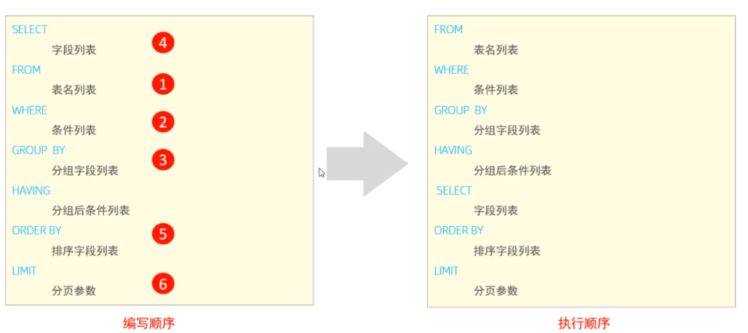
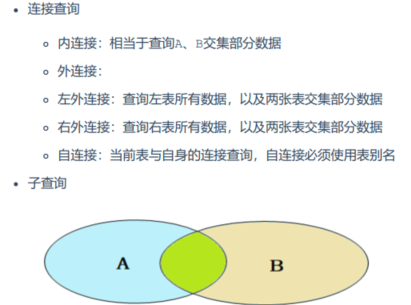
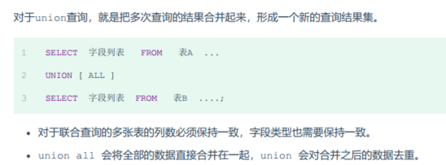
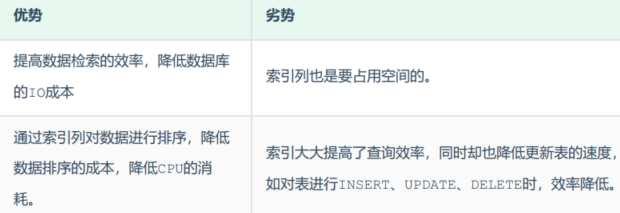
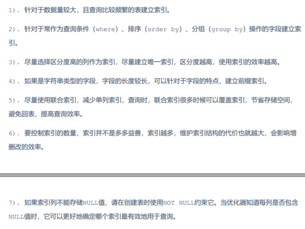
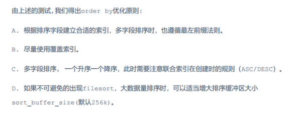
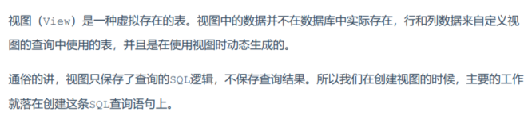

# 一、MySQL基础

## 1. 基础篇

1. MySQL概述     1) 数据库相关概念    2)   MySQ数据库
2. SQL       
1) SQL通用语法    ；结尾          不区分大小写           注释：-- 单行注释 /**/ 多行注释
2）SQL分类     DDL   DML  DQL  DCL
 - DDL  数据库操作  表操作 
数据库操作：
     查询所有数据库：     show databases ;    select database() ;
     创建数据库：            create database itcast;
     删除数据库：            drop database [ if exists ] 数据库名 ;
     切换数据库：            use itcast;

表操作：
        查询 - 创建 - 修改 - 删除
        1. 查询 和  创建表： (查询 所有表名字、表结构、创建语句  ) 
        - 查询当前数据库所有表 show tables;
        - 查询指定表结构          desc 表名 ; 
        - 查询指定表的建表语句 show create table 表名 ;  查询存储引擎、字符集等
        - 创建表结构                  create table user{  id int,  age int } comment "user";   
     2. 表的数据类型：（数值类型、字符串类型、日期时间类型）
        - 数值类型
            
        - 字符串类型 
            
        - 日期类型
            
          3. 修改表    alter操作
          -  添加字段 ALTER TABLE emp ADD nickname varchar(20) COMMENT '昵称';
          - 修改数据类型 ALTER TABLE 表名 MODIFY 字段名 新数据类型 (长度);
          - 修改字段名和字段类型 ALTER TABLE 表名 CHANGE 旧字段名 新字段名 类型 (长度) [ COMMENT 注释 ] [ 约束 ];1
          - 删除字段 ALTER TABLE 表名 DROP 字段名;
          4. 删除表
          - DROP TABLE IF EXISTS tb_user;
          - 删除指定表, 并重新创建 TRUNCATE TABLE 表名;
           

 - DML  数据表修改

添加数据（INSERT）   insert into   table()  values() 给指定字段添加数据   给全部字段添加数据  批量添加数据
修改数据（UPDATE） update table set 
删除数据（DELETE）  delete from

- DQL   
    基本语法  基础查询  条件查询  聚合函数  分组查询  排序查询  分页查询
    1. 基本语法 - 执行顺序

    2. 基础查询
    基本查询的DQL语句中，不带任何的查询条件
    查询多个字段    字段设置别名 as     distinct去除重复记录
    3. 条件查询 
    where   比较运算符（包含like） 逻辑运算符（and or not）
    4. 聚合函数
    将一列数据作为一个整体，进行纵向计算   count avg sum max min 
    5. 分组查询
    group by  通常前面会有分组的字段的聚合函数 不然没有意义
    6. 排序查询
    order by 通常 asc  默认  desc
    7. 分页查询
    Limit  start offset
    

- DCL
管理用户：
    查询用户：    select * from mysql.user; 
    创建用户：    create user 'itcast'@'localhost' identified by '123456';
    修改用户密码：alter user 'heima'@'%' identified with mysql_native_password by '1234';
    删除用户：   drop user 'itcast'@'localhost';
权限控制：
    查询权限 授予权限 撤销权限
    

    

3. 函数
- 字符串函数 
- 数值函数  随机生产验证码 select lpad(round(rand()*1000000 , 0), 6, '0');
- 日期函数
- 流程函数 if   ifnull     case   when then  when then  else  end

4. 约束
约束是作用于表中字段上的规则，用于限制存储在表中的数据。
非空约束 - 唯一约束 - 主键约束   （要求越来越强烈）
默认约束 - 检查约束  - 外键约束

外键约束
alter table emp add constraint fk_emp_dept_id foreign key (dept_id) references dept(id);

- 删除/更新行为
添加了外键之后，再删除父表数据时产生的约束行为，我们就称为删除/更新行为。具体的删除/更新行

为有以下几种:

5. 多表查询
- 5.1 多表关系
一对多 部门与员工    在多的一方建立外键，指向一的一方的主键
多对多 学生与课程     建立第三张中间表，中间表至少包含两个外键，分别关联两方主键
 一对一  
    一对一关系，多用于单表拆分，将一张表的基础字段放在一张表中，其他详情字段放在另一张表中，以提升操作效率
    一对一关系，多用于单表拆分，将一张表的基础字段放在一张表中，其他详情字段放在另一张表中，以提升操作效率
    
- 5.2 多表查询概述
    多表查询就是指从多张表中查询数据。笛卡尔积的形式返回  ,通过连接条件去重 select * from tablea,tableb where a.id = b.id;
    分类：
    
    
- 5.3 内连接
内连接查询的是两张表交集部分的数据，通常有 表结构 和 连接条件。

隐内连接： SELECT 字段列表 FROM 表1 , 表2 WHERE 条件 ... ;  where
显示内连接: 内连接查询的是两张表交集部分的数据  on

- 5.4 外连接
分为左外连接和右外连接

左外连接相当于查询表1(左表)的所有数据，当然也包含表1和表2交集部分的数据；
select e.*, d.name from emp e left outer join dept d on e.dept_id = d.id;

右外连接类似

- 5.5 自连接
自连接查询，顾名思义，就是自己连接自己，也就是把一张表连接查询多次。自连接查询，顾名思义，就是自己连接自己，也就是把一张表连接查询多次。自连接查询，顾名思义，就是自己连接自己，也就是把一张表连接查询多次。
SELECT 字段列表 FROM 表A 别名A JOIN 表A 别名B ON 条件 ... ;

- 5.6 联合查询 union  union all

- 5.7 子查询（嵌套查询）

SELECT * FROM t1 WHERE column1 = ( SELECT column1 FROM t2 );

标量子查询：
子查询返回的结果是单个值（数字、字符串、日期等），最简单的形式，这种子查询称为标量子查询。  =  > < >= ..

列子查询：
子查询返回的结果是一列（可以是多行），这种子查询称为列子查询。  in not in  any   all

行子查询
> < in

表子查询
IN

6. 事务
- 事务简介
- 事务四大特性 ACID
- 并发事务的问题
- 事务隔离级别

## 2. 进阶篇

1. 存储引擎

- 1.1 MySQL体系结构
Server层和存储引擎层

- 1.2  存储引擎介绍
存储引擎就是存储数据、建立索引、更新/查询数据等技术的实现方式 。存储引擎是基于表的，而不是
基于库的，所以存储引擎也可被称为表类型。我们可以在创建表的时候，来指定选择的存储引擎，如果
没有指定将自动选择默认的存储引擎

- 1.3 存储引擎特点
MyISAM InnoDB Memery

- InnoDB引擎 Mysql5.5之后默认
    - 特点：ACID事务 支持行级锁并发  支持外键
    - 文件： 每个表对应一个ibd文件，存放表结构、数据，还会存放该表对应的索引信息。  idb2sdi可以将二进制数据转查看表结构
    - 逻辑存储结构：表空间（ibd文件） - 段（数据段 索引段 回滚段） - 区（1M） - 页（16k） - 行（隐藏字段2个）
    
- MyISAM
    - 特点： 不支持事务，不支持外键；  支持表锁，不支持行锁；  访问速度快
    
- Memery
    - 特点： 内存存放 哈希索引     只能作为临时表和缓存使用
    
- 区别和特点
    主要是Innodb和my aism的区别
    
- 1.3 存储引擎的选择

2. 索引
- 2.1 索引概述和特点
    - 概述： 索引（index）是帮助MySQL高效获取数据的数据结构(有序)。在数据之外，数据库系统还维护着满足特定查找算法的数据结构，这些数据结构以某种方式引用（指向）数据， 这样就可以在这些数据结构上实现高级查找算法，这种数据结构就是索引。
    - 无索引的情况需要全表扫描  有索引的话更快
    - 特点：
    
    

- 2.2 索引结构
    - 概述
    
    - 二叉树
    - b-Tree
    - B+树    支持范围查询 和 排序操作（索引自动排序了）
        MySQL索引数据结构对经典的B+Tree进行了优化。在原B+Tree的基础上，增加一个指向相邻叶子节点的链表指针，就形成了带有顺序指针的B+Tree，提高区间访问的性能，利于排序
    - Hash

- 2.3 索引分类
    主键索引 唯一索引 常规索引 全文索引 联合索引
    聚簇索引 + 二级索引 （回表查询）
    InnoDB 3层高度 大概可以存储2200w数据
  
- 2.4 索引创建语法

- 2.5 SQL性能分析
    - 1. SQL执行频次分析
    通过如下指令，可以查看当前数据库的INSERT、UPDATE、DELETE、SELECT的访问频次：SHOW GLOBAL STATUS LIKE 'Com_______';
    我们可以查看到当前数据库到底是以查询为主，还是以增删改为主，从而为数据库优化提供参考依据。 如果是以增删改为主，我们可以考虑不对其进行索引的优化。 如果是以查询为主，那么就要考虑对数据库的索引进行优化了。
    - 2. 慢查询日志
    慢查询日志记录了所有执行时间超过指定参数（long_query_time，单位：秒，默认10秒）的所有SQL语句的日志 ，通过慢查询日志，就可以定位出执行效率比较低的SQL，从而有针对性的进行优化。
    - 3. profile详情
    SET profiling = 1; 开关已经打开了，接下来，我们所执行的SQL语句，都会被MySQL记录，并记录执行时间消耗到哪儿去了。
    
    
    - 4. explain
    EXPLAIN 或者 DESC命令获取 MySQL 如何执行 SELECT 语句的信息，包括在 SELECT 语句执行过程中表如何连接和连接的顺序。
    
    

- 2.6 索引使用
    - 1. 验证索引使用效率 ：  主键查询 和 普通字段的查询 走的路线不一样的  后者全表扫描
    - 2. 最左前缀法则：  （联合索引）
    最左前缀法则中指的最左边的列，是指在查询时，联合索引的最左边的字段(即是第一个字段)必须存在，与我们编写SQL时，条件编写的先后顺序无关。
    - 3. 范围查询：   联合索引中，出现范围查询(>,<)，范围查询右侧的列索引失效。
    当范围查询使用>= 或 <= 时，走联合索引了，但是索引的长度为54，就说明所有的字段都是走索引的，在业务允许的情况下，尽可能的使用类似于 >= 或 <= 这类的范围查询，而避免使用 > 或 <。
    - 4. 索引失效情况
        - 索引列运算
        - 字符串不加引号
        - 模糊查询
        - or连接条件
        - 数据分布影响  如果走全表扫描快就直接走全表扫描 不一定走索引
    - 5. SQL提示    use index(建议使用某个索引)   ignore index(忽略指定的索引)  force index (强制使用某个索引)
    - 6. 覆盖查询   尽量使用覆盖索引
    - 7. 前缀索引
    当字段类型为字符串（varchar，text，longtext等）时，有时候需要索引很长的字符串，这会让索引变得很大，查询时，浪费大量的磁盘IO， 影响查询效率。此时可以只将字符串的一部分前缀，建立索引，这样可以大大节约索引空间，从而提高索引效率。
    - 8. 单列索引与联合索引
    
- 2.7 索引设计原则

3. SQL优化
    - 3.1 插入数据
        - 批量插入数据  手动控制事务一次提交 主键顺序插入    其中大批量可以使用load加载
        
    - 3.2 主键优化
        - 主键的顺序插入性能高于乱序插入
        - 原因：页分裂 - 插入数据时   页合并 - 删除数据时
        - 索引设计原则：降低主键长度、选择自增主键、避免对主键的修改
        
    - 3.3 order by 优化
       
    
    - 3.4 group by优化
    
    - 3.5 limit优化
    在数据量比较大时，如果进行limit分页查询，在查询时，越往后，分页查询效率越低
    为，当在进行分页查询时，如果执行 limit 2000000,10 ，此时需要MySQL排序前2000010 记录，仅仅返回 2000000 - 2000010 的记录，其他记录丢弃，查询排序的代价非常大 。
    优化思路: 一般分页查询时，通过创建 覆盖索引 能够比较好地提高性能，可以通过覆盖索引加子查询形式进行优化。
    
    - 3.6 count优化
    
    
    - 3.7 update优化
    InnoDB的行锁是针对索引加的锁，不是针对记录加的锁 ,并且该索引不能失效，否则会从行锁升级为表锁 。

4. 视图、存储过程、触发器

- 4.1 视图

- 4.2 存储过程

- 4.3 存储函数
存储函数是有返回值的存储过程，存储函数的参数只能是IN类型的。

- 4.4 触发器

5. 锁

- 5.1 概述
协调多进程 多线程并发访问资源的一种机制，CPU IO 数据等
全局锁 表级锁 行级锁

- 5.2 全局锁
用于获取一致性视图，锁住所有的表，不能执行DDL DML语句

- 5.3 表锁
表锁 元数据锁MDL 意向锁

- 5.4 行锁

6. InnoDB存储引擎
见正文

## 3. 运维篇
1. 日志
- 1.1 错误日志

- 1.2 二进制日志
    - 1. 介绍 
    二进制日志（BINLOG）记录了所有的 DDL（数据定义语言）语句和 DML（数据操纵语言）语句，但不包括数据查询（SELECT、SHOW）语句。
    作用：①. 灾难时的数据恢复；②. MySQL的主从复制。
    - 2. 格式
    
    - 3. 查看
    由于日志是以二进制方式存储的，不能直接读取，需要通过二进制日志查询工具 mysqlbinlog 来查看，具体语法：

    - 4. 删除    
        对于比较繁忙的业务系统，每天生成的binlog数据巨大，如果长时间不清除，将会占用大量磁盘空间。可以通过以下几种方式清理日志：
    

- 1.3 查询日志
    查询日志中记录了客户端的所有操作语句，而二进制日志不包含查询数据的SQL语句。默认情况下，查询日志是未开启的。
    启了查询日志之后，在MySQL的数据存放目录，也就是 /var/lib/mysql/ 目录下就会出现mysql_query.log 文件。之后所有的客户端的增删改查操作都会记录在该日志文件之中，长时间运行后，该日志文件将会非常大
    

- 1.4 慢查询日志
    慢查询日志记录了所有执行时间超过参数 long_query_time 设置值并且扫描记录数不小于min_examined_row_limit 的所有的SQL语句的日志，默认未开启。long_query_time 默认为10 秒，最小为 0， 精度可以到微秒
    

2. 主从复制

- 2.1 概述

    主从复制是指将主数据库的 DDL 和 DML 操作通过二进制日志传到从库服务器中，然后在从库上对这些日志重新执行（也叫重做），从而使得从库和主库的数据保持同步。
    MySQL支持一台主库同时向多台从库进行复制， 从库同时也可以作为其他从服务器的主库，实现链状复制。
    
MySQL 复制的优点主要包含以下三个方面：
    主库出现问题，可以快速切换到从库提供服务。
    实现读写分离，降低主库的访问压力。
    可以在从库中执行备份，以避免备份期间影响主库服务。

- 2.2 原理
    - 1. Master 主库在事务提交时，会把数据变更记录在二进制日志文件 Binlog 中。
    - 2. 从库读取主库的二进制日志文件 Binlog ，写入到从库的中继日志 Relay Log 。
    - 3. slave重做中继日志中的事件，将改变反映它自己的数据。

- 2.3 搭建
    主库配置
    从库配置

3. 分库分表

- 3.1 介绍
    - 1. 问题分析
    随着互联网及移动互联网的发展，应用系统的数据量也是成指数式增长，若采用单数据库进行数据存储，存在以下性能瓶颈：
    a) IO瓶颈：热点数据太多，数据库缓存不足，产生大量磁盘IO，效率较低。 请求数据太多，带宽不够，网络IO瓶颈。
    b) CPU瓶颈：排序、分组、连接查询、聚合统计等SQL会耗费大量的CPU资源，请求数太多，CPU出现瓶颈
    分库分表的中心思想都是将数据分散存储，使得单一数据库/表的数据量变小来缓解单一数据库的性能问题，从而达到提升数据库性能的目的。

    - 2. 拆分策略
    主要是两种：垂直拆分和水平拆分     而拆分的粒度，一般又分为分库和分表
    
    - 3. 垂直拆分
           垂直分库：以表为依据，根据业务将不同表拆分到不同库中。  特点：每个库表不一样，每个库数据不一样
           垂直分表：以字段为依据，根据字段属性将不同字段拆分到不同表中。特点：每个表结构不一样，每个表数据也不一样（外键关联）
           
    - 4. 水平拆分
           水平分库：以字段为依据，按照一定策略，将一个库的数据拆分到多个库中。每个库的表结构都一样。每个库的数据都不一样。
           水平分表：以字段为依据，按照一定策略，将一个表的数据拆分到多个表中。每个表的表结构都一样，数据不一样
            
            
    - 5. 实现技术
        MyCat：数据库分库分表中间件，不用调整代码即可实现分库分表，支持多种语言，性能不及前者。

4. 读写分离

    - 1. 介绍
    
    - 2. 一主一从
   - 原理： MySQL的主从复制，是基于二进制日志（binlog）实现的。
   

    - 3. 双主双从
     

# 二、基础篇
## MySQL 执行流程是怎样的？

## 第一步：连接器

与客户端进行 TCP 三次握手建立连接；
校验客户端的用户名和密码，如果用户名或密码不对，则会报错；
如果用户名和密码都对了，会读取该用户的权限，然后后面的权限逻辑判断都基于此时读取到的权限；

- 如何查看 MySQL 服务被多少个客户端连接了？
show processlist

- 空闲连接会一直占用着吗？
当然不是了，MySQL 定义了空闲连接的最大空闲时长，由 wait_timeout 参数控制的，默认值是 8 小时（28880秒），如果空闲连接超过了这个时间，连接器就会自动将它断开。

- MySQL 的连接数有限制吗？
MySQL 服务支持的最大连接数由 max_connections 参数控制，比如我的 MySQL 服务默认是 151 个,超过这个值，系统就会拒绝接下来的连接请求，并报错提示“Too many connections”。
MySQL 的连接也跟 HTTP 一样，有短连接和长连接的概念，它们的区别如下：
可以看到，使用长连接的好处就是可以减少建立连接和断开连接的过程，所以一般是推荐使用长连接。
但是，使用长连接后可能会占用内存增多，因为 MySQL 在执行查询过程中临时使用内存管理连接对象，这些连接对象资源只有在连接断开时才会释放。如果长连接累计很多，将导致 MySQL 服务占用内存太大，有可能会被系统强制杀掉，这样会发生 MySQL 服务异常重启的现象。

- 怎么解决长连接占用内存的问题？
第一种，定期断开长连接。
第二种，客户端主动重置连接。MySQL 5.7 版本实现了 mysql_reset_connection() 函数的接口，注意这是接口函数不是命令，那么当客户端执行了一个很大的操作后，在代码里调用 mysql_reset_connection 函数来重置连接，达到释放内存的效果。这个过程不需要重连和重新做权限验证，但是会将连接恢复到刚刚创建完时的状态。

## 第二步：查询缓存
如果 SQL 是查询语句（select 语句），MySQL 就会先去查询缓存（ Query Cache ）里查找缓存数据，看看之前有没有执行过这一条命令，这个查询缓存是以 key-value 形式保存在内存中的，key 为 SQL 查询语句，value 为 SQL 语句查询的结果。

如果查询的语句命中查询缓存，那么就会直接返回 value 给客户端。如果查询的语句没有命中查询缓存中，那么就要往下继续执行，等执行完后，查询的结果就会被存入查询缓存中。

MySQL 8.0 版本直接将查询缓存删掉了，也就是说 MySQL 8.0 开始，执行一条 SQL 查询语句，不会再走到查询缓存这个阶段了。

## 第三步：解析 SQL

 解析器
 
第一件事情，词法分析。MySQL 会根据你输入的字符串识别出关键字出来，构建出 SQL 语法树，这样方面后面模块获取 SQL 类型、表名、字段名、 where 条件等等。

第二件事情，语法分析。根据词法分析的结果，语法解析器会根据语法规则，判断你输入的这个 SQL 语句是否满足 MySQL 语法。

## 第四步：执行 SQL

prepare 阶段，也就是预处理阶段；
optimize 阶段，也就是优化阶段；  主要负责将 SQL 查询语句的执行方案确定下来
execute 阶段，也就是执行阶段；

### 预处理器
检查 SQL 查询语句中的表或者字段是否存在；   表不存在会出错
将 select * 中的 * 符号，扩展为表上的所有列；

### 优化器
优化器主要负责将 SQL 查询语句的执行方案确定下来，比如在表里面有多个索引的时候，优化器会基于查询成本的考虑，来决定选择使用哪个索引。

（select * from product where id = 1）很简单，就是选择使用主键索引。

要想知道优化器选择了哪个索引，我们可以在查询语句最前面加个 explain 命令，这样就会输出这条 SQL 语句的执行计划，然后执行计划中的 key 就表示执行过程中使用了哪个索引，比如下图的 key 为 PRIMARY 就是使用了主键索引。

如果查询语句的执行计划里的 key 为 null 说明没有使用索引，那就会**全表扫描**（type = ALL），这种查询扫描的方式是效率最低档次的

这条查询语句的结果既可以使用主键索引，也可以使用普通索引，但是执行的效率会不同。这时，就需要优化器来决定使用哪个索引了。
很显然这条查询语句是**覆盖索引**，直接在二级索引就能查找到结果（因为二级索引的 B+ 树的叶子节点的数据存储的是主键值），就没必要在主键索引查找了，因为查询主键索引的 B+ 树的成本会比查询二级索引的 B+ 的成本大，优化器基于查询成本的考虑，会选择查询代价小的普通索引。
在下图中执行计划，我们可以看到，执行过程中使用了普通索引（name），Exta 为 Using index，这就是表明使用了覆盖索引优化。

### 执行器
执行器和存储引擎的交互过程：
    主键索引查询    聚簇索引查找
    全表扫描   引擎读取后给执行器判断是否是所请求的数据，不是的话继续读所有记录给执行器
    索引下推 
        索引下推能够减少二级索引在查询时的回表操作，提高查询的效率，因为它将 Server 层部分负责的事情，交给存储引擎层去处理了。
        通过联合索引进行举例（ where age > 20 and reward = 100000):
        没有索引下推的时候，每查询到一条二级索引记录，都要进行回表操作，然后将记录返回给 Server，接着 Server 再判断该记录的 reward 是否等于 100000。
        使用了索引下推后，虽然 reward 列无法使用到联合索引，但是因为它包含在联合索引（age，reward）里，所以直接在存储引擎过滤出满足 reward = 100000 的记录后，才去执行回表操作获取整个记录。相比于没有使用索引下推，节省了很多回表操作。

## Innodb引擎

### 逻辑存储结构

### 架构

#### 内存架构

8.0之后

#### 磁盘架构

#### 后台线程

### 事务原理

#### redolog

#### undolog

### MVCC

#### 记录的隐藏字段

#### undo log

#### undolog 版本链

#### readview

#### 总结

# 三、索引篇
## 3.1 常见面试题

1. **索引定义**

    - 概述： 索引（index）是帮助MySQL高效获取数据的数据结构(有序)。在数据之外，数据库系统还维护着满足特定查找算法的数据结构，这些数据结构以某种方式引用（指向）数据， 这样就可以在这些数据结构上实现高级查找算法，这种数据结构就是索引。
    - 无索引的情况需要全表扫描  有索引的话更快
    - 特点：
    

2. **索引分类**

按「数据结构」分类：B+tree索引、Hash索引、Full-text索引。
按「物理存储」分类：聚簇索引（主键索引）、二级索引（辅助索引） - 在二级索引能找到数据的叫做（覆盖索引）。
按「字段特性」分类：主键索引、唯一索引、普通索引、前缀索引。
按「字段个数」分类：单列索引、联合索引-最左匹配原则。

- 联合索引相关：
联合索引的最左匹配原则，在遇到范围查询（>、<、between、like 包括like '林%'这种）的时候，就会停止匹配，也就是范围列可以用到联合索引，但是范围列后面的列无法用到联合索引。

索引下推优化（index condition pushdown)， 可以在联合索引遍历过程中，对联合索引中包含的字段先做判断，直接过滤掉不满足条件的记录，减少回表次数。

建立联合索引时的字段顺序，对索引效率也有很大影响。越靠前的字段被用于索引过滤的概率越高，实际开发工作中建立联合索引时，要把区分度大的字段排在前面，这样区分度大的字段越有可能被更多的 SQL 使用到。

- 索引的存储结构

3. **什么时候需要 / 不需要创建索引？**

4. **有什么优化索引的方法？**
前缀索引优化；
覆盖索引优化；
主键索引最好是自增的；
索引最好设置为 NOT NULL； 
防止索引失效；

not null原因：
第一原因：索引列存在 NULL 就会导致优化器在做索引选择的时候更加复杂，更加难以优化，因为可为 NULL 的列会使索引、索引统计和值比较都更复杂，比如进行索引统计时，count 会省略值为NULL 的行。

第二个原因：NULL 值是一个没意义的值，但是它会占用物理空间，所以会带来的存储空间的问题，会导致更多的存储空间占用，因为 InnoDB 默认行存储格式COMPACT，会用 1 字节空间存储 NULL 值列表

5.  **防止索引失效**
用上了索引并不意味着查询的时候会使用到索引，所以我们心里要清楚有哪些情况会导致索引失效，从而避免写出索引失效的查询语句，否则这样的查询效率是很低的。

索引列运算 
联合索引 - 最左匹配原则
or连接条件
模糊查询
数据分布影响 (男 女)

当我们使用左或者左右模糊匹配的时候，也就是 like %xx 或者 like %xx%这两种方式都会造成索引失效；
当我们在查询条件中对索引列做了计算、函数、类型转换操作，这些情况下都会造成索引失效；
联合索引要能正确使用需要遵循最左匹配原则，也就是按照最左优先的方式进行索引的匹配，否则就会导致索引失效。
在 WHERE 子句中，如果在 OR 前的条件列是索引列，而在 OR 后的条件列不是索引列，那么索引会失效。

执行计划：
type字段   extra字段 比较重要

6. **总结**

## 3.2 InnoDB存储-数据页-B+树

### InnoDB存储数据-页构成

InnoDB 的数据是按「数据页」为单位来读写的，
也就是说，当需要读一条记录的时候，并不是将这个记录本身从磁盘读出来，而是以页为单位，将其整体读入内存。

数据库的 I/O 操作的最小单位是页，InnoDB 数据页的默认大小是 **16KB**

数据页包括七个部分：

在 File Header 中有两个指针，分别指向上一个数据页和下一个数据页，连接起来的页相当于一个双向的链表，采用链表的结构是让数据页之间不需要是物理上的连续的，而是逻辑上的连续。

数据页中的记录按照「主键」顺序组成单向链表，单向链表的特点就是插入、删除非常方便，但是检索效率不高，最差的情况下需要遍历链表上的所有节点才能完成检索。

因此，数据页中有一个**页目录**，起到记录的索引作用，就像我们书那样，针对书中内容的每个章节设立了一个目录，想看某个章节的时候，可以查看目录，快速找到对应的章节的页数，而数据页中的页目录就是为了能快速找到记录。

页目录创建的过程如下：
1. 将所有的记录划分成几个组，这些记录包括最小记录和最大记录，但不包括标记为“已删除”的记录；
2. 每个记录组的最后一条记录就是组内最大的那条记录，并且最后一条记录的头信息中会存储该组一共有多少条记录，作为 n_owned 字段（上图中粉红色字段）
3. 页目录用来存储每组最后一条记录的地址偏移量，这些地址偏移量会按照先后顺序存储起来，每组的地址偏移量也被称之为槽（slot），每个槽相当于指针指向了不同组的最后一个记录。

### B+树如何查询
InnoDB 采用了 B+ 树作为索引。InnoDB 里的 B+ 树中的每个节点都是一个数据页
B+ 树的特点：
只有叶子节点（最底层的节点）才存放了数据，非叶子节点（其他上层节）仅用来存放目录项作为索引。
非叶子节点分为不同层次，通过分层来降低每一层的搜索量；
所有节点按照索引键大小排序，构成一个双向链表，便于范围查询；

详细过程：
从根节点开始，通过二分法快速定位到符合页内范围包含查询值的页，因为查询的主键值为 6，在[1, 7)范围之间，所以到页 30 中查找更详细的目录项；
在非叶子节点（页30）中，继续通过二分法快速定位到符合页内范围包含查询值的页，主键值大于 5，所以就到叶子节点（页16）查找记录；
接着，在叶子节点（页16）中，通过槽查找记录时，使用二分法快速定位要查询的记录在哪个槽（哪个记录分组），定位到槽后，再遍历槽内的所有记录，找到主键为 6 的记录。

### 聚簇索引和二级索引

1. 聚簇索引和二级索引的区别
聚簇索引的叶子节点存放的是实际数据，所有完整的用户记录都存放在聚簇索引的叶子节点；
二级索引的叶子节点存放的是主键值，而不是实际数据。

2. 聚簇索引的生成方式：
如果有主键，默认会使用主键作为聚簇索引的索引键；
如果没有主键，就选择第一个不包含 NULL 值的唯一列作为聚簇索引的索引键；
在上面两个都没有的情况下，InnoDB 将自动生成一个隐式自增 id 列作为聚簇索引的索引键；

3. 查询过程
如果某个查询语句使用了二级索引，但是查询的数据不是主键值，这时在二级索引找到主键值后，需要去聚簇索引中获得数据行，这个过程就叫作「回表」，也就是说要查两个 B+ 树才能查到数据。不过，当查询的数据是主键值时，因为只在二级索引就能查询到，不用再去聚簇索引查，这个过程就叫作「索引覆盖」，也就是只需要查一个 B+ 树就能找到数据。

## 3.3 MySQL采用B+树索引原因

1. 怎样的数据结构是好的
2. 二分查找
3. 二分查找数
4. B树
5. B+树

比较B树和B+树的效率从三点比较：
- 单点查询    
    B 最佳可能O1，原因是非叶子节点有记录，而b+全在叶子节点有记录
    同样B+，平均更好，磁盘IO数少
- 插入删除效率
    B+ 树有大量的冗余节点，这样使得删除一个节点的时候，可以直接从叶子节点中删除，甚至可以不动非叶子节点，这样删除非常快，
    B+ 树的插入和删除效率更高
- 范围查询
     B+ 树所有叶子节点间还有一个链表进行连接，这种设计对范围查找非常有帮助
    B 树没有将所有叶子节点用链表串联起来的结构，因此只能通过树的遍历来完成范围查询，这会涉及多个节点的磁盘 I/O 操作，范围查询效率不如 B+ 树。
    因此，存在大量范围检索的场景，适合使用 B+树，比如数据库。而对于大量的单个索引查询的场景，可以考虑 B 树，比如 nosql 的MongoDB。
    

MySQL B+树的特点（同普通的B+数相比）：
B+ 树的叶子节点之间是用「双向链表」进行连接，这样的好处是既能向右遍历，也能向左遍历。普通的单向链表
B+ 树点节点内容是数据页，数据页里存放了用户的记录以及各种信息，每个数据页默认大小是 16 KB。

## 3.4 索引失效

1. 对索引使用左或者左右模糊匹配
2. 对索引使用函数  因为索引保存的是索引字段的原始值，而不是经过函数计算后的值，自然就没办法走索引了。
3. 对索引进行表达式计算 原因跟对索引使用函数差不多。
4. 对索引隐式类型转换
    如果索引字段是字符串类型，但是在条件查询中，输入的参数是整型的话，你会在执行计划的结果发现这条语句会走全表扫描。但是如果索引字段是整型类型，查询条件中的输入参数即使字符串，是不会导致索引失效，还是可以走索引扫描。
   ** MySQL 在遇到字符串和数字比较的时候，会自动把字符串转为数字，然后再进行比较。**
5. 联合索引非最左匹配
6. WHERE 子句中的 OR
    如果在 OR 前的条件列是索引列，而在 OR 后的条件列不是索引列，那么索引会失效。
    
## 3.5 左模糊匹配一定失效么？

不一定
1.  如果表存在多个字段，则左模糊匹配失效:
    加了其他字段后，select * from t_user where name like "%xx"; 要查询的数据就不能只在二级索引树里找了，得需要回表操作才能完成查询的工作，再加上是左模糊匹配，无法利用索引树的有序性来快速定位数据，所以**得在二级索引树逐一遍历**，获取主键值后，再到聚簇索引树检索到对应的数据行，这样实在太累了。
    
2. 如果表只有两个字段，全扫描二级索引：
左模糊匹配会默认走二级索引，且是覆盖索引，因为同时有id和name
二级索引空间更小，而聚簇索引记录的东西会更多，比如聚簇索引中的叶子节点则记录了主键值、事务 id、用于事务和 MVCC 的回滚指针以及所有的剩余列。

## 3.6 count使用及性能

一、哪种count性能好
count(*) = count(1) > count(主键字段) > count(字段)

1. count() ：
count() 是一个聚合函数，函数的参数不仅可以是字段名，也可以是其他任意表达式，该函数作用是统计符合查询条件的记录中，函数指定的参数不为 NULL 的记录有多少个。

2. count(主键字段) 执行过程
在通过 count 函数统计有多少个记录时，MySQL 的 server 层会维护一个名叫 count 的变量。
server 层会循环向 InnoDB 读取一条记录，如果 count 函数指定的参数不为 NULL，那么就会将变量 count 加 1，直到符合查询的全部记录被读完，就退出循环。最后将 count 变量的值发送给客户端。

如果表里只有主键索引，没有二级索引时，那么，InnoDB 循环遍历聚簇索引，**将读取到的记录返回给 server 层**，然后读取记录中的 id 值，就会 id 值判断是否为 NULL，如果不为 NULL，就将 count 变量加 1。
这是因为相同数量的二级索引记录可以比聚簇索引记录占用更少的存储空间，所以二级索引树比聚簇索引树小，这样遍历二级索引的 I/O 成本比遍历聚簇索引的 I/O 成本小，因此「优化器」优先选择的是二级索引。

3. count(1) 执行过程
如果表里只有主键索引，没有二级索引时。

可以看到，count(1) 相比 count(主键字段) 少一个步骤，就是不需要读取记录中的字段值返回给server，所以通常会说 count(1) 执行效率会比 count(主键字段) 高一点。

4. count(*) 执行过程

count(*)  其实等于 count(0)，也就是说，当你使用 时，MySQL 会将 * 参数转化为参数 0 来处理。
count(*) 执行过程跟 count(1) 执行过程基本一样的

而且 MySQL 会对 count(*) 和 count(1) 有个优化，如果有多个二级索引的时候，优化器会使用key_len 最小的二级索引进行扫描。

5. count(字段) 执行过程
对于这个查询来说，会采用全表扫描的方式来计数，所以它的执行效率是比较差的。

# 四、事务篇

## 4.1事务特性
A 
C
I
D

InnoDB 引擎通过什么技术来保证事务的这四个特性的呢？
持久性是通过 redo log （重做日志）来保证的；
原子性是通过 undo log（回滚日志） 来保证的；
隔离性是通过 MVCC（多版本并发控制） 或锁机制来保证的；
一致性则是通过持久性+原子性+隔离性来保证；

## 4.2 并发事务带来的问题
在同时处理多个事务的时候，就可能出现：
脏读：读到其他事务未提交的数据；
不可重复读：前后读取的数据不一致；
幻读：前后读取的记录数量不一致。

## 4.3 事务隔离级别

SQL 标准提出了四种隔离级别来规避这些现象，隔离级别越高，性能效率就越低，这四个隔离级别如下：

读未提交（read uncommitted），指一个事务还没提交时，它做的变更就能被其他事务看到；
读提交（read committed），指一个事务提交之后，它做的变更才能被其他事务看到；
可重复读（repeatable read），指一个事务执行过程中看到的数据，一直跟这个事务启动时看到的数据是一致的，MySQL InnoDB 引擎的默认隔离级别；
串行化（serializable ）；会对记录加上读写锁，在多个事务对这条记录进行读写操作时，如果发生了读写冲突的时候，后访问的事务必须等前一个事务执行完成，才能继续执行；

在「读未提交」隔离级别下，可能发生脏读、不可重复读和幻读现象；
在「读提交」隔离级别下，可能发生不可重复读和幻读现象，但是不可能发生脏读现象；
在「可重复读」隔离级别下，可能发生幻读现象，但是不可能脏读和不可重复读现象；
在「串行化」隔离级别下，脏读、不可重复读和幻读现象都不可能会发生。

InnoDB 引擎的默认隔离级别虽然是「可重复读」，但是它通过next-key lock 锁（行锁和间隙锁的组合）来锁住记录之间的“间隙”和记录本身，防止其他事务在这个记录之间插入新的记录，这样就避免了幻读现象。

## 4.4 read view 在mvcc中如何工作
Read View 中四个字段作用；
聚簇索引记录中两个跟事务有关的隐藏列；

1. 那 Read View 到底是什么

Read View 有四个重要的字段：
* m_ids ：指的是在创建 Read View 时，当前数据库中「活跃事务」的事务 id 列表，注意是一个列表，“活跃事务”指的就是，启动了但还没提交的事务。
* min_trx_id ：指的是在创建 Read View 时，当前数据库中「活跃事务」中事务 id 最小的事务，也就是 m_ids 的最小值。
* max_trx_id ：这个并不是 m_ids 的最大值，而是创建 Read View 时当前数据库中应该给下一个事务的 id 值，也就是全局事务中最大的事务 id 值 + 1；
* creator_trx_id ：指的是创建该 Read View 的事务的事务 id。

对于使用 InnoDB 存储引擎的数据库表，它的聚簇索引记录中都包含下面两个隐藏列：
* trx_id，当一个事务对某条聚簇索引记录进行改动时，就会把该事务的事务 id 记录在 trx_id 隐藏列里；
* roll_pointer，每次对某条聚簇索引记录进行改动时，都会把旧版本的记录写入到 undo 日志中，然后这个隐藏列是个指针，指向每一个旧版本记录，于是就可以通过它找到修改前的记录。

在创建 Read View 后，我们可以将记录中的 trx_id 划分这三种情况：

## 4.5 可重复读如何工作

可重复读隔离级别是启动事务时生成一个 Read View，然后整个事务期间都在用这个 Read View。

## 4.6 读提交如何工作
读提交隔离级别是在每次读取数据时，都会生成一个新的 Read View。

# 五、锁篇
## 5.1 MySQL锁的种类

### 1. 全局锁
用法：flush tables with read lock
全局锁应用场景：全局锁主要应用于做全库逻辑备份
加全局锁又会带来什么缺点：整个数据库都是只读状态，能更新数据，这样会造成业务停滞。
有什么其他方式可以避免：
        数据库的引擎支持的事务支持可重复读的隔离级别，那么在备份数据库之前先开启事务，会先创建 Read View，然后整个事务执行期间都在用这个 Read View，而且由于 MVCC 的支持，备份期间业务依然可以对数据进行更新操作。
 
### 2. 表级锁
表锁；
元数据锁（MDL）;
意向锁；
AUTO-INC 锁；

#### - 2.1 表锁
//表级别的共享锁，也就是读锁；
lock tables t_student read;
//表级别的独占锁，也就是写锁；
lock tables t_stuent write;

需要注意的是，表锁除了会限制别的线程的读写外，也会限制本线程接下来的读写操作。
也就是说如果本线程对学生表加了「共享表锁」，那么本线程接下来如果要对学生表执行写操作的语句，是会被阻塞的，当然其他线程对学生表进行写操作时也会被阻塞，直到锁被释放。

不过尽量避免在使用 InnoDB 引擎的表使用表锁，因为表锁的颗粒度太大，会影响并发性能，InnoDB 牛逼的地方在于实现了颗粒度更细的行级锁。

#### - 2.2 元数据锁

#### - 2.3 意向锁

#### - 2.4 auto-inc锁
**auto-inc锁**
在为某个字段声明 AUTO_INCREMENT 属性时，之后可以在插入数据时，可以不指定该字段的值，数据库会自动给该字段赋值递增的值，这主要是通过 AUTO-INC 锁实现的。

AUTO-INC 锁是特殊的表锁机制，锁不是再一个事务提交后才释放，而是再执行完插入语句后就会立即释放。

在插入数据时，会加一个表级别的 AUTO-INC 锁，然后为被 AUTO_INCREMENT 修饰的字段赋值递增的值，等插入语句执行完成后，才会把 AUTO-INC 锁释放掉。

那么，一个事务在持有 AUTO-INC 锁的过程中，其他事务的如果要向该表插入语句都会被阻塞，从而保证插入数据时，被 AUTO_INCREMENT 修饰的字段的值是连续递增的。

但是， AUTO-INC 锁再对大量数据进行插入的时候，会影响插入性能，因为另一个事务中的插入会被阻塞。

**轻量级锁**
一样也是在插入数据的时候，会为被 AUTO_INCREMENT 修饰的字段加上轻量级锁**，然后给该字段赋值一个自增的值，就把这个轻量级锁释放了，而不需要等待整个插入语句执行完后才释放锁**

当 innodb_autoinc_lock_mode = 0，就采用 AUTO-INC 锁；
当 innodb_autoinc_lock_mode = 2，就采用轻量级锁；
当 innodb_autoinc_lock_mode = 1，这个是默认值，两种锁混着用，如果能够确定插入记录的数量就采用轻量级锁，不确定时就采用 AUTO-INC 锁。

### 3. 行级锁

Record Lock，记录锁，也就是仅仅把一条记录锁上；
Gap Lock，间隙锁，锁定一个范围，但是不包含记录本身；
Next-Key Lock：Record Lock + Gap Lock 的组合，锁定一个范围，并且锁定记录本身。

//对读取的记录加共享锁
select ... lock in share mode;
//对读取的记录加独占锁
select ... for update;
上面这两条语句必须在一个事务中，因为当事务提交了，锁就会被释放；

## 5.2 MySQL如何加锁

## 5.3 update没有加索引会锁全表

1. 原因分析

InnoDB 存储引擎的默认事务隔离级别是「可重复读」，但是在这个隔离级别下，在多个事务并发的时候，会出现幻读的问题，所谓的幻读是指在同一事务下，连续执行两次同样的查询语句，第二次的查询语句可能会返回之前不存在的行。

**因此 InnoDB 存储引擎自己实现了行锁，通过 next-key 锁（记录锁和间隙锁的组合）来锁住记录本身和记录之间的“间隙”，防止其他事务在这个记录之间插入新的记录，从而避免了幻读现象。**

**当我们执行 update 语句时，实际上是会对记录加独占锁（X 锁）的，如果其他事务对持有独占锁的记录进行修改时是会被阻塞的。另外，这个锁并不是执行完 update 语句就会释放的，而是会等事务结束时才会释放。**

在 InnoDB 事务中，对记录加锁带基本单位是 next-key 锁，但是会因为一些条件会退化成间隙锁，或者记录锁。**加锁的位置准确的说，锁是加在索引上的而非行上。**

在 update 语句的 where 条件使用了唯一索引，那么 next-key 锁会退化成记录锁，也就是只会给一行记录加锁。

**在 update 语句的 where 条件没有使用索引，就会全表扫描，于是就会对所有记录加上 next-key 锁（记录锁 + 间隙锁），相当于把整个表锁住了。**

那 update 语句的 where 带上索引就能避免全表记录加锁了吗？  不是
关键还得看这条语句在执行过程种，优化器最终选择的是索引扫描，还是全表扫描，如果走了全表扫描，就会对全表的记录加锁了。

2. 避免发生的手段

大致的意思是，当 sql_safe_updates 设置为 1 时。
* update 语句必须满足如下条件之一才能执行成功：
* 使用 where，并且 where 条件中必须有索引列；
* 使用 limit；
* 同时使用 where 和 limit，此时 where 条件中可以没有索引列；
delete 语句必须满足以下条件能执行成功： 同时使用 where 和 limit，此时 where 条件中可以没有索引列；

如果 where 条件带上了索引列，但是优化器最终扫描选择的是全表，而不是索引的话，我们可以使用 force index([index_name]) 可以告诉优化器使用哪个索引，以此避免有几率锁全表带来的隐患。

## 5.4  MySQL死锁

幂等性校验
[幂等性](https://cloud.tencent.com/developer/article/2056527)
使用场景：多次请求

幂等校验：

# 六、日志篇

## 为什么需要 undo log？

undo log 两大作用：
实现事务回滚，保障事务的原子性。事务处理过程中，如果出现了错误或者用户执 行了 ROLLBACK 语句，MySQL 可以利用 undo log 中的历史数据将数据恢复到事务开始之前的状态。
实现 MVCC（多版本并发控制）关键因素之一。MVCC 是通过 ReadView + undo log 实现的。undo log 为每条记录保存多份历史数据，MySQL 在执行快照读（普通 select 语句）的时候，会根据事务的 Read View 里的信息，顺着 undo log 的版本链找到满足其可见性的记录。

## 为什么需要 Buffer Pool？

有了 Buffer Poo 后：

当读取数据时，如果数据存在于 Buffer Pool 中，客户端就会直接读取 Buffer Pool 中的数据，否则再去磁盘中读取。
当修改数据时，如果数据存在于 Buffer Pool 中，那直接修改 Buffer Pool 中数据所在的页，然后将其页设置为脏页（该页的内存数据和磁盘上的数据已经不一致），为了减少磁盘I/O，不会立即将脏页写入磁盘，后续由后台线程选择一个合适的时机将脏页写入到磁盘。

## 为什么需要 redo log ？
Buffer Pool 是提高了读写效率没错，但是问题来了，Buffer Pool 是基于内存的，而内存总是不可靠，万一断电重启，还没来得及落盘的脏页数据就会丢失。

为了防止断电导致数据丢失的问题，当有一条记录需要更新的时候，InnoDB 引擎就会先把记录写到 redo log 里面，并更新内存，这个时候更新就算完成了。同时，InnoDB 引擎会在适当的时候，由后台线程将缓存在 Buffer Pool 的脏页刷新到磁盘里，这就是 WAL （Write-Ahead Logging）技术，指的是 MySQL 的写操作并不是立刻更新到磁盘上，而是先记录在日志上，然后在合适的时间再更新到磁盘上。

 针对为什么需要 redo log 这个问题我们有两个答案：
实现事务的持久性，让 MySQL 有 crash-safe 的能力，能够保证 MySQL 在任何时间段突然崩溃，重启后之前已提交的记录都不会丢失；
将写操作从「随机写」变成了「顺序写」，提升 MySQL 写入磁盘的性能。

### 什么是 redo log？
redo log 是物理日志，记录了某个数据页做了什么修改，对 XXX 表空间中的 YYY 数据页 ZZZ 偏移量的地方做了AAA 更新，每当执行一个事务就会产生这样的一条物理日志。

在事务提交时，只要先将 redo log 持久化到磁盘即可，可以不需要将缓存在 Buffer Pool 里的脏页数据持久化到磁盘。当系统崩溃时，虽然脏页数据没有持久化，但是 redo log 已经持久化，接着 MySQL 重启后，可以根据 redo log 的内容，将所有数据恢复到最新的状态。

### 被修改 Undo 页面，需要记录对应 redo log 吗？
在修改该 Undo 页面前需要先记录对应的 redo log，所以先记录修改 Undo 页面的 redo log ，然后再真正的修改 Undo 页面。

### redo log 和 undo log 区别在哪？

redo log 记录了此次事务**「完成后」的数据状态，记录的是更新之「后」**的值；
undo log 记录了此次事务**「开始前」的数据状态，记录的是更新之「前」**的值；

所以有了 redo log，再通过 WAL 技术，InnoDB 就可以保证即使数据库发生异常重启，之前已提交的记录都不会丢失，这个能力称为 crash-safe（崩溃恢复）。可以看出来， redo log 保证了事务四大特性中的持久性。

### redo log 要写到磁盘，数据也要写磁盘，为什么要多此一举？
写入 redo log 的方式使用了追加操作， 所以磁盘操作是顺序写，而写入数据需要先找到写入位置，然后才写到磁盘，所以磁盘操作是随机写。

磁盘的「顺序写 」比「随机写」 高效的多，因此 redo log 写入磁盘的开销更小。

可以说这是 WAL 技术的另外一个优点：MySQL 的写操作从磁盘的「随机写」变成了「顺序写」，提升语句的执行性能。这是因为 MySQL 的写操作并不是立刻更新到磁盘上，而是先记录在日志上，然后在合适的时间再更新到磁盘上 。

### 产生的 redo log 是直接写入磁盘的吗？
redo log 也有自己的缓存—— redo log buffer，每当产生一条 redo log 时，会先写入到 redo log buffer，后续在持久化到磁盘如下图：
redo log buffer 默认大小 16 MB，可以通过 innodb_log_Buffer_size 参数动态的调整大小，增大它的大小可以让 MySQL 处理「大事务」是不必写入磁盘，进而提升写 IO 性能。

## redo log 什么时候刷盘？
MySQL 正常关闭时；
当 redo log buffer 中记录的写入量大于 redo log buffer 内存空间的一半时，会触发落盘；
InnoDB 的后台线程每隔 1 秒，将 redo log buffer 持久化到磁盘。
每次事务提交时都将缓存在 redo log buffer 里的 redo log 直接持久化到磁盘（这个策略可由 innodb_flush_log_at_trx_commit 参数控制，下面会说）。

当设置该参数为 0 时，表示每次事务提交时 ，还是将 redo log 留在 redo log buffer 中 ，该模式下在事务提交时不会主动触发写入磁盘的操作。
当设置该参数为 1 时，表示每次事务提交时，都将缓存在 redo log buffer 里的 redo log 直接持久化到磁盘，这样可以保证 MySQL 异常重启之后数据不会丢失。
当设置该参数为 2 时，表示每次事务提交时，都只是缓存在 redo log buffer 里的 redo log 写到 redo log 文件，注意写入到「 redo log 文件」并不意味着写入到了磁盘，因为操作系统的文件系统中有个 Page Cache（如果你想了解 Page Cache，可以看这篇 (opens new window)），Page Cache 是专门用来缓存文件数据的，所以写入「 redo log文件」意味着写入到了操作系统的文件缓存。

### innodb_flush_log_at_trx_commit 为 0 和 2 的时候，什么时候才将 redo log 写入磁盘？

InnoDB 的后台线程每隔 1 秒：

针对参数 0 ：会把缓存在 redo log buffer 中的 redo log ，通过调用 write() 写到操作系统的 Page Cache，然后调用 fsync() 持久化到磁盘。所以参数为 0 的策略，MySQL 进程的崩溃会导致上一秒钟所有事务数据的丢失;
针对参数 2 ：调用 fsync，将缓存在操作系统中 Page Cache 里的 redo log 持久化到磁盘。所以参数为 2 的策略，较取值为 0 情况下更安全，因为 MySQL 进程的崩溃并不会丢失数据，只有在操作系统崩溃或者系统断电的情况下，上一秒钟所有事务数据才可能丢失。

## redo log 文件写满了怎么办？

默认情况下， InnoDB 存储引擎有 1 个重做日志文件组( redo log Group），「重做日志文件组」由有 2 个 redo log 文件组成，这两个 redo 日志的文件名叫 ：ib_logfile0 和 ib_logfile1 。

在重做日志组中，每个 redo log File 的大小是固定且一致的，假设每个 redo log File 设置的上限是 1 GB，那么总共就可以记录 2GB 的操作。

重做日志文件组是以循环写的方式工作的，从头开始写，写到末尾就又回到开头，相当于一个环形。

所以 InnoDB 存储引擎会先写 ib_logfile0 文件，当 ib_logfile0 文件被写满的时候，会切换至 ib_logfile1 文件，当 ib_logfile1 文件也被写满时，会切换回 ib_logfile0 文件。

## 

# 七、内存篇

## Buffer Pool

### 【为什么要有 Buffer Pool？】

当读取数据时，如果数据存在于 Buffer Pool 中，客户端就会直接读取 Buffer Pool 中的数据，否则再去磁盘中读取。
当修改数据时，首先是修改 Buffer Pool 中数据所在的页，然后将其页设置为脏页，最后由后台线程将脏页写入到磁盘。

### Buffer Pool 有多大？
Buffer Pool 是在 MySQL 启动的时候，向操作系统申请的一片连续的内存空间，默认配置下 Buffer Pool 只有 128MB 。
可以通过调整 innodb_buffer_pool_size 参数来设置 Buffer Pool 的大小，一般建议设置成可用物理内存的 60%~80%。

### Buffer Pool 缓存什么？
InnoDB 会为 Buffer Pool 申请一片连续的内存空间，然后按照默认的16KB的大小划分出一个个的页， Buffer Pool 中的页就叫做缓存页。此时这些缓存页都是空闲的，之后随着程序的运行，才会有磁盘上的页被缓存到 Buffer Pool 中。

Buffer Pool 除了缓存「索引页」和「数据页」，还包括了 undo 页，插入缓存、自适应哈希索引、锁信息等等。

为了更好的管理这些在 Buffer Pool 中的缓存页，InnoDB 为每一个缓存页都创建了一个**控制块**，控制块信息包括「缓存页的表空间、页号、缓存页地址、链表节点」等等。

-  查询一条记录，就只需要缓冲一条记录吗？
不是的。
当我们查询一条记录时，InnoDB 是会把整个页的数据加载到 Buffer Pool 中，因为，通过索引只能定位到磁盘中的页，而不能定位到页中的一条记录。将页加载到 Buffer Pool 后，再通过页里的页目录去定位到某条具体的记录。

### 【如何管理 Buffer Pool？】

**Buffer Pool 里有三种页和链表来管理数据。**
Free Page（空闲页），表示此页未被使用，位于 Free 链表；
Clean Page（干净页），表示此页已被使用，但是页面未发生修改，位于LRU 链表。
Dirty Page（脏页），表示此页「已被使用」且「已经被修改」，其数据和磁盘上的数据已经不一致。当脏页上的数据写入磁盘后，内存数据和磁盘数据一致，那么该页就变成了干净页。脏页同时存在于 LRU 链表和 Flush 链表。

### 如何管理空闲页？
为了能够快速找到空闲的缓存页，可以使用链表结构，将空闲缓存页的「控制块」作为链表的节点，这个链表称为 Free 链表（**空闲链表**）。

有了 Free 链表后，每当需要从磁盘中加载一个页到 Buffer Pool 中时，就从 Free链表中取一个空闲的缓存页，并且把该缓存页对应的控制块的信息填上，然后把该缓存页对应的控制块从 Free 链表中移除。

### 如何管理脏页？
那为了能快速知道哪些缓存页是脏的，于是就设计出 Flush 链表，它跟 Free 链表类似的，链表的节点也是控制块，区别在于 Flush 链表的元素都是脏页。

有了 Flush 链表后，后台线程就可以遍历 Flush 链表，将脏页写入到磁盘。

### 如何提高缓存命中率？

**Buffer Pool 里有三种页和链表来管理数据。**
Free Page（空闲页），表示此页未被使用，位于 Free 链表；
Clean Page（干净页），表示此页已被使用，但是页面未发生修改，位于LRU 链表。
Dirty Page（脏页），表示此页「已被使用」且「已经被修改」，其数据和磁盘上的数据已经不一致。当脏页上的数据写入磁盘后，内存数据和磁盘数据一致，那么该页就变成了干净页。脏页同时存在于 LRU 链表和 Flush 链表。

 LRU（Least recently used）算法。
简单的 LRU 算法并没有被 MySQL 使用，因为简单的 LRU 算法无法避免下面这两个问题：

1. 预读失效；
2. Buffer Pool 污染；

- 1. 预读失效
#### 什么是预读失效？

MySQL 在加载数据页时，会提前把它相邻的数据页一并加载进来，目的是为了减少磁盘 IO。
但是可能这些被提前加载进来的数据页，并没有被访问，相当于这个预读是白做了，这个就是预读失效。

#### 怎么解决预读失效而导致缓存命中率降低的问题？

要避免预读失效带来影响，最好就是让预读的页停留在 Buffer Pool 里的时间要尽可能的短，让真正被访问的页才移动到 LRU 链表的头部，从而保证真正被读取的热数据留在 Buffer Pool 里的时间尽可能长。

MySQL 是这样做的，它改进了 LRU 算法，将 LRU 划分了 2 个区域：old 区域 和 young 区域。

old 区域占整个 LRU 链表长度的比例可以通过 innodb_old_blocks_pc 参数来设置，默认是 37，代表整个 LRU 链表中 young 区域与 old 区域比例是 63:37。

划分这两个区域后，预读的页就只需要加入到 old 区域的头部，当页被真正访问的时候，才将页插入 young 区域的头部。如果预读的页一直没有被访问，就会从 old 区域移除，这样就不会影响 young 区域中的热点数据。

虽然通过划分 old 区域 和 young 区域避免了预读失效带来的影响，但是还有个问题无法解决，那就是 Buffer Pool 污染的问题。

- 2. Buffer Pool 污染
#### 什么是 Buffer Pool 污染？
当某一个 SQL 语句扫描了大量的数据时，在 Buffer Pool 空间比较有限的情况下，可能会将 Buffer Pool 里的所有页都替换出去，导致大量热数据被淘汰了，等这些热数据又被再次访问的时候，由于缓存未命中，就会产生大量的磁盘 IO，MySQL 性能就会急剧下降，这个过程被称为 Buffer Pool 污染。

#### 怎么解决出现 Buffer Pool 污染而导致缓存命中率下降的问题？

MySQL 是这样做的，进入到 young 区域条件增加了一个**停留在 old 区域的时间判断**。

如果后续的访问时间与第一次访问的时间在某个时间间隔内，那么该缓存页就不会被从 old 区域移动到 young 区域的头部；
如果后续的访问时间与第一次访问的时间不在某个时间间隔内，那么该缓存页移动到 young 区域的头部；

**也就说，只有同时满足「被访问」与「在 old 区域停留时间超过 1 秒」两个条件，才会被插入到 young 区域头部，这样就解决了 Buffer Pool 污染的问题 。**

MySQL 针对 young 区域其实做了一个优化，为了防止 young 区域节点频繁移动到头部。young 区域前面 1/4 被访问不会移动到链表头部，只有后面的 3/4被访问了才会。

### 脏页什么时候会被刷入磁盘？

当 redo log 日志满了的情况下，会主动触发脏页刷新到磁盘；
Buffer Pool 空间不足时，需要将一部分数据页淘汰掉，如果淘汰的是脏页，需要先将脏页同步到磁盘；
MySQL 认为空闲时，后台线程回定期将适量的脏页刷入到磁盘；
MySQL 正常关闭之前，会把所有的脏页刷入到磁盘；

# 八、MySQL性能优化

[超详细MySQL高性能优化实战总结！](https://zhuanlan.zhihu.com/p/46647057)

1. MySQL性能分析： 慢查询日志  增删改查频次  profile explain执行计划
2. 索引优化： 主键索引自增  前缀索引优化  联合索引下推  覆盖索引   防止索引失效
3. SQL优化:   insert 批量插入  update防止行锁失效成为表锁  
                    order by优化（using index排序 非filesort排序） group by优化（联合索引分组）
                    limit优化（覆盖索引） count优化（count(*)）   
4. 系统设计层面：  主从复制 读写分离  分库分表 Redis层作为缓存降低磁盘的IO
 