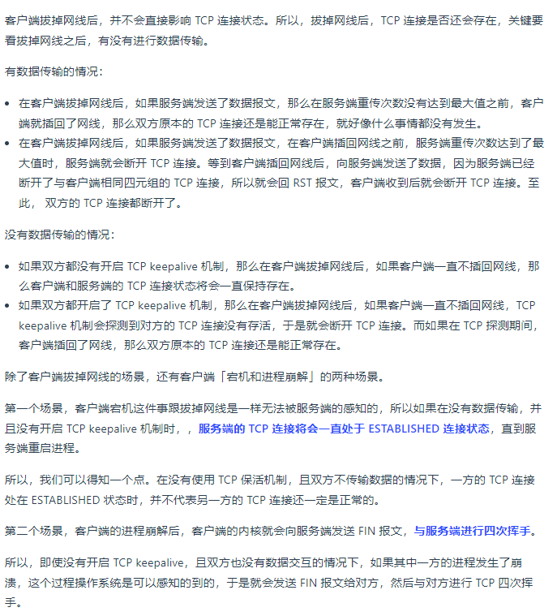

# 2 基础篇
## 2.1 TCP/IP模型


## 2.2 网页到显示发生什么 重点


## 2.3 网络模型-Linux协议栈-收发流程


# 3 HTTP
## 3.1 HTTP 常见面试题

HTTP 基本概念
Get 与 Post
HTTP 特性
HTTP 缓存技术
HTTPS 与 HTTP
HTTP/1.1、HTTP/2、HTTP/3 演变


### 1. HTTP基本概念
#### 1.1 HTTP是什么
超文本 
传输  双向协议
协议

#### 1.2 HTTP常见的状态码

1xx 类状态码属于提示信息，是协议处理中的一种中间状态，实际用到的比较少。

2xx 类状态码表示服务器成功处理了客户端的请求，也是我们最愿意看到的状态。


3xx 类状态码表示客户端请求的资源发生了变动，需要客户端用新的 URL 重新发送请求获取资源，也就是重定向。


4xx 类状态码表示客户端发送的报文有误，服务器无法处理，也就是错误码的含义。


5xx 类状态码表示客户端请求报文正确，但是服务器处理时内部发生了错误，属于服务器端的错误码。


#### 1.3 HTTP常见的字段
1. Host: www.A.com
有了 Host 字段，就可以将请求发往「同一台」服务器上的不同网站。

2. Content-Length: 1000
如上面则是告诉浏览器，本次服务器回应的数据长度是 1000 个字节，后面的字节就属于下一个回应了。

3. Connection: keep-alive
Connection 字段最常用于客户端要求服务器使用 TCP 持久连接，以便其他请求复用

4. Content-Type: text/html; charset=utf-8
发送的是网页，而且编码是UTF-8。    Accept: */*，客户端声明自己可以接受任何格式的数据。

5. Content-Encoding: gzip

6. Accept-Encoding: gzip, deflate


### 2. GET和POST


#### 2.1 GET和POST的区别
GET 的语义是从服务器获取指定的资源，这个资源可以是静态的文本、页面、图片视频等。
GET 请求的参数位置一般是写在 URL 中，URL 规定只能支持 ASCII，所以 GET 请求的参数只允许 ASCII 字符 ，而且浏览器会对 URL 的长度有限制（HTTP协议本身对 URL长度并没有做任何规定）。

POST 的语义是根据请求负荷（报文body）对指定的资源做出处理，具体的处理方式视资源类型而不同。POST 请求携带数据的位置一般是写在报文 body 中， body 中的数据可以是任意格式的数据，只要客户端与服务端协商好即可，而且浏览器不会对 body 大小做限制。

#### 2.2 GET和POST方法是安全和幂等的么？
安全和幂等的概念：
在 HTTP 协议里，所谓的「安全」是指请求方法不会「破坏」服务器上的资源。
所谓的「幂等」，意思是多次执行相同的操作，结果都是「相同」的。

1. GET 的语义是请求获取指定的资源。GET 方法是安全、幂等、可被缓存的。
2. POST 的语义是根据请求负荷（报文主体）对指定的资源做出处理，具体的处理方式视资源类型而不同。POST 不安全，不幂等，（大部分实现）不可缓存。

上面是从 RFC 规范定义的语义来分析的。
开发者不一定会按照 RFC 规范定义的语义来实现 GET 和 POST 方法
可以用 GET 方法实现新增或删除数据的请求，这样实现的 GET 方法自然就不是安全和幂等。
可以用 POST 方法实现查询数据的请求，这样实现的 POST 方法自然就是安全和幂等。

### 3. HTTP缓存技术
#### 3.1 HTTP缓存技术有哪些实现方式
对于一些具有重复性的 HTTP 请求，比如每次请求得到的数据都一样的，我们可以把这对「请求-响应」的数据都缓存在本地，那么下次就直接读取本地的数据，不必在通过网络获取服务器的响应了，这样的话 HTTP/1.1 的性能肯定肉眼可见的提升。

HTTP 缓存有两种实现方式，分别是强制缓存和协商缓存。

#### 3.2 强制缓存
强缓存指的是只要浏览器判断缓存没有过期，则直接使用浏览器的本地缓存，决定是否使用缓存的主动性在于浏览器这边。
强缓存是利用下面这两个 HTTP 响应头部（Response Header）字段实现的，它们都用来表示资源在客户端缓存的有效期，Cache-Control的优先级高于 Expires ：
Cache-Control， 是一个相对时间；
Expires，是一个绝对时间；


#### 3.3 协商缓存
协商缓存就是与服务端协商之后，通过协商结果来判断是否使用本地缓存。
协商缓存都基于cache-control
两种方式：一种基于时间  一种基于唯一标识（第二种更好，避免由于时间篡改导致的不可靠问题）
第一种：请求头部中的 If-Modified-Since 字段与响应头部中的 Last-Modified 字段实现
第二种：


### 4. HTTP特性（HTTP1.1）
#### 4.1 优点
简单（head + body 易理解）  灵活易扩展（head kv任意定义  底层TCP UDP任意换用） 跨平台

#### 4.2 缺点
无状态 明文传输 不安全

1. 无状态
对于无状态的问题，解法方案有很多种，其中比较简单的方式用 Cookie 技术。

2. 明文传输双刃剑
F12   wireshark抓包

3. 不安全


HTTP 的安全问题，可以用 HTTPS 的方式解决，也就是通过引入 SSL/TLS 层，使得在安全上达到了极致。

#### 4.3 性能
1. 长连接
HTTP1.0使用的是短链接， HTTP1.1采用长连接，TCP连接复用

2. 管道网络传输
在同一个 TCP 连接里面，客户端可以发起多个请求，只要第一个请求发出去了，不必等其回来，就可以发第二个请求出去，可以减少整体的响应时间。但是服务器必须按照接收请求的顺序发送对这些管道化请求的响应。

如果服务端在处理 A 请求时耗时比较长，那么后续的请求的处理都会被阻塞住，这称为**「队头堵塞」**。
HTTP/1.1 管道解决了请求的队头阻塞，但是没有解决响应的队头阻塞。

实际上 HTTP/1.1 管道化技术不是默认开启，而且浏览器基本都没有支持。

3. 队头阻塞
「请求 - 应答」的模式加剧了 HTTP 的性能问题。
因为当顺序发送的请求序列中的一个请求因为某种原因被阻塞时，在后面排队的所有请求也一同被阻塞了，会招致客户端一直请求不到数据，这也就是「队头阻塞」，好比上班的路上塞车。

 HTTP/1.1 的性能一般般，后续的 HTTP/2 和 HTTP/3 就是在优化 HTTP 的性能。

### 5. HTTP和HTTPS
#### 5.1 HTTP与HTTPS的区别

1. 安全问题 明文传输 加密传输
2. 建立连接 TCP三次握手    HTTPS需要三次握手后进行 SSL/TLS 的握手过程，才可进入加密报文传输。
3. 端口    HTTP 的端口号是 80，HTTPS 的端口号是 443。
4. 证书认证 HTTPS 协议需要向 CA（证书权威机构）申请数字证书，来保证服务器的身份是可信的。

#### 5.2 HTTPS解决了HTTP哪些问题
HTTP存在以下风险：

1. 被窃听   -    信息加密    - 混合加密
2. 被篡改   -   校验机制     - 摘要算法（哈希）+数字签名
3. 被冒充   -   身份证书     - 数字证书

通过以下方式进行响应的解决：

1. 混合加密


2. 摘要算法 + 数字签名
- 摘要算法：  哈希保证完整性


通过哈希算法可以确保内容不会被篡改，但是并不能保证「内容 + 哈希值」不会被中间人替换，因为这里缺少对客户端收到的消息是否来源于服务端的证明。


那为了避免这种情况，计算机里会用非对称加密算法来解决，共有两个密钥：
公钥：所有人  私钥：自己拥有  ；  
公钥和私钥可以双向解密：


非对称加密的用途主要在于通过「私钥加密，公钥解密」的方式，来确认消息的身份

- 数字签名:  保证消息来源的可靠性
通过「私钥加密，公钥解密」的方式，来确认消息的身份，是对内容的哈希值加密。


3. 数字证书
可以通过哈希算法来保证消息的完整性；
可以通过数字签名来保证消息的来源可靠性（能确认消息是由持有私钥的一方发送的）；
还缺少身份验证的环节，万一公钥是被伪造的呢？   数字证书解决 公钥的安全性

数字证书:「公钥 + 数字签名(ca的私钥对服务器公钥签名)」  

首先会去警察局验证这个数字证书是否合法, 由于通过警察局验证了数字证书是合法的,


#### 5.3 HTTPS如何建立连接，交互了什么

SSL/TLS 协议基本流程：
1. 客户端向服务器索要并验证服务器的公钥。
2. 双方协商生产「会话秘钥」。
3. 双方采用「会话秘钥」进行加密通信。

SSL/TLS建立连接流程：

1. ClientHello
在这一步，客户端主要向服务器发送以下信息：
（1）客户端支持的 SSL/TLS 协议版本，如 TLS 1.2 版本。
（2）客户端生产的随机数（Client Random），后面用于生成「会话秘钥」条件之一。
（3）客户端支持的密码套件列表，如 RSA 加密算法。

2. SeverHello
服务器收到客户端请求后，向客户端发出响应，也就是 SeverHello。服务器回应的内容有如下内容：
（1）确认 SSL/ TLS 协议版本，如果浏览器不支持，则关闭加密通信。
（2）服务器生产的随机数（Server Random），也是后面用于生产「会话秘钥」条件之一。
（3）确认的密码套件列表，如 RSA 加密算法。
（4）**服务器的数字证书。**！！

3. 客户端回应
客户端收到服务器的回应之后，首先通过浏览器或者操作系统中的 CA 公钥，确认服务器的数字证书的真实性。
如果证书没有问题，客户端会从数字证书中取出服务器的公钥，然后使用它加密报文，向服务器发送如下信息：
（1）一个随机数（pre-master key）。该随机数会被服务器公钥加密。
（2）加密通信算法改变通知，表示随后的信息都将用「会话秘钥」加密通信。
（3）客户端握手结束通知，表示客户端的握手阶段已经结束。这一项同时把之前所有内容的发生的数据做个摘要，用来供服务端校验。


4. 服务器的最后回应
服务器收到客户端的第三个随机数（pre-master key）之后，通过协商的加密算法，计算出本次通信的「会话秘钥」。
然后，向客户端发送最后的信息：
（1）加密通信算法改变通知，表示随后的信息都将用「会话秘钥」加密通信。
（2）服务器握手结束通知，表示服务器的握手阶段已经结束。这一项同时把之前所有内容的发生的数据做个摘要，用来供客户端校验。
至此，整个 SSL/TLS 的握手阶段全部结束。接下来，客户端与服务器进入加密通信，就完全是使用普通的 HTTP 协议，只不过用「会话秘钥」加密内容。

**客户端校验数字证书的流程是怎样的？**


#### 5.4 HTTPS数据完整性如何保证
TLS 在实现上分为握手协议和记录协议两层：

1. TLS 握手协议就是我们前面说的 TLS 四次握手的过程，负责协商加密算法和生成对称密钥，后续用此密钥来保护应用程序数据（即 HTTP 数据）；
2. **TLS 记录协议负责保护应用程序数据并验证其完整性和来源，所以对 HTTP 数据加密是使用记录协议；**

TLS 记录协议主要负责消息（HTTP 数据）的压缩，加密及数据的认证，过程如下图：


### 6. HTTP1.1 HTTP2演变
#### 6.1 HTTP1.1比HTTP1.0提升了什么

- HTTP/1.1 相比 HTTP/1.0 性能上的改进：
1. TCP 长连接
2. 管道传输，没有了请求的队头阻塞，但是有了响应的队头阻塞

- HTTP/1.1 性能瓶颈：
1. 请求 / 响应头部（Header）未经压缩就发送，首部信息越多延迟越大。只能压缩 Body 的部分；
2. 发送冗长的首部。每次互相发送相同的首部造成的浪费较多；
3. 服务器是按请求的顺序响应的，如果服务器响应慢，会招致客户端一直请求不到数据，也就是队头阻塞；
4. 没有请求优先级控制；
5. 请求只能从客户端开始，服务器只能被动响应。

#### 6.2 HTTP2做了什么优化
 - HTTP/2 相比 HTTP/1.1 性能上的改进：
1. 头部压缩        头HPACK  body压缩
2.  二进制格式    二进制 省空间   字符与数字
3. 数据流         stream id  双方建立stream  可以指定数据流的优先级
4. 多路复用     服务端没有队头阻塞，A - B请求 ，难处理的A处理了一半 先发好处理的B 再发A
5. 服务端推送  不用 css js文件再次请求
   
 1. 头部压缩
 HTTP/2 会**压缩头**（Header）如果你同时发出多个请求，他们的头是一样的或是相似的，那么，协议会帮你消除重复的部分。
这就是所谓的 HPACK 算法：在客户端和服务器同时维护一张头信息表，所有字段都会存入这个表，生成一个索引号，以后就不发送同样字段了，只发送索引号，这样就提高速度了。
 
2. 二进制格式
HTTP/2 不再像 HTTP/1.1 里的纯文本形式的报文，而是全面采用了二进制格式，头信息和数据体都是二进制，并且统称为帧（frame）：头信息帧（Headers Frame）和数据帧（Data Frame）。增加了数据传输的效率。

比如状态码 200 ，在 HTTP/1.1 是用 '2''0''0' 三个字符来表示（二进制：110010 110000 110000）
在 HTTP/2 是用数字 200 表示（二进制：10001000）

3. 数据流
HTTP/2 的数据包不是按顺序发送的，同一个连接里面连续的数据包，可能属于不同的回应。因此，必须要对数据包做标记，指出它属于哪个回应。

在 HTTP/2 中每个请求或响应的所有数据包，称为一个数据流（Stream）。每个数据流都标记着一个独一无二的编号（Stream ID），**不同 Stream 的帧是可以乱序发送的**（因此可以并发不同的 Stream ），因为每个帧的头部会携带 Stream ID 信息，所以接收端可以通过 Stream ID 有序组装成 HTTP 消息

客户端和服务器**双方都可以建立 Stream**， Stream ID 也是有区别的，客户端建立的 Stream 必须是奇数号，而服务器建立的 Stream 必须是偶数号。

客户端还**可以指定数据流的优先级**。优先级高的请求，服务器就先响应该请求。

4. 多路复用

HTTP/2 是可以在一个连接中并发多个请求或回应，而不用按照顺序一一对应。移除了 HTTP/1.1 中的串行请求，不需要排队等待，也就不会再出现「队头阻塞」问题，降低了延迟，大幅度提高了连接的利用率。

举例来说，在一个 TCP 连接里，服务器收到了客户端 A 和 B 的两个请求，如果发现 A 处理过程非常耗时，于是就回应 A 请求已经处理好的部分，接着回应 B 请求，完成后，再回应 A 请求剩下的部分。

5. 服务器推送
HTTP/2 还在一定程度上改善了传统的「请求 - 应答」工作模式，服务端不再是被动地响应，可以主动向客户端发送消息。
比如，客户端通过 HTTP/1.1 请求从服务器那获取到了 HTML 文件，而 HTML 可能还需要依赖 CSS 来渲染页面，这时客户端还要再发起获取 CSS 文件的请求，需要两次消息往返，在 HTTP/2 中，客户端在访问 HTML 时，服务器可以直接主动推送 CSS 文件，减少了消息传递的次数。

- HTTP/2 有什么缺陷？
HTTP/2 通过 Stream 的并发能力，解决了 HTTP/1 队头阻塞的问题，看似很完美了，
但是 HTTP/2 还是存在“队头阻塞”的问题，只不过问题不是在 HTTP 这一层面，而是在 TCP 这一层。

1. 仍有队头堵塞问题
HTTP/2 是基于 TCP 协议来传输数据的，TCP 是字节流协议，TCP 层必须保证收到的字节数据是完整且连续的，这样内核才会将缓冲区里的数据返回给 HTTP 应用，那么当「前 1 个字节数据」没有到达时，后收到的字节数据只能存放在内核缓冲区里，只有等到这 1 个字节数据到达时，HTTP/2 应用层才能从内核中拿到数据，这就是 HTTP/2 队头阻塞问题。

一旦发生了丢包现象，就会触发 TCP 的重传机制，这样在一个 TCP 连接中的所有的 HTTP 请求都必须等待这个丢了的包被重传回来。


#### 6.3 HTTP3做了什么优化

1. 无队头阻塞
2. 更快的连接
3. 连接迁移


HTTP/2 队头阻塞的问题是因为 TCP，所以 HTTP/3 把 HTTP 下层的 TCP 协议改成了 UDP！

UDP 发送是不管顺序，也不管丢包的，所以不会出现像 HTTP/2 队头阻塞的问题。大家都知道 UDP 是不可靠传输的，但基于 UDP 的 QUIC 协议 可以实现类似 TCP 的可靠性传输。


1. 无队头阻塞


2. 更快的连接建立
对于 HTTP/1 和 HTTP/2 协议，TCP 和 TLS 是分层的，分别属于内核实现的传输层、openssl 库实现的表示层，因此它们难以合并在一起，需要分批次来握手，先 TCP 握手，再 TLS 握手。

HTTP/3 在传输数据前虽然需要 QUIC 协议握手，这个握手过程只需要 1 RTT，握手的目的是为确认双方的「连接 ID」，连接迁移就是基于连接 ID 实现的。

但是 HTTP/3 的 QUIC 协议并不是与 TLS 分层，而是QUIC 内部包含了 TLS，它在自己的帧会携带 TLS 里的“记录”，再加上 QUIC 使用的是 TLS/1.3，因此仅需 1 个 RTT 就可以「同时」完成建立连接与密钥协商

3. 连接迁移

基于 TCP 传输协议的 HTTP 协议，由于是通过四元组（源 IP、源端口、目的 IP、目的端口）确定一条 TCP 连接，那么当**移动设备的网络从 4G 切换到 WIFI 时，意味着 IP 地址变化了，那么就必须要断开连接，然后重新建立连接**。而建立连接的过程包含 TCP 三次握手和 TLS 四次握手的时延，以及 TCP 慢启动的减速过程，给用户的感觉就是网络突然卡顿了一下，因此连接的迁移成本是很高的。

而 QUIC 协议没有用四元组的方式来“绑定”连接，而是通过连接 ID来标记通信的两个端点，客户端和服务器可以各自选择一组 ID 来标记自己，因此即使移动设备的网络变化后，导致 IP 地址变化了，只要仍保有上下文信息（比如连接 ID、TLS 密钥等），就可以“无缝”地复用原连接，消除重连的成本，没有丝毫卡顿感，达到了连接迁移的功能。

所以， QUIC 是一个在 UDP 之上的伪 TCP + TLS + HTTP/2 的多路复用的协议。


总结：
QUIC 是新协议，对于很多网络设备，根本不知道什么是 QUIC，只会当做 UDP，这样会出现新的问题，因为有的网络设备是会丢掉 UDP 包的，而 QUIC 是基于UDP 实现的，那么如果网络设备无法识别这个是 QUIC 包，那么就会当作 UDP包，然后被丢弃。
HTTP/3 现在普及的进度非常的缓慢。


## 3.2 HTTP/1.1 优化


1. 尽量避免发送 HTTP 请求；   本地缓存 服务器检查是否过期
2. 在需要发送 HTTP 请求时，考虑如何减少请求次数；   代理服务器进行重定向，  合并请求-图片合并 webpack文字css  ,   延迟请求（按需获取URL）
3. 减少服务器的 HTTP 响应的数据大小；  无损压缩-霍夫编码 - gzip     有损压缩- 质量因子q  webq格式


## 3.3 HTTPS TLS-RSA握手解析


通常经过「四个消息」就可以完成 TLS 握手，也就是需要 2个 RTT 的时延，然后就可以在安全的通信环境里发送 HTTP 报文，实现 HTTPS 协议。

缺陷：使用 RSA 密钥协商算法的最大问题是不支持前向保密。

因为客户端传递随机数（用于生成对称加密密钥的条件之一）给服务端时使用的是公钥加密的，服务端收到后，会用私钥解密得到随机数。所以一旦服务端的私钥泄漏了，过去被第三方截获的所有 TLS 通讯密文都会被破解。

为了解决这个问题，后面就出现了 ECDHE 密钥协商算法，我们现在大多数网站使用的正是 ECDHE 密钥协商算法，关于 ECDHE 握手的过程，


## 3.4 HTTPS ECDHE握手解析


ECDHE 密钥协商算法是 DH 算法演进过来的，所以我们先从 DH 算法说起。

### 1. 离散对数  可以简略看
对数运算的取值是可以连续的，而离散对数的取值是不能连续的，因此也以「离散」得名，
离散对数是在对数运算的基础上加了「模运算」，也就说取余数，对应编程语言的操作符是「%」

主要看公式和下方两句话：


底数 a 和模数 p 是离散对数的公共参数，也就说是公开的，**b 是真数，i 是对数。**
知道了对数，就可以用上面的公式计算出真数。但反过来，知道真数却很难推算出对数。

### 2. DH算法

需要先确定模数和底数作为算法的参数，这两个参数是公开的，用 P 和 G 来代称。
小红的公钥记作 A，A = G ^ a ( mod P )；
小明的公钥记作 B，B = G ^ b ( mod P )；

离散对数具备的幂运算具有交换律：
小红： K = B^a mod P              
小明：K = A^b mod P

这个 K 就是小红和小明之间用的对称加密密钥，可以作为会话密钥使用。
而 a、b 是双方各自保管的私钥，黑客无法获取这 2 个私钥

### 3. DHE 算法
static DH 算法，这个是已经被废弃了；  服务器的私钥固定的，a不变，客户端的私钥随机生成  不具备前向安全性（之前的TLS报文可能被截获）
DHE 算法，现在常用的； 双方的私钥在每次密钥交换通信时，都是随机生成的、临时的，这个方式也就是 DHE 算法 具备前向安全性

### 4. ECDHE 算法
DHE 算法由于计算性能不佳，因为需要做大量的乘法，为了提升 DHE 算法的性能，所以就出现了现在广泛用于密钥交换算法 —— ECDHE 算法。

ECDHE 算法是在 DHE 算法的基础上利用了 ECC 椭圆曲线特性，可以用更少的计算量计算出公钥，以及最终的会话密钥。

- 双方事先确定好使用哪种椭圆曲线，和曲线上的基点 G，这两个参数都是公开的；
- 双方各自随机生成一个随机数作为私钥d，并与基点 G相乘得到公钥Q（Q = dG）
- 双方交换各自的公钥，双方的 x 坐标是一样的，所以它是共享密钥，也就是会话密钥。

使用了 ECDHE，在 TLS 第四次握手前，客户端就已经发送了加密的 HTTP 数据，而对于 RSA 握手过程，必须要完成 TLS 四次握手，才能传输应用数据。


### 5. ECDHE握手流程

**第一次握手：**
客户端首先会发一个「Client Hello」消息，消息里面有客户端使用的 TLS 版本号、支持的密码套件列表，以及生成的随机数（Client Random）。


**第二次握手：**
服务端收到客户端的「打招呼」，同样也要回礼，会返回「Server Hello」消息，消息面有服务器确认的 TLS 版本号，也给出了一个随机数（Server Random），然后从客户端的密码套件列表选择了一个合适的密码套件。

不过，这次选择的密码套件就和 RSA 不一样了，我们来分析一下这次的密码套件的意思。
「 TLS_ECDHE_RSA_WITH_AES_256_GCM_SHA384」：
密钥协商算法使用 ECDHE；
签名算法使用 RSA；
握手后的通信使用 AES 对称算法，密钥长度 256 位，分组模式是 GCM；
摘要算法使用 SHA384；

服务端为了证明自己的身份，发送「Certificate」消息，会把证书也发给客户端。

在发送完证书后，发送「Server Key Exchange」消息。该过程发生下面事情：


随后，就是「Server Hello Done」消息，服务端跟客户端表明：“这些就是我提供的信息，打招呼完毕”。

至此，TLS 两次握手就已经完成了，目前客户端和服务端通过明文共享了这几个信息：Client Random、Server Random 、使用的椭圆曲线、椭圆曲线基点 G、服务端椭圆曲线的公钥，这几个信息很重要，是后续生成会话密钥的材料。

**TLS 第三次握手**
客户端收到了服务端的证书后，自然要校验证书是否合法，

客户端会生成一个随机数作为客户端椭圆曲线的私钥，然后再根据服务端前面给的信息，生成客户端的椭圆曲线公钥，然后用「Client Key Exchange」消息发给服务端。

至此，双方都有对方的椭圆曲线公钥、自己的椭圆曲线私钥、椭圆曲线基点 G。于是，双方都就计算出点（x，y），其中 x 坐标值双方都是一样的，前面说 ECDHE 算法时候，说 x 是会话密钥，但实际应用中，x 还不是最终的会话密钥。

还记得 TLS 握手阶段，客户端和服务端都会生成了一个随机数传递给对方吗？

最终的会话密钥，就是用「客户端随机数 + 服务端随机数 + x（ECDHE 算法算出的共享密钥） 」三个材料生成的。

之所以这么麻烦，是因为 TLS 设计者不信任客户端或服务器「伪随机数」的可靠性，为了保证真正的完全随机，把三个不可靠的随机数混合起来，那么「随机」的程度就非常高了，足够让黑客计算不出最终的会话密钥，安全性更高。

算好会话密钥后，客户端会发一个「Change Cipher Spec」消息，告诉服务端后续改用对称算法加密通信。

接着，客户端会发「Encrypted Handshake Message」消息，把之前发送的数据做一个摘要，再用对称密钥加密一下，让服务端做个验证，验证下本次生成的对称密钥是否可以正常使用。

**TLS 第四次握手**
最后，服务端也会有一个同样的操作，发「Change Cipher Spec」和「Encrypted Handshake Message」消息，如果双方都验证加密和解密没问题，那么握手正式完成。于是，就可以正常收发加密的 HTTP 请求和响应了。


AES对称加密和解密   加密和解密使用的相同密钥


### 总结


## 3.5 HTTPS 优化手段


### 1. 分析性能损耗

性能消耗两个环节:

- TLS握手过程                     密钥协商算法（ECDHE需要临时生成椭圆曲线公私钥）  客户端验证证书 计算对称密钥
- 握手后对称加密报文传输    AES ChaCha20  CPU加速

### 2. 硬件优化

计算密集型
选择有AES-NI支持的CPU

如果我们的 CPU 支持 AES-NI 特性，那么对于对称加密的算法应该选择 AES 算法。否则可以选择 ChaCha20 对称加密算法，因为 ChaCha20 算法的运算指令相比 AES 算法会对 CPU 更友好一点。


### 3. 软件优化

新版本不仅提供了最新的特性，也优化了以前软件的问题或性能。
升级Linux内核
升级OpenSSL


### 4. 协议优化

1. 密钥交换算法优化：
 RSA 密钥交换算法的 TLS 握手过程，不仅慢，而且安全性也不高。
 
选用 ECDHE 密钥交换算法替换 RSA 算法，因为该算法由于支持「False Start」，它是“抢跑”的意思，客户端可以在 TLS 协议的第 3 次握手后，第 4 次握手前，发送加密的应用数据，以此将 TLS 握手的消息往返由 2 RTT 减少到 1 RTT，而且安全性也高，具备前向安全性。

2. TLS 升级
TLS 1.3 大幅度简化了握手的步骤，完成 TLS 握手只要 1 RTT，而且安全性更高。

TLS 1.3 把 Hello 和公钥交换这两个消息合并成了一个消息，于是这样就减少到只需 1 RTT 就能完成 TLS 握手。

具体的做法是，客户端在 Client Hello 消息里带上了支持的椭圆曲线，以及这些椭圆曲线对应的公钥。

服务端收到后，选定一个椭圆曲线等参数，然后返回消息时，带上服务端这边的公钥。经过这 1 个 RTT，双方手上已经有生成会话密钥的材料了，于是客户端计算出会话密钥，就可以进行应用数据的加密传输了。

TLS1.3 对密码套件进行“减肥”了， 对于密钥交换算法，废除了不支持前向安全性的 RSA 和 DH 算法，只支持 ECDHE 算法。


### 5. 证书优化

对于证书的优化，可以有两个方向：
一个是证书传输，
一个是证书验证；

1. 证书传输优化
要让证书更便于传输，那必然是减少证书的大小，这样可以节约带宽，也能减少客户端的运算量。所以，对于服务器的证书应该选择椭圆曲线（ECDSA）证书，而不是 RSA 证书，因为在相同安全强度下， ECC 密钥长度比 RSA 短的多。

2. 证书验证优化

客户端在验证证书时，是个复杂的过程，会走证书链逐级验证，验证的过程不仅需要「用 CA 公钥解密证书」以及「用签名算法验证证书的完整性」，而且为了知道证书是否被 CA 吊销，客户端有时还会再去访问 CA， 下载 CRL 或者 OCSP 数据，以此确认证书的有效性。

这个访问过程是 HTTP 访问，因此又会产生一系列网络通信的开销，如 DNS 查询、建立连接、收发数据等。

CRL：证书吊销列表（Certificate Revocation List），CA定期更新，客户端查询后遍历列表，开销较大
OCSP：在线证书状态协议（Online Certificate Status Protocol），向 CA 发送查询请求，让 CA 返回证书的有效状态

OCSP 需要向 CA 查询，因此也是要发生网络请求，而且还得看 CA 服务器的“脸色”，如果网络状态不好，或者 CA 服务器繁忙，也会导致客户端在校验证书这一环节的延时变大

**解决方案：**
于是为了解决这一个网络开销，就出现了 OCSP Stapling，其原理是：服务器向 CA 周期性地查询证书状态，获得一个带有时间戳和签名的响应结果并缓存它。

当有客户端发起连接请求时，服务器会把这个「响应结果」在 TLS 握手过程中发给客户端。由于有签名的存在，服务器无法篡改，因此客户端就能得知证书是否已被吊销了，这样客户端就不需要再去查询。


### 6. 会话复用

TLS 握手的目的就是为了协商出会话密钥，也就是对称加密密钥，那我们如果我们把首次 TLS 握手协商的对称加密密钥缓存起来，待下次需要建立 HTTPS 连接时，直接「复用」这个密钥，不就减少 TLS 握手的性能损耗了吗？

第一种叫 Session ID；
首次 TLS 握手连接后，双方会在内存缓存会话密钥，并用唯一的 Session ID 来标识，Session ID 和会话密钥相当于 key-value 的关系。
问题：
1. 随着客户端的增多，服务器的内存压力也会越大
2. 由多台服务器通过负载均衡提供服务的，客户端再次连接不一定会命中上次访问过的服务器，

第二种叫 Session Ticket；
服务器不再缓存每个客户端的会话密钥，而是把缓存的工作交给了客户端，类似于 HTTP 的 Cookie。


第三种  Pre-shared Key；
对于重连 TLS1.3 只需要 0 RTT，原理和 Ticket 类似，只不过在重连时，客户端会把 Ticket 和 HTTP 请求一同发送给服务端，这种方式叫 Pre-shared Key。


这些会话重用技术虽然好用，但是存在一定的安全风险，它们不仅不具备前向安全，而且有重放攻击的风险，所以应当对会话密钥设定一个合理的过期时间。

**重放攻击：**
重放攻击的危险之处在于，如果中间人截获了某个客户端的 Session ID 或 Session Ticket 以及 POST 报文，而一般 POST 请求会改变数据库的数据，中间人就可以利用此截获的报文，不断向服务器发送该报文，这样就会导致数据库的数据被中间人改变了，而客户是不知情的。

### 总结


## 3.6 HTTP1缺陷-HTTP/2


### 1. HTTP/1.1 协议的性能问题


### 2. 兼容 HTTP/1.1

第一点，HTTP/2 没有在 URI 里引入新的协议名，仍然用「http://」表示明文协议，用「https://」表示加密协议，于是只需要浏览器和服务器在背后自动升级协议，这样可以让用户意识不到协议的升级，很好的实现了协议的平滑升级。

第二点，只在应用层做了改变，还是基于 TCP 协议传输，应用层方面为了保持功能上的兼容，HTTP/2 把 HTTP 分解成了「语义」和「语法」两个部分，「语义」层不做改动，与 HTTP/1.1 完全一致，比如请求方法、状态码、头字段等规则保留不变。
但是HTTP/2 在「语法」层面做了很多改造，基本改变了 HTTP 报文的传输格式

### 3. 头部压缩

1、 HTTP1.1报⽂中Header部分存在的问题：

头部字段多  - 压缩
头部字段多次请求重复性高 - 避免重复
头部字段ASCII编码 效率低 - 二进制编码


2、 HTTP2的改造：
 HPACK 算法压缩头部，HPACK 算法主要包含三个组成部分：
静态字典；
动态字典；
Huffman 编码（压缩算法）；
客户端和服务器两端都会建立和维护「字典」，用长度较小的索引号表示重复的字符串，再用 Huffman 编码压缩数据

- 静态编码 ： 
高频出现在头部的字符串和字段建立静态表，写入HTTP2的框架，有61组 ， 比如索引 2 代表method的get方法

- 动态编码：
静态表只包含了 61 种高频出现在头部的字符串，不在静态表范围内的头部字符串就要自行构建动态表，它的 Index 从 62 起步，会在编码解码的时候随时更新。

使用前提在同一个连接上，重复传输完全相同的头部，动态表越大内存越多，影响服务器性能，因此 Web 服务器都会提供类似 http2_max_requests 的配置，用于限制一个连接上能够传输的请求数量，避免动态表无限增大，请求数量到达上限后，就会关闭 HTTP/2 连接来释放内存。

### 4. 二进制帧（HTTP2报文内容）
HTTP/2 厉害的地方在于将 HTTP/1 的文本格式改成二进制格式传输数据，极大提高了 HTTP 传输效率，而且二进制数据使用位运算能高效解析。

HTTP/2 把响应报文划分成了两类帧（Frame），图中的 HEADERS（首部）和 DATA（消息负载） 是帧的类型，也就是说一条 HTTP 响应，划分成了两类帧来传输，并且采用二进制来编码。


- 帧开头的前 3 个字节表示帧数据（Frame Playload）的长度。
- 帧长度后面的一个字节是表示帧的类型，HTTP/2 总共定义了 10 种类型的帧，一般分为数据帧和控制帧两类，
- 标志位：携带简单控制信息 - 
    END_HEADERS 表示头数据结束标志； END_STREAM  - 单方向数据发送结束，后续不会再有数据帧。PRIORITY - 表示流的优先级；
- 流标识符（Stream ID）：
    它的作用是用来标识该 Frame 属于哪个 Stream，接收方可以根据这个信息从乱序的帧里找到相同 Stream ID 的帧，从而有序组装信息。


最后面就是帧数据了，它存放的是通过 HPACK 算法压缩过的 HTTP 头部和包体

### 5. 并发传输

 Stream、Message、Frame：
 1 个 TCP 连接包含一个或者多个 Stream，Stream 是 HTTP/2 并发的关键技术；
Stream 里可以包含 1 个或多个 Message，Message 对应 HTTP/1 中的请求或响应，由 HTTP 头部和包体构成；
Message 里包含一条或者多个 Frame，Frame 是 HTTP/2 最小单位，以二进制压缩格式存放 HTTP/1 中的内容（头部和包体）；

因此，我们可以得出 2 个结论：HTTP 消息可以由多个 Frame 构成，以及 1 个 Frame 可以由多个 TCP 报文构成。

在 HTTP/2 连接上，不同 Stream 的帧是可以乱序发送的（因此可以并发不同的 Stream ），因为每个帧的头部会携带 Stream ID 信息，所以接收端可以通过 Stream ID 有序组装成 HTTP 消息，而同一 Stream 内部的帧必须是严格有序的。

客户端和服务器双方都可以建立 Stream， Stream ID 也是有区别的，客户端建立的 Stream 必须是奇数号，而服务器建立的 Stream 必须是偶数号。

同一个连接中的 Stream ID 是不能复用的，只能顺序递增，所以当 Stream ID 耗尽时，需要发一个控制帧 GOAWAY，用来关闭 TCP 连接。

在 Nginx 中，可以通过 http2_max_concurrent_streams 配置来设置 Stream 的上限，默认是 128 个。

HTTP/2 通过 Stream 实现的并发，比 HTTP/1.1 通过 TCP 连接实现并发要牛逼的多，因为当 HTTP/2 实现 100 个并发 Stream 时，只需要建立一次 TCP 连接，而 HTTP/1.1 需要建立 100 个 TCP 连接，每个 TCP 连接都要经过TCP 握手、慢启动以及 TLS 握手过程，这些都是很耗时的。

HTTP/2 还可以对每个 Stream 设置不同优先级，帧头中的「标志位」可以设置优先级，比如客户端访问 HTML/CSS 和图片资源时，希望服务器先传递 HTML/CSS，再传图片，那么就可以通过设置 Stream 的优先级来实现，以此提高用户体验。

### 6. 服务器主动推送资源
HTTP/1.1 不支持服务器主动推送资源给客户端，都是由客户端向服务器发起请求后，才能获取到服务器响应的资源。

比如，客户端通过 HTTP/1.1 请求从服务器那获取到了 HTML 文件，而 HTML 可能还需要依赖 CSS 来渲染页面，这时客户端还要再发起获取 CSS 文件的请求，需要两次消息往返

客户端发起的请求，必须使用的是奇数号 Stream，服务器主动的推送，使用的是偶数号 Stream。服务器在推送资源时，会通过 PUSH_PROMISE 帧传输 HTTP 头部，并通过帧中的 Promised Stream ID 字段告知客户端，接下来会在哪个偶数号 Stream 中发送包体。

在 Stream 1 中通知客户端 CSS 资源即将到来，然后在 Stream 2 中发送 CSS 资源，注意 Stream 1 和 2 是可以并发的。


### 总结


## 3.7 HTTP2缺陷-QUIC-HTTP/3


 2017 年起， HTTP/3 已经更新到 34 个草案了。
 
### 1. HTTP2的缺陷
队头阻塞；
TCP 与 TLS 的握手时延迟；
网络迁移需要重新连接


1. 队头阻塞

HTTP/2 多个请求是跑在一个 TCP 连接中的，那么当 TCP 丢包时，整个 TCP 都要等待重传，那么就会阻塞该 TCP 连接中的所有请求。

packet 3 在网络中丢失了，即使 packet 4-6 被接收方收到后，由于内核中的 TCP 数据不是连续的，于是接收方的应用层就无法从内核中读取到，只有等到 packet 3 重传后，接收方的应用层才可以从内核中读取到数据，这就是 HTTP/2 的队头阻塞问题，是在 TCP 层面发生的。

2. TCP 与 TLS 的握手时延迟

发起 HTTP 请求时，需要经过 TCP 三次握手和 TLS 四次握手（TLS 1.2）的过程，因此共需要 3 个 RTT 的时延才能发出请求数据
TCP 由于具有「拥塞控制」的特性，所以刚建立连接的 TCP 会有个「慢启动」的过程，它会对 TCP 连接产生"减速"效果

3.  网络迁移需要重新连接
一个 TCP 连接是由四元组（源 IP 地址，源端口，目标 IP 地址，目标端口）确定的，这意味着如果 IP 地址或者端口变动了，就会导致需要 TCP 与 TLS 重新握手，这不利于移动设备切换网络的场景，比如 4G 网络环境切换成 WIFI。

要解决这个问题，就必须把传输层协议替换成 UDP，这个大胆的决定，HTTP/3 做了！

### 2. QUIC协议

·HTTP/3 不仅仅只是简单将传输协议替换成了 UDP，还基于 UDP 协议在「应用层」实现了 QUIC 协议，它具有类似 TCP 的连接管理、拥塞窗口、流量控制的网络特性，相当于将不可靠传输的 UDP 协议变成“可靠”的了，所以不用担心数据包丢失的问题。

特点：
无队头阻塞；
更快的连接建立；
连接迁移；


1. 无队头阻塞；


2. 更快的连接建立；
对于 HTTP/1 和 HTTP/2 协议，TCP 和 TLS 是分层的，分别属于内核实现的传输层、openssl 库实现的表示层，因此它们难以合并在一起，需要分批次来握手，先 TCP 握手，再 TLS 握手。

HTTP/3 在传输数据前虽然需要 QUIC 协议握手，这个握手过程只需要 1 RTT，握手的目的是为确认双方的「连接 ID」，连接迁移就是基于连接 ID 实现的。

但是 HTTP/3 的 QUIC 协议并不是与 TLS 分层，而是QUIC 内部包含了 TLS，它在自己的帧会携带 TLS 里的“记录”，再加上 QUIC 使用的是 TLS1.3，因此仅需 1 个 RTT 就可以「同时」完成建立连接与密钥协商，
甚至在第二次连接的时候，应用数据包可以和 QUIC 握手信息（连接信息 + TLS 信息）一起发送，达到 0-RTT 的效果。
 
3. 连接迁移；

而 QUIC 协议没有用四元组的方式来“绑定”连接，而是通过连接 ID来标记通信的两个端点，客户端和服务器可以各自选择一组 ID 来标记自己，因此即使移动设备的网络变化后，导致 IP 地址变化了，只要仍保有上下文信息（比如连接 ID、TLS 密钥等），就可以“无缝”地复用原连接，消除重连的成本，没有丝毫卡顿感，达到了连接迁移的功能。


### 3. HTTP3协议

HTTP/3 同 HTTP/2 一样采用二进制帧的结构，
不同的地方在于 HTTP/2 的二进制帧里需要定义 Stream，而 HTTP/3 自身不需要再定义 Stream，直接使用 QUIC 里的 Stream，
于是 HTTP/3 的帧的结构也变简单了。


- 大体上分为数据帧和控制帧两大类

- 头部压缩 QPACK：
HTTP/3 在头部压缩算法这一方面也做了升级，升级成了 QPACK。与 HTTP/2 中的 HPACK 编码方式相似，HTTP/3 中的 QPACK 也采用了静态表、动态表及 Huffman 编码。

对于静态表的变化，HTTP/2 中的 HPACK 的静态表只有 61 项，而 HTTP/3 中的 QPACK 的静态表扩大到 91 项。

HTTP/2 和 HTTP/3 的 Huffman 编码并没有多大不同，但是动态表编解码方式不同。

所谓的动态表，在首次请求-响应后，双方会将未包含在静态表中的 Header 项更新各自的动态表，接着后续传输时仅用 1 个数字表示，然后对方可以根据这 1 个数字从动态表查到对应的数据，就不必每次都传输长长的数据，大大提升了编码效率。

可以看到，动态表是具有时序性的，如果首次出现的请求发生了丢包，后续的收到请求，对方就无法解码出 HPACK 头部，因为对方还没建立好动态表，因此后续的请求解码会阻塞到首次请求中丢失的数据包重传过来。


### 总结


## 3.8 HTTP协议-RPC协议

原由：TCP基于字节流的，无法区分边界，容易产生粘包的现象，因此需要有消息头或者消息体，用于区分边界

RPC是一种远程过程调用，gRPC是一种具体的协议，与HTTP都在应用层
TCP 70年代     RPC 80年代  HTTP90年代

- 那既然有 RPC 了，为什么还要有HTTP呢？
RPC 主要用在CS架构
HTTP就是那个时代用于统一 browser/server (b/s) 的协议。

HTTP 和 RPC 有什么区别
- 服务发现    区别不大。HTTP通过DNS解析域名，RPC可以通过Redis或者CoreDNS解析域名
- 底层连接形式     RPC有一个连接池
- 传输的内容      HTTP有header body 头部字段多次发送，比较冗余  RPC采用protobuf序列化协议，不需要考虑302等，性能更好


# 4 TCP

## 4.0 HTTP123  TCP UDP QUIC ICMP IP MAC 报文首部

HTTP2 和HTTP3


 QUIC  腾讯的CDN开始支持
 [QUIC协议概览](https://baijiahao.baidu.com/s?id=1721173252344420134&wfr=spider&for=pc)


0. HTTP报文分片

1. HTTP


2. TCP


3. UDP


4. IP


## 4.1 TCP 三次握手与四次挥手面试题


### TCP基本认识
#### 1. 瞧瞧 TCP 头格式

20个字节  5个32位
端口 序列号 确认序列号  首部字段+控制位+窗口大小  校验位+紧急指针

序列号：在建立连接时由计算机生成的随机数作为其初始值，通过 SYN 包传给接收端主机，每发送一次数据，就「累加」一次该「数据字节数」的大小。**用来解决网络包乱序问题**。
确认应答号：指下一次「期望」收到的数据的序列号，发送端收到这个确认应答以后可以认为**在这个序号以前的数据都已经被正常接收**。**用来解决丢包的问题**。
ACK：该位为 1 时，「确认应答」的字段变为有效，TCP 规定**除了最初建立连接时的 SYN 包之外**该位必须设置为 1 。

1.1 UDP
端口号   包长度+校验和


#### 2. 为什么需要 TCP 协议？ TCP 工作在哪一层？

IP 层是「不可靠」的，它不保证网络包的交付、不保证网络包的按序交付、也不保证网络包中的数据的完整性。
如果需要保障网络数据包的可靠性，那么就需要由上层（传输层）的 TCP 协议来负责。
因为 TCP 是一个工作在**传输层**的可靠数据传输的服务，它能确保接收端接收的网络包是无损坏、无间隔、非冗余和按序的。

#### 3. 什么是 TCP ？
TCP 是面向连接的、可靠的、基于字节流的传输层通信协议。

面向连接：一定是「一对一」才能连接，不能像 UDP 协议可以一个主机同时向多个主机发送消息，也就是一对多是无法做到的；
可靠的：无论的网络链路中出现了怎样的链路变化，TCP 都可以保证一个报文一定能够到达接收端；
字节流：用户消息通过 TCP 协议传输时，消息可能会被操作系统「分组」成多个的 TCP 报文，如果接收方的程序如果不知道「消息的边界」，是无法读出一个有效的用户消息的。并且 TCP 报文是「有序的」，当「前一个」TCP 报文没有收到的时候，即使它先收到了后面的 TCP 报文，那么也不能扔给应用层去处理，同时对「重复」的 TCP 报文会自动丢弃。

#### 4. 什么是TCP链接
源地址
源端口
目的地址
目的端口

#### 5. IP监听一个端口，TCP最大连接数是多少？

#### 6. 有一个 IP 的服务器监听了一个端口，它的 TCP 的最大连接数是多少？

当然，服务端最大并发 TCP 连接数远不能达到理论上限，会受以下因素影响：

文件描述符限制，每个 TCP 连接都是一个文件，如果文件描述符被占满了，会发生 too many open files。Linux 对可打开的文件描述符的数量分别作了三个方面的限制：
    * 系统级：当前系统可打开的最大数量，通过 cat /proc/sys/fs/file-max 查看；
    * 用户级：指定用户可打开的最大数量，通过 cat /etc/security/limits.conf 查看；
    * 进程级：单个进程可打开的最大数量，通过 cat /proc/sys/fs/nr_open 查看；
内存限制，每个 TCP 连接都要占用一定内存，操作系统的内存是有限的，如果内存资源被占满后，会发生 OOM。


#### 7.UDP 和 TCP 有什么区别呢？分别的应用场景是？


TCP 和 UDP 应用场景：
由于 TCP 是面向连接，能保证数据的可靠性交付，因此经常用于：
* FTP 文件传输；
* HTTP / HTTPS；

由于 UDP 面向无连接，它可以随时发送数据，再加上UDP本身的处理既简单又高效，因此经常用于：
* 包总量较少的通信，如 DNS 、SNMP 等；
* 视频、音频等多媒体通信；
* 广播通信；

#### 8.为什么 UDP 头部没有「首部长度」字段，而 TCP 头部有「首部长度」字段呢？
原因是 TCP 有可变长的「选项」字段，而 UDP 头部长度则是不会变化的，无需多一个字段去记录 UDP 的首部长度。


#### 9. 为什么 UDP 头部有「包长度」字段，而 TCP 头部则没有「包长度」字段呢？


### TCP 连接建立

#### 1. TCP 三次握手过程和状态变迁

一开始，客户端和服务端都处于 CLOSED 状态。先是服务端主动监听某个端口，处于 LISTEN 状态

客户端会随机初始化序号（client_isn），将此序号置于 TCP 首部的「序号」字段中，同时把 SYN 标志位置为 1 ，表示 SYN 报文。接着把第一个 SYN 报文发送给服务端，表示向服务端发起连接，该报文不包含应用层数据，之后客户端处于 SYN-SENT 状态。

服务端收到客户端的 SYN 报文后，首先服务端也随机初始化自己的序号（server_isn），将此序号填入 TCP 首部的「序号」字段中，其次把 TCP 首部的「确认应答号」字段填入 client_isn + 1, 接着把 SYN 和 ACK 标志位置为 1。最后把该报文发给客户端，该报文也不包含应用层数据，之后服务端处于 SYN-RCVD 状态。

客户端收到服务端报文后，还要向服务端回应最后一个应答报文，首先该应答报文 TCP 首部 ACK 标志位置为 1 ，其次「确认应答号」字段填入 server_isn + 1 ，最后把报文发送给服务端，这次报文可以携带客户到服务器的数据，之后客户端处于 ESTABLISHED 状态。

服务器收到客户端的应答报文后，也进入 ESTABLISHED 状态。

**第三次握手是可以携带数据的，前两次握手是不可以携带数据的，这也是面试常问的题。**

#### 2. 为什么是三次握手？不是两次、四次？

三次握手才可以阻止重复历史连接的初始化（主要原因）
三次握手才可以同步双方的初始序列号
三次握手才可以避免资源浪费
因为三次握手才能保证双方具有接收和发送的能力。

为什么三次握手才可以初始化Socket、序列号和窗口大小并建立 TCP 连接。

2.1 首要原因是为了防止旧的重复连接初始化造成混乱。（主要原因）
**如果是两次握手连接，就无法阻止历史连接，那为什么 TCP 两次握手为什么无法阻止历史连接呢？**
在两次握手的情况下，「被动发起方」没有中间状态给「主动发起方」来阻止历史连接，导致「被动发起方」可能建立一个历史连接，造成资源浪费。
两次握手的情况下，「被动发起方」在收到 SYN 报文后，就进入 ESTABLISHED 状态，意味着这时可以给对方发送数据给，但是「主动发」起方此时还没有进入 ESTABLISHED 状态，假设这次是历史连接，主动发起方判断到此次连接为历史连接，那么就会回 RST 报文来断开连接，而「被动发起方」在第一次握手的时候就进入 ESTABLISHED 状态，所以它可以发送数据的，但是它并不知道这个是历史连接，它只有在收到 RST 报文后，才会断开连接。资源浪费


2.2 原因二：同步双方初始序列号

接收方可以去除重复的数据；
接收方可以根据数据包的序列号按序接收；
可以标识发送出去的数据包中， 哪些是已经被对方收到的（通过 ACK 报文中的序列号知道）；

这样一来一回，才能确保双方的初始序列号能被可靠的同步。

**四次握手**其实也能够可靠的同步双方的初始化序号，但由于第二步和第三步可以优化成一步，所以就成了「三次握手」。

2.3 原因三：避免资源浪费
如果只有「两次握手」，服务器不清楚客户端是否收到了自己发送的建立连接的 ACK 确认信号，所以每收到一个 SYN 就只能先主动建立一个连接，这会造成什么情况呢？

如果客户端的 SYN 阻塞了，重复发送多次 SYN 报文，那么服务器在收到请求后就会建立多个冗余的无效链接，造成不必要的资源浪费。

不使用「两次握手」和「四次握手」的原因：
「两次握手」：无法防止历史连接的建立，会造成双方资源的浪费，也无法可靠的同步双方序列号；
「四次握手」：三次握手就已经理论上最少可靠连接建立，所以不需要使用更多的通信次数。

#### 3. 为什么每次建立 TCP 连接时，初始化的序列号都要求不一样呢？

主要原因有两个方面：

为了防止历史报文被下一个相同四元组的连接接收（主要方面）；
为了安全性，防止黑客伪造的相同序列号的 TCP 报文被对方接收；

客户端和服务端建立一个 TCP 连接，在客户端发送数据包被网络阻塞了，而此时服务端的进程重启了，于是就会发送 RST 报文来断开连接。
紧接着，客户端又与服务端建立了与上一个连接相同四元组的连接；
在新连接建立完成后，上一个连接中被网络阻塞的数据包正好抵达了服务端，刚好该数据包的序列号正好是在服务端的接收窗口内，所以该数据包会被服务端正常接收，就会造成数据错乱。
如果每次建立连接，客户端和服务端的初始化序列号都是一样的话，很容易出现历史报文被下一个相同四元组的连接接收的问题。

#### 4. 初始序列号 ISN 是如何随机产生的？

初始化序列号 ISN 随机生成算法：ISN = M + F(localhost, localport, remotehost, remoteport)。
M 是一个计时器，这个计时器每隔 4 微秒加 1。
F 是一个 Hash 算法，根据源 IP、目的 IP、源端口、目的端口生成一个随机数值。要保证 Hash 算法不能被外部轻易推算得出，用 MD5 算法是一个比较好的选择。

#### 5. 既然 IP 层会分片，为什么 TCP 层还需要 MSS 呢？
MTU：一个网络包的最大长度，以太网中一般为 1500 字节；
MSS：除去 IP 和 TCP 头部之后，一个网络包所能容纳的 TCP 数据的最大长度；

当 IP 层有一个超过 MTU 大小的数据（TCP 头部 + TCP 数据）要发送，那么 IP 层就要进行分片，把数据分片成若干片，保证每一个分片都小于 MTU。把一份 IP 数据报进行分片以后，由目标主机的 IP 层来进行重新组装后，再交给上一层 TCP 传输层。

这看起来井然有序，但这存在隐患的，那么当如果一个 IP 分片丢失，整个 IP 报文的所有分片都得重传。

因为 IP 层本身没有超时重传机制，它由传输层的 TCP 来负责超时和重传。

当接收方发现 TCP 报文（头部 + 数据）的某一片丢失后，则不会响应 ACK 给对方，那么发送方的 TCP 在超时后，就会重发「整个 TCP 报文（头部 + 数据）」。

因此，可以得知由 IP 层进行分片传输，是非常没有效率的。

所以，为了达到最佳的传输效能 TCP 协议在建立连接的时候通常要协商双方的 MSS 值，当 TCP 层发现数据超过 MSS 时，则就先会进行分片，当然由它形成的 IP 包的长度也就不会大于 MTU ，自然也就不用 IP 分片了。

经过 TCP 层分片后，如果一个 TCP 分片丢失后，进行重发时也是以 MSS 为单位，而不用重传所有的分片，大大增加了重传的效率。

#### 6. 第一次握手丢失了，会发生什么？

在 Linux 里，客户端的 SYN 报文最大重传次数由 tcp_syn_retries内核参数控制，这个参数是可以自定义的，默认值一般是 5。

通常，第一次超时重传是在 1 秒后，第二次超时重传是在 2 秒，第三次超时重传是在 4 秒后，第四次超时重传是在 8 秒后，第五次是在超时重传 16 秒后。没错，每次超时的时间是上一次的 2 倍。

当第五次超时重传后，会继续等待 32 秒，如果服务端仍然没有回应 ACK，客户端就不再发送 SYN 包，然后断开 TCP 连接。

所以，总耗时是 1+2+4+8+16+32=63 秒，大约 1 分钟左右。

#### 7. 第二次握手丢失了，会发生什么？

客户端和服务端都会重传

因此，当第二次握手丢失了，客户端和服务端都会重传：

客户端会重传 SYN 报文，也就是第一次握手，最大重传次数由 tcp_syn_retries内核参数决定；
服务端会重传 SYN-ACK 报文，也就是第二次握手，最大重传次数由 tcp_synack_retries 内核参数决定。

#### 8. 第三次握手丢失了，会发生什么？

客户端收到服务端的 SYN-ACK 报文后，就会给服务端回一个 ACK 报文，也就是第三次握手，此时客户端状态进入到 ESTABLISH 状态。

因为这个第三次握手的 ACK 是对第二次握手的 SYN 的确认报文，所以当第三次握手丢失了，如果服务端那一方迟迟收不到这个确认报文，就会触发超时重传机制，重传 SYN-ACK 报文，直到收到第三次握手，或者达到最大重传次数。

注意，ACK 报文是不会有重传的，当 ACK 丢失了，就由对方重传对应的报文。


#### 9.什么是 SYN 攻击？如何避免 SYN 攻击？
我们都知道 TCP 连接建立是需要三次握手，假设攻击者短时间伪造不同 IP 地址的 SYN 报文，服务端每接收到一个 SYN 报文，就进入SYN_RCVD 状态，但服务端发送出去的 ACK + SYN 报文，无法得到未知 IP 主机的 ACK 应答，久而久之就会占满服务端的半连接队列，使得服务器不能为正常用户服务。

避免 SYN 攻击方式一
SYN_RCVD 状态连接的最大个数：net.ipv4.tcp_max_syn_backlog
超出处理能时，对新的 SYN 直接回报 RST，丢弃连接：net.ipv4.tcp_abort_on_overflow

避免 SYN 攻击方式二
正常流程：
当服务端接收到客户端的 SYN 报文时，会将其加入到内核的「 SYN 队列」；
接着发送 SYN + ACK 给客户端，等待客户端回应 ACK 报文；
服务端接收到 ACK 报文后，从「 SYN 队列」移除放入到「 Accept 队列」；
应用通过调用 accpet() socket 接口，从「 Accept 队列」取出连接。

应用程序过慢：
如果应用程序过慢时，就会导致「 Accept 队列」被占满。

受到 SYN 攻击：
如果不断受到 SYN 攻击，就会导致 SYN 队列（半连接队列）被占满，从而导致无法在建立新的连接。
tcp_syncookies 的方式可以应对 SYN 攻击的方法：
当 「 SYN 队列」满之后，后续服务器收到 SYN 包，不进入「 SYN 队列」；
计算出一个 cookie 值，再以 SYN + ACK 中的「序列号」返回客户端，
服务端接收到客户端的应答报文时，服务器会检查这个 ACK 包的合法性。如果合法，直接放入到「 Accept 队列」。
最后应用通过调用 accpet() socket 接口，从「 Accept 队列」取出的连接。

### TCP 连接断开
#### 1. TCP 四次挥手过程和状态变迁


客户端打算关闭连接，此时会发送一个 TCP 首部 FIN 标志位被置为 1 的报文，也即 FIN 报文，之后客户端进入 FIN_WAIT_1 状态。
服务端收到该报文后，就向客户端发送 ACK 应答报文，接着服务端进入 CLOSED_WAIT 状态。
客户端收到服务端的 ACK 应答报文后，之后进入 FIN_WAIT_2 状态。
等待服务端处理完数据后，也向客户端发送 FIN 报文，之后服务端进入 LAST_ACK 状态。
客户端收到服务端的 FIN 报文后，回一个 ACK 应答报文，之后进入 TIME_WAIT 状态
服务器收到了 ACK 应答报文后，就进入了 CLOSED 状态，至此服务端已经完成连接的关闭。
客户端在经过 2MSL 一段时间后，自动进入 CLOSED 状态，至此客户端也完成连接的关闭。
你可以看到，每个方向都需要一个 FIN 和一个 ACK，因此通常被称为四次挥手。

这里一点需要注意是：主动关闭连接的，才有 TIME_WAIT 状态。

#### 2. 为什么挥手需要四次？
服务端通常需要等待完成数据的发送和处理，所以服务端的 ACK 和 FIN 一般都会分开发送，从而比三次握手导致多了一次。

#### 3. 第一次挥手丢失了，会发生什么？

当客户端（主动关闭方）调用 close 函数后，就会向服务端发送 FIN 报文，试图与服务端断开连接，此时客户端的连接进入到 FIN_WAIT_1 状态。

正常情况下，如果能及时收到服务端（被动关闭方）的 ACK，则会很快变为 FIN_WAIT2状态。

如果第一次挥手丢失了，那么客户端迟迟收不到被动方的 ACK 的话，也就会触发超时重传机制，重传 FIN 报文，重发次数由 tcp_orphan_retries 参数控制。

当客户端重传 FIN 报文的次数超过 tcp_orphan_retries 后，就不再发送 FIN 报文，直接进入到 close 状态。

#### 4. 第二次挥手丢失了，会发生什么？

当服务端收到客户端的第一次挥手后，就会先回一个 ACK 确认报文，此时服务端的连接进入到 CLOSE_WAIT 状态。

**在前面我们也提了，ACK 报文是不会重传的，所以如果服务端的第二次挥手丢失了，客户端就会触发超时重传机制，重传 FIN 报文，直到收到服务端的第二次挥手，或者达到最大的重传次数。**

**要点知识**
这里提一下，当客户端收到第二次挥手，也就是收到服务端发送的 ACK 报文后，客户端就会处于 **FIN_WAIT2 状态，在这个状态需要等服务端发送第三次挥手，也就是服务端的 FIN 报文。**

对于 **close 函数关闭的连接，**由于无法再发送和接收数据，所以FIN_WAIT2 状态不可以持续太久，而 tcp_fin_timeout 控制了这个状态下连接的持续时长，默认值是 60 秒。

**这意味着对于调用 close 关闭的连接，如果在 60 秒后还没有收到 FIN 报文，客户端（主动关闭方）的连接就会直接关闭。**

但是注意，**如果主动关闭方使用 shutdown 函数关闭连接且指定只关闭发送方向，而接收方向并没有关闭，那**么意味着主动关闭方还是可以接收数据的。如果主动关闭方一直没收到第三次挥手，**那么主动关闭方的连接将会一直处于 FIN_WAIT2 状态（tcp_fin_timeout 无法控制 shutdown 关闭的连接）**。

#### 5. 第三次挥手丢失了，会发生什么？

当服务端（被动关闭方）收到客户端（主动关闭方）的 FIN 报文后，内核会自动回复 ACK，同时连接处于 CLOSE_WAIT 状态，顾名思义，它表示等待应用进程调用 close 函数关闭连接。

此时，内核是没有权利替代进程关闭连接，必须由进程主动调用 close 函数来触发服务端发送 FIN 报文。

服务端处于 CLOSE_WAIT 状态时，调用了 close 函数，内核就会发出 FIN 报文，同时连接进入 LAST_ACK 状态，等待客户端返回 ACK 来确认连接关闭。

**如果迟迟收不到这个 ACK，服务端就会重发 FIN 报文，重发次数仍然由 tcp_orphan_retries 参数控制，这与客户端重发 FIN 报文的重传次数控制方式是一样的。**

#### 6.第四次挥手丢失了，会发生什么？

当客户端收到服务端的第三次挥手的 FIN 报文后，就会回 ACK 报文，也就是第四次挥手，**此时客户端连接进入 TIME_WAIT 状态。**

在 Linux 系统**，TIME_WAIT 状态会持续 2MSL 后才会进入关闭状态。**

然后，服务端（被动关闭方）没有收到 ACK 报文前，还是处于 LAST_ACK 状态。

**如果第四次挥手的 ACK 报文没有到达服务端，服务端就会重发 FIN 报文，重发次数仍然由前面介绍过的 tcp_orphan_retries 参数控制。**


#### 7. 为什么 TIME_WAIT 等待的时间是 2MSL？
MSL 是 Maximum Segment Lifetime，报文最大生存时间，它是任何报文在网络上存在的最长时间，超过这个时间报文将被丢弃。
 IP 头中有一个 TTL 字段，是 IP 数据报可以经过的最大路由数，每经过一个处理他的路由器此值就减 1，当此值为 0 则数据报将被丢弃，同时发送 ICMP 报文通知源主机。
MSL 与 TTL 的区别： MSL 的单位是时间，而 TTL 是经过路由跳数。所以 MSL 应该要大于等于 TTL 消耗为 0 的时间，以确保报文已被自然消亡。
TTL 的值一般是 64，Linux 将 MSL 设置为 30 秒


TIME_WAIT 等待 2 倍的 MSL，比较合理的解释是： 网络中可能存在来自发送方的数据包，当这些发送方的数据包被接收方处理后又会向对方发送响应，所以一来一回需要等待 2 倍的时间。

可以看到 2MSL时长 这其实是相当于至少允许报文丢失一次。比如，若 ACK 在一个 MSL 内丢失，这样被动方重发的 FIN 会在第 2 个 MSL 内到达，TIME_WAIT 状态的连接可以应对。

1 min
如果要修改 TIME_WAIT 的时间长度，只能修改 Linux 内核代码里 TCP_TIMEWAIT_LEN 的值，并重新编译 Linux 内核。

#### 8. 为什么需要 TIME_WAIT 状态？

主动发起关闭连接的一方，才会有 TIME-WAIT 状态。

需要 TIME-WAIT 状态，主要是两个原因：

1. 防止历史连接中的数据，被后面相同四元组的连接错误的接收；
eg
服务端在关闭连接之前发送的 SEQ = 301 报文，被网络延迟了。
接着，服务端以相同的四元组重新打开了新连接，前面被延迟的 SEQ = 301 这时抵达了客户端，而且该数据报文的序列号刚好在客户端接收窗口内，因此客户端会正常接收这个数据报文，但是这个数据报文是上一个连接残留下来的，这样就产生数据错乱等严重的问题。

2. 保证「被动关闭连接」的一方，能被正确的关闭；


1.
序列号（SEQ）和初始序列号（ISN）。

序列号，是 TCP 一个头部字段，标识了 TCP 发送端到 TCP 接收端的数据流的一个字节，因为 TCP 是面向字节流的可靠协议，为了保证消息的顺序性和可靠性，TCP 为每个传输方向上的每个字节都赋予了一个编号，以便于传输成功后确认、丢失后重传以及在接收端保证不会乱序。序列号是一个 32 位的无符号数，因此在到达 4G 之后再循环回到 0。
初始序列号，在 TCP 建立连接的时候，客户端和服务端都会各自生成一个初始序列号，它是基于时钟生成的一个随机数，来保证每个连接都拥有不同的初始序列号。初始化序列号可被视为一个 32 位的计数器，该计数器的数值每 4 微秒加 1，循环一次需要 4.55 小时。

序列号和初始化序列号并不是无限递增的，会发生回绕为初始值的情况，这意味着无法根据序列号来判断新老数据。
**假设 TIME-WAIT 没有等待时间或时间过短，被延迟的数据包抵达后会发生什么呢？**
为了防止历史连接中的数据，被后面相同四元组的连接错误的接收，因此 TCP 设计了 TIME_WAIT 状态，状态会持续 2MSL 时长，这个时间足以让两个方向上的数据包都被丢弃，使得原来连接的数据包在网络中都自然消失，再出现的数据包一定都是新建立连接所产生的。

2. 原因二：保证「被动关闭连接」的一方，能被正确的关闭

如果客户端（主动关闭方）最后一次 ACK 报文（第四次挥手）在网络中丢失了，那么按照 TCP 可靠性原则，服务端（被动关闭方）会重发 FIN 报文。

假设客户端没有 TIME_WAIT 状态，而是在发完最后一次回 ACK 报文就直接进入 CLOSED 状态，如果该 ACK 报文丢失了，服务端则重传的 FIN 报文，而这时客户端已经进入到关闭状态了，在收到服务端重传的 FIN 报文后，就会回 RST 报文。

服务端收到这个 RST 并将其解释为一个错误（Connection reset by peer），这对于一个可靠的协议来说不是一个优雅的终止方式。

为了防止这种情况出现，客户端必须等待足够长的时间确保对端收到 ACK，如果对端没有收到 ACK，那么就会触发 TCP 重传机制，服务端会重新发送一个 FIN，这样一去一来刚好两个 MSL 的时间。

#### 9. TIME_WAIT 过多有什么危害？

过多的 TIME-WAIT 状态主要的危害有两种：

第一是内存资源占用；
第二是对端口资源的占用，一个 TCP 连接至少消耗「发起连接方」的一个本地端口；


客户端（发起连接方）受端口资源限制：
客户端TIME_WAIT过多，就会导致端口资源被占用，因为端口就 65536 个，被占满就会导致无法创建新的连接。

服务端（被动连接方）受系统资源限制：
由于一个四元组表示 TCP 连接，理论上服务端可以建立很多连接，因为服务端只监听一个端口，不会因为 TCP 连接过多而导致端口资源受限。但是 TCP 连接过多，会占用系统资源，比如文件描述符、内存资源、CPU 资源、线程资源等。


#### 10. 如何优化 TIME_WAIT？

这里给出优化 TIME-WAIT 的几个方式，都是有利有弊：

方式一：net.ipv4.tcp_tw_reuse 和 tcp_timestamps
如下的 Linux 内核参数开启后，则可以复用处于 TIME_WAIT 的 socket 为新的连接所用。
有一点需要注意的是，tcp_tw_reuse 功能只能用客户端（连接发起方），因为开启了该功能，在调用 connect() 函数时，内核会随机找一个 time_wait 状态超过 1 秒的连接给新的连接复用。

方式二：net.ipv4.tcp_max_tw_buckets
这个值默认为 18000，当系统中处于 TIME_WAIT 的连接一旦超过这个值时，系统就会将后面的 TIME_WAIT 连接状态重置，这个方法比较暴力。

方式三：程序中使用 SO_LINGER

我们可以通过设置 socket 选项，来设置调用 close 关闭连接行为。
struct linger so_linger;
so_linger.l_onoff = 1;
so_linger.l_linger = 0;
setsockopt(s, SOL_SOCKET, SO_LINGER, &so_linger,sizeof(so_linger));

如果l_onoff为非 0， 且l_linger值为 0，那么调用close后，会立该发送一个RST标志给对端，该 TCP 连接将跳过四次挥手，也就跳过了TIME_WAIT状态，直接关闭。

-----------------------------------------

前面介绍的方法都是试图越过 TIME_WAIT状态的，这样其实不太好。虽然 TIME_WAIT 状态持续的时间是有一点长，显得很不友好，但是它被设计来就是用来避免发生乱七八糟的事情。
《UNIX网络编程》一书中却说道：TIME_WAIT 是我们的朋友，它是有助于我们的，不要试图避免这个状态，而是应该弄清楚它。

如果服务端要避免过多的 TIME_WAIT 状态的连接，就永远不要主动断开连接，让客户端去断开，由分布在各处的客户端去承受 TIME_WAIT。


#### 11.如果已经建立了连接，但是客户端突然出现故障了怎么办？
TCP 有一个机制是保活机制。这个机制的原理是这样的：

定义一个时间段，在这个时间段内，如果没有任何连接相关的活动，TCP 保活机制会开始作用，每隔一个时间间隔，发送一个探测报文，该探测报文包含的数据非常少，如果连续几个探测报文都没有得到响应，则认为当前的 TCP 连接已经死亡，系统内核将错误信息通知给上层应用程序。

在 Linux 内核可以有对应的参数可以设置保活时间、保活探测的次数、保活探测的时间间隔，以下都为默认值：

```c++
net.ipv4.tcp_keepalive_time=7200
net.ipv4.tcp_keepalive_intvl=75  
net.ipv4.tcp_keepalive_probes=9
```

**应用程序若想使用 TCP 保活机制需要通过 socket 接口设置 SO_KEEPALIVE 选项才能够生效，如果没有设置，那么就无法使用 TCP 保活机制。**

TCP 保活的这个机制检测的时间是有点长，我们可以自己在应用层实现一个心跳机制。
比如，web 服务软件一般都会提供 keepalive_timeout 参数，用来指定 HTTP 长连接的超时时间。如果设置了 HTTP 长连接的超时时间是 60 秒，web 服务软件就会启动一个定时器，如果客户端在完后一个 HTTP 请求后，在 60 秒内都没有再发起新的请求，定时器的时间一到，就会触发回调函数来释放该连接。


#### 12. 如果已经建立了连接，但是服务端的进程崩溃会发生什么？

我自己做了个实验，使用 kill -9 来模拟进程崩溃的情况，发现在 kill 掉进程后，服务端会发送 FIN 报文，与客户端进行四次挥手。

### Socket 编程
#### 1. 针对 TCP 应该如何 Socket 编程？
服务端和客户端初始化 socket，得到文件描述符；
服务端调用 bind，将绑定在 IP 地址和端口;
服务端调用 listen，进行监听；
服务端调用 accept，等待客户端连接；
客户端调用 connect，向服务器端的地址和端口发起连接请求；
服务端 accept 返回用于传输的 socket 的文件描述符；
客户端调用 write 写入数据；服务端调用 read 读取数据；
客户端断开连接时，会调用 close，那么服务端 read 读取数据的时候，就会读取到了 EOF，待处理完数据后，服务端调用 close，表示连接关闭。
这里需要注意的是，服务端调用 accept 时，连接成功了会返回一个已完成连接的 socket，后续用来传输数据。

**所以，监听的 socket 和真正用来传送数据的 socket，是「两个」 socket，一个叫作监听 socket，一个叫作已完成连接 socket。**

成功连接建立之后，双方开始通过 read 和 write 函数来读写数据，就像往一个文件流里面写东西一样。


#### 2. listen 时候参数 backlog 的意义？

Linux内核中会维护两个队列：
半连接队列（SYN 队列）：接收到一个 SYN 建立连接请求，处于 SYN_RCVD 状态；
全连接队列（Accpet 队列）：已完成 TCP 三次握手过程，处于 ESTABLISHED 状态；

int listen (int socketfd, int backlog)
参数一 socketfd 为 socketfd 文件描述符
参数二 backlog，这参数在历史版本有一定的变化
在早期 Linux 内核 backlog 是 SYN 队列大小，也就是未完成的队列大小。

在 Linux 内核 2.2 之后，backlog 变成 accept 队列，也就是已完成连接建立的队列长度，**所以现在通常认为 backlog 是 accept 队列。**

**但是上限值是内核参数 somaxconn 的大小，也就说 accpet 队列长度 = min(backlog, somaxconn)。**

想详细了解 TCP 半连接队列和全连接队列，可以看这篇：TCP 半连接队列和全连接队列满了会发生什么？又该如何应对？


#### 3. accept 发生在三次握手的哪一步？

客户端的协议栈向服务器端发送了 SYN 包，并告诉服务器端当前发送序列号 client_isn，客户端进入 SYN_SENT 状态；
服务器端的协议栈收到这个包之后，和客户端进行 ACK 应答，应答的值为 client_isn+1，表示对 SYN 包 client_isn 的确认，同时服务器也发送一个 SYN 包，告诉客户端当前我的发送序列号为 server_isn，服务器端进入 SYN_RCVD 状态；
**客户端协议栈收到 ACK 之后，使得应用程序从 connect 调用返回，表示客户端到服务器端的单向连接建立成功，客户端的状态为 ESTABLISHED，同时客户端协议栈也会对服务器端的 SYN 包进行应答，应答数据为 server_isn+1；**
**ACK 应答包到达服务器端后，服务器端的 TCP 连接进入 ESTABLISHED 状态，同时服务器端协议栈使得 accept 阻塞调用返回，这个时候服务器端到客户端的单向连接也建立成功。至此，客户端与服务端两个方向的连接都建立成功。**
从上面的描述过程，我们可以得知客户端 **connect 成功返回是在第二次握手**，**服务端 accept 成功返回是在三次握手成功之后**。

#### 4. 客户端调用 close 了，连接是断开的流程是什么？


客户端调用 close，表明客户端没有数据需要发送了，则此时会向服务端发送 FIN 报文，进入 FIN_WAIT_1 状态；

**服务端接收到了 FIN 报文，TCP 协议栈会为 FIN 包插入一个文件结束符 EOF 到接收缓冲区中，应用程序可以通过 read 调用来感知这个 FIN 包。这个 EOF 会被放在已排队等候的其他已接收的数据之后**，这就意味着服务端需要处理这种异常情况，因为 EOF 表示在该连接上再无额外数据到达。此时，服务端进入 CLOSE_WAIT 状态；

接着，当处理完数据后，自然就会读到 EOF，于是也调用 close 关闭它的套接字，这会使得服务端发出一个 FIN 包，之后处于 LAST_ACK 状态；

客户端接收到服务端的 FIN 包，并发送 ACK 确认包给服务端，此时客户端将进入 TIME_WAIT 状态；

服务端收到 ACK 确认包后，就进入了最后的 CLOSE 状态；

客户端经过 2MSL 时间之后，也进入 CLOSE 状态；


## 4.2 TCP 重传、滑动窗口、流量控制、拥塞控制

### 1. 重传机制
#### 超时重传
TCP 会在以下两种情况发生超时重传：
数据包丢失
确认应答丢失

RTT 指的是数据发送时刻到接收到确认的时刻的差值，也就是包的往返时间。
超时重传时间是以 RTO （Retransmission Timeout 超时重传时间）表示。

**超时时间应该设置为多少呢？**

当超时时间 RTO 较大时，重发就慢，丢了老半天才重发，没有效率，性能差；
当超时时间 RTO 较小时，会导致可能并没有丢就重发，于是重发的就快，会增加网络拥塞，导致更多的超时，更多的超时导致更多的重发。
超时重传时间 RTO 的值应该略大于报文往返 RTT 的值。

实际上「报文往返 RTT 的值」是经常变化的，因为我们的网络也是时常变化的。也就因为「报文往返 RTT 的值」 是经常波动变化的，所以「超时重传时间 RTO 的值」应该是一个动态变化的值。

**我们来看看 Linux 是如何计算 RTO 的呢？**

- 需要 TCP 通过采样 RTT 的时间，然后进行加权平均，算出一个平滑 RTT 的值，而且这个值还是要不断变化的，因为网络状况不断地变化。
- 除了采样 RTT，还要采样 RTT 的波动范围，这样就避免如果 RTT 有一个大的波动的话，很难被发现的情况。

其中 SRTT 是计算平滑的RTT ，DevRTR 是计算平滑的RTT 与 最新 RTT 的差距。
有专门的公式计算，在 Linux 下，α = 0.125，β = 0.25， μ = 1，∂ = 4。是大量实验中调出来的

如果超时重发的数据，再次超时的时候，又需要重传的时候，TCP 的策略是超时间隔加倍。
也就是每当遇到一次超时重传的时候，都会将下一次超时时间间隔设为先前值的两倍。两次超时，就说明网络环境差，不宜频繁反复发送。

**超时触发重传存在的问题是，超时周期可能相对较长。**

#### 快速重传

发送端收到了三个 Ack = 2 的确认，知道了 Seq2 还没有收到，就会在定时器过期之前，重传丢失的 Seq2。
最后，收到了 Seq2，此时因为 Seq3，Seq4，Seq5 都收到了，于是 Ack 回 6 。

快速重传机制只解决了一个问题，就是超时时间的问题，但是它依然面临着另外一个问题。就是重传的时候，是重传之前的一个，还是重传所有的问题。

比如对于上面的例子，是重传 Seq2 呢？还是重传 Seq2、Seq3、Seq4、Seq5 呢？因为发送端并不清楚这连续的三个 Ack 2 是谁传回来的。

为了解决不知道该重传哪些 TCP 报文，于是就有 SACK 方法。


#### SACK 方法

还有一种实现重传机制的方式叫：SACK（ Selective Acknowledgment 选择性确认）。

这种方式需要在 TCP 头部「选项」字段里加一个 SACK 的东西，它可以将缓存的地图发送给发送方，这样发送方就可以知道哪些数据收到了，哪些数据没收到，知道了这些信息，就可以只重传丢失的数据。

如下图，发送方收到了三次同样的 ACK 确认报文，于是就会触发快速重发机制，通过 SACK 信息发现只有 200~299 这段数据丢失，则重发时，就只选择了这个 TCP 段进行重复。

如果要支持 SACK，必须双方都要支持。在 Linux 下，可以通过 net.ipv4.tcp_sack 参数打开这个功能（Linux 2.4 后默认打开）。

#### Duplicate SACK
使用了 SACK 来告诉「发送方」有哪些数据被重复接收了。

栗子一号：ACK 丢包
栗子二号：网络延时

可见，D-SACK 有这么几个好处：

可以让「发送方」知道，是发出去的包丢了，还是接收方回应的 ACK 包丢了;
可以知道是不是「发送方」的数据包被网络延迟了;
可以知道网络中是不是把「发送方」的数据包给复制了;
在 Linux 下可以通过 net.ipv4.tcp_dsack 参数开启/关闭这个功能（Linux 2.4 后默认打开）

### 2. 滑动窗口

#### 2.1 引入窗口概念的原因

 TCP 是每发送一个数据，都要进行一次确认应答。当上一个数据包收到了应答了， 再发送下一个。数据包的往返时间越长，通信的效率就越低。

窗口大小就是指无需等待确认应答，而可以继续发送数据的最大值。

窗口的实现实际上是操作系统开辟的一个缓存空间，发送方主机在等到确认应答返回之前，必须在缓冲区中保留已发送的数据。如果按期收到确认应答，此时数据就可以从缓存区清除。

 ACK 600 确认应答报文丢失，也没关系，因为可以通过下一个确认应答进行确认，只要发送方收到了 ACK 700 确认应答，就意味着 700 之前的所有数据「接收方」都收到了。**这个模式就叫累计确认或者累计应答。**
 
#### 2.2 窗口大小由哪一方决定？

通常窗口的大小是由接收方的窗口大小来决定的。
发送方发送的数据大小不能超过接收方的窗口大小，否则接收方就无法正常接收到数据。

#### 2.3 发送方的滑动窗口
#1 是已发送并收到 ACK确认的数据：1~31 字节
#2 是已发送但未收到 ACK确认的数据：32~45 字节
#3 是未发送但总大小在接收方处理范围内（接收方还有空间）：46~51字节
#4 是未发送但总大小超过接收方处理范围（接收方没有空间）：52字节以后

#### 2.4 程序是如何表示发送方的四个部分的呢？
TCP 滑动窗口方案使用三个指针来跟踪在四个传输类别中的每一个类别中的字节。其中两个指针是绝对指针（指特定的序列号），一个是相对指针（需要做偏移）。

SND.WND：表示发送窗口的大小（大小是由接收方指定的）；

SND.UNA（Send Unacknoleged）：是一个绝对指针，它指向的是已发送但未收到确认的第一个字节的序列号，也就是 #2 的第一个字节。

SND.NXT：也是一个绝对指针，它指向未发送但可发送范围的第一个字节的序列号，也就是 #3 的第一个字节。
指向 #4 的第一个字节是个相对指针，它需要 SND.UNA 指针加上 SND.WND 大小的偏移量，就可以指向 #4 的第一个字节了。

可用窗口大 = SND.WND -（SND.NXT - SND.UNA）


#### 2.5 接收方的滑动窗口

接下来我们看看接收方的窗口，接收窗口相对简单一些，根据处理的情况划分成三个部分：

#1 + #2 是已成功接收并确认的数据（等待应用进程读取）；
#3 是未收到数据但可以接收的数据；
#4 未收到数据并不可以接收的数据；

其中三个接收部分，使用两个指针进行划分:

RCV.WND：表示接收窗口的大小，它会通告给发送方。
RCV.NXT：是一个指针，它指向期望从发送方发送来的下一个数据字节的序列号，也就是 #3 的第一个字节。
指向 #4 的第一个字节是个相对指针，它需要 RCV.NXT 指针加上 RCV.WND 大小的偏移量，就可以指向 #4 的第一个字节了。

#### 2.6 接收窗口和发送窗口的大小是相等的吗？
并不是完全相等，接收窗口的大小是约等于发送窗口的大小的。

这个传输过程是存在时延的

### 3. 流量控制
TCP 提供一种机制可以让「发送方」根据「接收方」的实际接收能力控制发送的数据量，这就是所谓的流量控制。

#### 3.1 操作系统缓冲区与滑动窗口的关系

那操心系统的缓冲区，是如何影响发送窗口和接收窗口的呢？

1. 
当应用程序没有及时读取缓存时，发送窗口和接收窗口的变化。
客户端作为发送方，服务端作为接收方，发送窗口和接收窗口初始大小为 360；
服务端非常的繁忙，当收到客户端的数据时，应用层不能及时读取数据。

可见最后窗口都收缩为 0 了，也就是发生了窗口关闭。当发送方可用窗口变为 0 时，发送方实际上会定时发送窗口探测报文，以便知道接收方的窗口是否发生了改变，这个内容后面会说，这里先简单提一下。


2. 
当服务端系统资源非常紧张的时候，操心系统可能会直接减少了接收缓冲区大小，这时应用程序又无法及时读取缓存数据，那么这时候就有严重的事情发生了，会出现数据包丢失的现象。

为了防止这种情况发生，TCP 规定是不允许同时减少缓存又收缩窗口的，而是采用先收缩窗口，过段时间再减少缓存，这样就可以避免了丢包情况。

#### 3.2 窗口关闭

在前面我们都看到了，TCP 通过让接收方指明希望从发送方接收的数据大小（窗口大小）来进行流量控制。

如果窗口大小为 0 时，就会阻止发送方给接收方传递数据，直到窗口变为非 0 为止，这就是窗口关闭。

##### 1.  窗口关闭潜在的危险

- 发生死锁
**当发生窗口关闭时，接收方处理完数据后，会向发送方通告一个窗口非 0 的 ACK 报文**，如果这个通告窗口的 ACK 报文在网络中丢失了，那麻烦就大了。

这会导致发送方一直等待接收方的非 0 窗口通知，接收方也一直等待发送方的数据，如不采取措施，这种相互等待的过程，会造成了死锁的现象。


##### 2.  TCP 是如何解决窗口关闭时，潜在的死锁现象呢？

- 定时器  RST报文

为了解决这个问题，TCP 为每个连接设有一个持续定时器，只要 TCP 连接一方收到对方的零窗口通知，就启动持续计时器。

窗口探测的次数一般为 3 次，每次大约 30-60 秒（不同的实现可能会不一样）。如果 3 次过后接收窗口还是 0 的话，有的 TCP 实现就会发 RST 报文来中断连接。


#### 3.3 窗口过小

- 如果接收方腾出几个字节并告诉发送方现在有几个字节的窗口，而发送方会义无反顾地发送这几个字节，这就是糊涂窗口综合症。

糊涂窗口综合症的现象是可以发生在发送方和接收方：

接收方可以通告一个小的窗口
而发送方可以发送小数据
于是，要解决糊涂窗口综合症，就解决上面两个问题就可以了

让接收方不通告小窗口给发送方
让发送方避免发送小数据

##### 1.  怎么让接收方不通告小窗口呢？

接收方通常的策略如下:

当「窗口大小」小于 min( MSS，缓存空间/2 ) ，也就是小于 MSS 与 1/2 缓存大小中的最小值时，就会向发送方通告窗口为 0，也就阻止了发送方再发数据过来。

等到接收方处理了一些数据后，窗口大小 >= MSS，或者接收方缓存空间有一半可以使用，就可以把窗口打开让发送方发送数据过来。

##### 2.  怎么让发送方避免发送小数据呢？ Nagle延迟

发送方通常的策略:
使用 **Nagle 算法**，该算法的思路是延时处理，它满足以下两个条件中的一条才可以发送数据：

- 1. 要等到窗口大小 >= MSS 或是 数据大小 >= MSS
- 2. 收到之前发送数据的 ack 回包

只要没满足上面条件中的一条，发送方一直在囤积数据，直到满足上面的发送条件。

另外，Nagle 算法默认是打开的，**如果对于一些需要小数据包交互的场景的程序**，比如，telnet 或 ssh 这样的交互性比较强的程序，则需要关闭 Nagle 算法。

可以在 Socket 设置 TCP_NODELAY 选项来关闭这个算法（关闭 Nagle 算法没有全局参数，需要根据每个应用自己的特点来关闭）


### 4. 拥塞控制

#### 4.1 引言
##### 为什么要有拥塞控制呀，不是有流量控制了吗？

前面的流量控制是避免「发送方」的数据填满「接收方」的缓存，但是并不知道网络的中发生了什么。

一般来说，计算机网络都处在一个共享的环境。因此也有可能会因为其他主机之间的通信使得网络拥堵。

**在网络出现拥堵时，如果继续发送大量数据包，可能会导致数据包时延、丢失等，这时 TCP 就会重传数据，但是一重传就会导致网络的负担更重，于是会导致更大的延迟以及更多的丢包，这个情况就会进入恶性循环被不断地放大....**

所以，TCP 不能忽略网络上发生的事，它被设计成一个无私的协议，当网络发送拥塞时，TCP 会自我牺牲，降低发送的数据量。

于是，就有了**拥塞控制，控制的目的就是避免「发送方」的数据填满整个网络。**

为了**在「发送方」调节所要发送数据的量，定义了一个叫做「拥塞窗口」的概念。**


##### 什么是拥塞窗口？和发送窗口有什么关系呢？

拥塞窗口 cwnd是发送方维护的一个的状态变量，它会根据网络的拥塞程度动态变化的。

我们在前面提到过发送窗口 swnd 和接收窗口 rwnd 是约等于的关系，那么由于加入了拥塞窗口的概念后，此时发送窗口的值是swnd = min(cwnd, rwnd)，也就是拥塞窗口和接收窗口中的最小值。


##### 那么怎么知道当前网络是否出现了拥塞呢？

发生了超时重传，就会认为网络出现了拥塞。

##### 拥塞控制有哪些控制算法？、

慢启动
拥塞避免
拥塞发生
快速恢复


#### 4.2 慢启动

慢启动的算法记住一个规则就行：当发送方每收到一个 ACK，拥塞窗口 cwnd 的大小就会加 1。

可以看出慢启动算法，发包的个数是指数性的增长。

有一个叫慢启动门限 ssthresh （slow start threshold）状态变量。

当 cwnd < ssthresh 时，使用慢启动算法。
当 cwnd >= ssthresh 时，就会使用「拥塞避免算法」。


#### 4.3 拥塞避免算法

那么进入拥塞避免算法后，它的规则是：每当收到一个 ACK 时，cwnd 增加 1/cwnd。

当 8 个 ACK 应答确认到来时，每个确认增加 1/8，8 个 ACK 确认 cwnd 一共增加 1，于是这一次能够发送 9 个 MSS 大小的数据，变成了线性增长。

就这么一直增长着后，网络就会慢慢进入了拥塞的状况了，于是就会出现丢包现象，这时就需要对丢失的数据包进行重传。

当触发了重传机制，也就进入了「拥塞发生算法」。

#### 4.4 拥塞发生

超时重传
快速重传

##### 发生超时重传的拥塞发生算法
当发生了「超时重传」，则就会使用拥塞发生算法。

这个时候，ssthresh 和 cwnd 的值会发生变化：

ssthresh 设为 cwnd/2，
cwnd 重置为 1 （是恢复为 cwnd 初始化值，我这里假定 cwnd 初始化值 1）

接着，就重新开始慢启动，慢启动是会突然减少数据流的。这真是一旦「超时重传」，马上回到解放前。但是这种方式太激进了，反应也很强烈，会造成网络卡顿。

##### 发生快速重传的拥塞发生算法

还有更好的方式，前面我们讲过「快速重传算法」。当接收方发现丢了一个中间包的时候，发送三次前一个包的 ACK，于是发送端就会快速地重传，不必等待超时再重传。

TCP 认为这种情况不严重，因为大部分没丢，只丢了一小部分，则 ssthresh 和 cwnd 变化如下：

cwnd = cwnd/2 ，也就是设置为原来的一半;
ssthresh = cwnd;
进入快速恢复算法

#### 4.5 快速恢复

快速重传和快速恢复算法一般同时使用，快速恢复算法是认为，你还能收到 3 个重复 ACK 说明网络也不那么糟糕，所以没有必要像 RTO 超时那么强烈。

正如前面所说，进入快速恢复之前，cwnd 和 ssthresh 已被更新了：

cwnd = cwnd/2 ，也就是设置为原来的一半;
ssthresh = cwnd;

进入快速恢复算法如下：

拥塞窗口 cwnd = ssthresh + 3 （ 3 的意思是确认有 3 个数据包被收到了）；
重传丢失的数据包；
如果再收到重复的 ACK，那么 cwnd 增加 1；
如果收到新数据的 ACK 后，把 cwnd 设置为第一步中的 ssthresh 的值，原因是该 ACK 确认了新的数据，说明从 duplicated ACK 时的数据都已收到，该恢复过程已经结束，可以回到恢复之前的状态了，也即再次进入拥塞避免状态；


## 4.3 TCP 实战抓包分析


### TCP 快速建立连接

客户端在向服务端发起 HTTP GET 请求时，一个完整的交互过程，需要 2.5 个 RTT 的时延。

由于第三次握手是可以携带数据的，这时如果在第三次握手发起 HTTP GET 请求，需要 2 个 RTT 的时延。

在 Linux 3.7 内核版本中，提供了 TCP Fast Open 功能，这个功能可以减少 TCP 连接建立的时延。

在第一次建立连接的时候，服务端在第二次握手产生一个 Cookie （已加密）并通过 SYN、ACK 包一起发给客户端，于是客户端就会缓存这个 Cookie，所以第一次发起 HTTP Get 请求的时候，还是需要 2 个 RTT 的时延；

在下次请求的时候，客户端在 SYN 包带上 Cookie 发给服务端，就提前可以跳过三次握手的过程，因为 Cookie 中维护了一些信息，服务端可以从 Cookie 获取 TCP 相关的信息，这时发起的 HTTP GET 请求就只需要 1 个 RTT 的时延；

注：客户端在请求并存储了 Fast Open Cookie 之后，可以不断重复 TCP Fast Open 直至服务器认为 Cookie 无效（通常为过期）


### TCP 重复确认和快速重传

当接收方收到乱序数据包时，会发送重复的 ACK，以便告知发送方要重发该数据包，当发送方收到 3 个重复 ACK 时，就会触发快速重传，立刻重发丢失数据包。

### TCP 流量控制
它可利用接收方的接收窗口来控制发送方要发送的数据量，也就是流量控制。

假设接收方接收到数据后，应用层能很快的从缓冲区里读取数据，那么窗口大小会一直保持不变，过程如下：

上发送窗口是值是 min(拥塞窗口，接收窗口)。


**发送窗口和 MSS 有什么关系？**
发送窗口决定了一口气能发多少字节，而 MSS 决定了这些字节要分多少包才能发完。
举个例子，如果发送窗口为 16000 字节的情况下，如果 MSS 是 1000 字节，那就需要发送 1600/1000 = 16 个包。


**发送方在一个窗口发出 n 个包，是不是需要 n 个 ACK 确认报文？**
不一定，因为 TCP 有累计确认机制，所以当收到多个数据包时，只需要应答最后一个数据包的 ACK 报文就可以了。

### TCP 延迟确认与 Nagle 算法

当我们 TCP 报文的承载的数据非常小的时候，例如几个字节，那么整个网络的效率是很低的，因为每个 TCP 报文中都会有 20 个字节的 TCP 头部，也会有 20 个字节的 IP 头部，而数据只有几个字节，所以在整个报文中有效数据占有的比重就会非常低。

那么就出现了常见的两种策略，来减少小报文的传输，分别是：
Nagle 算法
延迟确认

#### Nagle 算法是如何避免大量 TCP 小数据报文的传输？


Nagle 算法做了一些策略来避免过多的小数据报文发送，这可提高传输效率。

Nagle 算法的策略：

没有已发送未确认报文时，立刻发送数据。
存在未确认报文时，直到「没有已发送未确认报文」或「数据长度达到 MSS 大小」时，再发送数据。
只要没满足上面条件中的一条，发送方一直在囤积数据，直到满足上面的发送条件。

Nagle 算法一定会有一个小报文，也就是在最开始的时候。

#### 那延迟确认又是什么？

事实上当没有携带数据的 ACK，它的网络效率也是很低的，因为它也有 40 个字节的 IP 头 和 TCP 头，但却没有携带数据报文。

为了解决 ACK 传输效率低问题，所以就衍生出了 TCP 延迟确认。

TCP 延迟确认的策略：

当有响应数据要发送时，ACK 会随着响应数据一起立刻发送给对方
当没有响应数据要发送时，ACK 将会延迟一段时间，以等待是否有响应数据可以一起发送
如果在延迟等待发送 ACK 期间，对方的第二个数据报文又到达了，这时就会立刻发送 ACK

知道了 HZ 的大小，那么就可以算出：

最大延迟确认时间是 200 ms （1000/5）
最短延迟确认时间是 40 ms （1000/25）
TCP 延迟确认可以在 Socket 设置 TCP_QUICKACK 选项来关闭这个算法。


#### 延迟确认 和 Nagle 算法混合使用时，会产生新的问题

当 TCP 延迟确认 和 Nagle 算法混合使用时，会导致时耗增长，如下图：
发送方使用了 Nagle 算法，接收方使用了 TCP 延迟确认会发生如下的过程：

**很明显，这两个同时使用会造成额外的时延，这就会使得网络"很慢"的感觉。**

- 要解决这个问题，只有两个办法：
要不发送方关闭 Nagle 算法
要不接收方关闭 TCP 延迟确认


## 4.4 TCP 半连接队列和全连接队列


不管是半连接队列还是全连接队列，都有最大长度限制，超过限制时，内核会直接丢弃，或返回 RST 包。


### 实战 - TCP 全连接队列溢出


####  1. 如何知道应用程序的 TCP 全连接队列大小？


在服务端可以使用 ss 命令，来查看 TCP 全连接队列的情况：

在「LISTEN 状态」时，Recv-Q/Send-Q 表示的含义如下：
Recv-Q：当前全连接队列的大小，也就是当前已完成三次握手并等待服务端 accept() 的 TCP 连接；
Send-Q：当前全连接最大队列长度，上面的输出结果说明监听 8088 端口的 TCP 服务，最大全连接长度为 128；

在「非 LISTEN 状态」时，Recv-Q/Send-Q 表示的含义如下：
Recv-Q：已收到但未被应用进程读取的字节数；
Send-Q：已发送但未收到确认的字节数；

#### 2. 如何模拟 TCP 全连接队列溢出的场景？


这里先介绍下 wrk 工具，它是一款简单的 HTTP 压测工具，它能够在单机多核 CPU 的条件下，使用系统自带的高性能 I/O 机制，通过多线程和事件模式，对目标机器产生大量的负载。

当服务端并发处理大量请求时，如果 TCP 全连接队列过小，就容易溢出。发生 TCP 全连接队溢出的时候，后续的请求就会被丢弃，这样就会出现服务端请求数量上不去的现象。


**Linux 有个参数可以指定当 TCP 全连接队列满了会使用什么策略来回应客户端。**

实际上，丢弃连接只是 Linux 的默认行为，我们还可以选择向客户端发送 RST 复位报文，告诉客户端连接已经建立失败。

tcp_abort_on_overflow 共有两个值分别是 0 和 1，其分别表示：

0 ：如果全连接队列满了，那么 server 扔掉 client 发过来的 ack ；
1 ：如果全连接队列满了，server 发送一个 reset 包给 client，表示废掉这个握手过程和这个连接；


通常情况下，应当把 tcp_abort_on_overflow 设置为 0，因为这样更有利于应对突发流量。
举个例子，当 TCP 全连接队列满导致服务器丢掉了 ACK，与此同时，客户端的连接状态却是 ESTABLISHED，进程就在建立好的连接上发送请求。只要服务器没有为请求回复 ACK，请求就会被多次重发。如果服务器上的进程只是短暂的繁忙造成 accept 队列满，那么当 TCP 全连接队列有空位时，再次接收到的请求报文由于含有 ACK，仍然会触发服务器端成功建立连接。


#### 3. 如何增大 TCP 全连接队列呢？
TCP 全连接队列的最大值取决于 somaxconn 和 backlog 之间的最小值，也就是 min(somaxconn, backlog)。从下面的 Linux 内核代码可以得知：

somaxconn 是 Linux 内核的参数，默认值是 128，可以通过 /proc/sys/net/core/somaxconn 来设置其值；
backlog 是 listen(int sockfd, int backlog) 函数中的 backlog 大小，Nginx 默认值是 511，可以通过修改配置文件设置其长度；

现在我们重新压测，把 TCP 全连接队列搞大，把 somaxconn 设置成 5000：
接着把 Nginx 的 backlog 也同样设置成 5000：


#### 4. 增大 TCP 全连接队列后，继续压测

从上面的执行结果，可以发现全连接队列使用增长的很快，但是一直都没有超过最大值，所以就不会溢出，那么 netstat -s 就不会有 TCP 全连接队列溢出个数的显示：

如果持续不断地有连接因为 TCP 全连接队列溢出被丢弃，就应该调大 backlog 以及 somaxconn 参数。


### 实战 - TCP 半连接队列溢出


#### 1. 如何查看 TCP 半连接队列长度？

可以抓住 TCP 半连接的特点，就是服务端处于 SYN_RECV 状态的 TCP 连接，就是 TCP 半连接队列。

#### 2. 如何模拟 TCP 半连接队列溢出场景？

模拟 TCP 半连接溢出场景不难，实际上就是对服务端一直发送 TCP SYN 包，但是不回第三次握手 ACK，这样就会使得服务端有大量的处于 SYN_RECV 状态的 TCP 连接。

这其实也就是所谓的 SYN 洪泛、SYN 攻击、DDos 攻击。


本次实验使用 hping3 工具模拟 SYN 攻击：

上面输出的数值是累计值，表示共有多少个 TCP 连接因为半连接队列溢出而被丢弃。隔几秒执行几次，如果有上升的趋势，说明当前存在半连接队列溢出的现象。


#### 3. 大部分人都说 tcp_max_syn_backlog 是指定半连接队列的大小，是真的吗？

半连接队列的大小并不单单只跟 tcp_max_syn_backlog 有关系。

如果半连接队列满了，并且没有开启 tcp_syncookies，则会丢弃；
若全连接队列满了，且没有重传 SYN+ACK 包的连接请求多于 1 个，则会丢弃；
如果没有开启 tcp_syncookies，并且 max_syn_backlog 减去 当前半连接队列长度小于 (max_syn_backlog >> 2)，则会丢弃；

开启 tcp_syncookies 是缓解 SYN 攻击其中一个手段。

半连接队列最大值不是单单由 max_syn_backlog 决定，还跟 somaxconn 和 backlog 有关系。

当 max_syn_backlog > min(somaxconn, backlog) 时， 半连接队列最大值 max_qlen_log = min(somaxconn, backlog) * 2;
当 max_syn_backlog < min(somaxconn, backlog) 时， 半连接队列最大值 max_qlen_log = max_syn_backlog * 2;


#### 4. 如果 SYN 半连接队列已满，只能丢弃连接吗？

并不是这样，开启 syncookies 功能就可以在不使用 SYN 半连接队列的情况下成功建立连接，

syncookies 是这么做的：服务器根据当前状态计算出一个值，放在己方发出的 SYN+ACK 报文中发出，当客户端返回 ACK 报文时，取出该值验证，如果合法，就认为连接建立成功，如下图所示。

syncookies 参数主要有以下三个值：

0 值，表示关闭该功能；
1 值，表示仅当 SYN 半连接队列放不下时，再启用它；
2 值，表示无条件开启功能；


#### 5. 如何防御 SYN 攻击？

增大半连接队列；
开启 tcp_syncookies 功能
减少 SYN+ACK 重传次数


## 4.5 优化TCP

### 1 TCP 三次握手的性能提升

**客户端优化**

客户端作为主动发起连接方，首先它将发送 SYN 包，于是客户端的连接就会处于 SYN_SENT 状态。

客户端在等待服务端回复的 ACK 报文，正常情况下，服务器会在几毫秒内返回 SYN+ACK ，但如果客户端长时间没有收到 SYN+ACK 报文，则会重发 SYN 包，重发的次数由 tcp_syn_retries 参数控制，默认是 5 次：

重发的次数由 tcp_syn_retries 参数控制
你可以根据网络的稳定性和目标服务器的繁忙程度修改 SYN 的重传次数，调整客户端的三次握手时间上限。比如内网中通讯时，就可以适当调低重试次数，尽快把错误暴露给应用程序。


**服务端优化**
如何调整 SYN 半连接队列大小？
要想增大半连接队列，不能只单纯增大 tcp_max_syn_backlog 的值，还需一同增大 somaxconn 和 backlog，也就是增大 accept 队列。否则，只单纯增大 tcp_max_syn_backlog 是无效的。

如果 SYN 半连接队列已满，只能丢弃连接吗？
并不是这样，开启 syncookies 功能就可以在不使用 SYN 半连接队列的情况下成功建立连接。
syncookies 的工作原理：服务器根据当前状态计算出一个值，放在己方发出的 SYN+ACK 报文中发出，当客户端返回 ACK 报文时，取出该值验证，如果合法，就认为连接建立成功，如下图所示。

SYN_RCV 状态的优化？
如果服务器没有收到 ACK，就会重发 SYN+ACK 报文，同时一直处于 SYN_RCV 状态。
当网络繁忙、不稳定时，报文丢失就会变严重，此时应该调大重发次数。反之则可以调小重发次数。修改重发次数的方法是，调整 tcp_synack_retries 参数：

accept 队列已满，只能丢弃连接吗？
tcp_abort_on_overflow 共有两个值分别是 0 和 1，其分别表示：
0 ：如果 accept 队列满了，那么 server 扔掉 client 发过来的 ack ；
1 ：如果 accept 队列满了，server 发送一个 RST 包给 client，表示废掉这个握手过程和这个连接；
丢弃连接只是 Linux 的默认行为，我们还可以选择向客户端发送 RST 复位报文，告诉客户端连接已经建立失败。打开这一功能需要将 tcp_abort_on_overflow 参数设置为 1。

tcp_abort_on_overflow 设为 0 可以提高连接建立的成功率，只有你非常肯定 TCP 全连接队列会长期溢出时，才能设置为 1 以尽快通知客户端。


如何调整 accept 队列的长度呢？
accept 队列的长度取决于 somaxconn 和 backlog 之间的最小值，也就是 min(somaxconn, backlog)，其中：
somaxconn 是 Linux 内核的参数，默认值是 128，可以通过 net.core.somaxconn 来设置其值；
backlog 是 listen(int sockfd, int backlog) 函数中的 backlog 大小；
Tomcat、Nginx、Apache 常见的 Web 服务的 backlog 默认值都是 511。


如何查看服务端进程 accept 队列的长度？
可以通过 ss -ltn 命令查看：
Recv-Q：当前 accept 队列的大小，也就是当前已完成三次握手并等待服务端 accept() 的 TCP 连接；
Send-Q：accept 队列最大长度，上面的输出结果说明监听 8088 端口的 TCP 服务，accept 队列的最大长度为 128；

如何查看由于 accept 连接队列已满，而被丢弃的连接？
如果持续不断地有连接因为 accept 队列溢出被丢弃，就应该调大 backlog 以及 somaxconn 参数。

 **如何绕过三次握手**

三次握手建立连接造成的后果就是，HTTP 请求必须在一个 RTT（从客户端到服务器一个往返的时间）后才能发送。

在 Linux 3.7 内核版本之后，提供了 TCP Fast Open 功能，这个功能可以减少 TCP 连接建立的时延。
TCP Fast Open 功能需要客户端和服务端同时支持，才有效果。

客户端发送 SYN 报文，该报文包含 Fast Open 选项，且该选项的 Cookie 为空，这表明客户端请求 Fast Open Cookie；
支持 TCP Fast Open 的服务器生成 Cookie，并将其置于 SYN-ACK 数据包中的 Fast Open 选项以发回客户端；
客户端收到 SYN-ACK 后，本地缓存 Fast Open 选项中的 Cookie。

所以，之后发起 HTTP GET 请求的时候，可以绕过三次握手，这就减少了握手带来的 1 个 RTT 的时间消耗。


### 2 TCP 四次挥手的性能提升

四次挥手过程只涉及了两种报文，分别是 FIN 和 ACK：

#### 主动方的优化
关闭连接的方式通常有两种，分别是 RST 报文关闭和 FIN 报文关闭。

如果进程异常退出了，内核就会发送 RST 报文来关闭，它可以不走四次挥手流程，是一个暴力关闭连接的方式。

安全关闭连接的方式必须通过四次挥手，它由进程调用 close 和 shutdown 函数发起 FIN 报文（shutdown 参数须传入 SHUT_WR 或者 SHUT_RDWR 才会发送 FIN）。

##### 调用 close 函数和 shutdown 函数有什么区别？

调用了 close 函数意味着完全断开连接，完全断开不仅指无法传输数据，而且也不能发送数据。 此时，调用了 close 函数的一方的连接叫做「孤儿连接」，如果你用 netstat -p 命令，会发现连接对应的进程名为空。

第二个参数决定断开连接的方式，主要有以下三种方式：

SHUT_RD(0)：关闭连接的「读」这个方向，如果接收缓冲区有已接收的数据，则将会被丢弃，并且后续再收到新的数据，会对数据进行 ACK，然后悄悄地丢弃。也就是说，对端还是会接收到 ACK，在这种情况下根本不知道数据已经被丢弃了。
SHUT_WR(1)：关闭连接的「写」这个方向，这就是常被称为「半关闭」的连接。如果发送缓冲区还有未发送的数据，将被立即发送出去，并发送一个 FIN 报文给对端。
SHUT_RDWR(2)：相当于 SHUT_RD 和 SHUT_WR 操作各一次，关闭套接字的读和写两个方向。

##### FIN_WAIT1 状态的优化
内核会定时重发 FIN 报文，其中重发次数由 tcp_orphan_retries 参数控制（注意，orphan 虽然是孤儿的意思，该参数却不只对孤儿连接有效，事实上，它对所有 FIN_WAIT1 状态下的连接都有效），默认值是 0。
实际上当为 0 时，特指 8 次，从下面的内核源码可知：

如果 FIN_WAIT1 状态连接很多，我们就需要考虑降低 tcp_orphan_retries 的值，当重传次数超过 tcp_orphan_retries 时，连接就会直接关闭掉。

对于普遍正常情况时，调低 tcp_orphan_retries 就已经可以了。如果遇到恶意攻击，FIN 报文根本无法发送出去，

首先，TCP 必须保证报文是有序发送的，FIN 报文也不例外，当发送缓冲区还有数据没有发送时，FIN 报文也不能提前发送。

其次，TCP 有流量控制功能，当接收方接收窗口为 0 时，发送方就不能再发送数据。所以，当攻击者下载大文件时，就可以通过接收窗口设为 0 ，这就会使得 FIN 报文都无法发送出去，那么连接会一直处于 FIN_WAIT1 状态。

解决这种问题的方法，是调整 tcp_max_orphans 参数，它定义了「孤儿连接」的最大数量

当进程调用了 close 函数关闭连接，此时连接就会是「孤儿连接」，因为它无法再发送和接收数据。Linux 系统为了防止孤儿连接过多，导致系统资源长时间被占用，就提供了 tcp_max_orphans 参数。如果孤儿连接数量大于它，新增的孤儿连接将不再走四次挥手，而是直接发送 RST 复位报文强制关闭。

##### FIN_WAIT2 状态的优化

如果连接是用 shutdown 函数关闭的，连接可以一直处于 FIN_WAIT2 状态，因为它可能还可以发送或接收数据。但对于 close 函数关闭的孤儿连接，由于无法再发送和接收数据，所以这个状态不可以持续太久，而 tcp_fin_timeout 控制了这个状态下连接的持续时长，默认值是 60 秒

##### TIME_WAIT 状态的优化

TIME-WAIT 的状态尤其重要，主要是两个原因：

防止历史连接中的数据，被后面相同四元组的连接错误的接收；
保证「被动关闭连接」的一方，能被正确的关闭；


1.
为了防止历史连接中的数据，被后面相同四元组的连接错误的接收，因此 TCP 设计了 TIME_WAIT 状态，状态会持续 2MSL 时长，这个时间足以让两个方向上的数据包都被丢弃，使得原来连接的数据包在网络中都自然消失，再出现的数据包一定都是新建立连接所产生的


2.
也就是说，TIME-WAIT 作用是等待足够的时间以确保最后的 ACK 能让被动关闭方接收，从而帮助其正常关闭。
假设客户端没有 TIME_WAIT 状态，而是在发完最后一次回 ACK 报文就直接进入 CLOSED 状态，如果该 ACK 报文丢失了，服务端则重传的 FIN 报文，而这时客户端已经进入到关闭状态了，在收到服务端重传的 FIN 报文后，就会回 RST 报文。

**我们再回过头来看看，为什么 TIME_WAIT 状态要保持 60 秒呢？**


这与孤儿连接 FIN_WAIT2 状态默认保留 60 秒的原理是一样的，因为这两个状态都需要保持 2MSL 时长。MSL 全称是 Maximum Segment Lifetime，它定义了一个报文在网络中的最长生存时间（报文每经过一次路由器的转发，IP 头部的 TTL 字段就会减 1，减到 0 时报文就被丢弃，这就限制了报文的最长存活时间）。

Linux 提供了 tcp_max_tw_buckets 参数，当 TIME_WAIT 的连接数量超过该参数时，新关闭的连接就不再经历 TIME_WAIT 而直接关闭：

#### 被动方的优化
Linux 并没有限制 CLOSE_WAIT 状态的持续时间。

如果连接双方同时关闭连接，会怎么样？
由于 TCP 是双全工的协议，所以是会出现两方同时关闭连接的现象，也就是同时发送了 FIN 报文。

此时，上面介绍的优化策略仍然适用。两方发送 FIN 报文时，都认为自己是主动方，所以都进入了 FIN_WAIT1 状态，FIN 报文的重发次数仍由 tcp_orphan_retries 参数控制。
接下来，双方在等待 ACK 报文的过程中，都等来了 FIN 报文。这是一种新情况，所以连接会进入一种叫做 CLOSING 的新状态，它替代了 FIN_WAIT2 状态。接着，双方内核回复 ACK 确认对方发送通道的关闭后，进入 TIME_WAIT 状态，等待 2MSL 的时间后，连接自动关闭。


#### TCP 传输数据的性能提升


## 4.6 TCP字节流-粘包


### 如何理解字节流？

 1. 先来说说为什么 UDP 是面向报文的协议？
每个 UDP 报文就是一个用户消息的边界，这样接收方在接收到 UDP 报文后，读一个 UDP 报文就能读取到完整的用户消息。

操作系统在收到 UDP 报文后，会将其插入到队列里，队列里的每一个元素就是一个 UDP 报文，这样当用户调用 recvfrom() 系统调用读数据的时候，就会从队列里取出一个数据，然后从内核里拷贝给用户缓冲区。


 2. 再来说说为什么 TCP 是面向字节流的协议？
 当用户消息通过 TCP 协议传输时，消息可能会被操作系统分组成多个的 TCP 报文，也就是一个完整的用户消息被拆分成多个 TCP 报文进行传输。
 
我们不能认为一个用户消息对应一个 TCP 报文，正因为这样，所以 TCP 是面向字节流的协议。

当两个消息的某个部分内容被分到同一个 TCP 报文时，就是我们常说的 TCP 粘包问题，这时接收方不知道消息的边界的话，是无法读出有效的消息。

要解决这个问题，要交给应用程序。

### 如何解决粘包？

粘包的问题出现是因为不知道一个用户消息的边界在哪，如果知道了边界在哪，接收方就可以通过边界来划分出有效的用户消息。

一般有三种方式分包的方式：
固定长度的消息；
特殊字符作为边界；
自定义消息结构。


 1. 固定长度的消息

这种是最简单方法，即每个用户消息都是固定长度的，比如规定一个消息的长度是 64 个字节，当接收方接满 64 个字节，就认为这个内容是一个完整且有效的消息。

但是这种方式灵活性不高，实际中很少用。

 2. 特殊字符作为边界
我们可以在两个用户消息之间插入一个特殊的字符串，这样接收方在接收数据时，读到了这个特殊字符，就把认为已经读完一个完整的消息。
HTTP 通过设置回车符、换行符作为 HTTP 报文协议的边界。
有一点要注意，这个作为边界点的特殊字符，如果刚好消息内容里有这个特殊字符，我们要对这个字符转义，避免被接收方当作消息的边界点而解析到无效的数据。


3.  自定义消息结构

我们可以自定义一个消息结构，由包头和数据组成，其中包头包是固定大小的，而且包头里有一个字段来说明紧随其后的数据有多大。
比如这个消息结构体，首先 4 个字节大小的变量来表示数据长度，真正的数据则在后面。

struct { 
    u_int32_t message_length; 
    char message_data[]; 
} message;

当接收方接收到包头的大小（比如 4 个字节）后，就解析包头的内容，于是就可以知道数据的长度，然后接下来就继续读取数据，直到读满数据的长度，就可以组装成一个完整到用户消息来处理了。

## 4.7 为什么 TCP 每次建立连接时，初始化序列号都要不一？

主要原因是为了防止历史报文被下一个相同四元组的连接接收。

## 4.8 SYN 报文什么时候情况下会被丢弃？

接下来，我就给出我遇到过 SYN 报文被丢弃的两种场景：

开启 tcp_tw_recycle 参数，并且在 NAT 环境下，造成 SYN 报文被丢弃

TCP 两个队列满了（半连接队列和全连接队列），造成 SYN 报文被丢弃

### 坑爹的 tcp_tw_recycle

Linux 操作系统提供了两个可以系统参数来快速回收处于 TIME_WAIT 状态的连接，这两个参数都是默认关闭的：

net.ipv4.tcp_tw_reuse，如果开启该选项的话，客户端（连接发起方） 在调用 connect() 函数时，内核会随机找一个 time_wait 状态超过 1 秒的连接给新的连接复用，所以该选项只适用于连接发起方。


**首先给大家说说什么是 PAWS 机制？**
tcp_timestamps 选项开启之后， PAWS 机制会自动开启，它的作用是防止 TCP 包中的序列号发生绕回。

PAWS 就是为了避免这个问题而产生的，在开启 tcp_timestamps 选项情况下，一台机器发的所有 TCP 包都会带上发送时的时间戳，PAWS 要求连接双方维护最近一次收到的数据包的时间戳（Recent TSval），每收到一个新数据包都会读取数据包中的时间戳值跟 Recent TSval 值做比较，**如果发现收到的数据包中时间戳不是递增的，则表示该数据包是过期的，就会直接丢弃这个数据包。**


**那什么是 per-host 的 PAWS 机制呢？**
开启了 recycle 和 timestamps 选项，就会开启一种叫 per-host 的 PAWS 机制。per-host 是对「对端 IP 做 PAWS 检查」，而非对「IP + 端口」四元组做 PAWS 检查。

如果客户端网络环境是用了 NAT 网关，那么客户端环境的每一台机器通过 NAT 网关后，都会是相同的 IP 地址，在服务端看来，就好像只是在跟一个客户端打交道一样，无法区分出来。

当客户端 A 通过 NAT 网关和服务器建立 TCP 连接，然后服务器主动关闭并且快速回收 TIME-WAIT 状态的连接后，客户端 B 也通过 NAT 网关和服务器建立 TCP 连接，注意客户端 A 和 客户端 B 因为经过相同的 NAT 网关，所以是用相同的 IP 地址与服务端建立 TCP 连接，如果客户端 B 的 timestamp 比 客户端 A 的 timestamp 小，那么由于服务端的 per-host 的 PAWS 机制的作用，服务端就会丢弃客户端主机 B 发来的 SYN 包。

因此，tcp_tw_recycle 在使用了 NAT 的网络下是存在问题的，如果它是对 TCP 四元组做 PAWS 检查，而不是对「相同的 IP 做 PAWS 检查」，那么就不会存在这个问题了。

**tcp_tw_recycle 在 Linux 4.12 版本后，直接取消了这一参数。**


### accpet 队列满了

#### 半连接队列满了
增大半连接队列；
开启 tcp_syncookies 功能
减少 SYN+ACK 重传次数

1. 
要想增大半连接队列，我们得知不能只单纯增大 tcp_max_syn_backlog 的值，还需一同增大 somaxconn 和 backlog，也就是增大全连接队列。否则，只单纯增大 tcp_max_syn_backlog 是无效的。

3. 
当服务端受到 SYN 攻击时，就会有大量处于 SYN_REVC 状态的 TCP 连接，处于这个状态的 TCP 会重传 SYN+ACK ，当重传超过次数达到上限后，就会断开连接。
那么针对 SYN 攻击的场景，我们可以减少 SYN+ACK 的重传次数，以加快处于 SYN_REVC 状态的 TCP 连接断开。

#### 全连接队列满了
在服务端并发处理大量请求时，如果 TCP accpet 队列过小，或者应用程序调用 accept() 不及时，就会造成 accpet 队列满了 ，这时后续的连接就会被丢弃，这样就会出现服务端请求数量上不去的现象。

要解决这个问题，我们可以：
调大 accpet 队列的最大长度，调大的方式是通过调大 backlog 以及 somaxconn 参数。
检查系统或者代码为什么调用 accept() 不及时；


## 4.9 已建立连接的TCP，收到SYN会发生什么？

已经建立的 TCP 连接，客户端中途宕机了，而服务端此时也没有数据要发送，一直处于 establish 状态，客户端恢复后，向服务端建立连接，此时服务端会怎么处理？


客户端的IP、服务端IP、目的端口并没有变化，所以这个问题关键要看客户端发送的 SYN 报文中的源端口是否和上一次连接的源端口相同。


1. 客户端的 SYN 报文里的端口号与历史连接不相同

**新连接**
如果客户端恢复后发送的 SYN 报文中的源端口号跟上一次连接的源端口号不一样，此时服务端会认为是新的连接要建立，于是就会通过三次握手来建立新的连接。

**那旧连接里处于 establish 状态的服务端最后会怎么样呢？**

如果服务端发送了数据包给客户端，由于客户端的连接已经被关闭了，此时客户的内核就会回 RST 报文，服务端收到后就会释放连接。

如果服务端一直没有发送数据包给客户端，在超过一段时间后， **TCP 保活机制就会启动**，检测到客户端没有存活后，接着服务端就会释放掉该连接。

2. 客户端的 SYN 报文里的端口号与历史连接相同 ！！！


### 如何关闭一个 TCP 连接？
我们可以伪造一个四元组相同的 SYN 报文，来拿到“合法”的序列号！

正如我们最开始学到的，如果处于 establish 状态的服务端，收到四元组相同的 SYN 报文后，会回复一个 Challenge ACK，这个 ACK 报文里的「确认号」，正好是服务端下一次想要接收的序列号，说白了，就是可以通过这一步拿到服务端下一次预期接收的序列号。

然后用这个确认号作为 RST 报文的序列号，发送给服务端，此时服务端会认为这个 RST 报文里的序列号是合法的，于是就会释放连接！

**killcx 工具的工作原理，如下图。**
它伪造客户端发送 SYN 报文，服务端收到后就会回复一个携带了正确「序列号和确认号」的 ACK 报文（Challenge ACK），然后就可以利用这个 ACK 报文里面的信息，伪造两个 RST 报文：

用 Challenge ACK 里的确认号伪造 RST 报文发送给服务端，服务端收到 RST 报文后就会释放连接。
用 Challenge ACK 里的序列号伪造 RST 报文发送给客户端，客户端收到 RST 也会释放连接。
正是通过这样的方式，成功将一个 TCP 连接关闭了！


## 4.10 四次挥手中收到乱序的 FIN 包会如何处理？
「在 FIN_WAIT_2 状态下，是如何处理收到的乱序到 FIN 报文，然后 TCP 连接又是什么时候才进入到 TIME_WAIT 状态?」。

在 FIN_WAIT_2 状态时，如果收到乱序的 FIN 报文，那么就被会加入到「乱序队列」，并不会进入到 TIME_WAIT 状态。

等再次收到前面被网络延迟的数据包时，会判断乱序队列有没有数据，然后会检测乱序队列中是否有可用的数据，如果能在乱序队列中找到与当前报文的序列号保持的顺序的报文，就会看该报文是否有 FIN 标志，如果发现有 FIN 标志，这时才会进入 TIME_WAIT 状态。

### 这里推荐个看 Linux 内核代码的在线网站：

https://elixir.bootlin.com/linux/latest/source


## 4.11 在 TIME_WAIT 状态的 TCP 连接，收到 SYN 后会发生什么？


处于 TIME_WAIT 状态的连接，在收到相同四元组的 SYN 后，会回 RST 报文，对方收到后就会断开连接。？

不完全正确。

「在 TCP 正常挥手过程中，处于 TIME_WAIT 状态的连接，收到相同四元组的 SYN 后会发生什么？」

- 
针对这个问题，关键是要看 SYN 的「序列号和时间戳」是否合法，因为处于 TIME_WAIT 状态的连接收到 SYN 后，会判断 SYN 的「序列号和时间戳」是否合法，然后根据判断结果的不同做不同的处理。

先跟大家说明下， 什么是「合法」的 SYN？

合法 SYN：客户端的 SYN 的「序列号」比服务端「期望下一个收到的序列号」要大，并且 SYN 的「时间戳」比服务端「最后收到的报文的时间戳」要大。
非法 SYN：客户端的 SYN 的「序列号」比服务端「期望下一个收到的序列号」要小，或者 SYN 的「时间戳」比服务端「最后收到的报文的时间戳」要小。
上面 SYN 合法判断是基于双方都开启了 TCP 时间戳机制的场景，如果双方都没有开启 TCP 时间戳机制，则 SYN 合法判断如下：

合法 SYN：客户端的 SYN 的「序列号」比服务端「期望下一个收到的序列号」要大。
非法 SYN：客户端的 SYN 的「序列号」比服务端「期望下一个收到的序列号」要小。

### 收到合法 SYN
如果处于 TIME_WAIT 状态的连接收到「合法的 SYN 」后，就会重用此四元组连接，跳过 2MSL 而转变为 SYN_RECV 状态，接着就能进行建立连接过程。

### 收到非法的 SYN
如果处于 TIME_WAIT 状态的连接收到「非法的 SYN 」后，就会再回复一个第四次挥手的 ACK 报文，客户端收到后，发现并不是自己期望收到确认号（ack num），就回 RST 报文给服务端。


### 在 TIME_WAIT 状态，收到 RST 会断开连接吗？
会不会断开，关键看 net.ipv4.tcp_rfc1337 这个内核参数（默认情况是为 0）：

如果这个参数设置为 0， 收到 RST 报文会提前结束 TIME_WAIT 状态，释放连接。
如果这个参数设置为 1， 就会丢掉 RST 报文。


## 4.13 拔掉网线后， 进程崩溃，宕机场景。



## 4.14 tcp_tw_reuse 为什么默认是关闭的？
tcp_tw_reuse 的作用是让客户端快速复用处于 TIME_WAIT 状态的端口，相当于跳过了 TIME_WAIT 状态，这可能会出现这样的两个问题：

历史 RST 报文可能会终止后面相同四元组的连接，因为 PAWS 检查到即使 RST 是过期的，也不会丢弃。
如果第四次挥手的 ACK 报文丢失了，有可能被动关闭连接的一方不能被正常的关闭;
虽然 TIME_WAIT 状态持续的时间是有一点长，显得很不友好，但是它被设计来就是用来避免发生乱七八糟的事情。


## 4.15 TCP Keepalive 和 HTTP Keep-Alive 是一个东西吗？

HTTP 的 Keep-Alive 也叫 HTTP 长连接，该功能是由「应用程序」实现的，可以使得用同一个 TCP 连接来发送和接收多个 HTTP 请求/应答，减少了 HTTP 短连接带来的多次 TCP 连接建立和释放的开销。

TCP 的 Keepalive 也叫 TCP 保活机制，该功能是由「内核」实现的，当客户端和服务端长达一定时间没有进行数据交互时，内核为了确保该连接是否还有效，就会发送探测报文，来检测对方是否还在线，然后来决定是否要关闭该连接。

## 4.16 TCP 协议有什么缺陷？

升级 TCP 的工作很困难；
TCP 建立连接的延迟；
TCP 存在队头阻塞问题；
网络迁移需要重新建立 TCP 连接；

## 4.17 如何基于 UDP 协议实现可靠传输？QUIC


很多同学第一反应就会说把 TCP 可靠传输的特性（序列号、确认应答、超时重传、流量控制、拥塞控制）在应用层实现一遍。

针对一下几点：
升级 TCP 的工作很困难；
TCP 建立连接的延迟；
TCP 存在队头阻塞问题；
网络迁移需要重新建立 TCP 连接；


### 1. QUIC 是如何实现可靠传输的？


1. Packet Header
Packet Header 细分这两种：
- Long Packet Header 用于首次建立连接。  source con ID   des con ID
- Short Packet Header 用于日常传输数据。 Des con ID  packet Number 负载数据

QUIC 也是需要三次握手来建立连接的，主要目的是为了协商连接 ID。协商出连接 ID 后，后续传输时，双方只需要固定住连接 ID，从而实现连接迁移功能。所以，你可以看到日常传输数据的 Short Packet Header 不需要在传输 Source Connection ID 字段了，只需要传输 Destination Connection ID。

Short Packet Header 中的 Packet Number 是每个报文独一无二的编号，它是严格递增的，也就是说就算 Packet N 丢失了，重传的 Packet N 的 Packet Number 已经不是 N，而是一个比 N 大的值。

为什么要这么设计呢？number单调递增？
1） 超时重传ACK的确认无法区分是哪一个传递的，单调递增可以确认是哪一个请求的ACK报文，更好的采样RRT，计算RTO
2）QUIC 支持乱序确认，当数据包Packet N 丢失后，只要有新的已接收数据包确认，当前窗口就会继续向右滑动

总结有两个好处：
可以更加精确计算 RTT，没有 TCP 重传的歧义性问题；
可以支持乱序确认，因为丢包重传将当前窗口阻塞在原地，而 TCP 必须是顺序确认的，丢包时会导致窗口不滑动；

2. QUIC Frame Header
一个 Packet 报文中可以存放多个 QUIC Frame。
每一个 Frame 都有明确的类型，针对类型的不同，功能也不同，自然格式也不同。

我这里只举例 Stream 类型的 Frame 格式，Stream 可以认为就是一条 HTTP 请求，它长这样：
Stream ID 作用：多个并发传输的 HTTP 消息，通过不同的 Stream ID 加以区别，类似于 HTTP2 的 Stream ID；
Offset 作用：类似于 TCP 协议中的 Seq 序号，保证数据的顺序性和可靠性；
Length 作用：指明了 Frame 数据的长度。
负载数据

**packet number 递增 如何确定数据的有序性？**
引入 Frame Header 这一层，通过 Stream ID + Offset 字段信息实现数据的有序性，通过比较两个数据包的 Stream ID 与 Stream Offset ，如果都是一致，就说明这两个数据包的内容一致。

QUIC 通过单向递增的 Packet Number，配合 Stream ID 与 Offset 字段信息，可以支持乱序确认而不影响数据包的正确组装，摆脱了TCP 必须按顺序确认应答 ACK 的限制，
解决了 TCP 因某个数据包重传而阻塞后续所有待发送数据包的问题。


### 2. QUIC如何解决TCP队头阻塞问题的

1. TCP的队头阻塞问题

1） 发送窗口的队头阻塞
TCP 发送出去的数据，都是需要按序确认的，只有在数据都被按顺序确认完后，发送窗口才会往前滑动

2） 接受窗口的队头阻塞
当接收窗口收到的数据不是有序的，比如收到第 33～40 字节的数据，由于第 32 字节数据没有收到， 接收窗口无法向前滑动，那么即使先收到第 33～40 字节的数据，这些数据也无法被应用层读取的。
只有当发送方重传了第 32 字节数据并且被接收方收到后，接收窗口才会往前滑动，然后应用层才能从内核读取第 32～40 字节的数据。

停留「发送窗口」会使得发送方无法继续发送数据。

停留「接收窗口」会使得应用层无法读取新的数据。

2. HTTP/2 的队头阻塞

HTTP/2 通过抽象出 Stream 的概念，实现了 HTTP 并发传输，一个 Stream 就代表 HTTP/1.1 里的请求和响应。

在 HTTP/2 连接上，不同 Stream 的帧是可以乱序发送的（因此可以并发不同的 Stream ），因为每个帧的头部会携带 Stream ID 信息，所以接收端可以通过 Stream ID 有序组装成 HTTP 消息，而同一 Stream 内部的帧必须是严格有序的。

 HTTP/2 多个 Stream 请求都是在一条 TCP 连接上传输，这意味着多个 Stream 共用同一个 TCP 滑动窗口，那么当发生数据丢失，滑动窗口是无法往前移动的，此时就会阻塞住所有的 HTTP 请求，这属于 TCP 层队头阻塞。

3. 没有队头阻塞的 QUIC

QUIC 也借鉴 HTTP/2 里的 Stream 的概念，在一条 QUIC 连接上可以并发发送多个 HTTP 请求 (Stream)。

 QUIC 给每一个 Stream 都分配了一个独立的滑动窗口，这样使得一个连接上的多个 Stream 之间没有依赖关系，都是相互独立的，各自控制的滑动窗口。
 

### 3. QUIC如何做流量控制的


QUIC 的 每个 Stream 都有各自的滑动窗口，不同 Stream 互相独立，队头的 Stream A 被阻塞后，不妨碍 StreamB、C的读取。而对于 HTTP/2 而言，所有的 Stream 都跑在一条 TCP 连接上，而这些 Stream 共享一个滑动窗口，因此同一个Connection内，Stream A 被阻塞后，StreamB、C 必须等待。

QUIC 实现了两种级别的流量控制，分别为 Stream 和 Connection 两种级别：

1. Stream 级别的流量控制：
Stream 可以认为就是一条 HTTP 请求，每个 Stream 都有独立的滑动窗口，所以每个 Stream 都可以做流量控制，防止单个 Stream 消耗连接（Connection）的全部接收缓冲。

2. Connection 流量控制：
限制连接中所有 Stream 相加起来的总字节数，防止发送方超过连接的缓冲容量。


### 4. QUIC对拥塞控制的改进

QUIC 协议当前默认使用了 TCP 的 Cubic 拥塞控制算法（我们熟知的慢开始、拥塞避免、快重传、快恢复策略），
同时也支持 CubicBytes、Reno、RenoBytes、BBR、PCC 等拥塞控制算法，相当于将 TCP 的拥塞控制算法照搬过来了。

QUIC 是处于应用层的，应用程序层面就能实现不同的拥塞控制算法，不需要操作系统，不需要内核支持。
而内核和操作系统的部署成本非常高，升级周期很长，所以 TCP 拥塞控制算法迭代速度是很慢的。
而 QUIC 可以随浏览器更新，QUIC 的拥塞控制算法就可以有较快的迭代速度。

TCP 更改拥塞控制算法是对系统中所有应用都生效，无法根据不同应用设定不同的拥塞控制策略。但是因为 QUIC 处于应用层，所以就可以针对不同的应用设置不同的拥塞控制算法，这样灵活性就很高了。

### 5. QUIC更快的连接建立

对于 HTTP/1 和 HTTP/2 协议，TCP 和 TLS 是分层的，分别属于内核实现的传输层、openssl 库实现的表示层，因此它们难以合并在一起，需要分批次来握手，先 TCP 握手（1RTT），再 TLS 握手（2RTT），所以需要 3RTT 的延迟才能传输数据，就算 Session 会话服用，也需要至少 2 个 RTT。

 HTTP/3 的 QUIC 协议并不是与 TLS 分层，而是QUIC 内部包含了 TLS，它在自己的帧会携带 TLS 里的“记录”，再加上 QUIC 使用的是 TLS1.3，因此仅需 1 个 RTT 就可以「同时」完成建立连接与密钥协商，甚至在第二次连接的时候，应用数据包可以和 QUIC 握手信息（连接信息 + TLS 信息）一起发送，达到 0-RTT 的效果。


### 6. QUIC如何迁移连接的


QUIC 协议没有用四元组的方式来“绑定”连接，而是通过连接 ID来标记通信的两个端点，客户端和服务器可以各自选择一组 ID 来标记自己，因此即使移动设备的网络变化后，导致 IP 地址变化了，只要仍保有上下文信息（比如连接 ID、TLS 密钥等），就可以“无缝”地复用原连接，消除重连的成本，没有丝毫卡顿感，达到了连接迁移的功能。


## 4.18 TCP 和 UDP 端口绑定相关？
- 1. TCP 和 UDP 可以同时绑定相同的端口吗？

可以的。

TCP 和 UDP 传输协议，在内核中是由两个完全独立的软件模块实现的。

当主机收到数据包后，可以在 IP 包头的「协议号」字段知道该数据包是 TCP/UDP，所以可以根据这个信息确定送给哪个模块（TCP/UDP）处理，送给 TCP/UDP 模块的报文根据「端口号」确定送给哪个应用程序处理。

因此， TCP/UDP 各自的端口号也相互独立，互不影响。

- 2.  多个 TCP 服务进程可以同时绑定同一个端口吗？

如果两个 TCP 服务进程同时绑定的 IP 地址和端口都相同，那么执行 bind() 时候就会出错，错误是“Address already in use”。

如果两个 TCP 服务进程绑定的端口都相同，而 IP 地址不同，那么执行 bind() 不会出错。

- 3. 如何解决服务端重启时，报错“Address already in use”的问题？

当我们重启 TCP 服务进程的时候，意味着通过服务器端发起了关闭连接操作，于是就会经过四次挥手，而对于主动关闭方，会在 TIME_WAIT 这个状态里停留一段时间，这个时间大约为 2MSL。

当 TCP 服务进程重启时，服务端会出现 TIME_WAIT 状态的连接，TIME_WAIT 状态的连接使用的 IP+PORT 仍然被认为是一个有效的 IP+PORT 组合，相同机器上不能够在该 IP+PORT 组合上进行绑定，那么执行 bind() 函数的时候，就会返回了 Address already in use 的错误。

**要解决这个问题，我们可以对 socket 设置 SO_REUSEADDR 属性。**

这样即使存在一个和绑定 IP+PORT 一样的 TIME_WAIT 状态的连接，依然可以正常绑定成功，因此可以正常重启成功。

- 4. 客户端的端口可以重复使用吗？

在客户端执行 connect 函数的时候，只要客户端连接的服务器不是同一个，内核允许端口重复使用。

TCP 连接是由四元组（源IP地址，源端口，目的IP地址，目的端口）唯一确认的，那么只要四元组中其中一个元素发生了变化，那么就表示不同的 TCP 连接的。

所以，如果客户端已使用端口 64992 与服务端 A 建立了连接，那么客户端要与服务端 B 建立连接，还是可以使用端口 64992 的，因为内核是通过四元祖信息来定位一个 TCP 连接的，并不会因为客户端的端口号相同，而导致连接冲突的问题。

- 5. 客户端 TCP 连接 TIME_WAIT 状态过多，会导致端口资源耗尽而无法建立新的连接吗？

要看客户端是否都是与同一个服务器（目标地址和目标端口一样）建立连接。

如果客户端都是与同一个服务器（目标地址和目标端口一样）建立连接，那么如果客户端 TIME_WAIT 状态的连接过多，当**端口资源被耗尽**，就无法与这个服务器再建立连接了。即使在这种状态下，还是可以与其他服务器建立连接的，只要客户端连接的服务器不是同一个，那么端口是重复使用的。

- 6. 如何解决客户端 TCP 连接 TIME_WAIT 过多，导致无法与同一个服务器建立连接的问题？

打开 net.ipv4.tcp_tw_reuse 这个内核参数。

因为开启了这个内核参数后，客户端调用 connect 函数时，如果选择到的端口，已经被相同四元组的连接占用的时候，就会判断该连接是否处于 TIME_WAIT 状态。

如果该连接处于 TIME_WAIT 状态并且 TIME_WAIT 状态持续的时间超过了 1 秒，那么就会重用这个连接，然后就可以正常使用该端口了。


# 5 IP篇
## 5.1 IP 基础知识全家桶


### 1. 基本认识
#### 1. IP的作用
IP 在 TCP/IP 参考模型中处于第三层，也就是网络层。
网络层的主要作用是：实现主机与主机之间的通信，也叫点对点（end to end）通信。
在复杂的 网络环境中将数据包发给最终目标主机。

#### 2. IP和MAC的关系
 IP 的作用是主机之间通信用的，负责在「没有直连」的两个网络之间进行通信传输。，而 MAC 的作用则是实现「直连」的两个设备之间通信。
 在网络中数据包传输中，源IP地址和目标IP地址在传输过程中是不会变化的，只有源 MAC 地址和目标 MAC 一直在变化。
 
### 2. IP 地址的基础知识

#### 1. IP定义

IP 地址（IPv4 地址）由 32 位正整数来表示，IP 地址在计算机是以二进制的方式处理的。
而人类为了方便记忆采用了点分十进制的标记方式，也就是将 32 位 IP 地址以每 8 位为组，共分为 4 组，每组以「.」隔开，再将每组转换成十进制。
 2的32次方，43 亿台计算机连接到网络，会根据一种可以更换 IP 地址的技术 NAT，使得可连接计算机数超过 43 亿台。
 
#### 2. IP地址的分类
IP 地址分类成了 5 种类型，分别是 A 类、B 类、C 类、D 类、E 类。

**2.1 ABC类的知识点：**
ABC类主要分为分别是网络号和主机号，最大主机个数不同。

* 最大主机个数计算方式？2^n-2;  
- 主机号全为 1 指定某个网络下的所有主机，用于广播
- 主机号全为 0 指定某个网络

* 广播地址用来做什么？
广播地址用于在同一个链路中相互连接的主机之间发送数据包。
在本网络内广播的叫做**本地广播**。
在不同网络之间的广播叫做**直接广播**。（直接广播有风险，一般路由器设置不转发）

**2.2 DE类知识点：**
而 D 类和 E 类地址是没有主机号的，所以不可用于主机 IP，D 类常被用于多播，E 类是预留的分类，暂时未使用。

* 多播地址作用？
- 多播用于将包发送给特定组内的所有主机。
- 由于广播无法穿透路由，若想给其他网段发送同样的包，就可以使用可以穿透路由的多播。

* 多播有三类？
224.0.0.0 ~ 224.0.0.255 为预留的组播地址，只能在局域网中，路由器是不会进行转发的。
224.0.1.0 ~ 238.255.255.255 为用户可用的组播地址，可以用于 Internet 上。
239.0.0.0 ~ 239.255.255.255 为本地管理组播地址，可供内部网在内部使用，仅在特定的本地范围内有效。


**2.3 IP分类的优缺点**

- 优点
不管是路由器还是主机解析到一个 IP 地址时候，我们判断其 IP 地址的首位是否为 0，为 0 则为 A 类地址，那么就能很快的找出网络地址和主机地址。   【这种分类地址的优点就是简单明了、选路（基于网络地址）简单。】

- 缺点
同一网络下没有地址层次，缺少地址的灵活性
A、B、C类有个尴尬处境，就是不能很好的与现实网络匹配。C 类地址能包含的最大主机数量实在太少了，而 B 类地址能包含的最大主机数量又太多了。

这两个缺点，都可以在 CIDR 无分类地址解决。


#### 3. 无分类IP地址CIDR
这种方式不再有分类地址的概念，32 比特的 IP 地址被划分为两部分，前面是网络号，后面是主机号。

3.1 网络号主机号划分
比如 10.100.122.2/24，这种地址表示形式就是 CIDR，/24 表示前 24 位是网络号，剩余的 8 位是主机号。
或者与子网掩码做与运算。

3.2 为什么要分离网络号和主机号？
因为两台计算机要通讯，首先要判断是否处于同一个广播域内，即网络地址是否相同。如果网络地址相同，表明接受方在本网络上，那么可以把数据包直接发送到目标主机。
路由器寻址工作中，也就是通过这样的方式来找到对应的网络号的，进而把数据包转发给对应的网络内。

3.3 怎么进行子网划分？
可以通过子网掩码划分出网络号和主机号，那实际上子网掩码还有一个作用，那就是划分子网。
子网划分实际上是将主机地址分为两个部分：子网网络地址和子网主机地址

子网划分实际上是将主机地址分为两个部分：子网网络地址和子网主机地址。
未做子网划分的 ip 地址：网络地址＋主机地址
做子网划分后的 ip 地址：网络地址＋（子网网络地址＋子网主机地址）


#### 4. 公有IP和私有IP
公有 IP 地址是有个组织统一分配的，并且公有 IP 地址基本上要在整个互联网范围内保持唯一。
私有IP可以重复；

公有 IP 地址由谁管理呢？

私有 IP 地址通常是内部的 IT 人员管理，公有 IP 地址是由 ICANN 组织管理，中文叫「互联网名称与数字地址分配机构」。
IANA 是 ICANN 的其中一个机构，它负责分配互联网 IP 地址，是按州的方式层层分配。
ARIN 北美地区
LACNIC 拉丁美洲和一些加勒比群岛
RIPE NCC 欧洲、中东和中亚
AfriNIC 非洲地区
APNIC 亚太地区
在中国是由 CNNIC 的机构进行管理，它是中国国内唯一指定的全局 IP 地址管理的组织。

#### 5. IP地址与路由控制

IP地址的网络地址这一部分是用于进行路由控制。
路由控制表中记录着网络地址与下一步应该发送至路由器的地址。在主机和路由器上都会有各自的路由器控制表。

在发送 IP 包时，首先要确定 IP 包首部中的目标地址，再从路由控制表中找到与该地址具有相同网络地址的记录，根据该记录将 IP 包转发给相应的下一个路由器。如果路由控制表中存在多条相同网络地址的记录，就选择相同位数最多的网络地址，也就是最长匹配。

- 环回地址是不会流向网络？
环回地址是在同一台计算机上的程序之间进行网络通信时所使用的一个默认地址，数据包不会流向网络。
 127.0.0.1  localhost 
 
#### 6. IP分片与分组


每种数据链路的最大传输单元 MTU 都是不相同的，如 FDDI 数据链路 MTU 4352、以太网的 MTU 是 1500 字节等。
其中，我们最常见数据链路是以太网，它的 MTU 是 1500 字节。

那么当 IP 数据包大小大于 MTU 时， IP 数据包就会被分片。
经过分片之后的 IP 数据报在被重组的时候，只能由目标主机进行，路由器是不会进行重组的。

在分片传输中，一旦某个分片丢失，则会造成整个 IP 数据报作废，所以 TCP 引入了 MSS 也就是在 TCP 层进行分片不由 IP 层分片，那么对于 UDP 我们尽量不要发送一个大于 MTU 的数据报文。


#### 7. IPv6基本认识
IPv4 的地址是 32 位的，大约可以提供 42 亿个地址，但是早在 2011 年 IPv4 地址就已经被分配完了。
但是 IPv6 的地址是 128 位的，这可分配的地址数量是大的惊人，说个段子 IPv6 可以保证地球上的每粒沙子都能被分配到一个 IP 地址。

IPv4 地址长度共 32 位，是以每 8 位作为一组，并用点分十进制的表示方式。
IPv6 地址长度是 128 位，是以每 16 位作为一组，每组用冒号 「:」 隔开。


#### 8. IPv4首部和IPv6首部


IPv6 相比 IPv4 的首部改进：
* **取消了首部校验和字段。** 因为在数据链路层和传输层都会校验，因此 IPv6 直接取消了 IP 的校验。
* **取消了分片/重新组装相关字段。** 分片与重组是耗时的过程，IPv6 不允许在中间路由器进行分片与重组，这种操作只能在源与目标主机，这将大大提高了路由器转发的速度。
* **取消选项字段。** 选项字段不再是标准 IP 首部的一部分了，但它并没有消失，而是可能出现在 IPv6 首部中的「下一个首部」指出的位置上。删除该选项字段使的 IPv6 的首部成为固定长度的 40 字节。


### 3. IP协议相关技术
DNS 域名解析
ARP 与 RARP 协议
DHCP 动态获取 IP 地址
NAT 网络地址转换
ICMP 互联网控制报文协议
IGMP 因特网组管理协


#### 1. DNS域名解析  

**可以分类为DNS递归查询+ DNS迭代查询  默认采用递归查询**

在DNS请求报头部的RD字段置1，默认的，采用递归查询
- 递归查询  本地DNS服务器查询，然后返回客户端结果


- 迭代查询  本地DNS服务器没有结果，通过客户端进行查询


- 域名的层级关系
根 DNS 服务器
顶级域 DNS 服务器（com）
权威 DNS 服务器（server.com）

根域的 DNS 服务器信息保存在互联网中所有的 DNS 服务器中。这样一来，任何 DNS 服务器就都可以找到并访问根域 DNS 服务器了。
因此，客户端只要能够找到任意一台 DNS 服务器，就可以通过它找到根域 DNS 服务器，然后再一路顺藤摸瓜找到位于下层的某台目标 DNS 服务器。

- 域名解析的工作流程


#### 2. ARP与RARP协议
- 那么 ARP 又是如何知道对方 MAC 地址的呢？
ARP 是借助 ARP 请求与 ARP 响应两种类型的包确定 MAC 地址的。
* 主机会通过**广播发送 ARP 请求**，这个包中包含了想要知道的 MAC 地址的主机 IP 地址。
* 当同个链路中的所有设备收到 ARP 请求时，会去拆开 ARP 请求包里的内容，如果 ARP 请求包中的目标 IP 地址与自己的 IP 地址一致，**那么这个设备就将自己的 MAC 地址塞入 ARP 响应包返回给主机。**

操作系统通常会把第一次通过 ARP 获取的 MAC 地址缓存起来，以便下次直接从缓存中找到对应 IP 地址的 MAC 地址。
不过，MAC 地址的缓存是有一定期限的，超过这个期限，缓存的内容将被清除。

- RARP 协议你知道是什么吗？
它是已知 MAC 地址求 IP 地址。例如将打印机服务器等小型嵌入式设备接入到网络时就经常会用得到。

通常这需要架设一台 RARP 服务器，在这个服务器上注册设备的 MAC 地址及其 IP 地址。然后再将这个设备接入到网络，接着：

* 该设备会发送一条「我的 MAC 地址是XXXX，请告诉我，我的IP地址应该是什么」的请求信息。
* RARP 服务器接到这个消息后返回「MAC地址为 XXXX 的设备，IP地址为 XXXX」的信息给这个设备。
* 最后，设备就根据从 RARP 服务器所收到的应答信息设置自己的 IP 地址

#### 3. DHCP动态获取IP协议
脑通常都是通过 DHCP 动态获取 IP 地址，大大省去了配 IP 信息繁琐的过程。 4 个步骤的过程，获取到 IP ：
先说明一点，DHCP 客户端进程监听的是 68 端口号，DHCP 服务端进程监听的是 67 端口号。


如果到期了客户端会发送DHCP请求报文续约；

另外，采用的广播的方式，每个网络段配置DHCP服务器，可以增加 中继代理 【将报文发给不同网段的DHCP服务器】解决；

#### 4. NAT网络地址转换
简单的来说 NAT 就是同个公司、家庭、教室内的主机对外部通信时，把私有 IP 地址转换成公有 IP 地址。

- NAPT技术
由于绝大多数的网络应用都是使用传输层协议 TCP 或 UDP 来传输数据的。
因此，可以把 IP 地址 + 端口号一起进行转换。
这样，就用一个全球 IP 地址就可以了，**这种转换技术就叫网络地址与端口转换 NAPT。**

两个私有 IP 地址都转换 IP 地址为公有地址 120.229.175.121，但是以不同的端口号作为区分。
生成一个 NAPT 路由器的转换表，就可以正确地转换地址跟端口的组合，令客户端 A、B 能同时与服务器之间进行通信。
这种转换表在 NAT 路由器上自动生成。例如，在 TCP 的情况下，建立 TCP 连接首次握手时的 SYN 包一经发出，就会生成这个表。而后又随着收到关闭连接时发出 FIN 包的确认应答从表中被删除。

- NAT缺点
由于 NAT/NAPT 都依赖于自己的转换表，因此会有以下的问题：
* 外部无法主动与 NAT 内部服务器建立连接，因为 NAPT 转换表没有转换记录。
* 转换表的生成与转换操作都会产生性能开销。
* 通信过程中，如果 NAT 路由器重启了，所有的 TCP 连接都将被重置。

- 如何解决 NAT 潜在的问题呢？
第一种就是改用 IPv6
第二种 NAT 穿透技术
客户端主动从 NAT 设备获取公有 IP 地址，然后自己建立端口映射条目，然后用这个条目对外通信，就不需要 NAT 设备来进行转换了。

#### 5. ICMP互联网控制报文协议

- ICMP 功能都有啥？
ICMP 主要的功能包括：确认 IP 包是否成功送达目标地址、报告发送过程中 IP 包被废弃的原因和改善网络设置等。

在 IP 通信中如果某个 IP 包因为某种原因未能达到目标地址，那么这个具体的原因将由 ICMP 负责通知。

eg:
主机 A 向主机 B 发送了数据包，由于某种原因，途中的路由器 2 未能发现主机 B 的存在，这时，路由器 2 就会向主机 A 发送一个 ICMP 目标不可达数据包，说明发往主机 B 的包未能成功。ICMP 的这种通知消息会使用 IP 进行发送 。

- ICMP 类型
一类是用于诊断的查询消息，也就是「查询报文类型」
另一类是通知出错原因的错误消息，也就是「差错报文类型」


#### 6. IGMP因特网组管理协议

- 概念
ICMP和IGMP不一样
组播地址是 D 类地址，既然是组播，那就说明是只有一组的主机能收到数据包，不在一组的主机不能收到数组包，怎么管理是否是在一组呢？就需要 IGMP 协议了


IGMP 是因特网组管理协议，工作在主机（组播成员）和最后一跳路由之间，如上图中的蓝色部分。
* IGMP 报文向路由器申请加入和退出组播组，默认情况下路由器是不会转发组播包到连接中的主机，除非主机通过 IGMP 加入到组播组，主机申请加入到组播组时，路由器就会记录 IGMP 路由器表，路由器后续就会转发组播包到对应的主机了。
* IGMP 报文采用 IP 封装，IP 头部的协议号为 2，而且 TTL 字段值通常为 1，因为 IGMP 是工作在主机与连接的路由器之间。

- IGMP工作机制
IGMP 分为了三个版本分别是，IGMPv1、IGMPv2、IGMPv3。
常规查询与响应工作机制
离开组播组工作机制

## 5.2 ping-ICMP

### 1. ICMP协议

1. ICMP 包头格式

ICMP 报文是封装在 IP 包里面，它工作在网络层，是 IP 协议的助手。


ICMP 包头的类型字段，大致可以分为两大类：

一类是用于诊断的查询消息，也就是「查询报文类型」
另一类是通知出错原因的错误消息，也就是「差错报文类型」

### 2. 查询报文类型


1. 回送消息 —— 类型 0 和 8
回送消息用于进行通信的主机或路由器之间，判断所发送的数据包是否已经成功到达对端的一种消息，ping 命令就是利用这个消息实现的。

可以向对端主机发送回送请求的消息（ICMP Echo Request Message，类型 8）
也可以接收对端主机发回来的回送应答消息（ICMP Echo Reply Message，类型 0）。


相比原生的 ICMP，这里多了两个字段：
标识符：用以区分是哪个应用程序发 ICMP 包，比如用进程 PID 作为标识符；
序号：序列号从 0 开始，每发送一次新的回送请求就会加 1， 可以用来确认网络包是否有丢失。
在选项数据中，ping 还会存放发送请求的时间值，来计算往返时间，说明路程的长短。

### 3. 差错报文类型
目标不可达消息 —— 类型 为 3
原点抑制消息 —— 类型 4
重定向消息 —— 类型 5
超时消息 —— 类型 11


### 4. ping 查询报文的使用

 ping 这个程序是使用了 ICMP 里面的 ECHO REQUEST（类型为 8 ） 和 ECHO REPLY （类型为 0）


